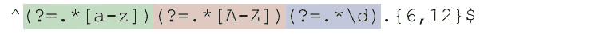
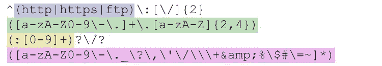
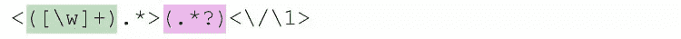

# 用实际例子揭开正则表达式的神秘面纱

> 原文：<https://www.sitepoint.com/demystifying-regex-with-practical-examples/>

正则表达式通常用于执行搜索、替换子字符串和验证字符串数据。本文提供了遍历复杂正则表达式的提示、技巧、资源和步骤。

如果你还没有掌握基本技能，你可以通过我们的初学者指南学习 regex。尽管正则表达式看起来很神秘，但你不会花太多时间去学习这些概念。

有许多书籍、文章、网站解释正则表达式，所以我宁愿直接看更实际的例子，而不是写另一个解释:

*   [匹配密码](#matching-password)
*   [匹配一个网址](#matching-url)
*   [匹配特定的 HTML 标签](#matching-html-tag)
*   [匹配重复单词](#matching-duplicated-words)

你可以在[这个链接](https://github.com/niklongstone/regular-expression-cheat-sheet)找到有用的备忘单。除了大量有用的资源，在这篇文章的底部还有一个由 Lea Verou 制作的会议视频——它有点长，但在分解 RegEx 方面非常出色。

## 如何构建一个好的正则表达式

正则表达式经常在开发人员的日常工作中使用——日志分析、表单提交验证、查找和替换等等。这就是为什么每个优秀的开发人员都应该知道如何使用它们，但是构建一个好的正则表达式的最佳实践是什么呢？

### 1.定义一个场景

使用自然语言来定义问题会让你对使用的方法有更好的想法。在定义中使用的词语**可以**和**必须**用于描述强制性约束或断言。

下面是一个例子:

*   字符串必须以“h”开头，以“o”结尾(例如，hello，halo)。
*   该字符串可以用括号括起来。

### 2.制定计划

对问题有了一个好的定义后，我们可以理解正则表达式中涉及的元素种类:

*   允许哪些类型的字符(单词、数字、新行、范围等)？
*   一个字符必须出现多少次(一次或多次，一次，…)？
*   是否有一些约束需要遵循(选项、前视/后视、if-then-else 等等)？

### 3.实现/测试/重构

有一个实时的测试环境来测试和改进你的正则表达式是非常重要的。像 regex101.com、regexr.com、debuggex.com 和 T2 这样的网站提供了一些最好的环境。

为了提高正则表达式的效率，您可以尝试回答以下附加问题:

*   是否为特定领域正确定义了字符类？
*   我应该写更多的测试字符串来覆盖更多的用例吗？
*   有没有可能发现并隔离一些问题，分别测试？
*   我应该用子模式、组、条件等重构我的表达式吗？，让它更小，更清晰，更灵活？

## 实际例子

以下示例的目标不是编写只能解决问题的表达式，而是使用字符范围、断言、条件、组等重要元素，为特定用例编写最有效的表达式。

### 匹配密码

**场景:**

*   长度为 6 到 12 个字符
*   必须至少有一个大写字母
*   必须至少有一个小写字母
*   必须至少有一位数字
*   应该包含其他字符

**图案:**

`^(?=.*[a-z])(?=.*[A-Z])(?=.*\d).{6,12}$`

该表达式基于多个正向前瞻`(?=(regex))`。lookahead 匹配后跟声明的`(regex)`的内容。条件的顺序不会影响结果。当有几个条件时，Lookaround 表达式非常有用。
我们也可以使用否定前瞻`(?!(regex))`来排除一些字符范围。例如，我可以用`(?!.*#)`排除`%`。

让我们解释一下上面表达式的每个模式:

1.  `^`断言字符串开头的位置
2.  `(?=.*[a-z])`正向前瞻，断言正则表达式`.*[a-z]`可以匹配:
    *   `.*`匹配任意字符(换行符除外),匹配次数从零到无限制
    *   `[a-z]`匹配 a 和 z 之间的单个字符(区分大小写)
3.  `(?=.*[A-Z])`正向前瞻，断言正则表达式`.*[A-Z]`可以匹配:
    *   `.*`匹配任意字符(换行符除外),匹配次数从零到无限制
    *   `[A-Z]`匹配 A 和 Z 之间的单个字符(区分大小写)
4.  (?=.*\d)正向前瞻，断言正则表达式`*\d`可以匹配:
    *   `.*`匹配任意字符(换行符除外),匹配次数从零到无限制
    *   `\d`匹配一个数字[0-9]
5.  `.{6,12}`匹配 6 到 12 次之间的任何字符(换行符除外)
6.  `$`断言字符串末尾的位置

### 匹配的 URL

**场景:**

*   必须以`http`或`https`或`ftp`开头，后跟`://`
*   必须与有效的域名匹配
*   可能包含端口规范(`http://www.sitepoint.com:80`)
*   可以多次包含数字、字母、点、连字符、正斜杠

**图案:**

`^(http|https|ftp):[\/]{2}([a-zA-Z0-9\-\.]+\.[a-zA-Z]{2,4})(:[0-9]+)?\/?([a-zA-Z0-9\-\._\?\,\'\/\\\+&amp;%\$#\=~]*)`

第一个场景很容易用`^(http|https|ftp):[\/]{2}`解决。
为了匹配域名，我们需要记住，要有效，它只能包含字母，数字，连字符和点。在我的例子中，我将标点符号后的字符数从 2 个限制到 4 个，但是可以扩展到新的域名，如`.rocks`或`.codes`。域名由`([a-zA-Z0-9\-\.]+\.[a-zA-Z]{2,4})`匹配。

可选端口规格由简单的`(:[0-9]+)?`匹配。

一个 URL 可以包含多个斜杠和多次重复的多个字符(参见 [RFC3986](http://tools.ietf.org/html/rfc3986#section-2) )，这是通过使用一组`([a-zA-Z0-9\-\._\?\,\'\/\\\+&amp;%\$#\=~]*)`中的一系列字符来匹配的。
用一个组捕获`()`来匹配每个重要的元素真的很有用，因为它只会返回我们需要的匹配。请记住，某些字符需要用`\`进行转义。

下面，每个子模式都解释了:

1.  `^`断言字符串开头的位置
2.  捕获组`(http|https|ftp)`，捕获`http`或`https`或`ftp`
3.  `:`转义字符，字面上匹配字符`:`
4.  `[\/]{2}`精确匹配 2 次转义字符`/`
5.  捕获组`([a-zA-Z0-9\-\.]+\.[a-zA-Z]{2,4})`:
    *   `[a-zA-Z0-9\-\.]+`匹配 A 和 Z 之间、A 和 Z 之间、0 和 9 之间的任意一个字符，字符`-`和字符`.`
    *   `\.`与字符`.`完全匹配
    *   `[a-zA-Z]{2,4}`在 A 和 Z 或 A 和 Z 之间匹配单个字符 2 到 4 次(区分大小写)
6.  捕获组`(:[0-9]+)?`:
    *   数量词`?`匹配零次或多次之间的组
    *   `:`与字符`:`完全匹配
    *   `[0-9]+`匹配 0 到 9 之间的单个字符一次或多次
7.  `\/?`匹配字符`/`一次或零次
8.  捕获组`([a-zA-Z0-9\-\._\?\,\'\/\\\+&amp;%\$#\=~]*)`:
    *   `[a-zA-Z0-9\-\._\?\,\'\/\\\+&amp;%\$#\=~]*`匹配范围 a-z、A-Z、0-9 中的单个字符的 0 到无限次之间的字符:`-._?,'/\+&amp;%$#=~`。

### 匹配 HTML 标签

**场景:**

*   开始标签必须以`<`开头，后跟一个或多个字符，并以`>`结尾
*   结束标签必须以`</`开头，后跟一个或多个字符，并以`>`结尾
*   我们必须匹配标签元素中的内容

**图案:**

`<([\w]+).*>(.*?)<\/\1>`

用`<([\w]+).*>`和`(.*?)`匹配开始标签和里面的内容非常容易，但是在上面的模式中，我添加了一个有用的东西:对捕获组的引用。
由括号`()`定义的每个捕获组可以使用其位置号`(first)(second)(third)`来引用，这将允许进一步的操作。
上述表达式可以解释为:

*   从`<`开始
*   捕获标签名称
*   后跟一个或多个字符
*   捕捉标签内的内容
*   结束标签必须是`</tag name captured before>`

在表达式中只包含两个捕获组，标签名和内容，将返回一个非常清晰的匹配，一个标签名和相关内容的列表。

让我们再深入一点，解释一下子模式:

1.  `<`与字符`<`完全匹配
2.  捕获组`([\w]+)`匹配任意单词字符`a-zA-Z0-9_`一次或多次
3.  `.*`匹配零次或多次之间的任何字符(换行符除外)
4.  `>`与字符`>`完全匹配
5.  捕获组`(.*?)`，匹配任意字符(除了换行符)，零次或多次
6.  `<`与字符`<`完全匹配
7.  `\/`与字符`/`完全匹配
8.  `\1`匹配第一个捕获组匹配的相同文本:`([\w]+)`
9.  `>`与字符`>`完全匹配

### 匹配重复的单词

**场景:**

*   单词是用空格隔开的
*   我们必须匹配每一个重复，包括不连续的重复

**图案:**

`\b(\w+)\b(?=.*\1)`

这个正则表达式看起来很有挑战性，但是使用了前面展示的一些概念。该模式引入了单词边界的概念。

一个字界`\b`主要检查位置。当一个单词字符(例如:`abcDE`)后跟一个非单词字符(例如:`-~,!`)时，它匹配。
下面你可以找到一些使用单词边界的例子来使它更清楚:
–给定短语`Regular expressions are awesome`
–模式`\bare\b`匹配`are`
–模式`\w{3}\b`可以匹配单词的最后三个字母:`lar, ion, are, ome`

上面的表达式可以解释为:

*   匹配每个单词字符后接一个非单词字符(在我们的案例空间中)
*   检查匹配的单词是否已经存在

以下是对每个子模式的解释:

1.  `\b`字界
2.  捕获组`([\w]+)`匹配任何单词字符`a-zA-Z0-9_`
3.  `\b`字界
4.  `(?=.*\1)`正向前瞻断言以下内容可以匹配:
    *   `.*`匹配任何字符(换行符除外)
    *   `\1`匹配与第一个捕获组相同的文本

如果我们返回所有的匹配，而不是只返回第一个匹配，这个表达式将更有意义。详见 PHP 函数 [`preg_match_all`](http://php.net/manual/en/function.preg-match-all.php) 。

## 最后的想法

正则表达式是一把双刃剑。增加的复杂性越多，解决问题的难度就越大。这就是为什么，有时候，很难找到一个匹配所有情况的正则表达式，最好使用几个更小的正则表达式。

有一个好的问题场景会非常有帮助，并且允许你开始考虑字符范围、约束、断言、重复、可选值等等。更加注意组捕获将使匹配对进一步处理有用。请随意改进例子中的表达，并让我们知道你做得如何！

## 有用的资源

下面你可以找到更多的信息和资源来帮助你提高正则表达式技能。如果你发现了一些没有列出的有用的东西，请随意给文章添加评论。

### lea Verou–/Reg(exp){ 2 } lained/:揭开正则表达式的神秘面纱

[https://www.youtube.com/watch?v=EkluES9Rvak](https://www.youtube.com/watch?v=EkluES9Rvak)

### PHP 库

| 名字 | 描述 |
| :-- | :-- |
| [RegExpBuilder](https://github.com/gherkins/regexpbuilderphp) | 使用人类可读的方法链创建正则表达式 |
| [nooofluentregex](https://github.com/tomgray15/NooNooFluentRegex) | 使用流畅的 setters 和英语术语构建正则表达式，如上所示 |
| [Hoa\Regex](https://github.com/hoaproject/Regex) | 提供分析正则表达式和生成字符串的工具 |
| [正则表达式反转](https://github.com/niklongstone/regex-reverse) | 给定一个正则表达式将生成一个字符串 |

### 网站

| 统一资源定位器 | 描述 |
| :-- | :-- |
| [regex101.com](https://regex101.com/) | PCRE 在线正则表达式测试器 |
| [regextester.com](http://www.regextester.com/) | PCRE 在线正则表达式测试器 |
| [rexv.org](http://www.rexv.org/) | PCRE 在线正则表达式测试器 |
| [debuggex.com](https://www.debuggex.com/) | 支持 PCRE 并提供了一个非常有用的可视化正则表达式调试器 |
| [regexper.com](http://regexper.com/) | Javascript 风格的正则表达式，但对调试有用 |
| [phpliveregex.com](http://www.phpliveregex.com/) | 预浸函数在线测试仪 |
| [regxlib.com](http://www.regxlib.com/) | 随时可以使用的正则表达式数据库 |
| [正则表达式信息](http://www.regular-expressions.info/) | 正则表达式教程，书评，例子 |

### 书

| 标题 | 描述 | 作者 | 编者ˌ编辑 |
| :-- | :-- | :-- | :-- |
| 掌握正则表达式 | 必须有正则表达式的书 | 杰弗里·弗里德尔 | 奥赖利 |
| 正则表达式袖珍参考 | Perl，Ruby，PHP，Python，C，Java 和。网 | 托尼史塔比尼 | 奥赖利 |

## 分享这篇文章