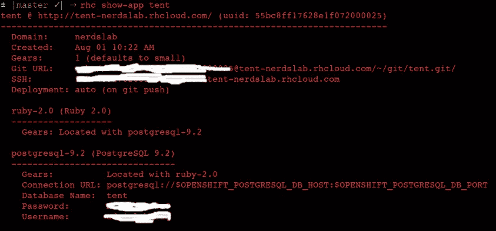
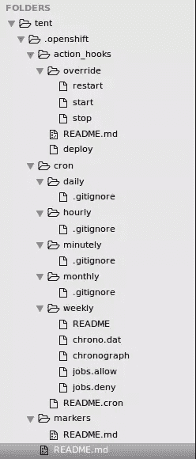

# 将您的 Rails 部署到 OpenShift

> 原文：<https://www.sitepoint.com/deploy-your-rails-to-openshift/>


**OpenShift** 是 Red Hat 的平台即服务(PaaS)，允许开发者在云环境中快速开发、托管和扩展应用。使用 OpenShift，您可以选择各种产品，包括在线、内部部署和开源项目选项。

有了 Git，开发者可以在平台上部署不同语言的 web 应用。OpenShift 使部署变得简单，而且它还是一个免费的开源软件。

在本教程中，我将制作一个带有静态页面的 Rails 应用程序，并将其部署到 OpenShift 平台。本教程的目的是了解部署过程是如何工作的。

## OpenShift 设置

[免费创建账户](https://www.openshift.com/app/account/new)。一个免费账号给你 3 个小齿轮，每个齿轮存储容量 1gb。OpenShift Gears 是应用程序在 OpenShift 节点中运行的安全容器。节点是[红帽企业 Linux](http://www.redhat.com/en/technologies/linux-platforms/enterprise-linux) 的实例，是 OpenShift 的基础。换句话说，您的应用程序驻留在**节点**上，并在名为 **Gears** 的节点内的安全容器中运行。

如果您需要不同的东西，您可以[比较计划](https://www.openshift.com/products/pricing/plan-comparison)了解更多信息。

### 安装 rhc

第一步是安装 rhc gem，它包含 OpenShift 命令行工具:

```
 gem install rhc 
```

这将安装 gem rhc 及其依赖项。就像 git 一样，rhc 有一个全局配置，可以通过以下方式完成:

```
 rhc setup 
```

(假设你是第一次安装 rhc，我相信你是。)

您将得到一个提示，要求您指定自己的 Openshift 服务器。在本教程中，我们将使用 Openshift online 的服务器:openshift.redhat.com。只需按回车键接受默认值。

接下来，输入您在注册时使用的 OpenShift 登录凭据。

```
 OpenShift can create and store a token on disk which allows to you to access the server without using your password. The key is stored in your home directory and should be kept secret.  You can delete the key at any time by running 'rhc logout'.
Generate a token now? (yes|no) 
```

如果您键入`yes`，一个令牌将被创建并存储在磁盘上。这个令牌允许你不用密码就能访问服务器。

最后，输入`yes`将您的公共 SSH 密钥上传到 OpenShift 服务器，以允许基于密钥的 SSH 访问。

## 命名空间

设置的最后一步是创建一个域。在 Openshift 中，应用程序被分组到域中。要创建应用程序，您必须首先创建一个域。每个域都有一个唯一的名称，称为命名空间。

OpenShift 在线名称空间是应用程序 URL 的一部分，是您的帐户所独有的。应用程序 URL 的语法是`application–namespace.example.com`。每个用户名支持一个名称空间，但是您可以在该名称空间内创建多个应用程序。如果需要多个名称空间，需要使用不同的用户名创建多个帐户。请注意，在创建应用程序之前，您必须创建一个命名空间。

OpenShift Online 使用黑名单来限制您可以使用的名称空间。黑名单保存在服务器上。如果您尝试使用黑名单中的名称创建或更改名称空间，会出现一条消息警告您选择了黑名单中的名称，并要求您选择不同的名称空间。名称空间最多可以包含 16 个字母数字字符，并且不能有空格或符号。

在提示符后输入一个唯一的名称，就完成了。至此，rhc 已经配置完毕。

## 生成一个 Rails 应用

我们需要部署一些东西。让我们创建一个小的 Rails 应用程序在 OpenShift 上使用。我假设你已经安装了`rails`宝石，如果没有，`gem install rails`会让你继续前进。

生成 Rails 应用程序:

```
 $ rails new tent
$ rails generate controller pages new 
```

这创建了一个带有`new`方法和视图的`PagesController`。编辑新页面:

```
###app/views/new.html.erb

<h1>Welcome to Tent</h1>

<p>This is a test page</p> 
```

将路由根更改为:

```
 ###config/routes.rb

Rails.application.routes.draw do
  root 'pages#new'
end 
```

我们想使用 Puma 作为 web 服务器，PostgreSQL 作为数据库。Puma 是 OpenShift 支持的 web 服务器之一。您可以选择使用其他 web 服务器，如 Unicorn、Thin 或 Passenger。

现在转到 gem 文件并添加以下内容:

```
 ###Gemfile

group :production do
  gem 'pg'
  gem 'puma', '2.11.1'
end 
```

 `之后运行`bundle install`。

## 打开 Rails 应用程序

此时，我们想为我们的应用程序创建一个新的遥控器。您需要从 Rails 应用程序上面的目录(~/parent-directory/rails-app)运行这个命令。这是为了防止在您的应用程序中创建新目录:

```
 rhc app-create tent ruby-2.0 postgresql-9.2 
```

**注:**‘帐篷’是 app 的名字。

编辑 **database.yml** 中的生产配置，如下图所示:

```
 ###config/database.yml

production:
  adapter: postgresql
  encoding: unicode
  pool: 5
  database: 
  host: 
  port: 
  username: 
  password: 
```

## 准备部署

现在让我们初始化本地回购:

```
 cd tent
git init 
```

查看您的应用的详细信息，您将需要它来进行部署:

```
 rhc show-app tent 
```



获取 git URL，并在下面的命令中用它替换`GIT REMOTE URL`:

```
 git remote add openshift GIT REMOTE URL 
```

让我们合并遥控器:

```
 git pull openshift master 
```

你应该在 **config.ru** 中得到一个冲突，我们需要确保它包含默认内容。打开您的 **config.ru** 并粘贴以下内容:

```
 #config.ru

#This file is used by Rack-based servers to start the application.

require ::File.expand_path('../config/environment', __FILE__)
run Rails.application 
```

然后，提交您的更改:

```
 git add .
git commit -m "fixed conflict in config.ru" 
```

我创建了一个**。以打开**目录为例，你可以在这里找到。提取它并覆盖**。在你的应用中打开 shift** 目录。该目录的结构如下所示:



[。openshift 目录](https://docs.openshift.org/origin-m4/oo_user_guide.html#localhost-directory-structure)，位于你的应用程序的主目录中，是一个隐藏的目录，用户可以在其中创建动作挂钩，设置标记，并创建 cron 作业。动作钩子是直接执行的脚本，可以用 Python、PHP、Ruby、bash 等编写。

上面的示例存储库也有一个包含一个`puma.rb`文件的**配置**文件夹。该文件配置 Puma，包含以下内容:

```
 ###config/puma.rb

workers Integer(ENV['WEBCONCURRENCY'] || 2)
threadscount = Integer(ENV['MAX_THREADS'] || 5)
threads threads_count, threads_count

preload_app!

rackup DefaultRackup
environment ENV['RACK_ENV'] || 'development' 
```

将该文件复制到您本地的 **config** 目录。

## 部署应用程序

将应用程序推送到远程服务器:

```
git push openshift master
```

**注意:**如果推送时出错，重复拉取请求，再次推送。

现在你的申请已经上线了。只需从浏览器访问应用程序的 URL，即 http://app-nerdslab.rhcloud.com。对于我的“帐篷”应用程序，它是:

[http://tent-nerdslab.rhcloud.com](http://tent-nerdslab.rhcloud.com/)

## 迁移数据库

要运行数据库迁移，我们需要 ssh 到我们的服务器并进行设置:

```
 rhc ssh tent
cd app-root/repo
bundle exec rake db:setup RAILS_ENV=production 
```

如果您遇到任何问题，您总是可以使用这些相同的命令 ssh 到您的服务器来修复它。请记住，上面命令中的 *tent* 应该替换为应用程序的名称。

## 检查日志

如果您遇到错误，您会想要访问应用程序日志。要检查日志:

```
 rhc ssh tent
cd $OPENSHIFT_LOG_DIR
ls
vim ruby.log #or replace with postgresql.log 
```

## 更改 Web 服务器

缺省情况下，OpenShift ruby 插件只支持运行在 Apache 上的乘客。但是高级的 Ruby cartridge 允许你使用其他流行的服务器，比如 Puma，Unicorn，Thin，Rainbows，和，Passenger。为了改变它，我们将使用`rhc`的一个特性，它允许我们改变环境变量。您选择的 web 服务器的名称存在于`OPENSHIFT_RUBY_SERVER`环境变量中。

要选择 Puma:

```
 rhc env set OPENSHIFT_RUBY_SERVER=puma -a tent 
```

要生效，您必须重新启动应用程序:

```
 rhc app restart tent 
```

您可以使用以下命令检查哪个服务器正在运行:

```
 rhc ssh tent '~/advanced-ruby/bin/control server' 
```

如果您正在使用 gem 文件，请确保您已经添加了所选 web 服务器的适当 gem。在这种情况下，它看起来像:

```
 ###Gemfile

group :production do
  gem 'puma', '2.11.1'
end 
```

## 结论

除了 OpenShift，还有很多托管 Rails 应用的选择。在 [SitePoint](https://www.sitepoint.com/shelly-cloud-deploy-rails-app-less-5-minutes/) 上有一个关于[谢利·克劳德](https://shellycloud.com)的帖子，作者是[杰西·赫里克](https://www.sitepoint.com/author/jherrick/)。这是另一篇关于将 Rails 应用程序部署到亚马逊网络服务(AWS)的文章。当然，总会有英雄。现在，我可以推荐 [OpenShift](http://openshift.com) 作为托管提供商，以便于部署。

## 分享这篇文章`