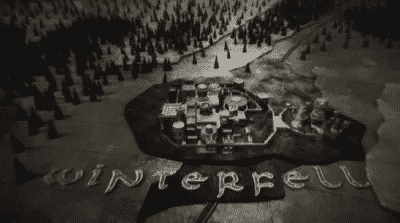
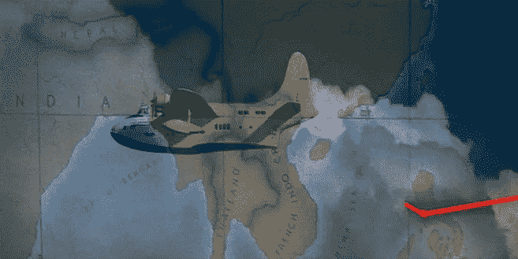
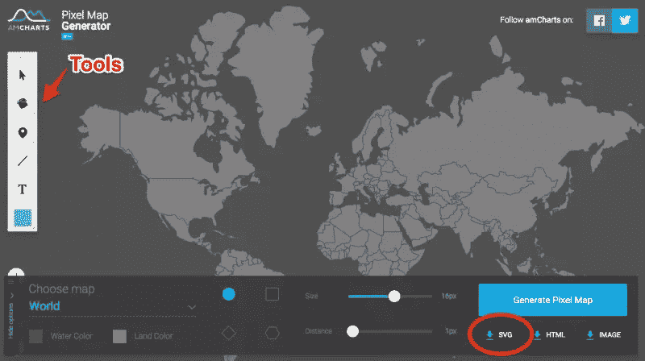
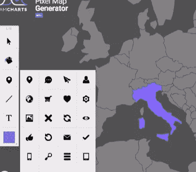

# 印第安纳琼斯和失落的 SVG 地图编辑器

> 原文：<https://www.sitepoint.com/indiana-jones-and-the-lost-svg-map-editor/>

地图是讲述故事的绝佳工具。

《权力的游戏》在标题序列中使用动画地图来帮助设定他们宇宙的史诗基调。[卡萨布兰卡](http://www.thecinetourist.net/the-daily-map/37-casablanca)以一张以巴黎为中心的地图为开场场景，地图上一条粗粗的黑线向南延伸至摩洛哥。

四十年后，史蒂文·斯皮尔伯格在《夺宝奇兵》中使用了类似的技巧，帮助我们追踪印第安纳·琼斯的[波音水上飞机](https://en.wikipedia.org/wiki/Boeing_314_Clipper)从旧金山到尼泊尔。红线成了所有印第安纳·琼斯电影的比喻。

最近，布偶们玩了一个点子，在他们的车里装了一个“地图旅行”按钮。

## 网络地图

地图在网络上也很强大，让我们将重要的想法和统计数据与特定的地理区域联系起来。这可以是任何东西，包括:

*   销售数字
*   订户/观众
*   付费会员
*   区域办事处

但是当你创建一个新的地图时，你从哪里开始呢？截屏谷歌地球或公开街道地图并不能解决问题。你可以从头开始画一张地图，但是海岸线的绘制是出了名的挑剔和耗时。

### 使用 AMCharts 制作 SVG 地图

AMCharts.com 提供了一系列非常酷的 JavaScript 图表工具，包括饼状图、折线图和条形图。但他们也有一个不太为人所知，但非常漂亮的测试版地图创建工具，叫做[像素地图生成器](http://pixelmap.amcharts.com/)。

这个工具很容易上手。web 应用程序底部面板中的控件允许您根据自己的喜好缩放、定位和框定地图。一个单独的下拉菜单让你选择个别国家。此面板还允许您设置默认的陆地和海洋颜色

左侧的工具条可让您为地图组件重新着色、绘制路线以及对地图进行注释和标注。将一幅有用的地图的基本组成部分组合在一起只需要几分钟。

我认为真正酷的部分是出口选项。PNG、HTML (& JS)或 SVG。PNG 是一个很好的备选方案，HTML/JS 很适合嵌入，但最后一个选项是我喜欢的。

通常图形编辑器生成的 SVG 非常混乱和笨拙，但是 AMCharts 似乎可以写出非常干净、结构良好的 SVG 文件。你可以复制这个 SVG 代码，粘贴到一个新的文本文件中，保存为 SVG 并直接嵌入到你的下一个站点/web 应用程序中。

不过你也可以多做*。*

 *你可以直接在 Adobe Illustrator 或 Inkscape 中打开这个 SVG 地图，但我建议不要这样做——文件会被立即重写，你会失去很多自然的优雅。

一个更有趣的想法是复制 SVG 代码并将其直接粘贴到 Codepen HTML 面板中。即使你对 SVG 标记一无所知，你也能认出它是一个类似于 HTML 的文件，你可以用 CSS 对它进行操作和设计。开始黑吧！

这是我之前准备的一个:[http://codepen.io/SitePoint/pen/dYGxPE](http://codepen.io/SitePoint/pen/dYGxPE)

在[码笔](http://codepen.io)上通过 SitePoint ( [@SitePoint](http://codepen.io/SitePoint) )看笔 [dYGxPE](http://codepen.io/SitePoint/pen/dYGxPE/) 。*