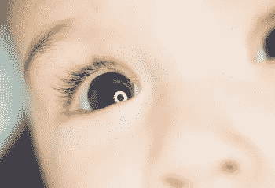
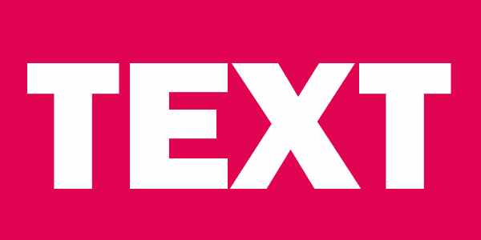
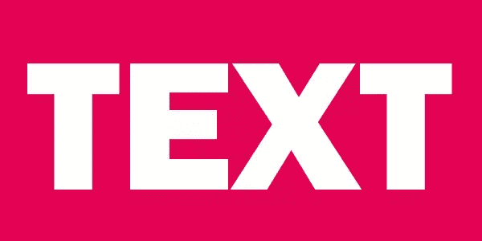
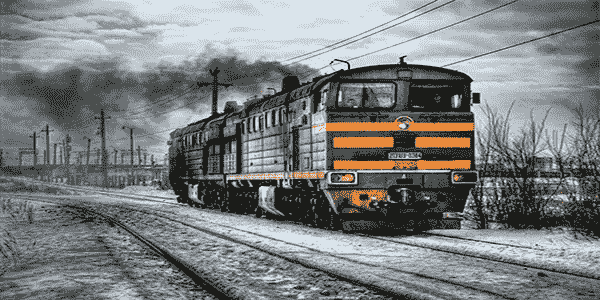
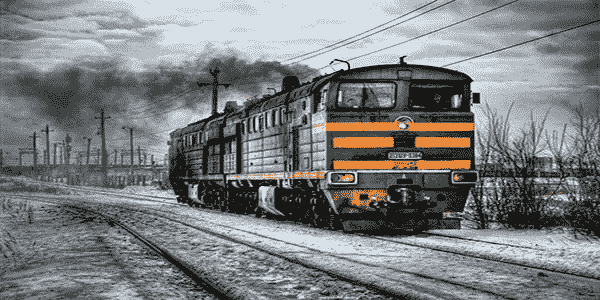
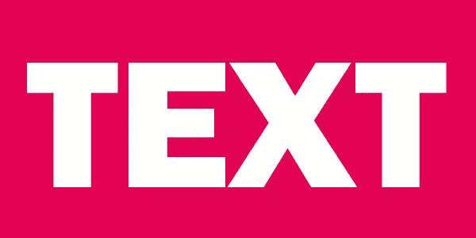

# 通过巧妙使用图像节省带宽

> 原文：<https://www.sitepoint.com/saving-bandwidth-by-using-images-the-smart-way/>

照片:加塔纳斯

图像是我们大脑的母语。虽然我们花了很多年来学习说话、阅读和写作，但我们从出生那天起就在处理图像。

这使得图像比文字更快地传达复杂的思想——甚至一千个单词。他们可以活跃网页，甚至吸引人们去阅读，阅读一个他们不会为之烦恼的话题。

### 成本

然而，在互联网上，图像不是没有代价的。图像占用了世界上很大一部分带宽，这影响了用户体验。我们知道，每多花一秒加载页面就会增加跳出率，同时也会对你的页面排名产生负面影响。

在这篇文章中，我们将讨论许多旨在节省您的时间和带宽的重要技巧

## 选择合适的图像格式

让我们从回到基础开始，看看每种网络图像格式的基本优点和缺点(即使你认为你知道所有)。

## GIF 格式

GIF 是一种无损文件格式，支持透明和动画。它被限制为最多 256 种颜色。不建议保存高度分级的照片图像，因为它们由远远超过 256 种颜色组成。然而，它对徽标、单色图形和几乎没有渐变的插图非常有用。

GIF 的动画能力意味着它也可以用来代替简短的解释性视频。

## PNG

和 GIF 一样，PNG 也是无损的，支持透明。但是，没有对动画的原生支持。

这种格式也适用于小尺寸图像或需要在不丢失任何数据的情况下保存的图像。PNG 图像可以保存为 PNG8 或 PNG24 格式。PNG8 是基于调色板的，如果不需要动画，它可以用作 GIF 的替代品。PNG8 最多可支持 256 种颜色。

值得记住的一点是，对于图形应用程序来说，以 2 位透明度导出 PNG-8 仍然很常见(即像素要么 100%不透明，要么 100%透明)，这可能会导致锯齿边缘。更好的编辑在他们的 PNG 输出中使用分级的 8 位透明度。

另一方面，PNG24 可以支持多达 1600 万种颜色。您可以使用后者来保存照片图像，但更复杂的图像意味着更大的文件大小。

## 使用 jpeg 文件交换格式存储的编码图像文件扩展名

最后，JPEG 或 JPG 格式适用于颜色可能因像素而异的照片图像。这种格式可以大幅减小文件大小，但是有一些注意事项。

首先，JPEG 是一种有损格式。这意味着它通过有选择地丢弃数据来压缩图像。这就是它能显著减小文件大小的原因，你需要在图像质量和文件大小之间做出妥协。JPG 也不支持透明。

JPEG 图像可以是基线或渐进格式。渐进格式首先渲染分辨率较低的图像，然后随着更多数据的可用而逐渐提高图像质量。这种格式还为图像保留了页面上的布局空间，从而减少了页面加载期间页面元素的重排。

当与 JPG 一起工作时，您应该始终单独维护您的原始未压缩图像。重新压缩 JPEG 图像会导致质量的累积损失，因为每次保存图像都会丢弃更多的数据。从未压缩的原始图像开始要好得多。

## 让我们比较一下

这里有几个图像显示了不同图像中文件大小的差异:**简单的单色图像，`.gif`格式。文件大小:4.4 KB**

**`.png`格式的简单平面彩色图像。文件大小:8.5 KB**

**`.jpg`格式的简单平面彩色图像。文件大小:26.2 KB**

**`.png`格式的摄影图像。文件大小:350 KB**

**`.jpg`格式的摄影图像。文件大小:85 KB**

正如你所看到的，前三张图片在质量上没有明显的区别，但是在 JPEG 格式下，图片的大小增加了很多，颜色变化很小甚至没有变化。在这种情况下，GIF 提供了最大的带宽节省。

然而，最后两个图像是不同的。这里，PNG 格式的文件要大得多。这是因为颜色变化很大，PNG 不会选择性地丢弃数据。除非你非常仔细地检查图像，否则你看不出质量有多大差别。

上面的例子清楚地说明了如何通过选择合适的图像格式来节省大量带宽。

## “为网页而存”真的有什么不同吗？

Photoshop 的'*'另存为..“T1”选项一直允许我们创建 PNG、GIF 和 JPG 图像，但近年来我们有了“*保存为 Web…* ”选项(最近还提取了资产)。有什么真正的区别吗？*

简而言之，是的，有一个非常值得的选择。

通过'*文件>保存为网页…* '访问，该界面提供了许多选项，如优化 PNG-8 和 GIF 格式的颜色数量，以及设置 JPEG 格式的质量。你也可以设置一个模糊值，这样可以节省几千字节。

请记住，一旦您以这种方式保存图像，您将无法再修改单个像素。因此，备份原始映像总是一个好主意。这是上面两张用“保存为网页格式”选项优化的图片。

**优化`.png`格式的简单图像。文件大小:3 KB**

**优化`.jpg`格式的摄影图像。文件大小:40 KB**

这两幅图像的相对节省分别为 32%和 53%。这对用户和网站所有者都是有益的。

## 提供调整大小的图像

为不同屏幕尺寸的用户提供相同分辨率的图像并不是最佳选择。当然，这可以节省一些时间，但是会消耗很多额外的带宽。用户需要等待更长的时间来加载网页，并且用 CSS 调整大小的图像并不总是缩放得很好。

为了根据屏幕大小提供不同的图像，你可以使用多种解决方案，比如 [Adaptive Images](http://adaptive-images.com/) 或者一个 jQuery 插件，比如 [HiSRC](https://github.com/teleject/hisrc) 。

有三个选项可用于调整图像大小。

首先是手动调整网站上每一张图片的大小。这可能是一个累人的过程。然后，您可以使用浏览器重新调整大小，使最初调整大小的图像缩放到完全适合具有更相似分辨率的设备。例如，使用 CSS 将图像从`400x300`调整到`350x262`比从`800x600`调整到`350x262`要好得多。

如果你对使用一些库没有问题，有一些很好的解决方案。这在金钱方面不会花费你什么，但是你将不得不投入时间去了解这个库。

两个这样的基于 PHP 的库是 [phpThumb](http://phpthumb.sourceforge.net/) 和 [WideImage](http://wideimage.sourceforge.net/) 。一旦调整了图像的大小，您可以稍后提供它的缓存版本来加速这个过程。

第三，也可能是最简单的解决方案是使用第三方服务。你将不得不支付一些钱，但如果钱不是一个大问题，这可能是你的理想解决方案。一个这样的服务是 imgix。你可以免费试用他们的服务一个月。

## 完全避免图像

有时你可以完全避免图像。在过去的五年中，浏览器对大量 CSS 属性的支持已经大大增加。你不再需要使用图像的圆角和基本的阴影效果了。你可以更进一步，用精心制作的 CSS 渐变替换网站中的简单模式。

这是一个 CodePen 演示，带有一个纯粹用 CSS 创建的简单模式。代码的大小是 189B，不带前缀。

通过[码笔](http://codepen.io)上的 SitePoint ( [@SitePoint](http://codepen.io/SitePoint) )看笔 [JYGrWR](http://codepen.io/SitePoint/pen/JYGrWR/) 。