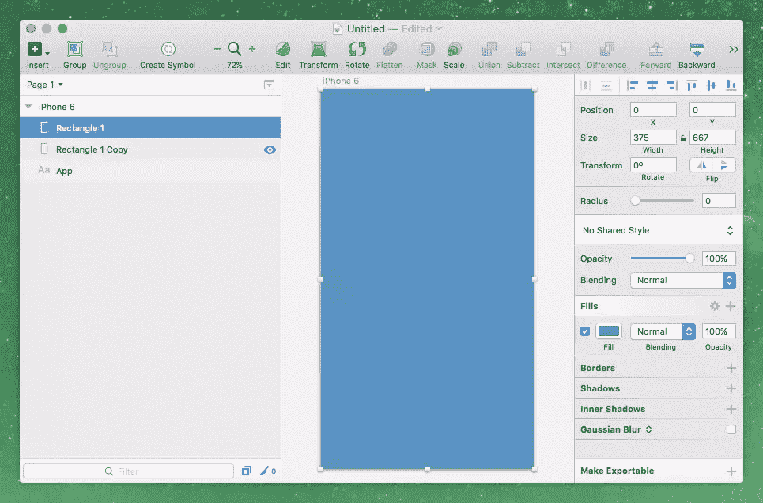
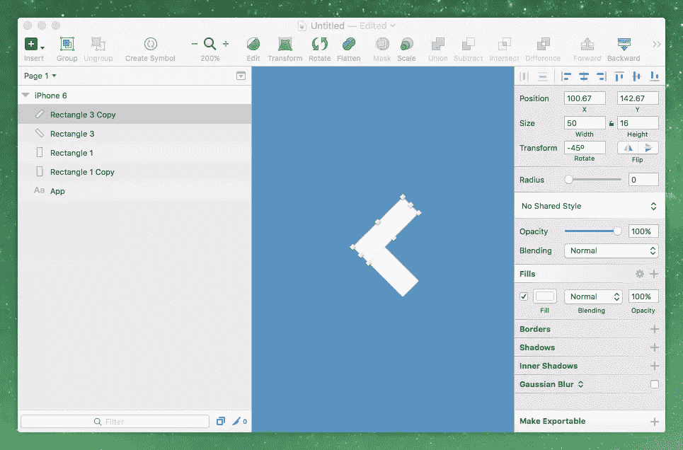
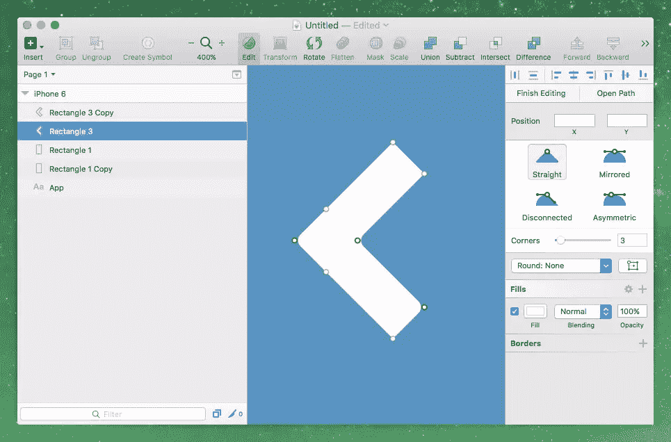
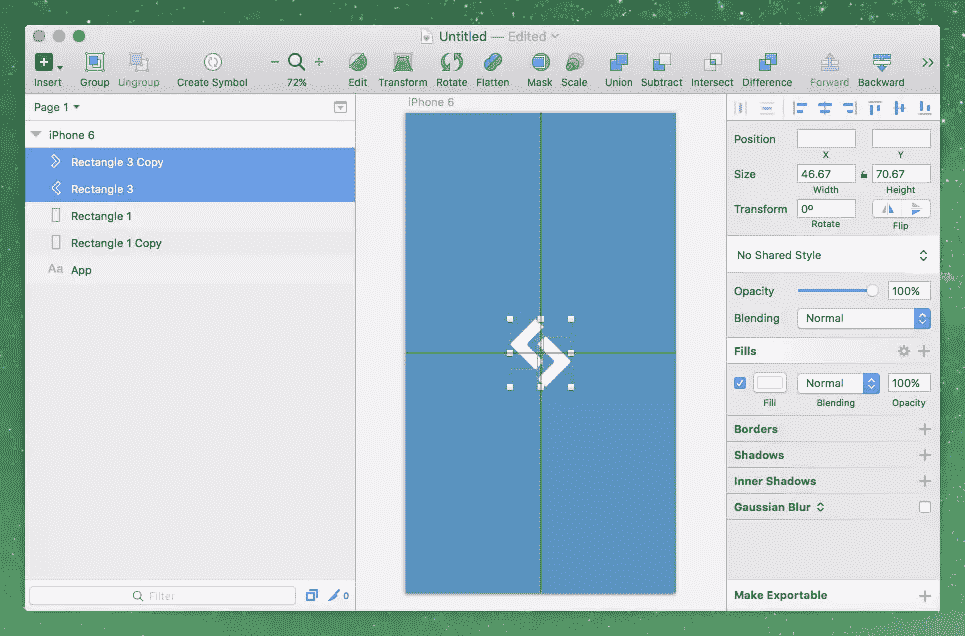
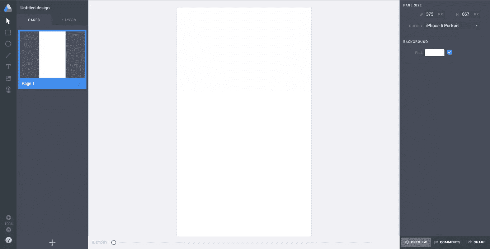
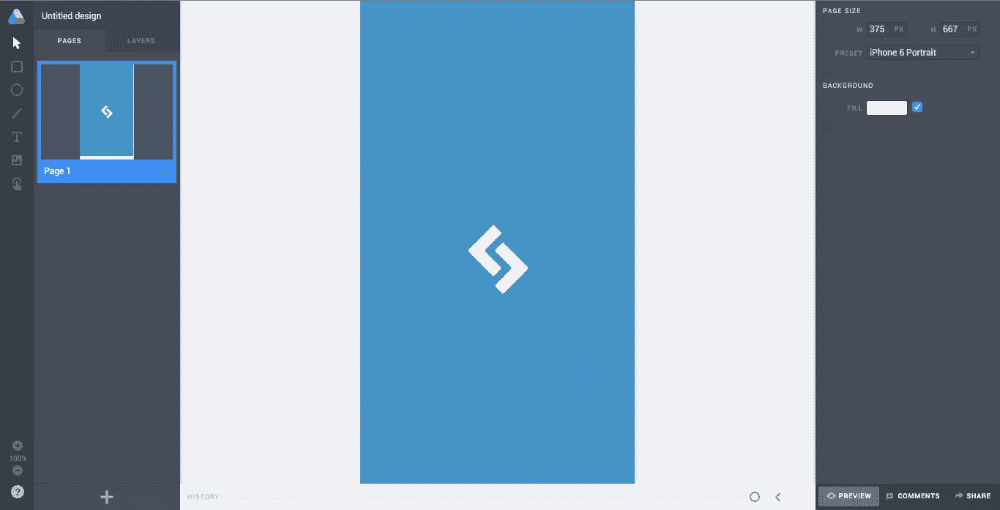
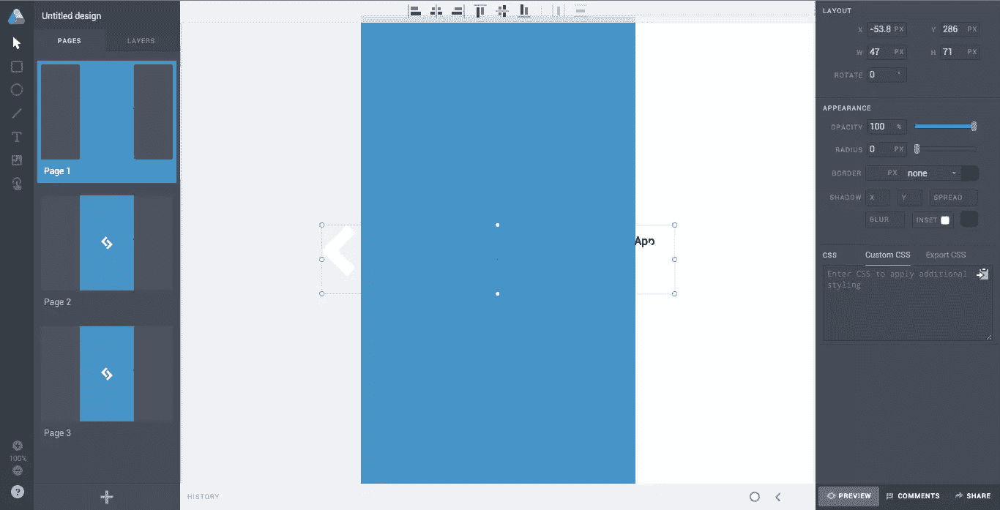
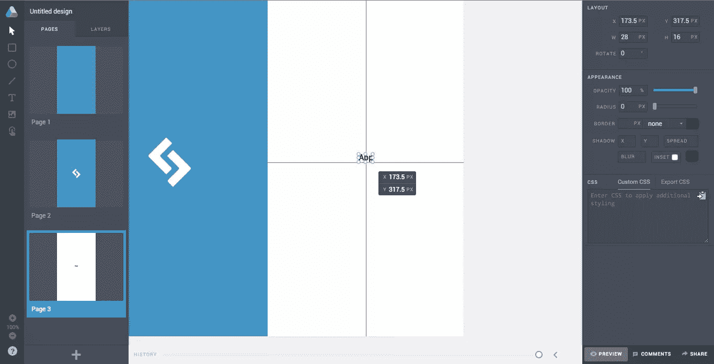
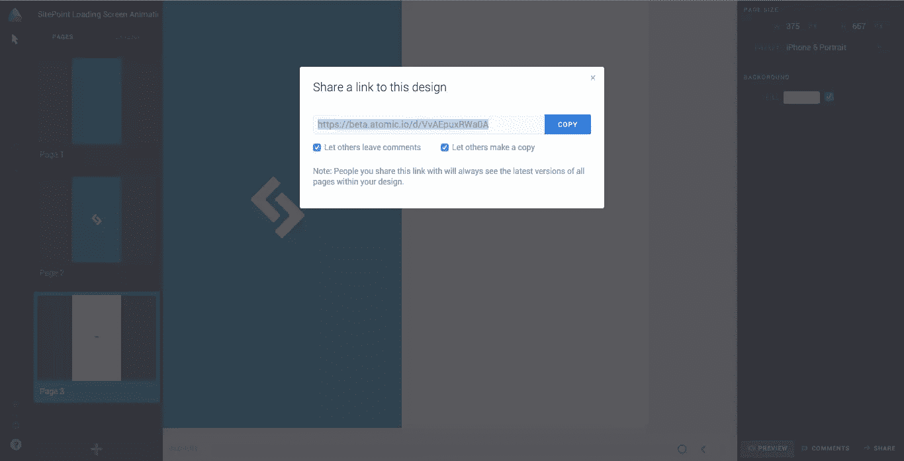

# 使用 Sketch & Atomic.io 创建优雅(但简单)的交互

> 原文：<https://www.sitepoint.com/create-easy-interactions-using-sketch-app-atomic-io/>

公平地说，在我的 SitePoint 文章中，我已经是一个毫不掩饰的素描应用粉丝好几个月了。但事实是，尽管我已经找到了许多不同的理由在各种类型的设计工作中使用它，我仍然每天都在寻找更多的理由使用它。

最近的一个激励是测试版的 Atomic.io，我发现它在界面和可执行性方面与 Sketch 惊人地相似。

不久前，我写了一篇关于 Atomic.io 的文章，只是在最近，我们直接在 Atomic 中创建了一个基本的图标，然后演示了如果我们与它交互，图标将如何动画。

这次我们要用草图设计一些东西，并在原子原型中使用它。

这里是我们将要制作的动画示例。

## 在 Sketch 中创建简单的加载屏幕动画

当你第一次打开一个应用程序时，你几乎总是会看到一个小动画，让用户知道他们的应用程序正在加载(并且没有冻结)。让我们假设 SitePoint 已经雇佣我们来创建上述动画。我们先在 Sketch App 里设计屏幕。

打开 Sketch，按“A”开始，从*检查员*处选择 *iPhone 6* 画板。

它需要一个蓝色的背景(#4494c2 就可以了)，但是我们稍后要在 Atomic 中制作它的动画，所以画板背景不适合这种情况。相反，创建一个与画板一样大的矩形(“R”)，并添加蓝色填充，模拟背景。

确保移除默认边框，并使用白色背景再次重复此步骤(将其保留在蓝色背景下)。

按“T”来创建一些文字(任何颜色，任何大小，这都没关系)，并再次将其移动到所有其他层的后面。我们称它为“App ”,所有这些都是为了演示我们假设的应用程序在加载屏幕后如何动画化。

<small>在草图中设置画板</small>

## 重新创建 SitePoint 徽标

再次按“R ”,去掉默认边框，创建一个 50x16px 的白色矩形，*旋转*45 度。完成后，*复制*它(command+d)并使用水平翻转按钮(在*旋转*旁边)。它应该看起来像这样。

构建我们的第一个形状

按住 *Shift* 同时选择这两个矩形，让我们开始使用顶部菜单栏中的一些工具。您需要按以下顺序使用这些工具:

1.  联盟
2.  变平
3.  编辑

使用*编辑*工具后，很明显我们的矩形现在已经变成了一个单一的扁平矢量形状，我们可以编辑它的*点*。在再次按住 *Shift* 的同时，选择其中三个(在下图中，这些是用黑色突出显示的)，并使用检查器将*角*更改为 5。快到了。

复制，翻转，移动两层，直到我们有这个:

<small>在草图中完成我们的设计</small>

## 将层从草图复制到原子

我们完成了我们的。草图文件。打开你的网络浏览器，跳到 [Atomic.io](https://atomic.io/) 。登录(或者如果你以前没用过就注册)，创建一个“新项目”，然后“新设计”；我们需要做的第一件事是选择“页面”选项卡(在左侧)，然后看向屏幕的另一侧，选择 *iPhone 6 肖像预设*。

<small>在 Atomic 中创建画板</small>

我们现在拥有的是一张空白的画布，这一步主要是将图层从 Sketch App 复制到 Atomic 中。在整个画板中复制不会起作用，因为 Atomic 会将其强制复制到单个展平层中。但这无关紧要——我们需要将我们的设计分成几个*页*,来代表动画中的不同阶段。首先复制图层。

<small>将层复制到原子层</small>

## 设置原子的阶段

让我们把所有的层移动到它们应该在的地方——可以说是“搭建舞台”。我们的“应用程序”文本层将从右侧滑入，因此目前不需要放在舞台上。将该层的“X”轴设为“373px ”,使其出现在**离开**载物台的位置。

对我们的白色背景做同样的操作。

确保“App”是垂直输入的。

你需要切换到*图层面板*才能选择一个单独的图层。轻弹回到*页面*，点击汉堡菜单，*复制*。再做一次，这样这个屏幕就有三个版本。现在让我们从第一个屏幕开始。

## 一“页”相当于动画的一个阶段

我们的动画将从看不到徽标开始。因为我们的徽标由两层组成，所以让左边的*侧*出现在屏幕外的左侧，让右边的*侧*出现在屏幕外的右侧。在下一步中，我们将制作这些层的动画，使它们从画布的任意一侧飞入，并具有平滑的反弹效果。

第一页目前看起来有点空白；这是所期望的。

<small>在原子中设置阶段</small>

第二页已经很好了。

跳到第三页，按住 *Shift* 同时选择所有图层，然后拖动图层，使白色背景完全填充画布，我们的蓝色背景(+logo)现在退出舞台。因为当我们从 Sketch 中复制图层时，所有图层都被转换为图像，所以我们的“App”文本图层现在失去了自动宽度。您需要手动移动该层，以便它捕捉到死点网格。

创建动画的不同阶段

## 制作屏幕动画

按“H”激活*热点*工具，并将其拉出(就像你对一个简单矩形所做的那样)以适合画板的整个尺寸。在右侧，将出现“交互”部分，我们需要使用以下设置:

1.  开:单击或点击
2.  转到:第 2 页
3.  动画:弹性:渐入渐出
4.  持续时间:1000 毫秒
5.  延迟:0 毫秒

第 2 页–使用这些设置创建另一个热点:

1.  开:单击或点击
2.  转到:第 3 页
3.  动画:博览会:轻松进出
4.  持续时间:1000 毫秒
5.  延迟:0 毫秒

## 结论

准备好向世界展示你的作品了吗？按下“预览”按钮(右下角)开始测试我们的动画。单击画板上任意位置的第一个**热点，观看下一个热点的屏幕动画。点击“编辑”返回到编辑器，然后在你满意的时候“分享”。**

共享原型交互

我们今天没有探索 Atomic.io 中的许多设计工具，因为我们使用了 Sketch App，但你可能已经注意到了这两个工具之间惊人的相似之处。尽管它们是为不同的任务而设计的，但它们的相似性使它们成为创建优秀 UI 交互的绝佳组合。

## 分享这篇文章