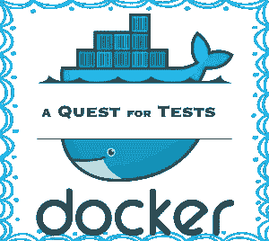

# 快乐结局:警卫和码头工人的史诗传奇

> 原文：<https://www.sitepoint.com/guard-and-docker/>



我从来不喜欢项目如何污染我的系统。库、数据库、消息队列，凡是你能想到的，我都得安装。在这个共享的宇宙中，世界碰撞只是时间问题。两个项目每个都需要不同的 Redis，我被困在了人类依赖解析器中。

过去曾有过项目筒仓的尝试。他们中没有一个像码头工人一样强大或有前途。即便如此，它也不是没有粗糙的边缘。这是一个关于边缘的故事。

我有一个包含现有测试的 Rails 项目，我希望将其归档。我没有的是在重构时获得反馈的好方法。我想运行 [Guard](http://guardgem.org/) ，这样我就可以做一些 TDD。正常情况下运行 Guard 没什么大不了的，但是 Docker(至少在 Mac 上)让这成为一个问题(它与 libnotify 有关)。很难也不可能改变文件来解除你的戒备。新技术伴随着取舍，有时简单变得困难。

我们开始吧。

## 首要职责

我的`Gemfile`已经开好了。我掰着指关节，转动肩膀，开始打字:

```
group :test do
  ...
  gem 'guard-rspec'
end 
```

我正在开发的 Rails 应用程序位于一个名为“web”的容器中。它与一个 PostgreSQL 数据库、一个后台工作的工人和一个假邮件服务器交互。所有这些都是由 [docker-compose](https://docs.docker.com/compose/) 编排的:

```
$ docker-compose run web bundle install 
```

当我的系统安装防护时，文字飞快地闪过。现在我需要一个`Guardfile`:

```
$ docker-compose run web bundle exec guard init 
```

这样，一切都应该准备好了:

```
$ docker-compose run web bundle exec guard 
```

迎接我的是一个熟悉的提示:

```
02:39:05 - INFO - Guard::RSpec is running
02:39:06 - INFO - Guard is now watching at '/app'

Frame number: 0/0
[1] guard(main)> 
```

我按下回车键，我的测试开始运行。它们以一系列令人满意的绿点结束，我忍不住笑了。我用 vim 打开一个模型并保存。我期待守卫和…

## 像耳语一样大声

让我们回顾一下。这一发展正在 OSX 发生。码头工人不在 OSX 经营。它运行在 Linux 和 Linux 上。在 OSX 上运行意味着使用一个小型的 Linux 虚拟机，方便地打包成 [boot2docker](http://boot2docker.io/) 。

我说过这种发展正在 OSX 发生。事实上，我所有的工作都发生在 OSX。这是我的家。这是我存放网络文件的地方。我不想加入虚拟机来工作。谢天谢地， [docker-compose](https://docs.docker.com/compose/) 理解我的困境，并将本地目录挂载到容器中。

我说到哪了？啊，是的，我保存了我的模型，测试应该正在运行。他们不是。

通常这将导致一阵谷歌搜索。没必要这样。我知道发生了什么。Guard 依赖于文件系统通知。装入的卷(在虚拟箱中)在黑暗的掩护下改变文件，并且不告诉任何人他们做了什么。守卫静静地等待着，幸福地意识不到变化。

对此有一个完全可靠的解决方案。我浏览文档寻找我需要的东西。

```
$ docker-compose run web bundle exec guard --force-polling 
```

现在`guard`正在每秒一次手动检查每个文件的更改。我切换回我的编辑器并再次保存。模型测试很快结束，我笔记本电脑上的风扇呼呼转动起来。

## 谁监视守望者

我的风扇声音太大了，我担心我的电脑会飞走。轮询文件比我预期的更激烈。


超过 100%的 CPU？这永远行不通。如果看东西这么贵，那么我需要小心我看的东西。我打开我安装的默认`Guardfile`。它被设置来监视我可能需要的一切，并且它有行数来证明这一点。我开始大量删除线条。

我又开始了，我的风扇听起来仍然是全力以赴。不过，它似乎在工作。在我脆弱的时候，我考虑用亚马逊的耳罩来抑制噪音。我摆脱了这个想法。

## 时间问题

我盯着屏幕，试图想出一个更好的方法。从我的过去中浮现出一个可能的解决方案。在我以前的一份工作中，我们会用 rsync 部署代码。那几乎是同样的问题。可能会有用。

我立即开始思考需要发生什么。我必须将 rsync 安装在 Docker 虚拟机中。当然，他们会发布新的图片，所以每次都要这么做。我需要一种简单的方法来重复安装。我不禁想知道要让它在 VM 上的容器中工作需要什么。事实是，我不知道。

运营从来都不是我的强项，这一点正在显现。我确实知道一个在过去对我有效的解决方案。我希望别人已经做过了。

我切换到 Firefox，开始搜索。我点击链接，浏览堆栈溢出的答案，然后进入一个名为 [docker-osx-dev](https://github.com/brikis98/docker-osx-dev) 的项目。它将本地文件同步到虚拟机，它的维护者 Yevgeniy Brikman 已经处理了棘手的部分。

我安装 docker-osx-dev，希望它能像宣传的那样工作。一墙的输出显示文件同步，给了我一点信心。我开始`guard`没有轮询，并再次保存我的模型。我的测试运行。我的风扇是无声的。我的手臂伸向空中。我喜欢这部分。

## 平行线

在胜利的鼓舞下，我继续前进。我的测试正在进行，但是运行之间有明显的延迟。我的直觉告诉我这是铁路装载。

加载轨道的延迟是一个众所周知的问题，有一个众所周知的解决方案。Rails 现在配备了[弹簧](https://github.com/rails/spring)来解决这个问题。它保存了一份 Rails 在后台运行的副本，然后在需要的时候分叉这个进程。

我打开我的`Guardfile`，将`spring`添加到用于运行`rspec`的命令中:

```
guard :rspec, cmd: "bundle exec spring rspec" do
   ...
end 
```

对自己的定位充满信心的我开始了`guard`:

```
03:32:35 - INFO - Running all specs
Version: 1.3.6

Usage: spring COMMAND [ARGS]

Commands for spring itself:

  binstub         Generate spring based binstubs. Use --all to generate a binstub for all known commands.
  help            Print available commands.
  status          Show current status.
  stop            Stop all spring processes for this project.

Commands for your application:

  rails           Run a rails command. The following sub commands will use spring: console, runner, generate, destroy, test.
  rake            Runs the rake command 
```

废话。看来`spring`得知道命令，对`rspec`不熟悉。我不可能是第一个这样做的人。回到谷歌。

社区再次通过 [spring-commands-rspec](https://github.com/jonleighton/spring-commands-rspec) 。我把它加到我的`Gemfile`中，再做一次`bundle install`，然后`guard`毫无怨言地开始了。我再次保存模型并运行测试。再救一次，再跑一次，延迟就没了。

## 一切美好的事物…

我深吸一口气，点点头。变更是通过一个很难代表努力的小消息提交的。我不禁想起那些我站在谁肩膀上的人。不是巨人，而是普通人。这是一个相当戏剧性的想法，考虑到我设法让警卫运行。我并没有拯救世界。尽管如此，我还是享受这一刻，希望我的肩膀能抓住其他人。很晚了，我需要放松一下才能睡觉。长途跋涉之后，我需要看点东西。如果我能弄清楚是什么。

## 分享这篇文章