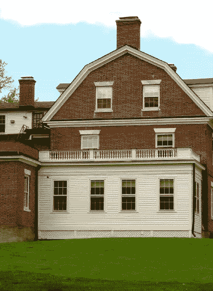
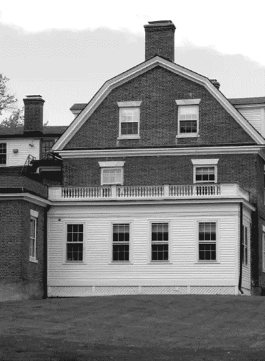
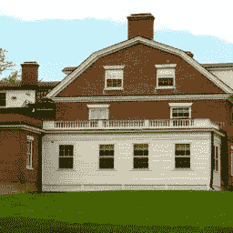

# 使用 Python 图像库处理图像

> 原文：<https://www.sitepoint.com/manipulating-images-with-the-python-imaging-library/>

在我上一篇关于为 Python 爱好者节省时间的技巧的文章中，我提到 Python 是一种可以激发用户爱心的语言(T2)。

其中一个原因是这种语言有大量节省时间的库。一个很好的例子是 [Python 图像库(PIL)](http://www.pythonware.com/products/pil/) ，这是本文的重点。

## 你能对 PIL 做什么

PIL 是一个免费的库，为您的 Python 解释器增加了图像处理功能，支持一系列图像文件格式，如 PPM、PNG、JPEG、GIF、TIFF 和 BMP。

PIL 提供了几种图像处理/操作的标准程序，例如:

*   基于像素的操作
*   遮罩和透明处理
*   过滤(例如，模糊、轮廓、平滑、边缘检测)
*   图像增强(例如，锐化、亮度调整、对比度)
*   几何、颜色和其他变换
*   向图像添加文本
*   剪切、粘贴和合并图像
*   创建缩略图。

## PIL 和枕头

PIL 的一个问题是其最新版本 1.1.7 发布于 2009 年，仅支持 Python 1 . 5 . 2–2.7。尽管 PIL 网站承诺即将推出 Python 3 的新版本。x，它的最后一次提交是在 2011 年，似乎已经停止开发。

幸运的是，Python 3 并没有失去一切。x 用户。一个名为 [Pillow](https://pillow.readthedocs.org/) 的项目已经分支了 PIL 资源库并添加了 Python 3。x 支持。因为大多数读者可能会使用 Python 3。x，我在这篇文章里重点说枕头更新。

## 安装枕头

由于 Pillow 支持从 Python 2.4 到 Python 2.4 的版本，所以我将只关注 Pillow 的安装，而不是 PIL 的旧版本。

### 苹果电脑上的 Python

我目前正在 Mac OS X Yosemite 10.10.5 上写这篇教程，因此将描述如何在 Mac OS X 机器上安装 Pillow。但是，不要担心，我会在本节末尾提供一个链接，描述如何在其他操作系统上安装 Pillow。

我只想在这里指出，Mac OS X 预装了 Python。但是，该版本很可能会早于 3.X。

例如，在我的机器上，当我在终端中运行`$ python --version`时，我得到`Python 2.7.10`。

### Python 和 pip

安装枕头的一个非常简单的方法是通过 [pip](https://pip.pypa.io/en/stable/) 。

如果您的机器上没有安装 pip，只需在终端中键入以下命令，就大功告成了:

```
$ sudo easy_install pip
```

现在，要安装 Pillow，只需在终端中键入以下内容:

```
$ sudo pip install pillow
```

那很容易，不是吗？

正如我所承诺的，在其他操作系统上安装 Pillow，你可以在这里找到说明。

## 一些例子

在这一节中，我将演示一些我们可以用 PIL 做的简单事情。

我将在下面的图像上执行这些测试:



如果您想了解这些示例，请下载图片。

### 阅读图像

这是图像处理任务中最基本的操作，因为要处理图像，您必须先读取它。使用 PIL，这可以通过以下方式轻松实现:

```
from PIL import Image
img = Image.open('brick-house.png')
```

注意这里的`img`是一个 PIL 图像对象，由 [`open()`](http://pillow.readthedocs.org/en/latest/reference/Image.html) 函数创建，它是 PIL `Image`模块的一部分。

你也可以读取已经打开的文件，或者从一个字符串，或者从一个 tar 存档。

### 将图像转换为灰度，显示并保存

文件`brick-house.png`是彩色图像。要将其转换为[灰度](https://en.wikipedia.org/wiki/Grayscale)，显示它，然后保存新的灰度图像，只需执行以下操作:

```
from PIL import Image
img = Image.open('brick-house.png').convert('L')
img.show()
img.save('brick-house-gs','png')
```

注意，我们使用了三个主要函数来执行这个操作: [`convert()`](http://pillow.readthedocs.org/en/latest/reference/Image.html) 、 [`show()`](http://pillow.readthedocs.org/en/latest/reference/Image.html) 和 [`save()`](http://pillow.readthedocs.org/en/latest/reference/Image.html) 。因为我们想转换成灰度图像，所以`L`参数与`convert()`一起使用。

以下是返回的图像:



### 转换成另一种图像类型

我们正在处理的图像属于类型`png`。假设您想将其转换为另一种图像类型，例如`jpg`。这个操作可以使用我们在上面小节中用来保存结果(将输出写到磁盘)的`save()`函数来完成:

```
from PIL import Image
img = Image.open('brick-house.png')
img.save('brick-image','jpeg')
```

### 调整图像大小

我们原始图像的尺寸是 440 x600 像素。如果我们想调整它的大小，使它的大小为 256 x 256px 像素，可以这样做:

```
from PIL import Image
img = Image.open('brick-house.png')
new_img = img.resize((256,256))
new_img.save('brick-house-256x256','png')
```

这产生了一个新的正方形图像:



正如你所看到的，这将图像压缩到所需的尺寸，而不是裁剪它，这可能不是你想要的。当然，你也可以[裁剪](http://pillow.readthedocs.org/en/latest/reference/Image.html?highlight=crop#PIL.Image.Image.crop)图像，同时保持适当的宽高比。

## 最后

这个快速的介绍只是为了了解 PIL 的皮毛，并展示通过 PIL 库用 Python 完成一些复杂的图像处理任务是多么容易。

您可以使用该库执行的许多其他操作在全面的 [Pillow 文档](https://pillow.readthedocs.org/)中有所描述，在那里您可以阅读关于上述问题的更多详细信息，以及方便的教程。

我希望这篇介绍能够启发您尝试使用 Python 进行图像处理。玩得开心！

## 分享这篇文章