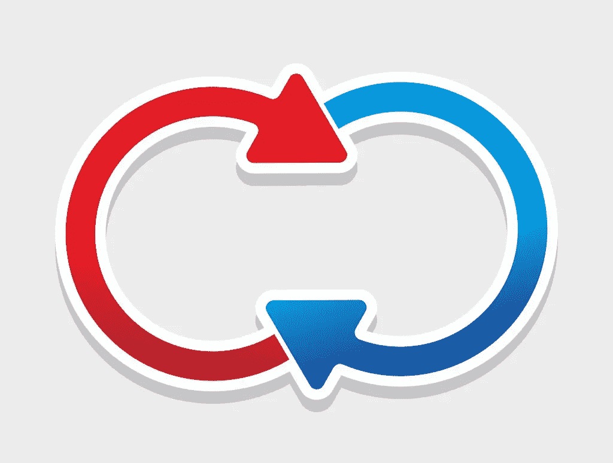
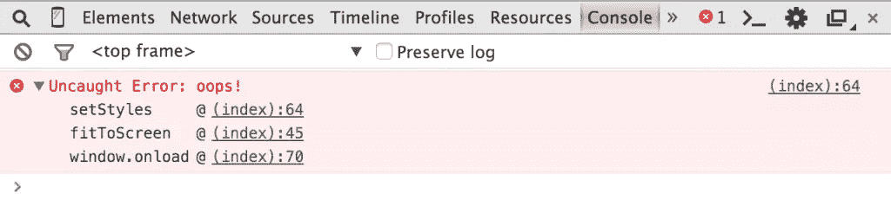
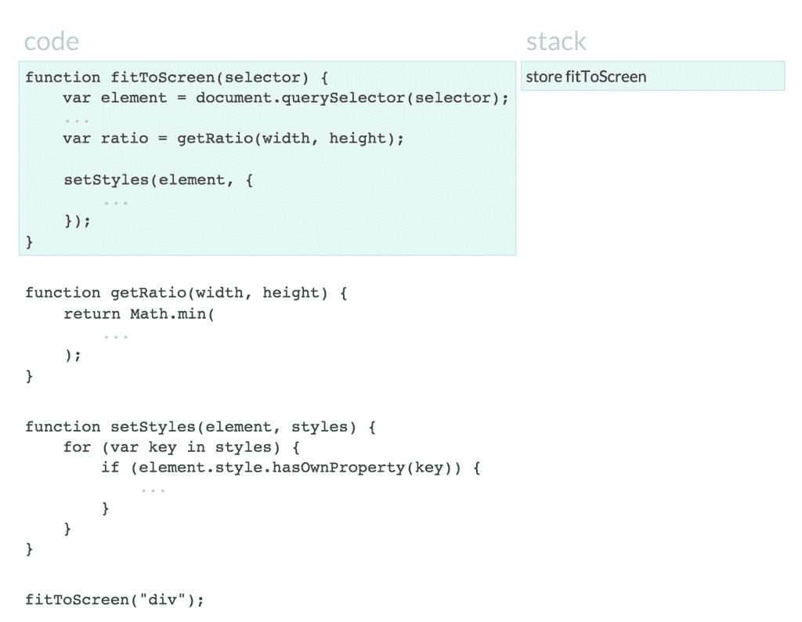

# PHP 中事件循环的介绍

> 原文：<https://www.sitepoint.com/an-introduction-into-event-loops-in-php/>

PHP 开发人员总是在等待着什么。有时我们在等待对远程服务的请求。有时我们会等待数据库从复杂的查询中返回行。如果在等待的过程中，我们可以做些别的事情，那不是很好吗？

如果你写过一些 JS，你可能对回调和 DOM 事件很熟悉。尽管我们在 PHP 中有回调，但它们的工作方式并不完全相同。这要归功于一个叫做事件循环的特性。



我们将看看事件循环是如何工作的，以及如何在 PHP 中使用事件循环。

我们将会看到一些有趣的 PHP 库。有些人会认为这些还不够稳定，不能用于生产。有些人会认为给出的例子“最好用更成熟的语言来做”。有很好的理由去尝试这些事情。在生产中也有很好的理由避免这些事情。这篇文章的目的是强调 PHP 的潜力。

## 事情去哪里等待

为了理解事件循环，让我们看看它们在浏览器中是如何工作的。看一下这个例子:

```
function fitToScreen(selector) {
    var element = document.querySelector(selector);

    var width = element.offsetWidth;
    var height = element.offsetHeight;

    var top = "-" + (height / 2) + "px";
    var left = "-" + (width / 2) + "px";

    var ratio = getRatio(width, height);

    setStyles(element, {
        "position": "absolute",
        "left": "50%",
        "top": "50%",
        "margin": top + " 0 0 " + left,
        "transform": "scale(" + ratio + ", " + ratio + ")"
    });
}

function getRatio(width, height) {
    return Math.min(
        document.body.offsetWidth / width,
        document.body.offsetHeight / height
    );
}

function setStyles(element, styles) {
    for (var key in styles) {
        if (element.style.hasOwnProperty(key)) {
            element.style[key] = styles[key];
        }
    }
}

fitToScreen(".welcome-screen");
```

这段代码不需要额外的库。它将在任何支持 CSS 缩放转换的浏览器中工作。你需要的应该就是最新版本的 Chrome。只要确保 CSS 选择器匹配文档中的元素。

这几个函数使用 CSS 选择器，居中并缩放元素以适合屏幕。如果我们把一个`Error`放在那个`for`循环中会发生什么？我们会看到这样的东西…



我们称这个函数列表为堆栈跟踪。它是浏览器使用的堆栈内部的样子。他们将逐步处理这些代码…



这就像 PHP 使用堆栈来存储上下文一样。浏览器更进一步，为 DOM 事件和 Ajax 回调提供 WebAPIs。在其自然状态下，JavaScript 与 PHP 完全一样是异步的。也就是说:虽然两者看起来都可以同时做很多事情，但它们都是单线程的。他们一次只能做一件事。

通过浏览器 WebAPIs(如 setTimeout 和 addEventListener ),我们可以将并行工作卸载到不同的线程。当这些事件发生时，浏览器向回调队列添加回调。当堆栈下一次为空时，浏览器从回调队列中挑选回调并执行它们。

这个清除堆栈，然后清除回调队列的过程就是事件循环。

## 没有事件循环的生活

在 JS 中，我们可以运行以下代码:

```
setTimeout(function() {
    console.log("inside the timeout");
}, 1);

console.log("outside the timeout");
```

当我们运行这段代码时，我们会在控制台中看到`outside the timeout`和`inside the timeout`。`setTimeout`功能是浏览器让我们使用的 WebAPIs 的一部分。当 1 毫秒过去后，他们将回调添加到回调队列中。

第二个`console.log`在第一个`setTimeout`开始之前完成。我们在标准 PHP 中没有类似于`setTimeout`的东西，但是如果我们必须尝试并模拟它:

```
function setTimeout(callable $callback, $delay) {
    $now = microtime(true);

    while (true) {
        if (microtime(true) - $now > $delay) {
            $callback();
            return;
        }
    }
}

setTimeout(function() {
    print "inside the timeout";
}, 1);

print "outside the timeout";
```

当我们运行这个时，我们看到`inside the timeout`和`outside the timeout`。这是因为我们必须在我们的`setTimeout`函数中使用一个无限循环来执行延迟后的回调。

将`while`循环移出`setTimeout`并将我们所有的代码包装在其中可能很诱人。这可能会让我们的代码感觉不那么阻塞，但在某些时候，我们总是会被那个循环阻塞。在某个时候，我们将会看到我们不能在一个线程中一次做多件事情。

虽然在标准 PHP 中没有类似于`setTimeout`的东西，但是除了事件循环之外，还有一些模糊的方法来实现非阻塞代码。我们可以使用像`stream_select`这样的函数来创建非阻塞的网络 IO。我们可以使用像 EIO 这样的 C 扩展来创建非阻塞的文件系统代码。让我们来看看基于这些模糊方法构建的库…

## 之禾

Icicle 是考虑到事件循环而构建的组件库。让我们看一个简单的例子:

```
use Icicle\Loop;

Loop\timer(0.1, function() {
    print "inside timer";
});

print "outside timer";

Loop\run();
```

*这是用`icicleio/icicle`版本`0.8.0`做的。*

Icicle 的事件循环实现很棒。它还有许多其他令人印象深刻的特点；像 A+承诺，套接字，服务器实现。

Icicle 也使用生成器作为协同例程。生成器和协同例程是一个不同的主题，但是它们允许的代码很漂亮:

```
use Icicle\Coroutine;
use Icicle\Dns\Resolver\Resolver;
use Icicle\Loop;

$coroutine = Coroutine\create(function ($query, $timeout = 1) {
    $resolver = new Resolver();

    $ips = (yield $resolver->resolve(
        $query, ["timeout" => $timeout]
    ));

    foreach ($ips as $ip) {
        print "ip: {$ip}\n";
    }
}, "sitepoint.com");

Loop\run();
```

这是用`icicleio/dns`版`0.5.0`的。

生成器使得以类似于同步代码的方式编写异步代码变得更加容易。当与承诺和事件循环相结合时，它们会产生像这样伟大的无阻塞代码！

## ReactPHP

[react PPH](https://github.com/reactphp)有一个类似的事件循环实现，但是没有所有有趣的生成器:

```
$loop = React\EventLoop\Factory::create();

$loop->addTimer(0.1, function () {
    print "inside timer";
});

print "outside timer";

$loop->run();
```

*这是用`react/event-loop`版本`0.4.1`做的。*

ReactPHP 比 Icicle 更成熟，组件范围更广。在与 ReactPHP 提供的所有功能抗衡之前，Icicle 还有一段路要走。不过，开发人员正在取得良好的进展！

## 结论

很难走出我们被教导的单线程思维模式。我们只是不知道，如果我们能够访问非阻塞 API 和事件循环，我们可以编写的代码有多少限制。

PHP 社区需要意识到这种架构。我们需要学习和尝试异步和并行执行。我们需要[从其他语言中剽窃](http://blog.astrumfutura.com/2012/04/php-innocent-villagefolk-or-a-pillagin-pirate)这些概念和最佳实践，这些语言已经有事件循环很长时间了，直到“我怎样才能有效地使用最多的系统资源？”用 PHP 回答这个问题很容易。

请继续关注 Icicle 更实用的实现，即将推出！

## 分享这篇文章