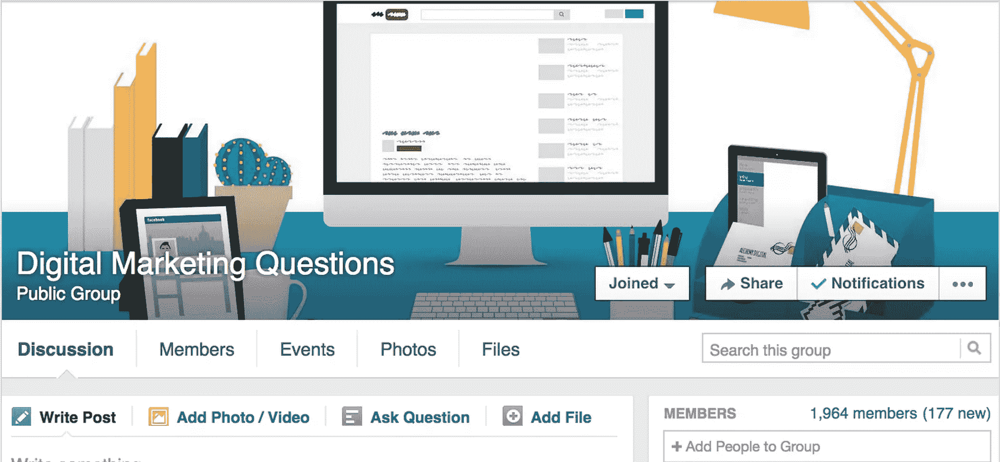
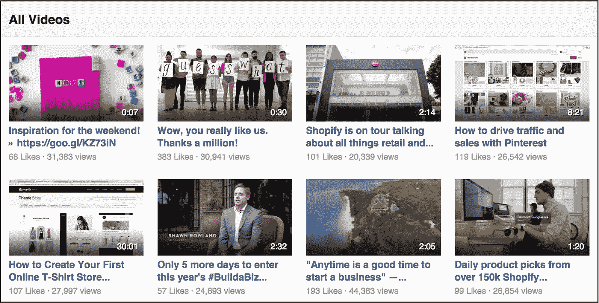
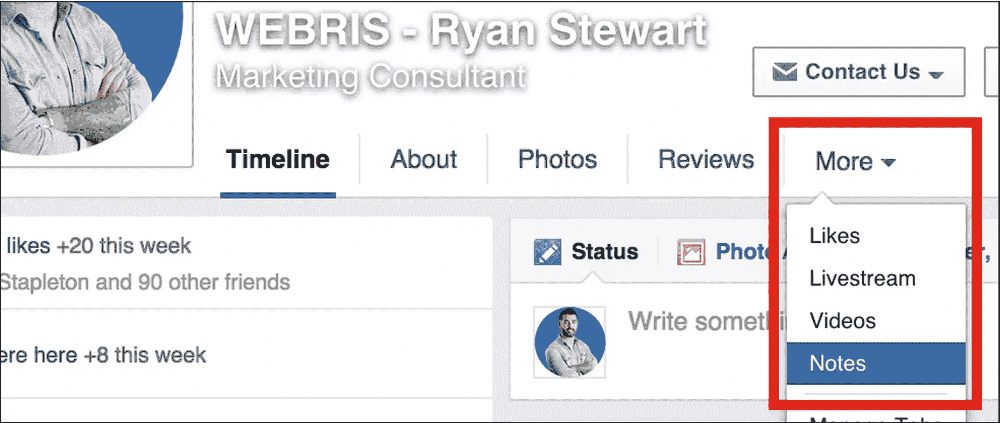

# 你现在应该在脸书做的 5 件事

> 原文：<https://www.sitepoint.com/5-things-you-should-be-doing-on-facebook/>

上周，马克·扎克伯格在他的个人脸书账户上发布了一条状态更新:

> “我们刚刚走过了一个重要的里程碑。有史以来第一次，10 亿人在一天内使用脸书”。

***10 亿人。***

继续……试着告诉我你的目标观众没有使用脸书。

脸书哪儿也不去。这是一个继续发展和改进的巨人，即使竞争越来越激烈。

现在是时候全力以赴进行脸书营销了。这里有 6 种方法可以帮助你开始。

## 加入脸书团体

这是一个有据可查的事实，脸书为了刺激广告收入而关闭了页面的有机延伸。

然而，来自脸书团体的帖子没有这个问题。事实上，他们拥有巨大的有机影响力，群体越活跃，影响力就越大。

脸书页面是单方面的对话，而脸书群体是真正的在线社区，允许进行伟大的、多维度的对话。

加入团体有两种方式:

1.  搜索相关的加入进来。不要给他们发垃圾邮件！参与进来，参与线程并增加价值。如果你能做到这一点，你将获得推广内容的权利。(欢迎加入我们的。)
2.  创造你自己的。

如果你选择第二种，有几件事你应该知道:

*   你需要建立一个基于价值的群体，而不是你的品牌。
*   你需要一个全职的版主，因为脸书有很多全职的垃圾邮件发送者。

记住这两点，你会用脸书集团杀死它。

## 利用本地视频

几个月前，我在我的 newsfeed 上看到了许多关于 [Shopify 的发票平台](http://www.shopify.com/invoice)的视频。这激起了我的兴趣。

经过一些调查，我了解到脸书给了本地视频比任何其他类型的内容更多的影响力。

为什么脸书的视频如此受欢迎？

因为脸书明白在线视频的力量，它想从 YouTube 那里窃取市场份额。

如果你尝试分享 YouTube 上关于脸书的链接，你可能是唯一一个看到它的人。但如果你拍摄同样的视频，并将文件直接上传到脸书(即脸书的主机)，你会看到覆盖范围大幅增加。

## 将脸书作为一个发布平台

除非你付费，否则脸书不希望你驱动其平台之外的流量，这就是为什么你的链接很少或为零的原因。

与其在你的页面上无意识地发布链接，为什么不使用脸书来整合你的内容呢？

脸书页面能够创建长形式的帖子，或“[笔记](https://www.facebook.com/help/488014787881885/)”，非常类似于你网站上的博客帖子。只需将您的博客文章复制粘贴到笔记中，并在脸书上进行推广。

我保证你会注意到在你的岗位上参与度的瞬间提升。

在一天结束的时候，网站流量是消费的第二位的，所以不要和算法作对。好好利用它。

## 拿出脸书的广告

地球上的每个企业都应该在脸书做广告。

是的，没错。每一个。单身。生意。

***你知道脸书有多少数据吗？***

我指的不仅仅是你放入个人资料的信息，以及你“喜欢”的东西，还有 cookie 和用户数据。

想想你用脸书登录了多少网站和应用程序……这些数据被推送到脸书的广告平台，并被用来锁定用户。不管你卖什么，你都可以通过脸书广告接触到你的观众。

我想分享一个我们正在合作的当地企业的有力例子，以及我们如何利用脸书广告来推动有针对性的合格销售线索。

### 为他们的企业制作了 3 个短视频

*   视频 1 讲述了常见的业务问题，但没有提到他们的服务
*   视频 2 介绍了他们的服务
*   视频 3 讲述了他们的服务如何解决他们的业务问题

### 将视频直接上传到脸书

*   连续 7 天播放视频 1，目标是纽约地区的每个人
*   运行视频 2，将观看视频 1 超过 50%的人作为目标
*   运行视频 3，将观看视频 2 超过 50%的人作为目标

### 结果呢？

25 个电话线索，200 美元

## 作为一个交流平台

为了写这篇文章，我对自己在脸书所做的一切进行了自我审查。

我对自己使用脸书信息的程度感到震惊。我给他们发的不仅仅是短信。

深究原因后，我并不感到意外。脸书已经悄悄地将大量功能集成到他们的消息平台中:

*   国际信息传递(当您与远程团队合作时，这一点非常重要)
*   群组消息(管理团队时非常重要)
*   发送大文件的能力
*   能够拨打电话和视频电话
*   向聊天对象汇款的能力

许多公司都在努力寻找一个价格合理的可靠消息平台。脸书有市场上最好的，而且是 100%免费的。

## 结论

脸书是一个巨人，它正在朝着成为媒体巨人的方向大步前进。为了更快实现这一目标，脸书给那些愿意遵守其规则的人提供了巨大的优势。

不要和脸书对抗。好好利用它。

## 分享这篇文章