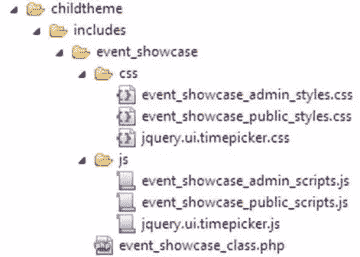
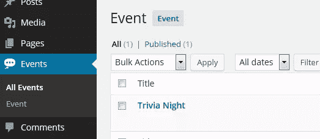
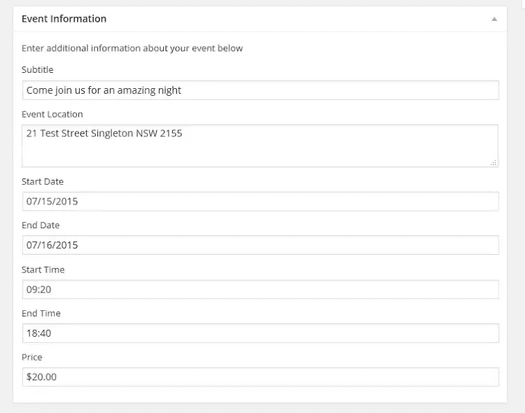

# 用 WordPress 进行面向对象的开发

> 原文：<https://www.sitepoint.com/object-orientated-development-with-wordpress/>

面向对象的代码无处不在，WordPress 也不例外。

WordPress 的核心是建立在一系列的对象/类之上的，这些对象/类用来控制从数据库操作到网站外观的一切。

在本教程中，我们将探讨面向对象的设计，以及在为 WordPress 开发时，如何在实际应用中使用这些设计，包括:

*   准确理解什么是面向对象设计。
*   讨论为什么我们应该使用面向对象的设计。
*   研究一个真实世界的例子来展示它是如何工作的。

注 1:还要注意，本教程主要概述了以 WordPress 为中心的概念，所以如果你完全不熟悉面向对象设计，你应该可以通过 PHP 参考指南快速了解 OO。

注 2:如果你热衷于立即下载所有东西，请随意从我的 GitHub 库下载源代码并跟随教程。

让我们直接开始吧！

## 什么是面向对象的设计？

面向对象设计(OO Design)是一种不同于传统过程方法的解决问题的方法。

使用面向对象的设计，你可以创建一个结构(类),将所有相关的功能(方法)和信息(属性)组合在一起，以解决问题。

这不同于创建函数和变量来解决问题的过程化开发，然而，这些元素可以跨多个文件分开，重新声明，并且通常是松散关联的。

简而言之，面向对象的设计就是把相关的功能集中到一个地方，这样就可以在一个地方进行维护、扩展和使用。

## 为什么面向对象是个好主意？

既然过程代码运行良好，你可能想知道用面向对象的方法开发有什么意义？

虽然过程化设计没有什么“错误”,但是以更加面向对象的风格进行开发有几个好处。

### 组织

当使用面向对象的方法时，你的代码通常组织得更好。创建类意味着解决您的问题的功能都在一个文件中(不像过程化开发，您可能将函数和变量分散在各处)。

把你所有的代码放在一个地方有助于你把事情组织得井井有条，也有助于其他开发人员了解你的系统是如何工作的。

最糟糕的事情莫过于选择一个项目，然后不得不四处寻找用于创建网站各种元素的函数和变量(由于未知的原因，这些元素总是分布在多个文件中)。

### 可量测性

当用面向对象的方法解决问题时，你创建类。

这些类可以通过使用`inheritance`扩展来扩展或缩放。继承可以让你创建一个基于另一个类的类，这个类可以访问新类的所有属性和方法。

您可以扩展一个类来执行额外的功能，甚至可以覆盖它的方法和属性来适应这种情况。

对于过程化代码，您要么需要重构部分代码，要么创建完整的新代码来处理额外的情况。

### 模块性

面向对象设计的目的是将解决问题的所有功能整合到一个类中。

因为解决问题的所有代码都在一个类中，而这个类通常在它自己的 PHP 文件中，所以你可以获取一个完整的文件并在另一个位置使用它，因此它本质上是模块化的。

这样做的好处是，如果您编写的类足够好，您应该能够在以后重用它们，并且只需要进行少量的定制。

虽然您可以复制和粘贴过程代码，但它通常没有很好的组织，并且您可能必须浏览几个文件以确保您拥有所需的功能。

## 示例场景–创建简单的活动展示

在这种情况下，我们的客户希望在他们的网站上有一个可以创建和管理活动的位置。这些活动将用于推广即将到来的知识之夜、宾果游戏和其他有趣的活动。

第一步是分解所需的功能，这样我们就可以计划我们的解决方案(在这里做好计划将有助于我们的面向对象方法向前发展)。在我们的场景中，我们可以看到以下一组任务:

*   创建自定义内容类型来管理这些“事件”。
*   添加额外的元框来处理额外的信息处理。
*   保存附加元信息。
*   显示我们“活动”的元信息。

我们可以创建一个**插件**或者我们可以编辑**子主题**来提供这个功能。

对于这个场景，我们将在一个文件中创建我们的功能，然后我们可以将它包含在子主题中。我选择这种方法是因为我们想要编辑我们的主题模板，这样我们就可以输出额外的事件信息。

### 设置目录并创建文件

因为我们希望一切都易于管理和模块化，所以让我们从设置子主题中的文件夹结构开始。

组织一切的一个简单方法是在你的子主题中创建一个`includes`目录。这个目录将包含您的主题将包含/实现的其他代码或功能(您可以随意称呼它，目的是在主题中有一个单独的目录)。

在这个目录中，我们应该创建另一个文件夹，这次叫做`event_showcase`。在这个文件夹中，我们将放置所有适用于此场景的文件。我们还需要一个`js`和一个`css`文件夹。

将你的功能组织到文件夹中意味着你可以更容易地看到你的主题实现了哪些模块/特性。例如，你可能想为你的主题实现另一套功能，你可以只添加一个新的文件夹，逻辑上一切都组织得井井有条。

让我们为示例创建文件，并将它们移动到正确的目录中

*   `event_showcase_class.php`
*   `event_showcase_admin_styles.css`
*   `event_showcase_admin_scripts.js`
*   `event_showcase_public_styles.css`
*   `event_showcase_public_scripts.js`

您应该看到类似下面的内容:



稍后，您将需要下载 jQuery 时间选择器脚本和样式，并将其放在这个目录中。暂时不要担心这个。

### 在 WordPress 中加载你的文件

随着文件的建立，我们现在需要将它们包含在我们的子主题中。

打开你的子主题的`functions.php`,将下面的代码放在顶部或底部

```
//Theme functions for child theme

//load our event showcase class
$event_showcase = get_stylesheet_directory() . '/includes/event_showcase/event_showcase_class.php';
include($event_showcase);
```

这将加载主类文件，该文件将概述我们的功能。在这个类中，我们将处理脚本和样式以及其他元素的入队。

### 创建您的课程大纲

我们名为`event_showcase_class.php`的类文件将包含我们的事件系统使用的大部分功能；因此，制定出一个基本的框架来说明我们需要什么方法和属性来完成这项工作是一个好主意。

将以下代码复制到您的类文件中。

```
/*
 * Event Showcase
 * Creates an 'event' content type to showcase upcoming functions and information
 * Uses hooks and filters inside your theme to output relevant information
 */

 class event_showcase{

	//variables
	private $directory = '';
	private $singular_name = 'event';
	private $plural_name = 'events';
	private $content_type_name = 'event_showcase';

	//magic function, called on creation
	public function __construct(){}
	//sets the directory (path) so that we can use this for our enqueuing
	public function set_directory_value(){}
	//check if we need to flush rewrite rules
	public function check_flush_rewrite_rules(){}
	//enqueue public scripts and styles
	public function enqueue_public_scripts_and_styles(){}
	//enqueue admin scripts and styles
	public function enqueue_admin_scripts_and_styles(){}
	//adding our new content type
	public function add_content_type(){}
	//adding meta box to save additional meta data for the content type
	public function add_meta_boxes_for_content_type(){}
	//displays the visual output of the meta box in admin (where we will save our meta data)
	public function display_function_for_content_type_meta_box($post){}
	//when saving the custom content type, save additional meta data
	public function save_custom_content_type($post_id){}
	//display additional meta information for the content type
	//@hooked using 'display_additional_meta_data' in theme
	function display_additional_meta_data(){}
 }

 //create new object 
 $event_showcase = new event_showcase;
```

让我们浏览一下方法和属性，这样我们就可以理解流程:

*   变量——我们声明了几个变量，使这个类更加模块化(所以我们可以复制这个文件，更改几个属性，这个类将处理其他的更改)。
*   我们所有的钩子、过滤器和初始化代码都将放在这里。
*   `set_directory_value()`–定义我们的`directory`属性，这将让我们轻松地将放在 CSS 或 JS 目录中的文件排队。
*   当我们添加我们的内容类型时，处理漂亮的永久链接的刷新(这使得新项目工作)。
*   加载我们面向公众的脚本和样式。
*   `enqueue_admin_scripts_and_styles()`–加载管理脚本和样式。
*   `add_content_type()`–定义我们正在创建的新内容类型。
*   `add_meta_boxes_for_content_type()`–为我们的新内容类型添加元框。
*   `display_function_for_content_type_meta_box`–为内容类型构建后端管理界面，以便我们可以保存额外的信息。
*   `save_custom_content_type($post_id)`–处理自定义内容类型(和我们的元信息)的保存。
*   `display_additional_meta_data()`–在前端显示保存的元信息。

现在让我们来看一下，更新这些元素并概述代码

### 类别属性

我们在类的顶部声明了一些属性，这些属性将被我们的方法引用。这样做的目的是使这个类在将来更容易重用和改变它的功能。

```
//variables
private $directory = '';	
private $singular_name = 'event';
private $plural_name = 'events';
private $content_type_name = 'event_showcase';
```

### _ _ 构造()

我们的`__construct`函数是一个神奇的函数。这些函数是特殊的 PHP5+函数，类可以访问它们来执行特定的操作。

它们都以名字前的双下划线开头，可以选择包含在任何类定义中。理解所有的神奇函数最好留给另一个讨论[(这是另一篇关于神奇函数和常数的文章)。](https://www.sitepoint.com/magic-methods-and-predefined-constants-in-php/)

类一初始化就调用`__construct`函数，所以它是第一个被触发的函数。在这里，我们添加了所有的钩子、过滤器和启动逻辑。用下面的代码更新基本大纲。

```
//magic function, called on creation
public function __construct(){

	$this->set_directory_value(); //set the directory url on creation
	add_action('init', array($this,'add_content_type')); //add content type
	add_action('init', array($this,'check_flush_rewrite_rules')); //flush re-write rules for permalinks (because of content type)
	add_action('add_meta_boxes', array($this,'add_meta_boxes_for_content_type')); //add meta boxes 
	add_action('wp_enqueue_scripts', array($this,'enqueue_public_scripts_and_styles')); //enqueue public facing elements
	add_action('admin_enqueue_scripts', array($this, 'enqueue_admin_scripts_and_styles')); //enqueues admin elements
	add_action('save_post_' . $this->content_type_name, array($this,'save_custom_content_type')); //handles saving of content type meta info
	add_action('display_content_type_meta', array($this,'display_additional_meta_data')); //displays the saved content type meta info	
}
```

你可能认为`add_action`看起来与你之前看到的有些不同，你是对的。

当在类中使用`add_action`和`add_filter`调用时，必须在数组中提供第二个参数。数组的第一个值是`$this`变量(意味着类本身)，第二个值是将要使用的函数名(用引号括起来)。

更多信息请查看 WordPress Codex 上的`add_action`函数的[类脚注。](https://codex.wordpress.org/Function_Reference/add_action#Using_with_a_Class)

### 集合目录值()

因为我们将 CSS 和 JS 放入队列，所以将文件目录 URL 存储到我们可以访问的变量中是有意义的。我们的目录结构是`/includes/event_showcase`但是它可以定制以适合您的结构。

```
//sets the directory (path) so that we can use this for our enqueuing
public function set_directory_value(){
	$this->directory = get_stylesheet_directory_uri() . '/includes/event_showcase';
}
```

### check_flush_rewrite_rules()

由于我们正在添加自定义内容类型，我们需要处理[漂亮的永久链接](https://codex.wordpress.org/Using_Permalinks)；这些永久链接是重写的，让你的页面 URL 看起来不那么难看(你可以用`http://mywebsite.com.au/my-event`代替`http://mywebsite.com.au/?p=123`)。

重写确保你的内容类型被转换成漂亮的格式，然而，这种重写是昂贵的，如果做得过分，会降低你的站点速度。因为重写会影响你的站点，所以通常只在主题/插件激活或停用时才会改变。

因为你可能不想手动更新你的永久链接，这个功能要求 WordPress 自动更新，并且只更新一次(在你的新内容类型被添加之后)。

该功能将检查网站是否需要通过主题选项刷新。如果需要刷新，它将更新永久链接，然后将选项的值设置为 false(因此它只触发一次，而不是每次加载页面)。

```
//check if we need to flush rewrite rules
public function check_flush_rewrite_rules(){
	$has_been_flushed = get_option($this->content_type_name . '_flush_rewrite_rules');
	//if we haven't flushed re-write rules, flush them (should be triggered only once)
	if($has_been_flushed != true){
		flush_rewrite_rules(true);
		update_option($this->content_type_name . '_flush_rewrite_rules', true);
	}
}
```

### enqueue _ public _ scripts _ and _ styles()

这个函数在前端处理网站脚本和样式的入队。

我们在入队调用中使用内容类型的名称，这样就不会与其他插件有任何命名冲突(因为它会转换成一些独特的东西，如“event_showcase_public_scripts”。

我们调用 [`wp_enqueue_style`](https://codex.wordpress.org/Function_Reference/wp_enqueue_style) 和 [`wp_enqueue_script`](https://codex.wordpress.org/Function_Reference/wp_enqueue_script) 来加载我们的资源。

在加载资源时，我们还使用了`$directory`和`$content_type_name`属性。

```
//enqueue public scripts and styles
public function enqueue_public_scripts_and_styles(){	
	//public styles
	wp_enqueue_style(
		$this->content_type_name . '_public_styles', 
		$this->directory . '/css/' . $this->content_type_name . '_public_styles.css'
	);
	//public scripts
	wp_enqueue_script(
		$this->content_type_name . '_public_scripts', 
		$this->directory . '/js/' . $this->content_type_name . '_public_scripts.js', 
		array('jquery')
	); 
}
```

### enqueue _ admin _ scripts _ and _ styles()

此功能处理在管理后端网站的脚本和样式入队。

我们检查我们是否在我们内容类型的编辑屏幕或新屏幕上，并且只有在我们在的情况下才继续(当我们不在正确的页面上时不需要加载资源)。

我们调用 [`wp_enqueue_style`](https://codex.wordpress.org/Function_Reference/wp_enqueue_style) 和 [`wp_enqueue_script`](https://codex.wordpress.org/Function_Reference/wp_enqueue_script) 来加载我们的资源，本质上与我们的公共面向函数相同。

对于这个例子，我同时使用了 [jQuery UI 日期选择器](https://jqueryui.com/datepicker/)(jQuery UI 库的一部分)和 [jQuery UI 时间选择器](https://fgelinas.com/code/timepicker/)(与日期选择器风格相似)。

从上面的链接下载时间选择器库，并在目录中包含相关的 CSS 和 JS 文件。

```
//enqueue admin scripts and styles
public function enqueue_admin_scripts_and_styles(){

	global $pagenow, $post_type;

	//process only on post edit page for custom content type
	if(($post_type == $this->content_type_name) && ($pagenow == 'post-new.php' || $pagenow == 'post.php')){

		//admin styles
		wp_enqueue_style(
			$this->content_type_name . '_public_styles', 
			$this->directory . '/css/' . $this->content_type_name . '_admin_styles.css'
		);
		//jquery ui styles for datepicker
		wp_enqueue_style(
			$this->content_type_name . '_jquery_ui_style',
			'//code.jquery.com/ui/1.11.4/themes/smoothness/jquery-ui.css'
		);
		//timepicker styles
		wp_enqueue_style(
			'jquery_ui_timepicker_styles',
			$this->directory . '/css/jquery.ui.timepicker.css'
		);
		//timepicker script
		wp_enqueue_script(
			'jquery_ui_timepicker_script',
			$this->directory . '/js/jquery.ui.timepicker.js'
		);		
		//admin scripts (depends on datepicker and timepicker)
		wp_enqueue_script(
			$this->content_type_name . '_public_scripts', 
			$this->directory . '/js/' . $this->content_type_name . '_admin_scripts.js', 
			array('jquery','jquery-ui-datepicker','jquery_ui_timepicker_script')
		); 	
	}
}
```

### 添加内容类型()

我们在这个函数中声明我们的自定义内容类型。

该函数使用`$singular_name`、`$plural_name`和`$content_type_name`属性来简化这个新文章类型的注册。

像这样构造注册函数意味着你只需要提供一些信息就可以很容易地改变和注册一个帖子类型。

关于注册自定义内容类型的更详细的概要，请查看`register_post_type`函数的 [WordPress codex](https://codex.wordpress.org/Function_Reference/register_post_type)

```
//adding our new content type
public function add_content_type(){
	 $labels = array(
           'name'               => ucwords($this->singular_name),
           'singular_name'      => ucwords($this->singular_name),
           'menu_name'          => ucwords($this->plural_name),
           'name_admin_bar'     => ucwords($this->singular_name),
           'add_new'            => ucwords($this->singular_name),
           'add_new_item'       => 'Add New ' . ucwords($this->singular_name),
           'new_item'           => 'New ' . ucwords($this->singular_name),
           'edit_item'          => 'Edit ' . ucwords($this->singular_name),
           'view_item'          => 'View ' . ucwords($this->plural_name),
           'all_items'          => 'All ' . ucwords($this->plural_name),
           'search_items'       => 'Search ' . ucwords($this->plural_name),
           'parent_item_colon'  => 'Parent ' . ucwords($this->plural_name) . ':', 
           'not_found'          => 'No ' . ucwords($this->plural_name) . ' found.', 
           'not_found_in_trash' => 'No ' . ucwords($this->plural_name) . ' found in Trash.',
       );

       $args = array(
           'labels'            => $labels,
           'public'            => true,
           'publicly_queryable'=> true,
           'show_ui'           => true,
           'show_in_nav'       => true,
           'query_var'         => true,
           'hierarchical'      => false,
           'supports'          => array('title','editor','thumbnail'), 
           'has_archive'       => true,
           'menu_position'     => 20,
           'show_in_admin_bar' => true,
           'menu_icon'         => 'dashicons-format-status'
       );

	//register your content type
	register_post_type($this->content_type_name, $args);

}
```

一旦你添加了这一步，你应该会看到一个新的项目被添加到后端 WordPress 菜单中。



### add _ meta _ boxes _ for _ content _ type()

我们在这里添加内容类型所需的元框。我们调用 [`add_meta_box`](https://codex.wordpress.org/Function_Reference/add_meta_box) 函数，并为其提供 out 功能。简而言之，我们用它来创建一个新的管理框来保存我们想要保存的新表单元素。

```
//adding meta box to save additional meta data for the content type
public function add_meta_boxes_for_content_type(){

	//add a meta box
	add_meta_box(
		$this->singular_name . '_meta_box', //id
		ucwords($this->singular_name) . ' Information', //box name
		array($this,'display_function_for_content_type_meta_box'), //display function
		$this->content_type_name, //content type 
		'normal', //context
		'default' //priority
	);

}
```

### 显示 _ 功能 _ 内容 _ 类型 _ 元 _ 框($post)

我们使用这个函数来输出内容类型的新元信息的后端选项。

对于我们的示例，我们正在收集日期、时间和其他有关事件的信息，我们将向最终用户显示这些信息。

我们首先将所有附加的 post 元收集到变量中，并显示 HTML 表单的输出。其中一些字段将触发日期选择器接口，其他字段将触发时间选择器(由元素上使用的类决定)。

此外，我们设置了一个 nonce 字段，这样我们可以在保存时验证请求是否来自这个页面。

```
 //displays the back-end admin output for the event information
public function display_function_for_content_type_meta_box($post){

	//collect meta information
	$event_subtitle = get_post_meta($post->ID,'event_subtitle', true);
	$event_start_date = get_post_meta($post->ID,'event_start_date', true);
	$event_end_date = get_post_meta($post->ID,'event_end_date', true);
	$event_start_time = get_post_meta($post->ID,'event_start_time', true);
	$event_end_time = get_post_meta($post->ID,'event_end_time', true);
	$event_location = get_post_meta($post->ID,'event_location', true);
	$event_price = get_post_meta($post->ID,'event_price', true);

	//set nonce
	wp_nonce_field($this->content_type_name . '_nonce', $this->content_type_name . '_nonce_field');

	?>
	<p>Enter additional information about your event below</p>
	<div class="field-container">
		<label for="event_subtitle">Subtitle</label>
		<input type="text" name="event_subtitle" id="event_subtitle" value="<?php echo $event_subtitle; ?/>"/>
	</div>
	<div class="field-container">
		<label for="event_location">Event Location</label>
		<textarea name="event_location" id="event_location">< ?php echo $event_location; ?></textarea>
	</div>
	<div class="field-container">
		<label for="event_start_date">Start Date</label>
		<input type="text" name="event_start_date" id="event_start_date" class="admin-datepicker" value="<?php echo $event_start_date; ?/>" required/>
	</div>
	<div class="field-container">
		<label for="event_end_date">End Date</label>
		<input type="text" name="event_end_date" id="event_end_date" class="admin-datepicker" value="<?php echo $event_end_date;  ?/>" required/>
	</div>
	<div class="field-container">
		<label for="event_start_time">Start Time</label>
		<input type="text" name="event_start_time" id="event_start_time" class="admin-timepicker" value="<?php echo $event_start_time; ?/>" required/>
	</div>
	<div class="field-container">
		<label for="event_end_time">End Time</label>
		<input type="text" name="event_end_time" id="event_end_time" class="admin-timepicker" value="<?php echo $event_end_time; ?/>" required/>
	</div>
	<div class="field-container">
		<label for="event_price">Price</label>
		<input type="text" name="event_price" id="event_price"  value="<?php echo $event_price; ?/>"/>
	</div>
	< ?php
} 
```

当你完成了这一步，你应该看到新的空的元框已经被转换，现在可以保存我们所有的新信息。



### 保存自定义内容类型(post _ id)

这里是我们保存自定义内容类型的附加元数据的地方。

我们首先检查添加到元框中的 nonce，并验证其真实性。在这之后，我们检查我们没有进行自动保存，并且用户实际上可以编辑这个页面。如果所有这些检查都通过了，我们就继续前进。

我们将所有的值收集到变量中，并使用 [`sanitize_text_field`](https://codex.wordpress.org/Function_Reference/sanitize_text_field) 函数净化它们。这之后我们调用 [`update_post_meta`](https://codex.wordpress.org/Function_Reference/update_post_meta) 函数来保存我们的数据。

```
//when saving the custom content type, save additional meta data
public function save_custom_content_type($post_id){

	//check for nonce
	if(!isset($_POST[$this->content_type_name . '_nonce_field'])){
		return $post_id;
	}
	//verify nonce
	if(!wp_verify_nonce($_POST[$this->content_type_name . '_nonce_field'] , $this->content_type_name . '_nonce')){
		return $post_id;
	}
	//check for autosaves
	if(defined('DOING_AUTOSAVE') && DOING_AUTOSAVE){
		return $post_id;
	}
	//check if the user can edit 
	if(!current_user_can('edit_posts')){
		return $post_id;
	}

	//collect sanitized information
	$event_subtitle =sanitize_text_field($_POST['event_subtitle']);
	$event_start_date =sanitize_text_field($_POST['event_start_date']);
	$event_end_date = sanitize_text_field($_POST['event_end_date']);
	$event_start_time =sanitize_text_field($_POST['event_start_time']);
	$event_end_time = sanitize_text_field($_POST['event_end_time']);
	$event_location = sanitize_text_field(wpautop($_POST['event_location']));
	$event_price = sanitize_text_field($_POST['event_price']);

	//save post meta
	update_post_meta($post_id,'event_subtitle',$event_subtitle);
	update_post_meta($post_id,'event_start_date',$event_start_date);
	update_post_meta($post_id,'event_end_date',$event_end_date);
	update_post_meta($post_id,'event_start_time',$event_start_time);
	update_post_meta($post_id,'event_end_time',$event_end_time);
	update_post_meta($post_id,'event_location',$event_location);
	update_post_meta($post_id,'event_price', $event_price);

}
```

### 显示附加元数据()

这个函数显示我们的新内容类型(单个事件)的单个帖子的已保存元信息。

我们在`__construct`函数中定义了一个名为`display_content_type_meta`的新动作，如下所示:

```
add_action('display_content_type_meta', array($this,'display_additional_meta_data')); //displays the saved content type meta info
```

这个动作的第二个值叫做`display_additional_meta_data`，对应于这个函数。这意味着任何时候有人调用`do_action('display_content_type_meta');`它都会调用这个函数并显示新的文章元信息。

你可以从你的主题中的任何地方调用`do_action('display_content_type_meta');`(只要你在这种内容类型的一个帖子上),它将显示元信息。

我使用的是一个父主题 twenty thirteen，所以我将挂钩到我的显示的子主题的`content.php`。

这个函数将获得全局的`$post`和`$post_type`，并检查当前正在查看的项目是否属于我们的新内容类型。

在这之后，该函数收集元信息并显示它(一路上做一些快速检查)。

```
//display additional meta information for the content type
	//@hooked using 'display_additional_meta_data' in theme
	function display_additional_meta_data(){
		global $post, $post_type;

		//if we are on our custom post type
		if($post_type == $this->content_type_name){

			//collect information
			$event_subtitle = get_post_meta($post->ID,'event_subtitle', true);
			$event_start_date = get_post_meta($post->ID,'event_start_date', true);
			$event_end_date = get_post_meta($post->ID,'event_end_date', true);
			$event_start_time = get_post_meta($post->ID,'event_start_time', true);
			$event_end_time = get_post_meta($post->ID,'event_end_time', true);
			$event_location = get_post_meta($post->ID,'event_location', true);
			$event_price = get_post_meta($post->ID,'event_price', true);

			$html = '';
			if(!empty($event_subtitle)){
				$html .= '

### *’。$event_subtitle。*

';
			}
			$html .= '';
				$html .= '**Start:** ' . $event_start_date . ' - ' . $event_start_time . '';
				$html .= '**End:** ' . $event_end_date . ' - ' . $event_end_time . '';
			if(!empty($event_location)){
				$html .= '**Location:** ' . $event_location . '';
			}
			if(!empty($event_price)){
				$html .= '**Price:** ' . $event_price . '';
			}
			$html .= '';

			echo $html;

		}

	}
```

### 附加文件，CSS 和 JS

现在大部分功能已经完成，让我们切换到我们的 CSS 和 JS 文件，以快速添加一些样式和交互性。

#### event _ showcase _ admin _ styles . CSS

```
/*
 * Admin Styles
 * Styling the back-end of our content type
 */

.field-container{
	margin-bottom: 10px;
}
.field-container label{
	display: block;
	margin-bottom: 5px;
	width: 100%;
}
.field-container input,
.field-container textarea,
.field-container select{
	width: 100%;
}
```

#### event _ showcase _ public _ styles . CSS

```
/*
 * Public Styles
 * Front end stytes to format our additional content meta
 */

.additional-meta{
	margin-bottom: 15px;
}
.additional-meta .meta{
	margin-bottom: 5px;
}
.additional-meta .meta span{
	margin-left: 10px;	
}
```

#### 事件 _ 展示 _ 管理 _ 脚本. js

```
/*
 * Admin Scripts
 * activates jQuery date picker and time picker on the backend
 */

jQuery(document).ready(function($){

	//activate datepicker
	$('.admin-datepicker').datepicker();

	//activate timepicker
	$('.admin-timepicker').timepicker();
});
```

### 完整的功能正在运行！

当一切都拼凑在一起，你应该能够创建一个新的“事件”与额外的元数据。当您查看您的活动时，您应该会看到我下面的示例


你可以看到附加字幕，日期，时间和门票数据。

像这样扩展一个基本的帖子类型并添加额外的元素有助于创建一个更具交互性和更易于管理的网站。用户不再需要通过内容区添加所有的信息，因为内容区可能会很混乱、难以使用且不一致。他们现在有一个简单的易于管理的界面。

### 从这里去哪里？

现在你已经看到了一个面向对象设计的实际例子，以及增强你的开发是多么容易，你可以应用这些技能，构建更好的主题和插件。

您可能想从我的 GitHub 页面下载这个例子的源代码，然后修改它以适应即将到来的项目，或者扩展它以提供额外的功能。

希望这篇文章能帮助你计划你的开发，并看到面向对象的方法如何节省你的时间和精力。

## 分享这篇文章