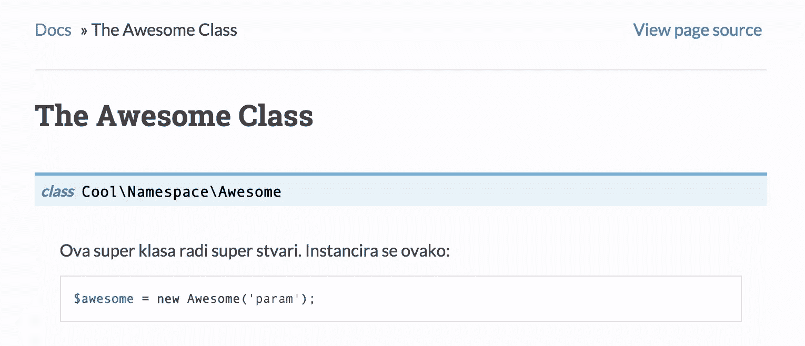
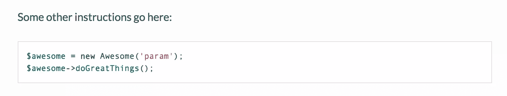
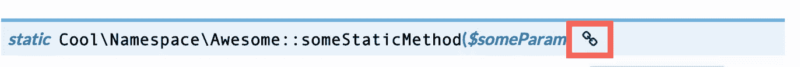
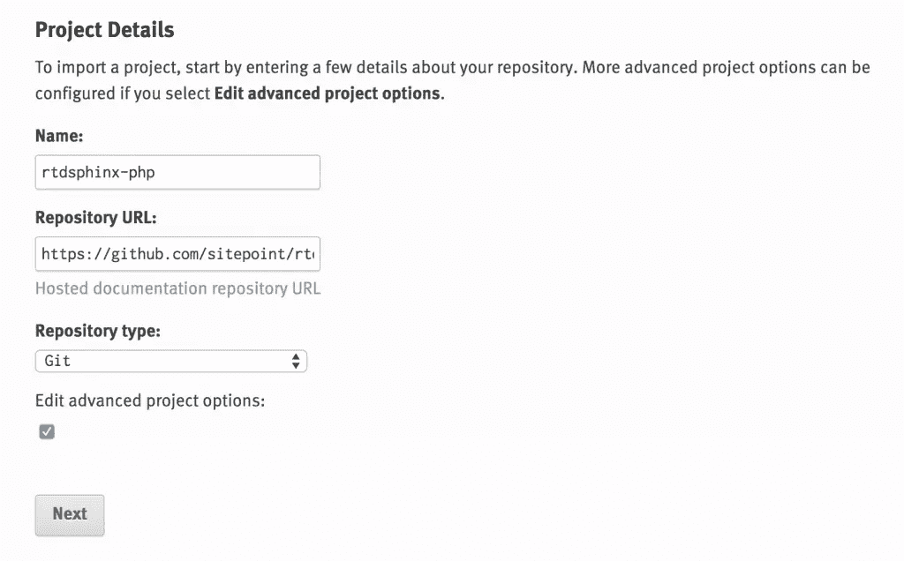
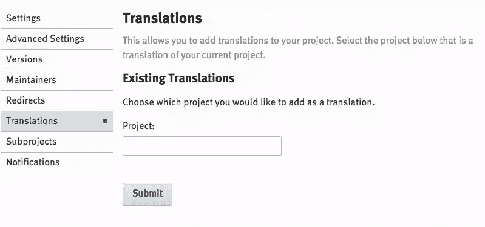
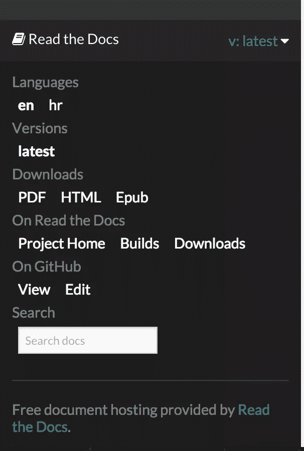

# 使用 SitePoint 的 RTDSphinx-PHP 快速多语言文档

> 原文：<https://www.sitepoint.com/fast-multi-language-docs-with-sitepoints-rtdsphinx-php/>

这篇文章将指导你使用 [RTDSphinx-PHP](https://github.com/sitepoint/rtdsphinx-php) ，这是一个 [ReadTheDocs](http://readthedocs.org) 友好的基于 Sphinx 的 PHP 文档框架，具有相同的缺省值、预安装的指令和修改过的样式，可以以多种语言呈现最佳的 API 和散文文档。对于未完成的文档示例，请参见此处的并在左下方的弹出面板中切换语言。

如果这听起来很熟悉，那是因为我们已经在[以前的文章](https://www.sitepoint.com/using-sphinx-for-php-project-documentation)中手动设置了一个类似的框架，但是那个没有本地化支持，步骤太多，并且不像这个新开发的一样可重用。本指南不是一个“让我们从头开始构建”的项目，而是这个框架项目提供的开箱即用特性的概述，以及对其用法的介绍。

这篇文章将是许多 SitePoint 品牌项目中的第一篇，这些项目旨在广泛的公共消费、完全开源和高度欢迎其他人的贡献。


## 快速启动

对于先决条件，确保你已经安装了 Python 和`pip`、Python 包管理器。

首先，将骨架克隆到一个文件夹中——可以是你项目的子文件夹，比如`projectRoot/docs`,也可以是它自己的文件夹——什么都可以。

```
git clone https://github.com/sitepoint/rtdsphinx-php docs
```

可选地，创建一个 [Python 虚拟环境](https://www.sitepoint.com/virtual-environments-python-made-easy/)。

然后，在克隆的文件夹中，通过运行以下命令从`requirements.txt`文件安装必备组件:

```
pip install -r requirements.txt
```

这将安装所有必需的软件包。

就是这样。要为新语言生成文件，请运行:

```
bin/update.sh xx
```

…其中`xx`是语言代码(如日语的“jp”)。
然后，编辑`locale/xx/LC_MESSAGES`中以`.po`结尾的文件。

要从这些翻译中编译 HTML，请运行:

```
bin/build.sh xx yy zz
```

…其中`xx`、`yy`和`zz`是您想要构建的所有语言的语言代码。通过在浏览器中打开`_build/html/xx/index.html`来检查您生成的 HTML。

有关部署 ReadTheDocs 的信息，请参见下文。

## 特征

下面几节将列出 SitePoint 的 RTDSphinx-php 项目在默认的 RTD 主题 Sphinx 安装之外的特性。

### 本地化

让本地化在 Sphinx 中工作几乎非常简单。然而，在 ReadTheDocs 上就没这么简单了。这就是这个框架捆绑了一个现成的本地化设置的原因，它既可以用于定制部署的本地工作，也可以用于 ReadTheDocs 上的部署。

在这个框架中，你会发现一个`locale`文件夹。该文件夹包含为您选择的语言自动生成的语言文件。默认包含`en`和`hr`。如果你查看每个文件夹的`LC_MESSAGES`文件夹，你会注意到几个`*.po`文件(和一些`.mo`文件)。`.mo`文件是从`*.po`文件生成的机器可读文件，所以你不需要接触它们。`.po`文件依次由位于`_build/locale`的模板文件(`*.pot`)创建。

要更新/创建翻译，您只需更新`.po`文件。例如，如果您在[的第 18-20 行](https://github.com/sitepoint/rtdsphinx-php/blob/master/locale/hr/LC_MESSAGES/01-example.po#L18)查看文件`locale/hr/LC_MESSAGES/01-example.po`:

```
#: ../../01-example.rst:17 msgid "The awesome class does awesome things. Instantiate like so::" msgstr ""
```

第一行是 gettext 注释，告诉 gettext 紧跟其后的 ID 字符串来自哪里。在我们的例子中，它来自第 17 行的`/01-example.rst`。`msgid`值是要翻译的字符串的 ID。`msgstr`值是文本中的 ID 应该替换的值。如果我们将`msgstr`留空，ID 将被打印出来——这确保了不完整的翻译不会显示空白内容，而是显示它们的原始(在这种情况下)英文版本的缺失字符串。

如果我们用翻译更新这个文件:

```
#: ../../01-example.rst:17 msgid "The awesome class does awesome things. Instantiate like so::" msgstr "Ova super klasa radi super stvari. Instancira se ovako::"
```

然后运行:

```
bin/build.sh hr
```

新生成的 HTML 应该反映这一变化:



您可能想知道如何定义提取哪些字符串进行翻译。答案是——你没有。Gettext 和 Sphinx 为您做了这些。他们识别段落中断和章节，并自动提取任何他们认为可翻译的内容。这很好——这意味着您可以专注于编写原始语言的文档，并依靠软件将其提取为语言文件，然后您可以直接交给您的翻译人员。

### 实用程序脚本

该框架附带了几个有用的实用程序脚本，都可以在`bin`子文件夹中找到。

`configure.sh`脚本用于一次性将项目中的一些占位符值替换为所需的值:项目名称、作者姓名和项目 slug。slug 是项目的 url 友好名称，如果省略，将默认为项目名称的 *slugified* 版本。例如，“我的项目”将被合并为“我的项目”。配置脚本的调用方式如下:

```
bin/configure.sh "My superb documentation"  "John Doe"  my-docs
```

当源文件`*.rst`发生变化时，`update.sh`脚本用于更新`*.pot`文件。它还用于从那些`*.pot`文件生成新的`*.po`文件，无论是针对现有语言还是新添加的语言。这一切都是自动完成的，只需要语言代码就可以知道要更新什么:

```
bin/update.sh jp
```

`build.sh`脚本将`*.po`文件编译成机器码`*.mo`文件，并构建 HTML。生成的 HTML 可以通过在浏览器中打开`_build/html/xx/index.html`来检查，其中`xx`是您选择的语言代码。对于英语、克罗地亚语和日语，它是这样被调用的:

```
bin/build.sh hr en jp
```

### PHPDomain 和默认语法亮点

这个框架项目针对 PHP 进行了调整。因此，它默认为 PHP 语法高亮显示，并预装了 [PHPDomain](http://mark-story.com/posts/view/sphinx-phpdomain-released) 。

语法高亮默认确保没有代码片段需要以`<?php`为前缀，也没有明确的语言需要在 PHP 代码片段中定义。参见[概述. rst](https://raw.githubusercontent.com/sitepoint/rtdsphinx-php/master/overview.rst) 底部的示例:

```
Some other instructions go here:: $awesome =  new  Awesome('param'); $awesome->doGreatThings();
```



除了默认情况下内置和激活的语法亮点之外，这个框架还使用 PHPDomain——一组旨在按照 PHPDocumentor 或 ApiGen 以及类似工具的精神呈现源代码文档的指令，只是自动化程度较低，但可读性更好。

建议您在项目中为每个类使用一个`*.rst`文件，除非您在相同的名称空间或接口下处理非常小的类。使用这些指令很简单:

*   定义所描述的类的名称空间:

    ```
    .. php:namespace::  Cool\Namespace
    ```

    命名空间将为其下的所有类添加前缀，直到声明了新的命名空间。

*   定义类别:

    ```
    .. php:class::  Awesome
    ```

    将一个类描述放在这个声明的上面或下面，Sphinx 不在乎。一个好的做法是将一般描述放在上面，将构造函数描述和参数放在类声明的下面。不要忘记缩进声明下面的描述——毕竟这是 Python。

*   定义一种方法——用`.. php:staticmethod:: someStaticMethod()`定义静态方法或用`.. php:method:: someMethod()`定义动态方法。添加参数并像这样返回值(注意缩进！):

    ```
     .. php:staticmethod:: someStaticMethod($someParam)  This method is  static.  See the ``.rst`` source file for how this  is  defined.  :param string $someParam: A parameter needed by the method :returns:  void,  or  throws an \\InvalidArgumentException  if the param is invalid Usage::  Awesome::someStaticMethod($someParam);
    ```

默认情况下，方法和类旁边会自动生成永久链接。



但是，这些链接不会出现在目录的左侧。如果您希望链接到文档中的任意位置(这些位置可能就在方法或类之上，所以您模拟链接到它们)，使用项目的`hidden`角色。这个自定义的角色将一个类附加到由角色生成的 section 元素上，这使得 section 在内容中不可见(因此不会中断流)，但出现在 TOC 中(因此链接到文档的任意不可见部分)。隐藏角色的用法如下:

```
:hidden:`someStaticMethod`  """"""""""""""""""""""""""
```

分隔符可以是任何东西——不一定是引号(`"`)—但它需要与上面的文字长度匹配，并且需要完全不缩进——所以一直到左边。关于使用示例，请参见`01-example.rst` 的[原始版本。](https://raw.githubusercontent.com/sitepoint/rtdsphinx-php/master/01-example.rst)

插件和定制的结合使得源代码文档呈现得非常漂亮，在目录中有深度链接，并且用教程式的散文进行了深入的解释，以方便读者。

### 自定义 CSS

框架附带了默认样式的 CSS 覆盖。如果您希望包含自定义样式，将其添加到`_static/css/my_theme.css`文件的末尾。

CSS 文件的配置方式使得对它们的更改在本地版本和部署到 RTD 时都可见。

在这个框架中，添加了自定义样式，使 PHPDomain 与 ReadTheDocs 主题的集成更加美观，并使 PHPDomain 的 API 方法链接出现在目录中。

### 在 ReadTheDocs 上发布

在[之前的帖子](https://www.sitepoint.com/using-sphinx-for-php-project-documentation)中，我们通过导入我们的 Github repos 并从列表中选择来托管 RTD。对于基于单一来源回购协议的多语言项目，这是行不通的——RTD 只允许从 Github 列表中导入一次回购协议。相反，我们需要在添加项目时选择[手动选项](https://readthedocs.org/dashboard/import/manual/?):



Sphinx 支持开箱即用的本地化，但是 RTD 并不这样工作。在 RTD，一个项目的每一个翻译都需要是一个独立的项目，然后在另一个项目的背景下定义为另一个项目的翻译:



每个 RTD 项目在选项中都有一个语言选择器。RTD 在构建文档时，将其作为参数传递给斯芬克斯构建器。如果一个 Sphinx 项目定义了 locales 文件夹，并且存在一个 language 参数，那么只要语言文件存在，项目就会用该语言构建。

程序是:

1.  建立主要的英语项目
2.  为另一种语言设置一个不同名称的新手动项目。例如，如果`en`是`rtdsphinx`，那么`hr`可能是`rtdsphinx-hr`
3.  进入各自的高级设置，输入`requirements.txt`作为需求文件，`conf.py`作为配置文件。
4.  确保两者都能成功构建，并且可以实时查看。
5.  进入主英语项目，进入翻译菜单，输入另一个项目的名称(`rtdsphinx-hr`)。添加完成后，转到另一个选项屏幕并单击“提交”来保存项目(这是必要的，因为只有点击“保存”后，翻译链接才会发生)。

语言现在应该可以在主项目的底部菜单中切换:



## 结论

SitePoint 的 RTDSphinx-PHP 项目是许多 SitePoint 品牌的开源项目中的一个，这些项目将在不远的将来涌现出来。如果你对这个项目的任何方面感到困惑，请让我们知道，好吗？如果你想贡献或告诉我们一个问题，回购是[在这里](https://github.com/sitepoint/rtdsphinx-php)。

通过提供多种语言的项目文档，您可以让更多的人自动获得您的作品，从而将迄今为止没有链接的社区聚集在一起。没有理由不去做。

你的项目文档本地化了吗？如果有，如何实现？如果没有，为什么没有？

## 分享这篇文章