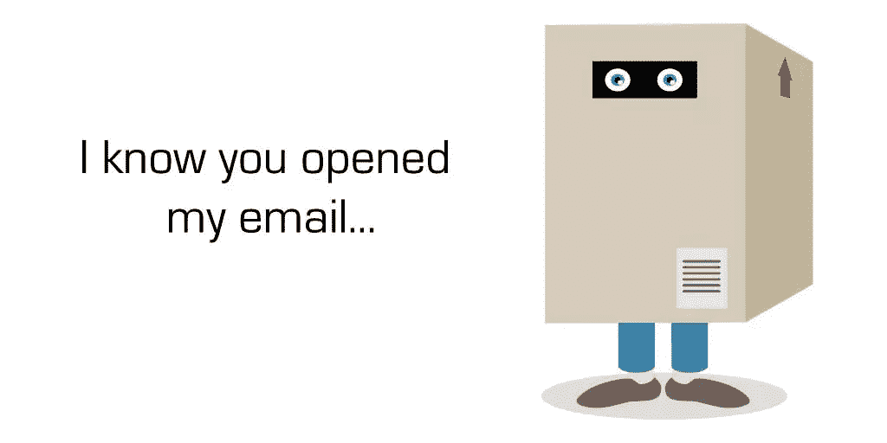
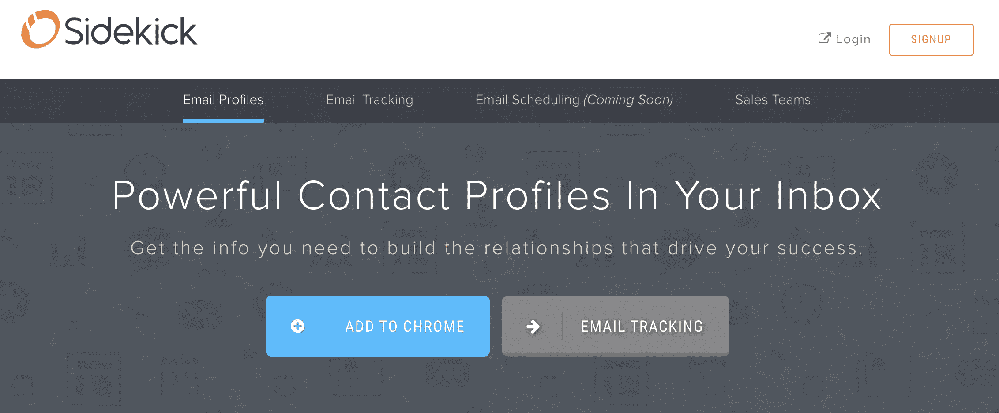
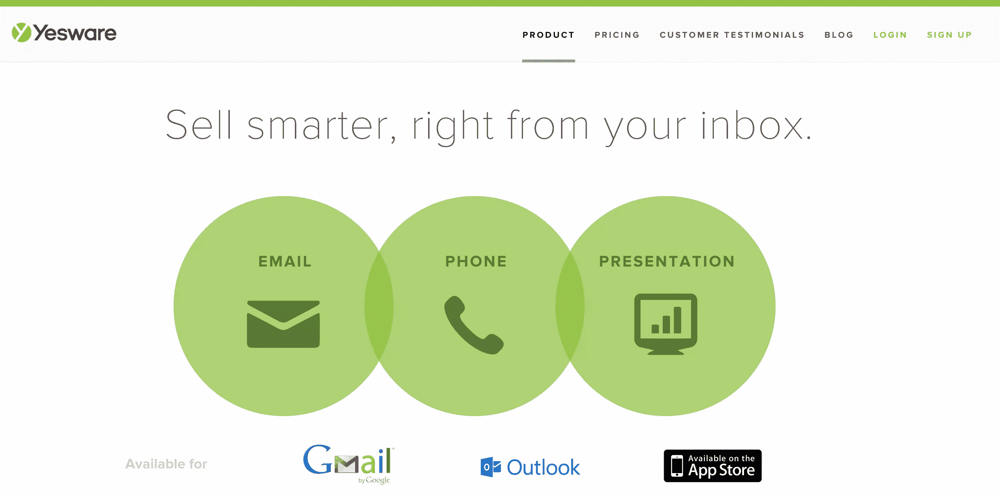
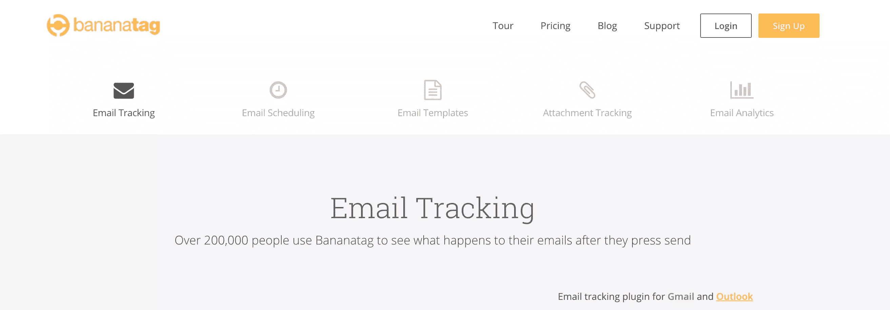
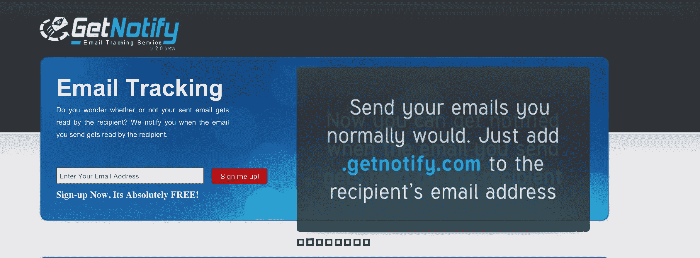
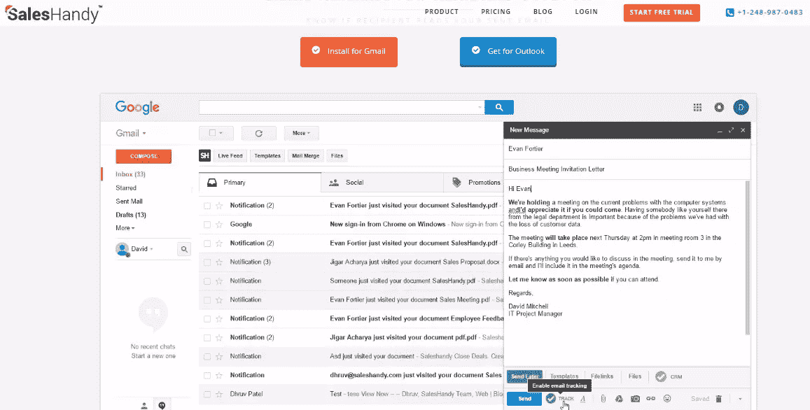

# 电子邮件跟踪工具的终极比较

> 原文：<https://www.sitepoint.com/email-tracking-tools/>

曾几何时，点击“发送”就是行尾。除了坐下来等待回复，发邮件的人别无选择。现在，点击“发送”只是一个开始。

在过去的几年里，电子邮件跟踪软件市场呈爆炸式增长，对于那些通过电子邮件开展大量业务的公司来说，这些工具正迅速成为不可或缺的工具。

数百万人正在使用电子邮件跟踪工具来获取有关其客户的可操作情报。知道一封电子邮件是否被打开以及何时被打开，有助于更快地达成交易，并制作更相关的通信。它可以确定哪些主题行正在工作，哪些没有转换。出于营销目的，跟踪电子邮件是必须的。

但是并不是每个电子邮件跟踪工具都是一样的。一些提供了大量的功能，而另一些保持简单。有些非常便宜，但技术上很原始，而另一些可能会花很多钱，但包括技术奇迹，会让你觉得自己像一个电子邮件向导。

这里有五种电子邮件跟踪服务，它们提供什么，以及它们有什么不同。

## [**死党**](https://chrome.google.com/webstore/detail/sidekick-by-hubspot/oiiaigjnkhngdbnoookogelabohpglmd?hl=en)

****

Sidekick 是由 HubSpot 的人开发的，旨在让用户与他们的联系人保持高度联系。

与市场上的许多其他电子邮件跟踪工具一样，Sidekick 的核心功能会通知用户电子邮件在何时何地被打开、打开了多少次以及是在什么设备上打开的。但是 Sidekick 与众不同的是，它还提供你的联系人的个人资料。类似于的邮件扩展，联系人的职业历史会直接显示在你的收件箱里。

Sidekick 兼容 Gmail、Outlook、Apple Mail、Salesforce，当然还有 Hubspot，并将很快提供电子邮件日程安排和电子邮件提醒。它拥有超过 20 万周用户，并在商业软件和服务评论平台 G2 Crowd 上保持着 [4.3/5 星](https://www.g2crowd.com/products/sidekick/reviews) 的评级。

### **定价计划**

**免费**

*   每月 200 个打开/点击通知
*   无限情景模式

**超级用户:10 美元/用户/月**

*   无限制打开/点击通知
*   无限情景模式

**商务助手:50 美元/用户/月**

*一切来自异能使用者加上……*

*   电子邮件模板
*   报告
*   文件发送/跟踪
*   In-CRM 呼叫

## [**yes ware**](http://www.yesware.com/)

Yesware 比 Sidekick 更全面一些。除了追踪电子邮件这一核心功能之外，这项服务还提供了大量主要面向销售人员的功能。

其中一个功能是活动提要，它可以快速地将跟踪数据编辑成一个易于理解的视觉效果。活动提要只是 Yesware 在 G2 人群中拥有 [4.7/5 星级](https://www.g2crowd.com/products/yesware/reviews) 并拥有超过 60 万用户的一个原因。

### **计划**

**免费**

*   每月 100 次电子邮件跟踪事件
*   个人电子邮件模板
*   分析报告

**Pro:$ 12/用户/月**

*   无限邮件追踪事件
*   电子邮件日程安排和提醒
*   将收件箱与 Batchbook、Pipedrive、Base、Highrise 和 SugarCRM 等 CRM 同步的选项
*   附件跟踪
*   演示跟踪
*   进入 Yesware Deal Room，这里有各种销售工具和服务的独家优惠

**团队:$ 20/用户/月**

*一切从亲计加上……*

*   自动跟进邮件合并
*   能够同时或定时向多达 200 人发送个性化电子邮件
*   单个团队成员活动水平和效率的分析报告
*   团队模板
*   基于角色的权限

**企业:40 美元/用户/月**

*一切从团队计划加上……*

*   Salesforce 同步
*   Salesforce 报告和仪表板
*   Salesforce 侧边栏
*   点击呼叫
*   双向日历
*   优先电话和电子邮件支持

## ****

 ******

Bananatag 将 Yesware 的关注点从销售人员扩大到了内部沟通，并鼓励企业使用这项服务来获取员工参与度的实时数据。

Bananatag 提供了三个仪表盘，看起来很棒，使用起来也很简单。指标控制面板提供了重要数据，如已打开与未打开的电子邮件、未点击与已点击的电子邮件，以及独特点击与重复点击。资源仪表板是您可以下载 Gmail、Outlook 和其他客户端插件的地方，用户仪表板显示您跟踪的所有电子邮件，以及发送和打开这些电子邮件之间的时间长度。

Bananatag 在谷歌 Chrome 网上商店上保持着 [4.5/5 星级](https://chrome.google.com/webstore/detail/bananatag-email-tracking/jpbnpbfpgjkblmejlgkfkekajajhjcid/reviews?hl=en) ，有超过 20 万人使用。

### **计划**

**免费**

*   每天 5 个电子邮件跟踪事件
*   完整指标
*   基本通知
*   Gmail 的电子邮件日程安排

**Pro:$ 6.25/月**

*   每天 100 个电子邮件跟踪事件
*   完整指标
*   报告
*   详细通知
*   Gmail 的电子邮件日程安排

**团队:$ 12.50/月**

*   每天 200 个电子邮件跟踪事件
*   团队指标
*   团队报告
*   详细通知
*   团队管理
*   Gmail 的电子邮件日程安排

**内部通信:$ 250/月**

*一切从团队计划加上……*

*   能够发送到分发列表
*   内部通信跟踪
*   内部报告

## 

 ******

WhoReadMe 是极简主义者对功能丰富的电子邮件追踪器的回答。它只提供了一个计划，完全免费，并且坚持最基本的:跟踪电子邮件。

然而，与竞争对手相比，WhoReadMe 的技术相当基础。为了使用该服务，用户必须手动将后缀*whoreadme.com*添加到预期收件人的电子邮件地址，如。

虽然 WhoReadMe 保持了良好的记录，但它并不能保证 100%的准确性，这使得这项服务更适合休闲使用，而不是商业使用。

**特征**

*   无限邮件追踪事件
*   设置电子邮件内容到期日期的选项
*   下载附件时的通知
*   追踪收件人的位置
*   跟踪收件人的浏览器详细信息

## 

 ******

GetNotify 标榜自己是一项免费服务，但给用户额外的功能以换取“捐赠”非常聪明的家伙。

与 WhoReadMe 一样，要使用 GetNotify，你必须手动将后缀*getnotify.com*添加到每个预定收件人的电子邮件地址的末尾。这项服务的整体设计、用户体验和品牌形象都无法与其更大的竞争对手的时尚、用户友好的审美相媲美，但它确实完成了任务。

**计划**

**免费**

*   每月 150 次电子邮件跟踪事件(每天最多 5 次)
*   6 个月的电子邮件内容备份
*   get notify 网站上的个人发件箱页面，包含完整的跟踪历史记录

**【12 美元捐款/6 个月**

*   100 封电子邮件跟踪事件，加上每天 5 封额外的电子邮件，没有每日限额
*   每次邮件阅读的持续时间
*   12 个月的电子邮件内容备份
*   Get Notify 网站上的个人发件箱页面，包含完整的跟踪历史记录

**【20 美元捐赠/6 个月**

*   700 封电子邮件跟踪事件，加上每天五封额外的电子邮件，没有每日限额
*   每次邮件阅读的持续时间
*   12 个月的电子邮件内容备份
*   Get Notify 网站上的个人发件箱页面，包含完整的跟踪历史记录

## 

 ******

SalesHandy 已经成为市场上最具成本效益的电子邮件生产工具之一。

与其他工具一样，它提供电子邮件跟踪、电子邮件模板、电子邮件日程安排、文档跟踪和邮件合并。它包括一个团队电子邮件性能报告功能，用户可以看到其他成员的电子邮件效率水平。举个例子，你还可以看到哪些邮件的打开率最好，或者哪些邮件的回复率最好。

SalesHandy 还为 Gmail 和 Outlook 提供电子邮件跟踪功能。SalesHandy 在谷歌 Chrome 网络商店上保持着 4/5 星的评级。

**计划**

**免费**

*   邮件跟踪&分析
*   邮件调度
*   个人模板/团队模板
*   密件抄送至客户关系管理

**普通:**【7 美元/用户/月

*   电子邮件活动/报告/模板
*   文档跟踪/附件跟踪/转发跟踪
*   报告和分析

**加:**【16 美元/用户/月

*   扎皮尔集成公司
*   团队电子邮件绩效报告
*   分享团队模板

**企业:**【40 美元/用户/月

*   自定义功能
*   在线会议
*   支持

## **结论**

要决定电子邮件跟踪解决方案，您必须考虑许多因素。例如，您是否只需要核心的电子邮件跟踪功能？或者，您的企业是否会受益于其他功能，如联系人资料、电子邮件模板和电子邮件日程安排？你的团队有多少人？如果只有你一个人，选择会比整个部门便宜很多。

如果你是一家小型企业(或更小)，一种更简单的服务，如 GetNotify 或 WhoReadMe，可能更适合你的需求和预算。然而，这些服务不如价格较高的服务全面或高效。另一方面，如果您是一家中大型企业，并且需要为多个团队成员提供强大的电子邮件跟踪解决方案，那么技术更先进、功能更丰富的服务是您的最佳选择。

## 分享这篇文章********