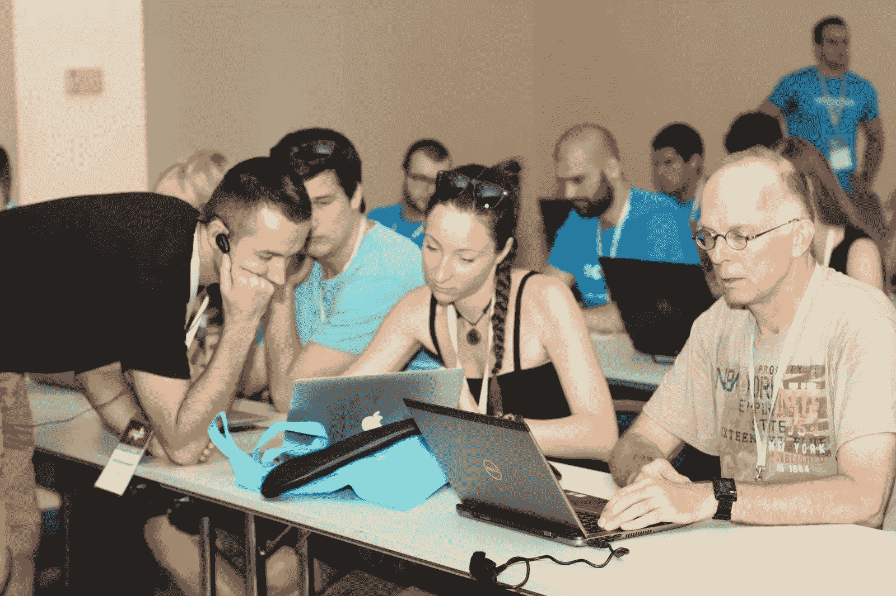
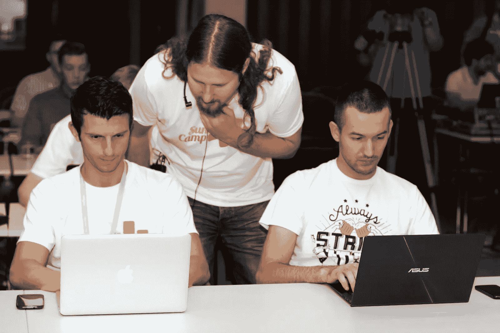
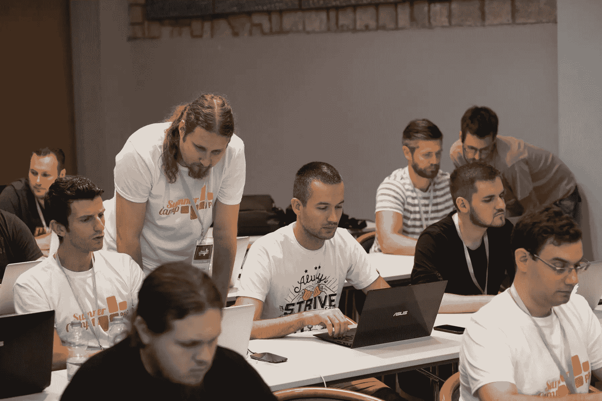
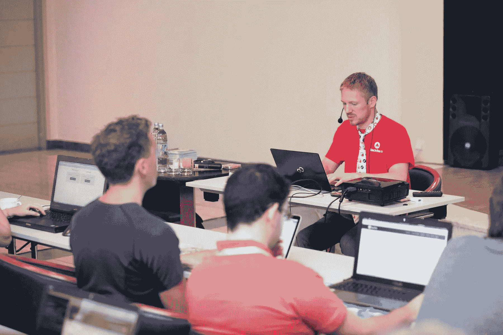

# PHP 夏令营 2015 回顾

> 原文：<https://www.sitepoint.com/php-summer-camp-2015-review/>

你站在一个长长的码头上，奇怪的是，码头的最后十米属于国际水域，尽管它位于当前国家的领土内。当你爬上一米高的岩壁，形成一个向西的小屏障时，你可以看到太阳在远处沉入大海。轻柔的海浪抚摸着你脚下的岩石表面，让海胆和鱼来回摆动。那里还有其他人，每个人都沉浸在自己的思绪中。

不，那不是龙与地下城的开始。这是在克罗地亚 Rovinj 举行的一次大型研讨会的尾声，与去年的 T1 有着同样的精神。

## PHP 夏令营 2015

PHP 夏令营是一项双重活动，包括两个 PHP 项目和一个 eZ Publish 项目，它们的工作坊统称为 [EZ 夏令营](http://2015.ezsummercamp.com)。今年的活动时间比去年稍早——从 8 月 26 日到 29 日。

今年我完全是以非官方身份参加的。现场零责任，这是一种完全不同的体验。今年会议的主要收获是:

*   教义并没有看起来那么复杂，只是笨拙地记录了下来
*   Blackfire 并没有看起来那么复杂，只是被笨拙地记录了下来
*   更多的人需要阅读罗斯·塔克的[会议演讲指南](http://rosstuck.com/tips-on-speaking/)
*   埔里不是下一个改变游戏规则的人，就是下一个大败笔
*   如果你只参加被邀请参加的会议(你的日程表上没有这些邀请)，你就不是这个社区的好成员
*   技术人员*能够*和*在酒吧里进行有趣的谈话，而不会喝醉和尴尬，这与[的普遍看法](https://twitter.com/Crell/status/637750355355283456)相反。*

## 研讨会评论

PHP 夏令营不是一个典型的会议，在那里你坐着听某人重复他们 3 年前写的东西，而且从未改变。这不是关于“了解作曲家”或“永远不要相信用户的输入”——这是一个完全亲自动手的活动，很少或没有叙事，并不断与演讲者直接互动。因此，每天有非常少的[个研讨会，但都很长且技术性很强(最短为 1.5 小时)。我有机会参加了五个:](http://2015.phpsummercamp.com/Programme)

### 原则:开始使用映射、查询和关系

我从来不需要在项目中使用教条。我是在 SQL 环境中长大的，任何需要解决的问题都很容易用 SQL 解决。当某些东西需要优化时，我会高兴地一头扎进去，玩索引、解释，以及将语句合并到优化的混沌链中。因此，由于其明显的高学习曲线、使用注释进行逻辑决策的倾向以及*魔法*的流行，我主动避开了它。

KNP 大学的马赛丽·斯塔蒙科维奇举办的这个研讨会提供了一个绝佳的机会，让你不必浪费时间阅读文档，就能鸟瞰实际操作。研讨会本身确实非常基础，很多时间都被“第一个的诅咒”所消耗，其中第一个研讨会总是有最多初始设置问题的研讨会，但我确实觉得我已经获得了一些有用的知识，并对理论实际上可以发挥作用的地方有了更好的看法。我仍然怀疑我是否会需要它，但现在对它有点熟悉是件好事。

马赛丽比去年好得多，也更有信心，但如果他想超越他的导师瑞安·韦弗，他还需要努力。

### 使遗产现代化

来自英国 SensioLabs 的 Marek Matulka 举办了这个关于传统代码现代化的简短研讨会。

虽然由于保罗·琼斯的书，大部分内容对我来说非常熟悉，但我相信马雷克指出了一些重要的想法——特别是一个人应该一个概念一个概念地更新，而不是一个文件一个文件地更新，这是我们一群人在不到一个小时前讨论过的。

没有技术上的小问题，但是由于演讲者的口音和音量(他患了感冒，嗓子哑了)以及研讨会的简短，感觉有点缺乏，有时很难跟上。我会更快地推荐人们阅读保罗的书，并从那里获得这些内容(以及更多)。

### 前端设计到后端中间件或任何优秀的 PHP 开发人员都应该知道的一些 JS 概念

这个研讨会名副其实，承诺过多，却没有兑现。[达米尔](https://twitter.com/damirbr)花了前十到十五分钟直接读幻灯片，看着大屏幕而不是观众，这让它看起来像是别人写的内容。在一次招聘推介会后(通常在谈话后*进行)，他一头扎进了代码中。*

在一个小时的磕磕绊绊中，Damir 比较了 JavaScript 和 PHP 的一些常见语言结构，有时会对结果感到惊讶，这证明了缺乏准备。一个潜在的好处是用普通的 JS 编写 jQuery 的一部分，但这无关紧要——对 PHP 开发人员来说没什么意思，任何做过一点前端开发的人都已经知道了。此外，这种有些负面的经历只不过是因为传统上已经很糟糕的 NPM 而变得更加糟糕。

如果这次会议有一个 JS 轨道，我会理解这个回归 JS 基础的会议在那里举行。然而，了解到已经提交的各种更有趣的话题，我想知道是什么让组织者选择了这个话题。

### 实践中的松耦合

在这个有趣的研讨会上， [Jakub Zalas](https://twitter.com/jakub_zalas) 使用了一个与教义紧密耦合的 Symfony 应用程序来完全解耦它，并将教义实现提取到某种*可注入*和可替换的东西中。

由于对 Symfony 和 Doctrine 的了解严重不足，这意味着有时会有点难以理解，但通过 Github step 分支对教程的出色组织，这一点得到了缓解，它允许我们这些一瘸一拐地跟在别人后面的人跳过前面并检查解决方案。

Jakub 的交付非常出色，当我再次遇到 Symfony 和 Doctrine 时，他的工作室的代码肯定会在我的有用快捷方式库中找到永久的位置。

### 用普利开发下一代包装

资深演讲者兼 Symfony 表格大师 Bernhard Schussek 展示了他的最新作品——Puli。我们很快会在这个频道上介绍 Puli，但长话短说，Puli 是传统软件包的“插件”,允许人们定义与这些软件包一起使用的公共资源。

用几个简短的段落来解释有点困难，所以如果你检查一下幻灯片是最好的。让 Puli 在众多 PHP 包中脱颖而出的一点是，它是有潜力在包开发中做出巨大范式转变的包之一，就像 Composer 几年前做的那样。如果很多人都采用 Puli，我们将拥有包和框架之间无与伦比的兼容性，以及前所未有的可重用性。话又说回来，这完全取决于采用率和受欢迎程度——这是我希望我们 SitePoint 能够帮助解决的问题。

像往常一样，伯恩哈德的交付几乎完美无缺，除了开始时的一些技术故障，这些故障使我们无法充分利用整个研讨会。

### 剖析 PHP 应用程序

在由尼古拉斯·格雷卡斯主持的研讨会中，我们研究了 Blackfire 以及它可以帮助人们优化网站的一切。到目前为止，我使用 Blackfire 的最大障碍实际上是让它运行起来——一旦我们提到一些配置向导需要运行，大约六个`ini`文件需要更改，我们就可以运行了，Blackfire 在一个 Symfony 应用程序样本上绘制了一些疯狂的图形。

通过 Nicolas 的研讨会，我们学会了分析图表、发现瓶颈和消除重复计算。在接下来的几个月里，我们肯定会在 SitePoint 上经常看到 Blackfire。

这个演讲的一个缺点是，由于尼古拉斯的口音，他有时很难理解。我们能够理解代码，但我可以注意到在某些快速发音的句子中，许多人脸上的困惑表情(紧接着是“让我从你的屏幕上复制”的表情)。

## 技术实现

在技术方面，本组织在某些领域与去年一样出色，但在其他领域则不如去年。

去年，组织者为我们所有人提供了一个虚拟设备——一个完全配置的虚拟机，我们在所有研讨会上都使用它。这已经足够好了，每个人——从 Windows 到 Linux 用户——都能够有效地使用它，尽管它有些不正统(对于这样的大型团队来说，最好将 large 作为一个共同的起点)。

今年，流浪者被使用，在很大程度上像一个迷人的工作。然而，它似乎没有在 Windows 机器上进行足够的测试，导致 Windows 用户遇到一些困难。此外，NFS 被强制作为共享机制，这在一些机器上是不必要的，并且需要管理员密码，从而减慢了供应过程。最好是让它自动运行——现在，流浪者足够聪明，可以根据操作系统和驱动程序的可用性选择最好的一个。

供应过程被留在盒子里，并从启动过程中排除，这很奇怪，但工作得相当好，但在几乎每个研讨会上，我们都必须做一个`git pull`来刷新代码，然后做一个`composer install`来安装依赖项。由于演讲者带来的一些延迟，取消是必要的(我建议组织者明年雇用一名“扑克”——负责从接受到开幕日每天戳演讲者关于他们演讲状态的人)。期望不得不`composer install`是完全自然的，但是让 200 个人同时做这件事是不理智的——尤其是当每组 60 个人拉着同样的包裹的时候。安装诡计可以通过一个 [Toran 代理](https://www.sitepoint.com/personal-packagist-toran-proxy/)来避免，它可以托管所有软件包的本地副本，从而将安装过程加速到接近零。

VM 的设置还有其他一些奇怪的地方，但总的来说，它工作得非常好，一旦最初的问题解决了，每个人都能够跟着做了。

互联网连接与去年一样稳定，考虑到只有几个小问题，出勤率明显高于 2014 年，这一数字可能会更高。

## 临时演员

会议的每一天都有一些额外的内容。一个特别有趣的挑战是每天早上为那些有兴趣参加的人举办“铁人三项”的一部分——第一天早上是游泳，第二天是骑自行车，第三天是跑步。每个晚上都以随意的饮料、晚餐和交谈结束，有时还伴随着免费的品酒。

会议结束后的最后一天，传统上是乘船游览。这一次，我们去了 Porec，一个海边的中世纪小镇，进行了一次完整的游客般的旅行，然后自由漫步，然后在返回的船上狼吞虎咽地吃了一些免费的鱼。在一些公海游泳和慢动作潜水后，我们回家了。

如果你有兴趣，你可以在这里看到所有的照片。

## 结论

Netgen 又一次做到了。组织得天衣无缝，所有的客人都有宾至如归的感觉。通过高质量的研讨会、精彩的讨论、圆桌会议、视频会议和所有其他额外的活动，会议贡献的不仅仅是实践编码知识——它还有助于建立新的友谊、伙伴关系，以及对从 scrum 到 BDD 等任何事情的深入讨论。

你明年会来吗？你应该。如果你是一名演讲者，开始参加这些研讨会，这样你就可以按时提交提案；传达它们需要更多的努力，但是你的观众会更欣赏它。

## 分享这篇文章