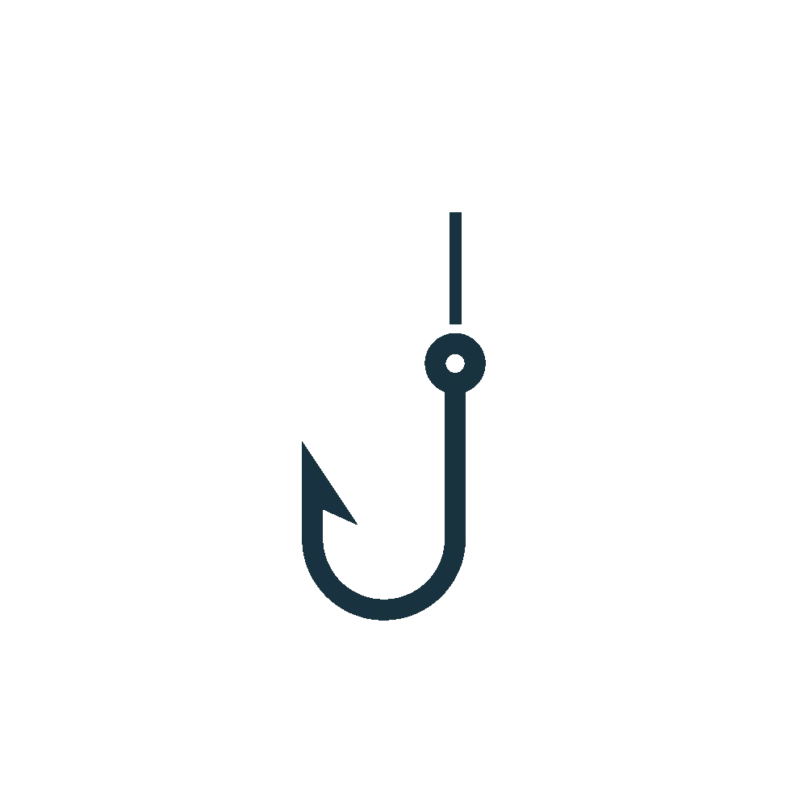
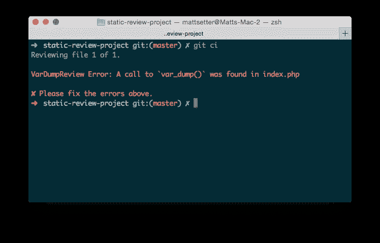
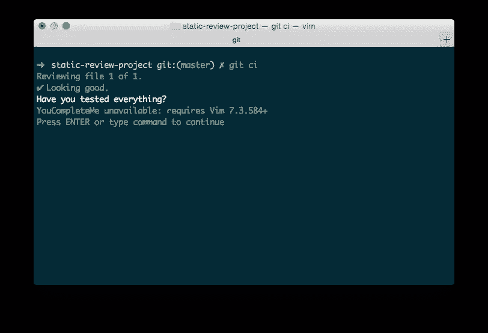

# 用静态审查编写 PHP Git 挂钩

> 原文：<https://www.sitepoint.com/writing-php-git-hooks-with-static-review/>

如果您已经使用 Git 很长时间了，那么您应该听说过 Git 挂钩。如果没有，Git 钩子，正如 Andrew Udvare 去年八月在 SitePoint 上介绍的那样，是基于 Git 生命周期中的某些事件在客户端和服务器上运行的脚本。



提交前和提交后、更新前和更新后、推送前、重定基础前等等都有挂钩。示例钩子是用 Bash 编写的，Bash 是 Linux shell 语言之一。但是它们几乎可以用你熟悉或精通的任何语言来编写。

正如 Tim Boronczyk 在 2013 年 9 月指出的那样，挂钩有广泛的有意义的用途。这些包括林挺、拼写检查提交消息、对照公认的编码标准检查补丁、运行 composer 等等。

现在，PHP 是一门伟大的语言，不要误解我的意思，但它不一定是 shell 脚本的最佳语言。不可否认，它已经比以前好了很多。但是与 Bash、Python 和 Ruby 等语言相比，它并不太适合创建 Git 挂钩；也就是说，直到现在。

多亏了 Samuel Parkinson 的 [Static Review](https://github.com/sjparkinson/static-review) ，你现在可以用原生 PHP 编写 Git 钩子，可以选择在现有的核心类上构建。在今天的帖子中，我将带您浏览一下提供的内容，最后编写一个自定义类来检查对`var_dump()`的任何延迟调用。

## 安装库

像大多数现代 PHP 库和包一样，StaticReview 可以通过 Composer 安装。要将它安装到您的项目中，请在项目的根目录下运行`composer require sjparkinson/static-review`。就这样，我们走吧。

## 一个工作实例

像任何代码一样，理解它的最佳方式是逐步完成一个真实的例子，比如下面这个取自 StaticReview 项目存储库的例子。

首先，像所有 shell 脚本一样，它定义了运行脚本的内容。在这种情况下，它是 PHP。之后，包含了 Composer 自动加载脚本，以便该脚本可以访问所有必需的类，以及一个警告，如果自动加载脚本不可用的话。

```
#!/usr/bin/env php
<?php

$included = include file_exists(__DIR__ . '/../vendor/autoload.php')
    ? __DIR__ . '/../vendor/autoload.php'
    : __DIR__ . '/../../../autoload.php';

if (! $included) {
    echo 'You must set up the project dependencies, run the following commands:' . PHP_EOL
       . 'curl -sS https://getcomposer.org/installer | php' . PHP_EOL
       . 'php composer.phar install' . PHP_EOL;

    exit(1);
}
```

接下来，与大多数现代 PHP 脚本一样，导入所有必需的类，并初始化三个变量。它们是:一个`Reporter`、一个`CLImate`和一个`GitVersionControl`对象。Reporter 对象提供关于挂钩的信息，无论挂钩是成功还是失败。气候对象使得输出彩色文本和文本格式变得简单。GitVersionControl 对象简化了与 Git 的交互。

```
// Reference the required classes and the reviews you want to use.
use League\CLImate\CLImate;
use StaticReview\Reporter\Reporter;
use StaticReview\Review\Composer\ComposerLintReview;
use StaticReview\Review\General\LineEndingsReview;
use StaticReview\Review\General\NoCommitTagReview;
use StaticReview\Review\PHP\PhpLeadingLineReview;
use StaticReview\Review\PHP\PhpLintReview;
use StaticReview\StaticReview;
use StaticReview\VersionControl\GitVersionControl;

$reporter = new Reporter();
$climate  = new CLImate();
$Git      = new GitVersionControl();
```

接下来，它创建一个新的`StaticReview`对象，并在钩子中传递要运行的评论类型。在下面的例子中，它增加了 5。这些评论:

*   检查文件是否包含任何 CRLF 行结尾
*   检查 set 文件是否以正确的字符序列开始
*   检查文件是否包含`NOCOMMIT`。
*   使用内置的 PHP linter，`php -l`检查 PHP 文件。
*   检查`composer.json`文件是否有效。

然后，它会通知审阅者检查任何暂存文件。

```
$review = new StaticReview($reporter);

// Add any reviews to the StaticReview instance, supports a fluent interface.
$review->addReview(new LineEndingsReview())
       ->addReview(new PhpLeadingLineReview())
       ->addReview(new NoCommitTagReview())
       ->addReview(new PhpLintReview())
       ->addReview(new ComposerLintReview());

// Review the staged files.
$review->review($Git->getStagedFiles());
```

与其他形式的验证类似，如果任何一个审查类报告了问题，那么每个问题都会以红色打印到终端，前面有一个`✘`，并且提交不会完成。但是，如果没有问题，则打印出成功消息`✔ Looking good. Have you tested everything?`，并允许提交完成。

```
// Check if any matching issues were found.
if ($reporter->hasIssues()) {
    $climate->out('')->out('');
    foreach ($reporter->getIssues() as $issue) {
        $climate->red($issue);
    }
    $climate->out('')->red('✘ Please fix the errors above.');
    exit(1);
} else {
    $climate->out('')->green('✔ Looking good.')->white('Have you tested everything?');
    exit(0);
}
```

到目前为止，如果你以前使用过 Git hooks，你不会感到陌生。但是复习课具体是怎么操作的呢？每个 Review 类都扩展了`AbstractReview`，实现了`ReviewInterface`。这个接口需要实现两个方法:`canReview()`和`review()`。

`canReview`顾名思义，决定是否可以运行评审，而`review`进行实际的评审。以`ComposerLintReview.php`为例，如下图。`canReview()`检查正在审查的文件是否名为`composer.json`。如果有，可以调用`review()`。

然后创建一个命令，调用 Composer 在`composer.json`上的验证功能，并将其传递给在`AbstractReview`中实现的`getProcess`方法，运行流程。如果这个过程不成功，就会创建一个错误消息，并在 Reporter 对象上设置，方法是将它传递给 Reporter 的`error()`方法调用，以及被检查的文件。

```
public function canReview(FileInterface $file)
{
    // only if the filename is "composer.json"
    return ($file->getFileName() === 'composer.json');
}

public function review(ReporterInterface $reporter, FileInterface $file)
{
    $cmd = sprintf('composer validate %s', $file->getFullPath());
    $process = $this->getProcess($cmd);
    $process->run();

    if (! $process->isSuccessful()) {
        $message = 'The composer configuration is not valid';
        $reporter->error($message, $this, $file);
    }
}
```

简而言之，这就是创建 Git 挂钩来验证 Git 生命周期中某个事件的文件所需要的全部内容。

## 自定义评论

如果你在`vendor/sjparkinson/static-review/src/Review/`下浏览，你会看到有相当多的预先打包好的复习课。它们涵盖了 Composer、PHP 和通用评论。但是如果我们想自己创建一个，一个适合我们特定用例的，该怎么办呢？

如果我们担心可能会在代码中留下`var_dump`语句，该怎么办？我们不会的，对吧？但是，嘿，可以肯定的是，没有坏处，因为旧习惯有时很难改掉。那么，定制评论会是什么样的呢？让我们解决一个问题并找出答案。

首先，我们将创建一个新的目录结构来存储我们的符合 [PSR-4 的](https://www.sitepoint.com/battle-autoloaders-psr-0-vs-psr-4/)代码。在项目的根目录中使用以下命令。

```
mkdir -p src/SitePoint/StaticReview/PHP
```

然后，在`composer.json`中，将以下内容添加到现有配置中，并运行`composer dumpautoload`:

```
"autoload": {
  "psr-4": {
    "SitePoint\\": "src/SitePoint/"
  }
}
```

这将更新 Composer 的自动加载程序，也自动加载我们的新名称空间。完成后，创建一个新类，在`src/SitePoint/StaticReview/PHP`中称为`VarDumpReview.php`。在其中，添加以下代码:

```
<?php

namespace SitePoint\StaticReview\PHP;

use StaticReview\File\FileInterface;
use StaticReview\Reporter\ReporterInterface;
use StaticReview\Review\AbstractReview;

class VarDumpReview extends AbstractReview
{
    public function canReview(FileInterface $file)
    {
        $extension = $file->getExtension();
        return ($extension === 'php' || $extension === 'phtml');
    }

    public function review(ReporterInterface $reporter, FileInterface $file)
    {
        $cmd = sprintf('grep --fixed-strings --ignore-case --quiet "var_dump" %s', $file->getFullPath());
        $process = $this->getProcess($cmd);
        $process->run();

        if ($process->isSuccessful()) {
            $message = 'A call to `var_dump()` was found';
            $reporter->error($message, $this, $file);
        }
    }
}
```

根据`PhpLintReview.php`和`ComposerLintReview.php`，`canReview`根据扩展名检查被检查的文件是否是 PHP 文件。如果是这样，`review`然后使用 grep 扫描文件中任何对`var_dump`的引用。

如果找到了，就会记录一个错误，告诉用户找到了对`var_dump`的调用，提交失败。如果您要运行它，您可以预期输出如下图所示。



## 创建挂钩

还有最后一步，就是从我们的钩子类创建一个 Git 钩子。在我的项目根目录下的一个新目录`Hooks`中，我复制了我们在文章开始时学习过的钩子代码，做了一个小的改动。

我将新的审核文件添加到审核列表中，如下所示:

```
$review->addReview(new LineEndingsReview())
       ->addReview(new PhpLeadingLineReview())
       ->addReview(new NoCommitTagReview())
       ->addReview(new PhpLintReview())
       ->addReview(new ComposerLintReview())
       ->addReview(new VarDumpReview());
```

完成后，通过运行以下命令创建一个预提交挂钩。

```
./vendor/bin/static-review.php hook:install hooks/example-pre-commit.php .Git/hooks/pre-commit
```

这样，如果你查看`.git/hooks`，你会看到一个从预提交创建的符号链接，指向我们新的钩子文件。为了测试这个钩子，在任何 PHP 文件中调用`var_dump()`,暂存这个文件，并尝试提交它。

在错误消息出现之前，甚至不应该允许您创建提交消息。如果您随后更新文件以删除对`var_dump()`的调用，您应该会看到一条成功消息，然后才能添加一条提交消息，如下图所示。



## 包扎

这就是创建简单或强大的 Git 挂钩所需要的全部，使用最通用的语言之一，PHP。多亏了一直保持警惕的布鲁诺·什科沃茨，我才接触到静态评论。但我真的很感谢他建议去看看。

有了它，我现在可以使用我最喜欢的软件开发语言——PHP，完成一项更重要的开发任务。你已经在使用静态审查了吗？如果有，请在评论中分享你的经历。我很想知道比我更有经验的人是如何使用它的。

## 分享这篇文章