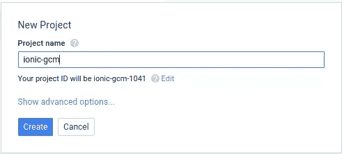
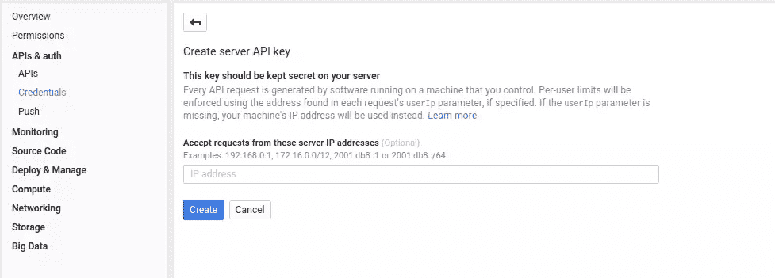
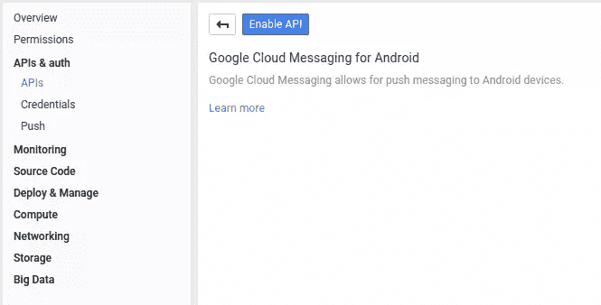
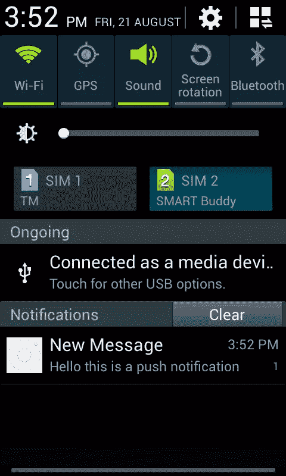

# 使用谷歌云消息在 Ionic 应用中推送通知

> 原文：<https://www.sitepoint.com/push-notifications-in-ionic-apps-with-google-cloud-messaging/>

*1 月 13 日更新，以反映谷歌云消息平台的意见和变化*

在本教程中，我们将了解如何使用谷歌云消息平台在 Android 应用中实现推送通知。我们将使用 Ionic 框架和 Cordova 来创建应用程序。服务器组件将使用[节点](https://nodejs.org/)来实现。你可以从 [Github](https://github.com/sitepoint-editors/ionic-gcm) 中检出我们将要构建的项目的所有代码。

## 创建一个 Google 控制台项目

第一步，在 [Google 开发者控制台](https://console.developers.google.com/)上创建一个新项目。如果您没有帐户，您将需要一个帐户。



项目创建完成后，点击屏幕左侧的*API&auth*菜单，然后点击*凭证*。这允许您创建一个可用于服务器的新 API 密钥。点击*添加凭证*并选择 *API 键*。


接下来将询问您想要创建哪种密钥。选择*服务器密钥*，因为该密钥将主要在服务器中使用。暂时不要添加 IP 地址，跳过不添加任何内容的步骤，点击*创建*按钮。注意产生的 API 密钥。



仍然在*API&auth*菜单下，点击*API*链接，搜索【Android 云消息。这是所需的 API，单击并启用它。



## 安装

创建一个使用*空白*模板的新 ionic 应用。

```
ionic start ionic-gcm blank
```

进入项目目录并安装 [Phonegap Builds 的 Push 插件](https://github.com/phonegap-build/PushPlugin)。应用程序使用它来注册设备并接收服务器发送的推送通知。

```
cordova plugin add https://github.com/phonegap-build/PushPlugin.git
```

在编写时，收到通知时声音不起作用。默认是振动，即使你已经设置手机使用声音。如果你想播放声音，你必须改变*GCMIntentService.java*文件。可以在以下路径找到*plugins/com . phonegap . plugins . push plugin/src/Android/com/plugin/GCM*

打开文件，在第 12 行和第 13 行添加以下内容。

```
import android.content.res.Resources;
import android.net.Uri;
```

以及从第 125 行到第 131 行。

```
String soundName = extras.getString("sound");
if (soundName != null) {
    Resources r = getResources();
    int resourceId = r.getIdentifier(soundName, "raw", context.getPackageName());
    Uri soundUri = Uri.parse("android.resource://" + context.getPackageName() + "/" + resourceId);
    mBuilder.setSound(soundUri);
}
```

删除第 105 行:

```
.setDefaults(defaults)
```

可以看看这个[拉取请求](https://github.com/phonegap-build/PushPlugin/pull/301/files)做参考。

如果您已经添加了 android 平台，您可能需要在*platforms/Android/src/com/plugin/GCM/gcmintentservice . Java*中更新相应的文件，进行相同的更改。

除了推送插件，我们还需要安装 [cordova 白名单插件](https://github.com/apache/cordova-plugin-whitelist)。

```
cordova plugin add cordova-plugin-whitelist
```

这将激活包含在 *config.xml* 文件中的设置，该文件可以在 Ionic 项目的根目录中找到。默认情况下，它允许访问每台服务器。如果您计划稍后部署此应用程序，您应该更新以下行，以便仅匹配与您的应用程序通信的那些服务器。这提高了应用程序的安全性。

```
<access origin="*"/>
```

## 构建项目

现在我们可以开始构建项目了。

### 请求服务

在 *www/js* 目录下创建一个 *services* 文件夹，并创建一个 *RequestsService.js* 文件。这将是将设备令牌传递给服务器的服务。需要设备令牌来向特定设备发送推送通知。将以下内容添加到文件中。

```
(function(){

    angular.module('starter')
    .service('RequestsService', ['$http', '$q', '$ionicLoading',  RequestsService]);

    function RequestsService($http, $q, $ionicLoading){

        var base_url = 'http://{YOUR SERVER}';

        function register(device_token){

            var deferred = $q.defer();
            $ionicLoading.show();

            $http.post(base_url + '/register', {'device_token': device_token})
                .success(function(response){

                    $ionicLoading.hide();
                    deferred.resolve(response);

                })
                .error(function(data){
                    deferred.reject();
                });

            return deferred.promise;

        };

        return {
            register: register
        };
    }
})();
```

破解密码。首先，我们将所有内容包装在一个立即调用的函数表达式中。这允许封装内部包含的代码，并避免污染全局范围。

```
(function(){

})();
```

接下来，我们为*启动器*模块创建一个新的角度服务。这个模块是在 *js/app.js* 文件中创建的，名为 *starter* ，所以在这里引用。服务依赖于`$http`、`$q`、`$ionicLoading`，这些都是 Angular 和 Ionic 提供的服务。

```
angular.module('starter')
    .service('RequestsService', ['$http', '$q', '$ionicLoading',  RequestsService]);

function RequestsService($http, $q, $ionicLoading){
    ...
}
```

在`RequestsService`函数中，声明用作向服务器发出请求的基本 URL 的`base_url`。它应该是一个互联网可访问的网址，以便应用程序可以向它发出请求。

```
var base_url = 'http://{YOUR SERVER}';
```

如果没有可以运行服务器组件的服务器，可以使用 [ngrok](https://www.sitepoint.com/use-ngrok-test-local-site/) 将本地主机中的任何端口暴露给互联网。从项目[下载页面](https://ngrok.com/download)下载您平台的版本，解压并运行。当我们到达服务器部分后，我将向您展示如何运行 ngrok。

回到代码。我们创建了一个`register`函数，它将向服务器发出一个`POST`请求，使用来自 push 插件的设备令牌来注册设备。

```
function register(device_token){

    var deferred = $q.defer(); //run the function asynchronously
    $ionicLoading.show(); //show the ionic loader animation

    //make a POST request to the /register path and submit the device_token as data.
    $http.post(base_url + '/register', {'device_token': device_token})
        .success(function(response){

            $ionicLoading.hide(); //hide the ionic loader
            deferred.resolve(response);

        })
        .error(function(data){
            deferred.reject();
        });

    return deferred.promise; //return the result once the POST request returns a response

};
```

最后，我们使用显示模块模式将注册方法显示为`RequestsService`的公共方法。

```
return {
    register: register
};
```

在链接到 *app.js* 文件之后，将 javascript 添加到*index.html*中。

```
<script src="js/services/RequestsService.js"></script>
```

打开*plugin/com . phonegap . plugins . push plugin/www*目录，将 *PushNotification.js* 文件复制到 *www/js* 文件夹。在*index.html*文件中，在链接到 *css/style.css* 文件之后添加一个链接。

```
<script type="text/javascript" charset="utf-8" src="js/PushNotification.js"></script>
```

### 注册设备

在 *app.js* 文件中，为推送插件创建一个全局变量。将这段代码添加到`$ionicPlatform.ready`函数的右括号之后。

```
pushNotification = window.plugins.pushNotification;
```

要注册设备，调用`register`功能。该函数接受 3 个参数。第一个是收到通知后执行的功能，第二个是发生错误时执行的功能，第三个是选项。options 是一个对象，您可以在其中为将要接收的推送通知指定配置。从下面的代码中，你可以看到`badge`(通知中的图标)`sound`和`alert`(通知中的文本)选项。`ecb`是事件回调函数，每次收到通知时都会执行。这与第一个参数中使用的函数相同。最后，`senderId`是您之前在 Google 控制台上创建的项目的 ID。您可以通过点击项目的*概述*菜单找到它。

要注册设备，调用`register`功能。该函数接受 3 个参数。第一个是收到通知后将执行的功能，第二个是发生错误时将执行的功能，第三个是选项。options 是一个对象，您可以在其中为将要接收的推送通知指定不同的选项。从下面的代码可以看出，您可以启用`badge`(通知中的图标)、`sound`或`alert`(通知中的文本)。`ecb`是事件回调函数，每次收到通知时都会执行。这与第一个论证中使用的函数基本相同。最后，`senderId`是您之前在 Google 控制台上创建的项目的项目编号。您可以通过点击项目的*概述*菜单找到它。

将此代码添加到 *app.js* :

```
pushNotification.register(
  onNotification,
  errorHandler,
  {
    'badge': 'true',
    'sound': 'true',
    'alert': 'true',
    'ecb': 'onNotification',
    'senderID': 'YOUR GOOGLE CONSOLE PROJECT NUMBER',
  }
);
```

## 接收通知

应该将`onNotification`函数附加到`window`对象上，以便插件可以找到它。传递给该函数的参数是实际的通知。您可以通过提取`event`属性来检查发生了哪种类型的通知事件。

这可以有 3 个可能的值:`registered`、`message`和`error`。注册设备时触发`registered`事件。当应用程序在前台收到推送通知时的`message`事件。以及出现错误时的`error`。当`registered`事件被触发时，检查`regid`的长度是否大于 0。

如果随后假设已经返回了正确设备令牌。调用`RequestsService`服务中的`register`函数，并将`device_token`作为参数传递。一旦它返回一个响应，通知用户设备已经注册。

将此代码添加到 *app.js* :

```
window.onNotification = function(e){

      switch(e.event){
        case 'registered':
          if(e.regid.length > 0){

            var device_token = e.regid;
            RequestsService.register(device_token).then(function(response){
              alert('registered!');
            });
          }
        break;

        case 'message':
          alert('msg received: ' + e.message);
          /*
            {
                "message": "Hello this is a push notification",
                "payload": {
                    "message": "Hello this is a push notification",
                    "sound": "notification",
                    "title": "New Message",
                    "from": "813xxxxxxx",
                    "collapse_key": "do_not_collapse",
                    "foreground": true,
                    "event": "message"
                }
            }
          */
        break;

        case 'error':
          alert('error occured');
        break;

      }
};
```

出现错误时，使用警告消息通知用户。

将此代码添加到 *app.js* :

```
window.errorHandler = function(error){
  alert('an error occured');
}
```

### 播放声音

如果您想在收到通知时播放声音，我们需要将 mp3 文件添加到*platforms/Android/RES/raw*文件夹中。我的名字叫 *notification.mp3* 。记下文件名，稍后推送通知时，我们会将它添加到服务器端。你可以在这里下载一些通知声音。

## 服务器端

服务器负责接受应用程序提交的设备令牌，并发送推送通知。

在项目的根目录下创建一个*服务器*文件夹，然后创建一个 *ionic-gcm.js* 文件。这个文件将包含运行节点服务器的代码。这个文件有三个依赖项: [express](https://github.com/strongloop/express) 、 [node-gcm](https://github.com/ToothlessGear/node-gcm) 和 [body-parser](https://github.com/expressjs/body-parser) 。使用 npm 安装那些。

```
npm install express node-gcm body-parser
```

打开 *ionic-gcm.js* 文件并要求这些依赖项。

```
var express = require('express');
var gcm = require('node-gcm');
```

使用快递。

```
var app = express();
```

创建一个监听端口 3000 上的请求的服务器。

```
var server = app.listen(3000, function(){

 console.log('server is running');

});
```

将服务器设置为允许所有请求源。这允许 AJAX 请求来自任何 IP 地址。

```
app.use(function(req, res, next){
  res.header("Access-Control-Allow-Origin", "*");
  res.header("Access-Control-Allow-Headers", "Origin, X-Requested-With, Content-Type, Accept");
  next();
});
```

创建一个全局变量来存储当前设备令牌。当访问`/register`路线时，这将被更新。并且当访问`/push`路线时将使用当前值。

```
var device_token;
```

为`/register`路径创建一条新路线。这是设备注册的途径。您可以访问通过`req`对象中的`body`属性传递的`device_token`。

请注意，我没有添加任何与将设备令牌保存到数据库中相关的代码。我希望你有你自己的，所以我把它作为待办事项放在那里。现在，它使用全局变量`device_token`来存储设备令牌。一旦保存了`device_token`，发送`ok`作为响应。

```
app.post('/register', function(req, res){
    device_token = req.body.device_token;
    console.log('device token received');
    console.log(device_token);
    /*YOUR TODO: save the device_token into your database*/
    res.send('ok');
});
```

**发送推送通知**:

1.  为`/push`路径创建一条路线。
2.  在回调函数中，创建一个存储设备令牌的新数组和一个存储重试发送消息次数的变量。
3.  通过调用`Sender`函数创建一个新的发送者实例。这将接受来自 Google 控制台的 API 密钥。
4.  通过调用`gcm`对象中的`Message`函数创建一条新消息。这个对象由*节点-gcm* 包提供。
5.  通过调用消息的`addData`函数，在推送通知中添加要传递的数据。该函数接受要传递的数据的键值对。必需的键是`title`和`message`。`title`是推送通知的标题，`message`是内容。在下面的例子中，`sound`键也被传递。这是您希望在收到通知时播放的声音文件的名称。
6.  或者，您可以设置`collapseKey`对通知进行分组。这允许您发送带有`collapseKey`的通知#1，然后几分钟后，发送带有相同`collapseKey`的通知#2。将要发生的是通知#2 将取代通知#1。也就是说，当通知#2 到达时，用户仍然没有打开通知#1。
7.  `delayWhileIdle`是另一个可选属性，如果将其设置为`true`，则在设备空闲时不会立即发送通知。这意味着服务器在发送通知之前会等待设备变为活动状态。请注意，如果设置了`collapseKey`，服务器将只发送包含该`collapseKey`的最新消息。最后还有`timeToLive`，它允许你设置当接收设备离线时，信息在服务器上保留的秒数。如果指定了这个属性，还需要指定`collapseKey`。
8.  这是我希望你自己实施的另一个步骤。从数据库中获取`device_token`。为此，您需要传递一个`user_id`或其他唯一的用户标识。这将允许您通过使用唯一的数据作为键来获取`device_token`。在下面的例子中，使用的是全局变量`device_token`的值。因此，每次注册新设备时，该设备都会收到通知。
9.  将从数据库中获得的`device_token`放入`device_tokens`数组中。
10.  调用`message`对象中的`send`函数。一旦消息被发送，它接受`message`、`device_tokens`、`retry_times`和要调用的函数。
11.  发送`ok`响应。

```
app.get('/push', function(req, res){

    var device_tokens = []; //create array for storing device tokens
    var retry_times = 4; //the number of times to retry sending the message if it fails

    var sender = new gcm.Sender('THE API KEY OF YOUR GOOGLE CONSOLE PROJECT'); //create a new sender
    var message = new gcm.Message(); //create a new message

    message.addData('title', 'New Message');
    message.addData('message', 'Hello this is a push notification');
    message.addData('sound', 'notification');

    message.collapseKey = 'testing'; //grouping messages
    message.delayWhileIdle = true; //delay sending while receiving device is offline
    message.timeToLive = 3; //the number of seconds to keep the message on the server if the device is offline

    /*
    YOUR TODO: add code for fetching device_token from the database
    */

    device_tokens.push(device_token);

    sender.send(message, device_tokens, retry_times, function(result){
        console.log(result);
        console.log('push sent to: ' + device_token);
    });

    res.send('ok');
});
```

通过从终端调用来运行服务器:

```
node ionic-gcm.js
```

如果要使用 ngrok 将此服务器暴露给 internet，请打开安装了 ngrok 的新终端窗口，并执行以下命令:

```
ngrok http 3000
```

这告诉 ngrok 将端口 3000 暴露给互联网，并为其分配一个可公开访问的 URL。

## 部署应用程序

返回应用程序。导航到应用的根目录，更新*www/js/services/requests service . js*中的`base_url`，以匹配 ngrok 提供的 URL。

```
var base_url = 'http://{YOUR SERVER}';
```

添加 android 平台:

```
cordova platform add android
```

不要忘记将 mp3 文件添加到*platforms/Android/RES/raw*目录中，这样声音才能工作。

通过执行以下命令构建应用程序:

```
cordova build android
```

完成后，导航到*平台/android/build/outputs/apk/* 目录，并将 *android-debug.apk* 文件复制到您的 android 设备。安装并打开它。一旦打开，它会将设备令牌转发给服务器。

它应该在您执行`node ionic-gcm.js`的终端窗口中显示类似如下的内容:

```
device token received
sjdlf0ojw3ofjowejfowefnosfjlsjfosnf302r3n2on3fon3flsnflsfns0f9un
```

现在，您可以通过在浏览器中打开以下本地 URL 来测试推送通知:

```
http://localhost:3000/push
```

此时，您的设备应该会收到推送通知。下面是截图。



## 结论

就是这样！在本教程中，您已经学习了如何使用 Google Cloud Messaging Platform for Android 向 Cordova 应用程序发送推送通知。如果你有任何疑问、意见或问题，请在下面的评论中告诉我。

## 分享这篇文章