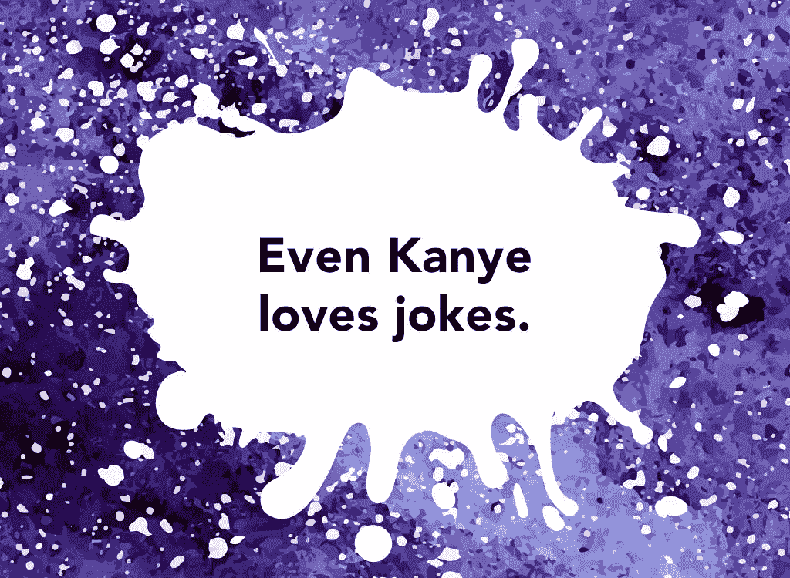
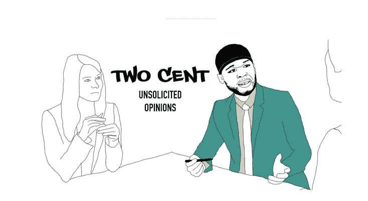

# 笑出更多销售:如何变得有趣

> 原文：<https://www.sitepoint.com/how-to-be-funny/>

如果你能让别人笑，你就能让他们做任何事。

讨人喜欢很重要——在工作中，在爱情中，基本上，生活中的每件事都需要你讨人喜欢。

讨人喜欢的一个简单方法是让人们发笑。是的，有一些异常，他们不喜欢笑，我建议无论如何不要和他们做生意。

莎拉·库珀(Sarah Cooper)非常有趣，她告诉我如何变得有趣。(如果你不相信我，读读[这篇标题为“如果你的同事是说唱歌手”的文章](https://medium.com/conquering-corporate-america/if-your-coworkers-were-rappers-60435f216656)

## 第一步:保持真实，兄弟

实话实说吧。别搞笑了。为什么我对阿齐兹·安萨里的脱口秀笑得那么大声？因为这家伙很真实。别人想说什么他就说什么。要搞笑，只要观察入微，诚实就好。

想法:你甚至可以通过向你的社交媒体关注者提问来增加你的社区参与度，甚至变得更有趣。例如，如果你想写一篇人们会分享的有趣的博文，在脸书上发布类似这样的内容:“嘿，你的同事在会议中最讨厌做什么？这将成为一个杀手职位。

## 第二步:捣碎

库珀建议，选择无聊的日常话题，用令人兴奋的东西来增加趣味。把不同的话题结合在一起。我觉得这就相当于为你的客户解决问题。

*灵感:[如果我的同事是说唱歌手](https://medium.com/conquering-corporate-america/if-your-coworkers-were-rappers-60435f216656)——是的，显然我把这篇文章收入囊中。* 

## 第三步:取笑自己(在去银行的路上)

[https://www.youtube.com/embed/Lt8p0_Cp76c](https://www.youtube.com/embed/Lt8p0_Cp76c)

我可以证明这一个工作。当我说出自己做的愚蠢或尴尬的事情时，人们总是大笑。

正如库珀所说，“没有什么比一个自信的人做得很好，大声说出自己做错了什么或者为什么自己是个白痴更有趣的了。”

想法:你对什么一无所知或不擅长？利用它！

## 第四步:比较两件事

意见帖很棒，因为它们让你想发表评论。他们让你想选择一方。为每个类别选择两个意想不到的东西进行比较，以保持其趣味性。

*灵感:[生活在纽约和三藩市的区别](http://thecooperreview.com/difference-between-living-in-new-york-and-san-francisco/)*

## 结论

人们喜欢让他们笑的人。让别人笑，你就能让他们做任何事。

我想说的是真正地有趣，你很可能会让 T2 有更多的推特粉丝、更多的博客订阅者和更多的转化率。

## 分享这篇文章