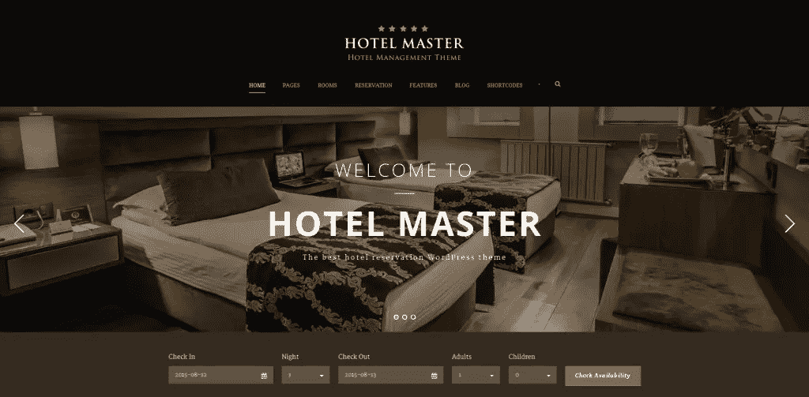
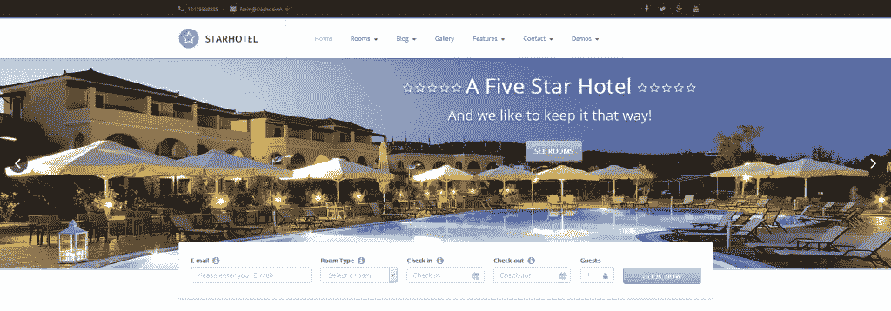
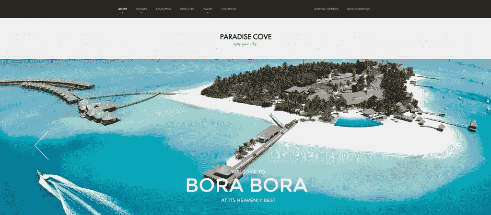
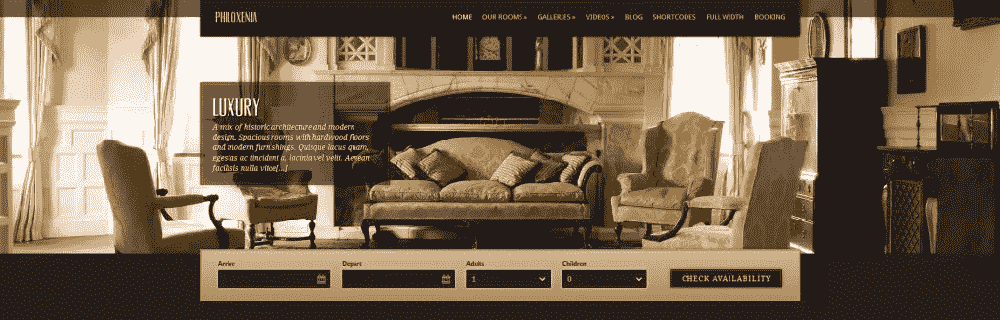
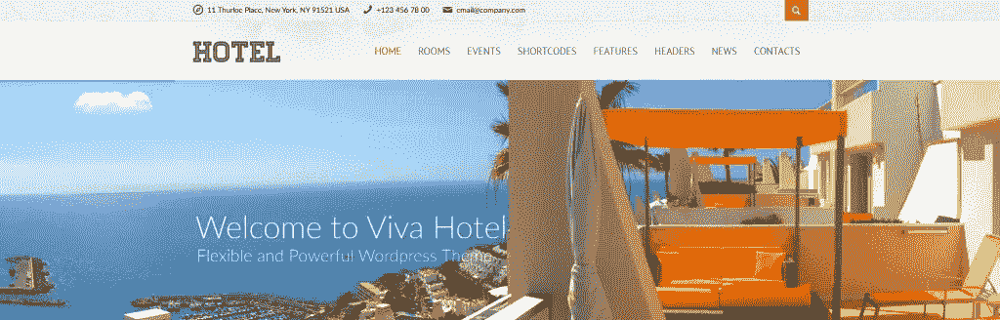

# WordPress 的 5 个美丽的酒店主题

> 原文：<https://www.sitepoint.com/5-beautiful-hotel-themes-for-wordpress/>

尽管 WordPress 最初的预期用途是博客软件，但它已经成功地超越了许多预期，服务于更普遍的目的，将它变成了一个“万金油”。在许多情况下，WordPress 能够为一系列相当复杂的网站节省大量的精力和金钱，这些网站需要更多的资源。

## 入住！

酒店和住宿网站属于不需要高度复杂的网站基础设施的网站。也就是说，开箱即用的 WordPress 安装并不总是能够满足需求。你可能不是酒店老板，但你可能需要在某个时候处理一个酒店项目。在这种情况下，我将向你介绍 WordPress 精选的美味酒店主题，这些主题将帮助你完成工作，无论是五星级酒店还是类似 AirBnB 的旅舍。

## 酒店主管

预览 Hotel Master by GoodLayers 时，您首先会注意到它提供了 3 种不同的主题风格，如果您想对主题进行额外的定制，可以节省时间(和金钱)。一个黑暗，一个光明和一个单位的现代风格是在酒店主人，有助于灵活的主题提供。

Hotel Master 更适合需要尽可能自动化预订流程的豪华酒店或分支机构，因此将其用于小型宾馆或招待所可能有些过头了。它的特点是花哨而简约的外观，这在主题的现代风格中更加突出。主题是完全响应的，并与现代网络标准保持一致，所以这也是为你考虑的(现在看起来似乎不言自明)。

该主题支持多个分支，这显然是一个必须的，如果你正在为多个地点创建一个网站。该主题还支持季节性定价，你甚至可以利用各种支付网关(PayPal、Stripe、PayMill 或 Authorized.net)来处理支付。该主题还包括主滑块插件和自制的 GoodLayers 页面生成器，这对于该主题附带的 58 美元的价格来说是一笔不错的交易。

《酒店大师》中包含了大量的其他功能，这些功能将会打破本文的界限，所以你可以自己看看并做出决定。

[购买](http://themeforest.net/item/hotel-master-hotel-booking-wordpress-theme/11032879)
[试玩(黑暗)](http://demo.goodlayers.com/hotelmaster/dark/)

## Starhotel

如果您不需要复杂的基础设施，如在线支付或多个酒店分支机构，但希望解决一些简单而强大的问题，Starhotel 是 Hotel Master 的一个不错的替代选择。与 Hotel Master 类似，它有 3 种不同的风格:Starhotel、Starmotel 和 Citytrip Edition。

不得不承认，这个主题的视觉效果比今天的网页设计标准稍逊一筹，这并不一定是坏事(我的意思是我爷爷不在乎预订按钮是平的还是闪亮的圆形)。星级酒店的 UX 相当简单，可能不会给游客带来任何麻烦(我问过我爷爷，他同意了)。

主题包括 Revolution Slider 插件和 Visual Composer 页面生成器(尽管 [WordPress 页面生成器](https://www.sitepoint.com/understanding-the-power-of-wordpress-page-builders/)可能不是每个人都喜欢的)。您还可以将现场演示的主题内容导入到您的新安装中，这很可能会节省您尝试新主题的时间。这个主题将花费你 48 美元，这是森林主题的平均价格。

[购买](http://themeforest.net/item/starhotel-responsive-hotel-wordpress-theme/10947944)
[试玩](http://www.slashdown.net/starhotel-wp/)

## 天堂湾

天堂湾是另一个充满异国情调的主题，有很多空白和一个巨大的滑块，如果你想强调图像，这是一个理想的主题。它提供了一个平面视觉元素的现代界面，看起来很棒。它丰富多彩的界面使它成为更具异国情调或度假酒店的完美开箱即用，但像许多其他 WordPress 主题一样，它可以很容易地改变。

该主题包括一个非常方便的天气小工具，我个人非常喜欢。它还有一个矢量图标字体，在各种情况下都很有用。有许多布局选项和大量菜单可供选择，天堂湾在灵活性方面不会让人失望。该主题也是视网膜就绪，反应迅速，并建立在 Twitter 的引导框架。

一个很好的好处是可以通过 ThemeFuse 网站上 TestLabs 区域的一个帐户来安装和测试这个主题。这个特性允许你测试和使用主题的所有区域，包括 WordPress 仪表盘。与其他主题一样，您可以通过“一键安装”将天堂湾的现场演示内容导入到您的新装置中，以便有一个起点。

这个主题将花费你 55 美元的标准许可费，可以在 ThemeFuse 的网站上买到(不在 ThemeForest 上)。

[购买](http://themefuse.com/wp-themes-shop/wordpress-hotel-theme/)
[试玩](http://demo.themefuse.com/?theme=paradisecove&device=desktop&_ga=1.131456075.537660666.1438874674)

## 味觉迟钝

Philoxenia 外观更加华丽奢华，具有古典风格。圆角、渐变和衬线字体使该主题非常适合豪华酒店的开箱即用。

该主题包括常见的预订表单、各种内容类型(房间、画廊、视频和滑块项目)、自定义小部件和许多其他小功能，包括一套现成的配色方案，无需触摸代码即可定制。该主题还包括一个博客，这不一定是现象级的，但如果需要的话应该可以。我对全幅页面印象不深，它只提供了一个干净的 2015 主题。Philoxenia 通过收集大量的短代码和一个简单但可靠的图库功能弥补了这一点。主题是响应和视网膜就绪。

Philoxenia 没有单一的许可证，但是您可以支付 49 美元/年来访问和支持所有的 CSSIgniter 主题(总共 64 个主题，这是一个很好的价值)。[此外，看看他们提供的其他主题](http://www.cssigniter.com/ignite/themes/)(他们在为酒店和度假村创建主题方面有丰富的经验)。

[购买](http://www.cssigniter.com/ignite/pricing/)
[试玩](http://www.cssigniter.com/preview/philoxenia/)

## VivaHotel

VivaHotel 在这里采取了一种更加简约和灵活的方法，使它成为一个非常强大的解决方案。通过简单的菜单和功能，它非常容易设置，是任何想要在短时间内建立并运行一个稳定网站的人的推荐解决方案。

该主题提供了平面的视觉效果和流畅的动画，很好地符合今天的网络标准(除了一些标题和背景图片看起来有点不合适)。它包括各种配色方案，使定制主题非常容易。VivaHotel 还拥有一个有趣的博客布局，有很多空白空间和简约的结构。

Google Fonts API 集成在主题中，允许您直接使用 Google Fonts 中的数百种字体，让您的生活变得更加轻松。此外，VivaHotel 还包括 Revolution Slider 插件。主题中还有一个大的宣传页面功能，但点击它给了我一个 404 错误，所以我不知道该期待什么。

包括的也是常见的，如:预订表格，响应，视网膜就绪，自定义部件，短代码和其他小调整吨。这里值得一提的是 PSD 文件，它也包含在标准许可证中。这个主题会花掉你 48 美元。

[购买](http://themeforest.net/item/viva-hotel-premium-responsive-wordpress-theme/5483977)

## 退房？

酒店主题是 WordPress 广泛使用的最复杂的类别之一。利用正确的主题来完成工作是至关重要的，它可以节省你尝试让主题为你工作的时间。我希望这个小小的选择能帮助你缩小需求范围，为你的下一个酒店网站找到合适的解决方案。

## 分享这篇文章