# 控制网页排版的 CSS 属性

> 原文：<https://www.sitepoint.com/css-properties-to-control-web-typography/>

网络排版的优势在于利用了印刷排版悠久传统的知识财富。出于同样的原因，这种传统承载着最佳实践和卓越的标准，这也是网页排版所需要达到的。

然而，网络作为一种传播媒介也有其自身的特点。以至于我们认为从印刷到网络排版的无缝转移是一个艰难的决定。Jason Santa Maria 在他的第 110 页关于网络排版的书[中解释道:](https://www.sitepoint.com/web-typography-made-easy-with-google-font-preview/)

> 印刷书籍是一种静态格式。从设计师最初对书的布局，到它的印刷机床、仓库、书架和你的手的行程，那本书的输出没有变化。它完全按照设计师的设想交付。

就网络而言，根据多种因素，例如，各种设备、屏幕分辨率、个性化浏览器设置等，完全相同的网站可能会有非常不同的体验。正如 Jason 进一步解释的那样，其中一些因素…

> …可能会给我们一种字体太小的印象，另一些可能会让我们错过屏幕外的重要内容，还有一些可能会让我们根本无法查看网页。

也就是说，“网络是文本的最佳去处”也是事实正如蒂姆·布朗在他关于通用印刷术的演讲中所说。互联网上的文本可以“被搜索、复制、翻译、链接到其他文档，可以被打印，很方便，很容易获取”。

网络的灵活性并不意味着放弃控制权。相反，作为网页设计师，我们仍然被期望对我们工作中的任何东西做出明智的选择，文本也不例外。文本元素的布局方式、颜色、大小、字体等等传达了一个网站的核心信息和品牌。

要处理网页上的文本外观，我们首选的工具是 CSS。

我将在这篇文章中展示的 CSS 属性可以在 [CSS 文本模块](http://drafts.csswg.org/css-text-3/)规范中找到。

> 这个模块描述了 CSS 的排版控件；也就是说，CSS 的
> 特性控制源文本到
> 格式的换行文本的翻译。

换句话说，CSS 文本模块处理浏览器中的字符和单词的显示，以及它们如何间隔、对齐、断字等。，使用 CSS。

什么构成了文本或单词的基本单位，以及一个单词在给定文本中的确切位置，很大程度上取决于网站使用的语言规则。由于这个原因，在 HTML 文档中声明这个信息很重要(通常在`<html>`元素的`lang`属性中)。

在这里，我不会讨论以下两个话题:

*   字体，即字符的[视觉表示，即字形及其属性；](http://www.unicode.org/reports/tr17/#CharactersVsGlyphs)
*   与文本修饰相关的 CSS 功能，如下划线、文本阴影和强调标记。

如果你很好奇，你会在 [CSS 字体模块第三级](http://drafts.csswg.org/css-fonts-3/)和 [CSS 文本装饰模块第三级](http://drafts.csswg.org/css-text-decor-3/)中分别找到关于字体和文本装饰属性的最新文档。

## 操纵字母大小写

有时文本元素需要以大写字母显示，例如名字和姓氏。CSS 通过`text-transform`属性让我们控制字母大小写。

`text-transform`属性的默认值为`none`，即不影响字母大小写。

### `capitalize`值

如果您希望每个单词的第一个字母以大写形式显示，而其他所有字母的外观不受影响(不管它们在 HTML 文档中的大小写)，使用值`capitalize`可以实现这一点:

HTML:

```
<h2>alice's adventures in wonderland</h2>
```

CSS:

```
h2 {
  text-transform: capitalize;
}
```


注意`capitalize`是如何不遵循标题大小写惯例的:事实上，上面例子中的所有首字母都是大写的，包括单词“in”。想要遵循关于标题的文学惯例的作者将需要在源文本中手动操作字母。

### `uppercase`值

如果您的目标是让所有字母都以大写形式显示，不管它们在 HTML 文档中的大小写如何，`uppercase`是可以使用的合适值:

HTML:

```
<h2>alice's adventures in wonderland</h2>
```

CSS:

```
h2 {
  text-transform: uppercase;
}
```

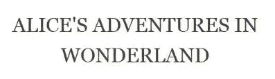

### `lowercase`值

使用值`lowercase`将导致所有字母以小写显示。自然，这不会影响原始源文档中已经是小写字母的外观。

HTML:

```
<h2>Alice's Adventures in Wonderland</h2>
```

CSS:

```
h2 {
  text-transform: lowercase;
}
```

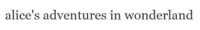

### `full-width`值

规范增加了一个新值`full-width`。该值限制字符出现在正方形内，就好像它是一个表意字符，例如，日语、中文等。这有助于将拉丁字符与表意字符对齐。

并非所有字符都有相应的全角形式，在这种情况下，字符不会受到`full-width`值的影响。

HTML:

```
<h2>Alice's Adventures in Wonderland</h2>
```

CSS:

```
h2 {
  text-transform: full-width;
}
```

以下是应用`full-width`时 Firefox 中角色的样子:

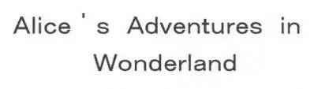

### 进一步说明

**浏览器对`text-transform`物业的**支持非常好。其实各大浏览器都支持。

唯一的例外是`full-width`值，它目前只在 Firefox 中有效。考虑到`full-width`在规范的候选推荐阶段有被放弃的风险，这也许是可以理解的。

此外，我注意到 Firefox (v.39)和其他主流浏览器在呈现带连字符的单词上的`capitalize`值时有一点不一致。

这是它在 Firefox 中的样子:

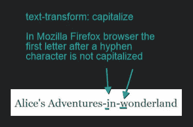

注意连字符后的第一个字母没有大写。另一方面，下面是 Chrome 中显示的相同文本:

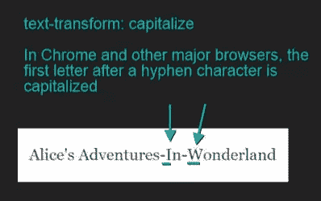

在这种情况下，连字符后面的字母也不例外；它们也用大写字母显示。我在所有其他主流浏览器的最新版本中都观察到了同样的行为，除了上面提到的 Firefox。

最后，小心瀑布！如果在容器元素上设置了`text-transform`属性，它的值将被它的所有子元素继承。为了避免不希望的结果，将子元素的`text-transform`属性值重置为`none`。

[**查看文本转换属性值的演示**。](http://codepen.io/SitePoint/pen/MwNvRO)

## 如何处理空白

当您按下 Tab 键、space 键或强制某些文本换行(使用`ENTER`键或`<br>`标签)时，您会在源文档中创建空白。

默认情况下，浏览器会将空白序列折叠成一个空格，删除换行符，并换行以适应其容器。这对我们很方便，因为它允许我们缩进和分隔文本块，以保持源文档的可读性和可维护性，而不会影响内容在浏览器中的显示方式。

然而，如果这不是你的目标呢？比方说，你想保留你在 HTML 文档中创建的空白。一种常见的情况是，您编写了一些文本，旨在显示为适当缩进的代码片段。或者，您希望一些文本全部显示在一行上，不要换行。

在这种情况下，当您打算覆盖浏览器的默认行为时，`white-space`属性提供了一些有趣的选项。

关键字`normal`将浏览器重置为默认行为:所有额外的空白被折叠成一个字符，当它们到达容器边缘时换行。

### `pre`值

`pre`关键字允许您通过保留源文档中出现的所有空白和强制换行来显示文本。文本溢出容器时不会换行。

```
element {
  white-space: pre;  
}
```

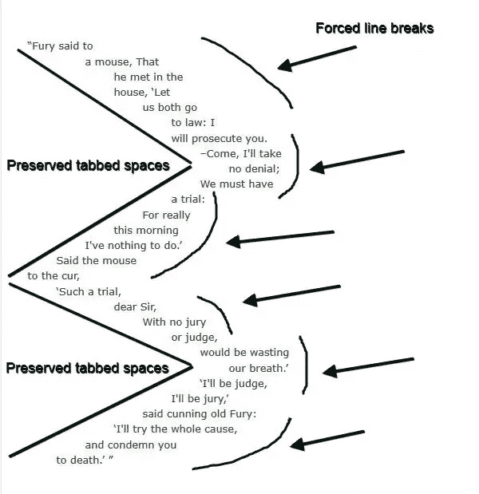

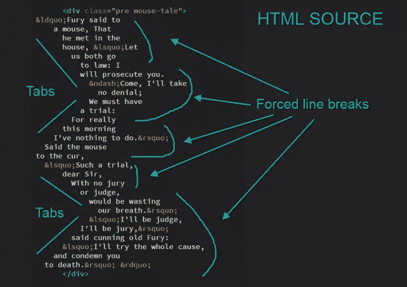

如果您使用制表符来创建空白，您可以通过将`tab-size`属性设置为一个整数值来控制它们的大小。

```
element {
  white-space: pre;
  -moz-tab-size: 4;
  -o-tab-size: 4;
  tab-size: 4;
}
```

`tab-size`是一个与[不一致的浏览器支持](http://caniuse.com/#search=tab-size)的属性，但是如果你实在无法忍受默认 tab 的字符长度，这里有一个 [polyfill](http://codepen.io/tjacobdesign/pen/Cjryo) 来覆盖你所有的基数。

### `pre-wrap`值

假设您希望在浏览器显示中保留源文档中的空白。但是，您也想让行在到达容器边缘时换行。

`pre-wrap`关键字将帮助您获得想要的结果。

```
element {
  white-space: pre-wrap;  
}
```

注意浏览器中显示的每一行是如何反映源代码中的强制中断的，尽管容器有足够的空间来容纳更多的文本:

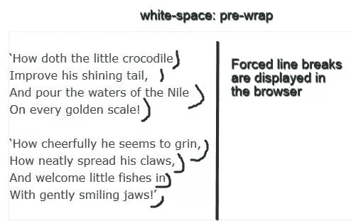


然而，缩小你的浏览器屏幕，你会注意到换行以适应他们的容器。

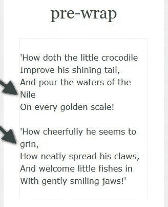

### `pre-line`值

`white-space`属性的最后一个有趣的值是`pre-line`。在某种程度上，它将空间序列压缩成一个空间并允许换行，其行为类似于`normal`。但是，当 HTML 文档中出现新的行字符或`<br>`标签时，它们会保留在浏览器显示中。

```
element {
  white-space: pre-line;   
}
```

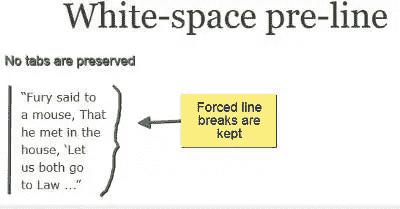

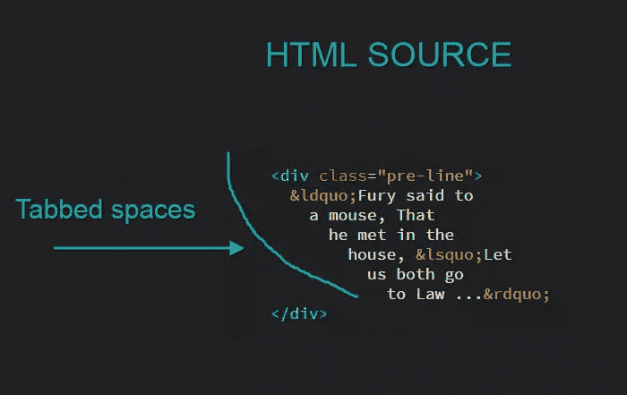

[**试用`pre`、`pre-wrap`、`pre-line`关键词的 CodePen demo**](http://codepen.io/SitePoint/pen/vOoMLz) 。

### `nowrap`值

`nowrap`可能是最广为人知的`white-space`值。您的设计是否要求一段内联内容永远不要换行？在你的元素上使用`white-space: nowrap;`可以达到这个效果。

[Louis Lazaris 向](http://www.impressivewebs.com/css-white-space/)指出了该价值的以下使用案例。


上面是一个链接，后跟一个`»`符号。让这个字符移到下一行，例如在流动的网页布局中，是不可取的。

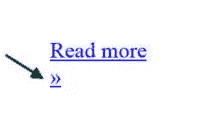

在这种情况下以及类似的情况下(例如，考虑图标)，`nowrap`值非常方便。

另一个有趣的用例是 Sara Soueidan [在 Codrops CSS 参考文献](http://tympanus.net/codrops/css_reference/white-space/)中带给我们的。Sara 指出,`white-space`属性可以应用于任何内嵌内容，包括图像。

> 它有时与值`nowrap`一起使用，通过防止图像换行并强制它们在容器中显示在一行上，在可滚动元素中创建一个水平的图像列表。

我通过使用`white-space: nowrap`创建一个基本的 jQuery carousel 来扩展这个建议。这是演示:

通过 [CodePen](http://codepen.io) 上的 SitePoint ( [@SitePoint](http://codepen.io/SitePoint) )在图像转盘上使用自动换行属性查看笔[。](http://codepen.io/SitePoint/pen/NqQvQd/)