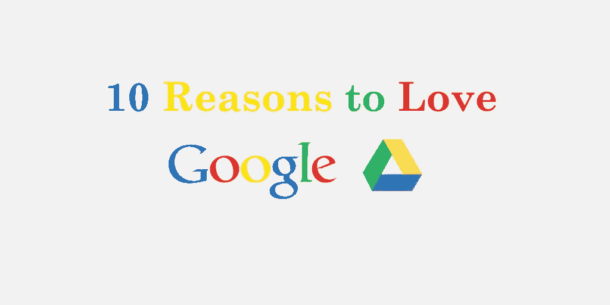

# 喜欢谷歌文档的 10 个理由

> 原文：<https://www.sitepoint.com/google-docs/>

谷歌文档就像玛丽·波平斯的魔法钱包。在你标准的基于云的文字处理器之下，似乎有无穷无尽的技巧、功能和快捷方式。这个平台不会立刻用选项轰炸你——事实上，谷歌文档在展示方面一直很谦虚——但它确实奖励了那些做了一点挖掘的人。

以下是我喜欢谷歌文档的 10 个原因。

## **1。真正管用的离线访问**

我可能是少数，但是其他基于云的文字处理器(咳咳，草稿)的离线能力经常是碰运气的。有时我无法打字。其他时候，应用程序需要很长时间来保存我的工作。

但是当 Wi-Fi 关闭时，谷歌文档不会错过任何一个节拍。它可以平稳地从在线模式过渡到离线模式，并且仍然允许您创建新文档和处理现有文档。当您重新连接到 internet 时，所有更改都将被同步。

要启用离线访问，找到齿轮图标，点击*设置*，勾选*离线*旁边的复选框。

## **2。**研究工具

这就是事情开始变得有趣的地方。利用谷歌的力量，研究工具可以让你在谷歌文档页面上舒适地执行各种研究任务。

该工具采用侧边栏的形式，内嵌谷歌搜索对话。你既可以搜索*一切，*，也可以将搜索结果限制在图片、学术文章和引文等范围内。然后，只需点击一下，您就可以将它们插入到您的文档中。大多数结果都有一个引用按钮，这将创建一个脚注引用。

如果你正在寻找快捷方式，右击一个单词并选择*搜索*。这将自动打开搜索栏并执行网络搜索。您也可以选择*定义*来自动搜索字典。

## **3。找到并插入链接**

很明显，谷歌文档对多个浏览器标签有恐惧症，这就是为什么它允许你直接从你的文档中搜索和插入链接。

在文档的任意位置点击右键，选择*链接*，或者点击*插入*菜单标签，选择*链接*。当你在 ink 对话框中输入一个查询时，它会生成一个来自 Google 的链接列表。

## **4。安装附加组件**

通过与第三方软件合作，Google Docs 能够提供一系列令人印象深刻的增强、修改和扩展。点击*附加组件*菜单标签，选择*获取附加组件*，即可找到完整列表。

要找到你要找的东西，你可以搜索关键词，将附加软件分成不同的类别，或者滚动浏览所有的附加软件。

我最喜欢的几个插件包括: [同义词库](https://chrome.google.com/webstore/detail/thesaurus/lhbmnjfnkboeekbaogpphjjmippkmihm?utm_source=permalink) ， [EasyBib 书目创建者](https://chrome.google.com/webstore/detail/easybib-bibliography-crea/dnhomniofbmbomomggjpkakilbbgfkhc?utm_source=permalink) ， [打开剪贴画](https://chrome.google.com/webstore/detail/openclipart/jhlifdiflonnipfdneahhngjdcaloajn?utm_source=permalink) ，以及[Uber conference](https://chrome.google.com/webstore/detail/uberconference-sidebar/hbnkihaebkcmacjhmenhepamcdjolbmi?utm_source=permalink)

## **5。创建个人字典**

在韦氏词典可能不存在“怪兽”这个词，但在你即将出版的科幻小说中它肯定存在，这部小说记录了远古时期怪兽和伊尔克哥特之间的斗争，两个外星种族在一个冷漠的星系中争夺资源。

为了让 Google Docs 相信 Garglecopter 不是一个错别字，右键单击该单词并选择*添加到个人词典*。

*工具>个人字典*也行。

## **6。模板**

不要被 Google Docs 的极简美学所迷惑；这位超级明星可以做出很多狂野的造型。

谷歌文档 [模板库](https://drive.google.com/templates?ddrp=1) 充斥着精心设计的新闻稿、发票、简历、时事通讯、求职信等等。一旦你选择了你想要的模板，它将作为一个新的谷歌文档文件打开。

进入模板库，点击*文件*菜单标签，选择*新建*，从模板中选择*。*

您也可以 [创建自己的](https://drive.google.com/createtemplate?referringview=public) 模板并提交给公众使用。

## **7。不同格式的邮件和下载**

当涉及到竞争格式时，Google Docs 走的是一条捷径，它使转换文档变得快速而简单。

下载一个谷歌文档作为 Word 文档(。docx)、PDF、网页(。html)等，点击*文件*菜单标签，选择*下载为*。

要将文件作为电子邮件附件发送，点击*文件*菜单标签，选择*电子邮件作为附件*，选择您想要的格式。

## **8。将邮件附件直接保存到谷歌文档**

虽然您可以将 Google Docs 文档作为电子邮件附件发送，但您也可以将电子邮件附件(如图像、视频和文档)直接从 Gmail 界面保存到 Google Docs。

打开包含附件的电子邮件，将光标移到附件上。将出现两个图标:一个箭头和谷歌文档标志。选择徽标，然后选择要保存附件的 Google Docs 文件夹。

## **9。自动换人**

厌倦了在一篇关于指纹的文章中不得不打出*皮下注射*？厌倦了不断拼错单词*锻炼*？

Google Docs 的自动替换功能可以让你创建自定义的快捷方式来自动填充某些单词或短语。这有点像自动更正，除了它不会让你想把你的电脑扔进湖里。

要创建替换，点击*工具*菜单标签，选择*偏好*并填写*替换*和【T7 用表格。

例如，你可以用*皮下注射*代替*皮下注射*，或者用*运动*代替*皮下注射*。

## **10。实时协作**

谷歌文档也许是该应用程序最强大的功能，它允许用户就一份文档进行实时协作。

要与合作者共享文档，点击屏幕右上角的*共享*按钮，并输入合作者的电子邮件地址。指定您的合作者是否能够*编辑*、*评论*或*查看*。要访问更多共享设置，请单击*高级*。

合作时的一些有用提示:

**建议**谷歌文档提供编辑、查看和建议模式。在建议模式下工作时，所有编辑都会被跟踪，类似于 Word 的修订。这使得每个人都可以看到所做的每个编辑，文档所有者可以接受或拒绝修改。

**标记合作者**如果你的文档有很多合作者，在评论中标记他们可能更容易吸引特定的人。要标记某人，只需键入@或+符号，后跟该人的姓名。选中后，将通过电子邮件通知该人该标签。

## **结论**

喜欢谷歌文档的理由还有很多，但这 10 个应该会吊起你的胃口。有这么多的方式来定制应用程序，您可以选择一些苗条和简朴的东西，或者使用强大的文字处理功能。此外，您还将知道，无论您身在何处，使用什么计算机，或者无线网络状况如何，都可以访问您的所有文档。

## 分享这篇文章