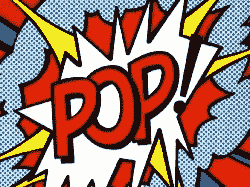
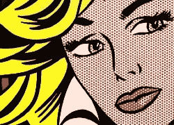
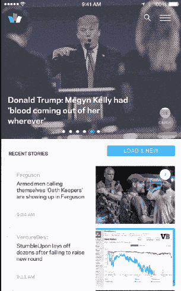
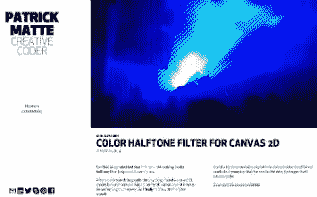
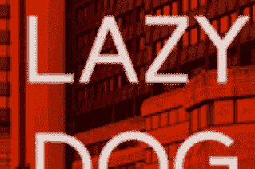

# 为什么我们喜欢粗糙的唱片、半色调网点和其他瑕疵？

> 原文：<https://www.sitepoint.com/scratchy-records-halftones-dots-love/>

有趣的是，几乎总是技术中的不完美成为了它的标志——我们庆祝的那一点。

我在说什么？

*   黑胶唱片的嘶嘶声和爆裂声
*   电影胶片卷轴上的链轮孔
*   拨号上网的咔哒声、口哨声和尖叫声
*   绘画中的直线笔触

每一个都只不过是他们创造过程中的意外副作用。例如，拨号调制解调器*黑掉了*音频电话技术，使数据连接工作。它从来都不是一个发送数据的好系统，所以我们放弃了它。然而，这种微弱的抱怨仍然能让人微笑。

同样，我们很少依靠移动机械卷轴来驱动今天的数字视频。然而，穿孔胶片卷轴仍然是电影公司和摄影师最常见的视觉主题。

这让我们想到了“半色调图案”。

## 半色调

“半色调”——你在大多数打印照片中看到的小点——是不完美过程的另一个副作用。这是我们用现有的所能做的最好的事情。

在半色调技术发明之前，几乎所有的彩色图像都是手绘的，熟练的画家可能会手工混合数百种不同的颜色来再现他们的眼睛所看到的。

显然，手工混合每张图片的数百种颜色并不适合印刷过程。与画家不同，印刷机一次只能印刷有限颜色的固体油墨。

半色调改变了游戏规则，它让印刷商用更少的油墨获得更多的色调。带有微小透镜网格的玻璃屏幕允许印刷厂将色调图像转换成不同大小的点。虽然它不是一个完美的、像镜子一样的复制品——早期的屏幕非常粗糙——但它是彩色印刷的一场革命。

罗伊·利希滕斯坦

但半色调图片不能不有自己的“外观”，艺术家和设计师拿起了那个。

20 世纪 60 年代的[波普艺术大师罗伊·利希滕斯坦](http://www.npr.org/2012/10/15/162807890/one-dot-at-a-time-lichtenstein-made-art-pop)在其所有最具代表性的作品中采用了半色调网点([本日网点](https://en.wikipedia.org/wiki/Ben-Day_dots))。他大胆的、漫画式的作品充满了手绘圆点，你可以在任何东西上找到这些圆点，从帆布到瓷砖到杯子和陶器。

## Khoi Vin 引入了通配符

Khoi Vin(以前是 NYT 的 design extraordinaire)也在他新的通配符 iPhone 应用程序中大量采用了半色调效果。

厌倦了过去两年变得普遍的[模糊背景照片效果](http://www.subtraction.com/2015/08/11/blurring-is-the-auto-tune-of-ui-design/?utm_source=SitePoint)，Khoi 以两种方式使用半色调:

*   浏览视图中的彩色特征图像使用微妙的类似报纸的半色调。
*   -打开“卡片”时，特征图像会变成一个暗色调的版本，成为背景。

你会在这个动画中感受到它(我稍微放慢了速度)。

使用半色调的通配符应用。

这是一个非常酷的效果，给应用程序一种值得信赖的“报纸”感觉，同时仍然使它在视觉上与众不同——它看起来肯定不像另一个动画书。

不过，有一个有趣的决定。

目前，通配符 CMS 会自动为每张特色新闻图片生成两张额外的图片——每次一张彩色图片和一张单色图片。Khoi 提到这些图像压缩得很好，但我真的想知道是否有其他方法。

这意味着用户需要下载三张图片来获得一张图片的“编辑价值”。这并不疯狂，但或许也不理想。

这还意味着通配符服务器需要管理和存储三倍的图像资产，如果这些图像在两年内不再具有这种视觉效果，它们将立即变得多余。

再说一次，这不是一场悲剧，但你不能掉以轻心。

## 生成即时半色调

帕特里克·马特半色调过滤器

已经有一些优秀的解决方案来生成动态半色调效果。David DeSandro 创造了这个疯狂的、互动的“呼吸”半色调图片(T1)，玩起来很有趣。

然而，我认为 Patrick Matte 的彩色半色调过滤器最适合我们的应用。Patrick 的方法将原始图像渲染到画布元素中，同时让您交互式地调整细节层次。

这是一个很好的解决方案，如果用在“通配符式”布局中，将允许“实时调整”效果，而不会产生任何遗留问题。

可调半色调设置

我们很想知道 Khoi 的团队是否考虑过构建这样的过滤器，但最终决定不这么做——可能是因为 IOS 的性能原因。Patrick 的 canvas 解决方案在 web 上的性能似乎不错。

然而，不可否认的是，通配符是一个漂亮的设计和很棒的 UI。我怀疑我们将会在明年看到“半色调点”相当多。

最初发表于 [SitePoint 设计简讯](https://www.sitepoint.com/newsletter/)。

## 分享这篇文章