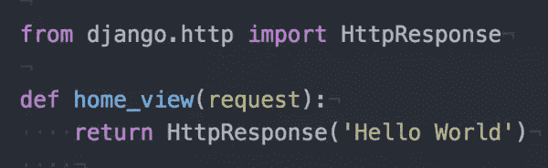

# 在 Ubuntu 14.04 上使用 mod_wsgi 部署 Django 应用程序

> 原文：<https://www.sitepoint.com/deploying-a-django-app-with-mod-wsgi-on-ubuntu-14-04/>

Django 是一个免费的、开源的、基于 Python 的 web 框架。Django 遵循 MVC 架构模式，特别强调快速创建应用程序。最近，Django 已经成为创建 web 应用程序的流行选择。Instagram、Bitbucket 和 Pinterest 等流行服务都是使用 Django 开发的。

在开发模式下，Django 有一个开发服务器，对于测试来说已经足够了。一旦您完成了一个 web 应用程序并准备好投入生产，在服务器上设置应用程序的过程可能会让一些人不知所措，尤其是如果您是第一次这样做的话。本文提供了如何使用`mod_wsgi`部署基于 Django 的 web 应用程序的分步指南。

### `mod_wsgi`

WSGI 或 web 服务器网关接口，是 Web 服务器的 Python 标准。Python 传统上是作为一种编程语言开发的，因此 WSGI 为 web 服务器提供了一种服务于用 Python 开发的应用程序的方式。它使 Python 中的 web 应用程序能够与 web 服务器交互，充当两者之间的链接。

Apache 是最流行的 web 服务器之一，而`mod_wsgi`是一个 Apache 模块，用于在 Apache 上托管 Python 应用程序。这也是部署 Django 应用程序的一种相对简单的方式。

Python 默认安装在 Ubuntu 14.04 中。现在让我们看一下使用`mod_wsgi`部署 Django 应用程序的逐步指南。

## 1.创建 Django 应用程序

在本节中，我们将安装所需的包，并设置一个由`mod_wsgi`提供服务的 hello world Django 应用程序。我们假设您已经登录到一个新创建的虚拟机。

### 1.1 创建新用户(可选)

如果您使用 AWS 或 Microsoft Azure 创建虚拟机，您将以创建虚拟机时指定的用户身份登录，因此可以跳过这一步。

如果您首次以 root 用户身份登录(如果您使用 Digital Ocean 创建了一个新的虚拟机)，则需要一些额外的步骤。尽管您可以使用同一个用户执行所有功能，但通常建议您创建一个新用户。下面是在 Ubuntu 14.04 上创建用户并将他们添加到 sudoers 列表的详细说明。

### 1.2 安装 Python 包管理器

在本教程中，我们将使用 Ubuntu 软件包管理器`apt-get`来安装软件包。但是，在新虚拟机上，您必须首先通过运行以下命令来更新程序包:

```
sudo apt-get update
```

[Pip](https://pypi.python.org/pypi/pip/) 是一个 Python 包管理器，帮助我们安装、修改或删除 Python 包。在 Ubuntu 中安装`pip`最简单的方法是使用 Ubuntu 软件包管理器`apt-get`:

```
sudo apt-get install python-pip
```

`apt-get`安装`pip`的最新稳定版本。或者，如果你需要特定版本的`pip`，你可以[从源代码](https://pip.pypa.io/en/latest/installing.html)安装。然而，为了部署 Django 应用程序，通过包管理器安装就足够了。

也可以用`easy_install`代替`pip`。然而，在本教程中，我们将使用`pip`来安装包。

### 1.3 安装 Django

如果你从头开始创建一个项目，你只需要 Django 包。在本例中，我们不需要任何进一步的包:

```
sudo pip install Django
```

如果您想要安装软件包的特定版本，您可以在如下所示的命令中指定它(如果您的应用程序是在 Django 的旧版本中编写的):

```
sudo pip install Django==1.5.5
```

也可以通过包管理器`apt-get`安装 Django。遵循此步骤时必须小心，因为与`pip`相比，`apt-get`可能不会更新为最新的稳定版本。

### 1.4 安装和冻结其他要求(可选)

如果您正在部署一个现有的项目，您可以递归地运行`pip`来安装项目中的依赖项。通常，在项目的源目录中有一个文件`requirements.txt`,它包含运行项目所需的包:

```
pip install -r requirements.txt
```

如果您的系统有其他 Python 项目，不同 Python 包的版本可能会相互干扰。对此的一个解决方案是使用`virtualenv`并将每个项目保存在它自己的虚拟 Python 环境中。下面是[入门`virtualenv`](https://www.sitepoint.com/virtual-environments-python-made-easy/) 的教程。因为我们正在服务器上部署应用程序，所以在本教程中我们不打算使用`virtualenv`。

如果您正在开发一个 Django 应用程序，并且想要创建或更新需求文件，那么您可以运行下面的代码:

```
pip freeze > requirements.txt
```

`pip freeze`打印当前环境中已安装的 Python 包的列表，`>`将命令`pip freeze`的输出存储到文件`requirements.txt`中。

### 1.5 创建 <q>Hello World</q> 应用程序

要在 Django 中创建一个名为 <q>helloworld</q> 的新项目，运行以下命令:

```
django-admin.py startproject helloworld
```

您会注意到已经创建了一个新目录 <q>helloworld</q> 。将您的目录更改为 <q>helloworld</q> 并运行以下命令，在 Django 项目中启动一个新的应用程序 <q>helloapp</q> :

```
cd helloworld/
django-admin.py startapp helloapp
```

我们现在可以创建一个样本视图，在浏览器中打印 <q>Hello World</q> 。首先，将新应用程序添加到项目的`settings.py`中。在文件中搜索 <q>`INSTALLED_APPS`</q> ，添加我们新 app 的名称。它应该如下所示:

```
INSTALLED_APPS = (
    'django.contrib.auth',
    'django.contrib.contenttypes',
    'django.contrib.sessions',
    'django.contrib.sites',
    'django.contrib.messages',
    'django.contrib.staticfiles',
    'helloapp'
)
```

接下来，我们向项目的`urls.py`添加一个 URL 模式。它看起来像这样:

```
urlpatterns = patterns('',
    # Examples:
    # url(r'^$', 'helloworld.views.home', name='home'),
    url(r'^', 'helloapp.views.home_view'),
)
```

这指示 Django 在应用程序 <q>helloapp</q> 的`views.py`中寻找函数`home_view`。因此，我们编辑`views.py`文件，如下所示:

```
from django.http import HttpResponse

def home_view(request):
    return HttpResponse('Hello World')
```

接下来，我们通过运行以下命令来运行开发服务器:

```
python manage.py runserver
```

hello world Django 应用程序的代码可从 GitHub 上的[处获得。](https://github.com/sdaityari/django-hello-world)

## 2.通过 Apache 和`mod_wsgi`服务 Django 应用

现在我们已经创建了一个 hello world 应用程序，本节将探讨如何配置不同的设置，以便通过 Apache 和 mod_wsgi 为应用程序提供服务。

### 2.1 安装 Apache2

使用`apt-get`命令，安装 Apache 也是一步完成的过程。运行以下命令:

```
sudo apt-get install apache2
```

### 2.2 安装 mod_wsgi

Apache 的`mod_wsgi`模块可以使用`apt-get`安装在 Ubuntu 14.04 上:

```
sudo apt-get install libapache2-mod-wsgi
```

如果您使用的是 Python 3 而不是 Python 2，运行以下命令:

```
sudo apt-get install libapache2-mod-wsgi-py3
```

这里有一个教程，详细说明了如何在 Ubuntu 上安装[。](https://www.digitalocean.com/community/tutorials/installing-mod_wsgi-on-ubuntu-12-04)

### 2.3 修改目录结构

为了通过`mod_wsgi`服务 Django 应用程序，我们需要编写一个 WSGI 脚本，作为 Apache 和 Django 之间的连接。Django 文件的默认结构是这样的:

```
mysite/
    manage.py
    mysite/
        __init__.py
        settings.py
        urls.py
    myapp/
        models.py
        views.py
```

我们将对其进行一些更改，并在`mysite`中添加一个`apache`目录，以包含三个文件:

```
mysite/
    manage.py
    mysite/
        __init__.py
        settings.py
        urls.py
        apache/
            __init__.py
            override.py
            wsgi.py
    myapp/
        models.py
        views.py
```

这有助于分离逻辑，您也可以在版本控制系统中忽略整个目录。

*注意:如果您使用的是 Git 这样的版本控制软件(VCS ),您可以将`apache`目录添加到 VCS 的忽略列表中。*

### 2.4 创建 WSGI 脚本

空的`__init__.py`文件告诉 Python 把目录当作一个包。`override.py`导入所有设置并覆盖任何生产设置。例如，用于生产的数据库和调试设置可能与开发的不同，您可能希望将它们与源代码分开:

```
# override.py

from mysite.settings import *

DEBUG = True
ALLOWED_HOSTS = ['www.mydomain.com', 'mydomain.com']
```

最后，`wsgi.py`文件包含 WSGI 设置。我们假设上面显示的根目录包含在用户(`/home/myuser/`)的主目录中:

```
#wsgi.py
import os, sys
# Calculate the path based on the location of the WSGI script.
apache_configuration= os.path.dirname(__file__)
project = os.path.dirname(apache_configuration)
workspace = os.path.dirname(project)
sys.path.append(workspace)
sys.path.append(project)

# Add the path to 3rd party django application and to django itself.
sys.path.append('/home/myuser')
os.environ['DJANGO_SETTINGS_MODULE'] = 'mysite.apache.override'
import django.core.handlers.wsgi
application = django.core.handlers.wsgi.WSGIHandler()
```

您还需要将`apache`目录的所有权转移给 Apache 的默认用户`www-data`,以便允许它访问该目录:

```
sudo chown www-data:www-data apache/
```

*注意:感谢斯科特·塔加特在评论中指出
上面显示的`wsgi.py`脚本将在 Django 1.8 中抛出一个错误(本文使用了 Django 1.7)。正如 Scott 所指出的，为了让这个脚本能够在 Django 1.8 中运行，最后两行需要替换为:*

```
 from django.core.wsgi import get_wsgi_application
application = get_wsgi_application()
```

### 2.5 配置 Apache 设置

要配置 Apache 使用您的 WSGI 脚本，您需要如下所示编辑配置文件(使用文本编辑器，在本例中是 VIM):

```
sudo vi /etc/apache2/sites-enabled/000-default.conf
```

将以下几行添加到文件中:

```
<VirtualHost *:80>
    WSGIScriptAlias /mypath/ /home/myuser/mysite/apache/wsgi.py
    <Directory "/home/myuser/mysite/apache/">
      Require all granted
    </Directory>
</VirtualHost>
```

第一行将别名`/mypath`添加到 web 应用程序的根目录。您的 web 应用程序现在将在您的域— `http://www.mydomain.com/mypath/`上运行。如果您希望您的域`http://www.mydomain.com/`直接指向 Django 应用程序，请将上面的`/mypath/`替换为`/`。`<Directory>`块允许对包含 WSGI 脚本的目录的请求。

如果您有自定义的`robots.txt`和 favicon，您可以添加一个别名，如下所示:

```
Alias /robots.txt /home/myuser/mysite/robots.txt
Alias /favicon.ico /home/myuser/mysite/favicon.ico
```

在上面的每一行中，关键字`Alias`后面的第一个参数表示 URL 模式，第二个参数显示要提供的文件的路径。这个例子假设你的文件`robots.txt`和`favicon.ico`保存在`mysite`目录中。

要提供静态和媒体文件，您需要分别创建它们的别名条目:

```
Alias /media/ /home/myuser/mysite/media/
Alias /static/ /home/myuser/mysite/static/

<Directory /path/to/mysite.com/static>
Require all granted
</Directory>

<Directory /path/to/mysite.com/media>
Require all granted
</Directory>
```

最后，保存并关闭文件，重新启动 Apache 来查看更改:

```
sudo service apache2 restart
```

#### 旧版本 Apache 的注意事项

对于 2.4 以上的 Apache 版本(比如 Ubuntu 12.04 中的版本)，需要在上面加上一行`Order deny,allow`后，用`Allow from all`替换`Require all granted`。

#### Django 包提供的静态文件的注意事项

一些 Django 包有自己的静态和媒体文件。在开发版本中，它由 Django 负责，但是在通过 Apache(包括 Django 管理静态文件)提供服务时，它并不这样工作。静态文件通常位于安装软件包的同一位置。

覆盖它们的一个简单方法是将它们的静态文件复制到您的静态目录中(并提交它们)，这是一个相当麻烦的解决方案。更好的方法是为特定的静态文件集创建别名，就像为静态和媒体根目录创建别名条目一样。

关于 StackOverflow 的讨论给出了一个如何处理 Django 管理静态和媒体文件的例子。对于其他使用静态和媒体文件的包，您需要遵循相同的模式。

## 结论

近年来，Django 成为了众多程序员中的首选。尽管许多人指责 Python 速度慢，但像 Instagram 和 Disqus 这样在 Django 上运行的网站已经拥有数百万用户。如果你感兴趣，你可能想阅读【HackerEarth 如何使用 mod_wsgi 扩展他们基于 Django 的 web 应用程序。

我希望本教程能够帮助您使用 Apache 和`mod_wsgi`在服务器上部署基于 Django 的 web 应用程序。如果你遇到了任何困难，请在下面的评论中告诉我。

## 分享这篇文章