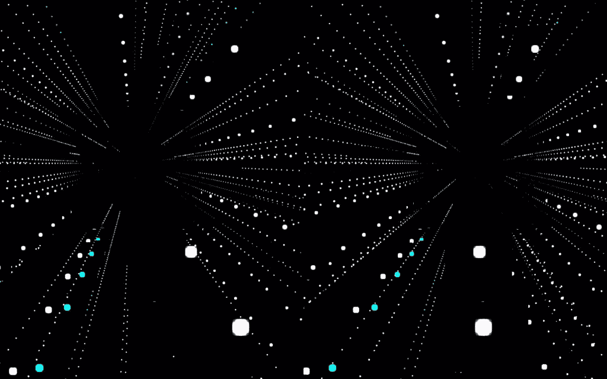

# 用 Three.js 和 Node 在 VR 中可视化 Twitter 流

> 原文：<https://www.sitepoint.com/visualizing-a-twitter-stream-in-vr-with-three-js-and-node/>

Twitter 是一个奇妙的、信息丰富的怪兽。我想把可视化、Three.js 和它的 VR 功能与 Socket 结合起来。IO 和 Node 通过 Twitter 流创建了一个漂亮的粒子世界。

我之前已经在 SitePoint 文章[中讨论了开发虚拟现实网络体验的所有基础知识，使用 Google Cardboard 和 Three.js](https://www.sitepoint.com/bringing-vr-to-web-google-cardboard-three-js/) 将虚拟现实带到网络上，所以如果你对这整个想法还不熟悉，那么先阅读这一篇，然后再回来。这个演示使用相同的基础。

我们将建立的演示将观看一个关键字的实时 Twitter 流。当一个人在观看视频流时发出推文，它会显示一个闪亮粒子的“塔”,代表推文有多长。这个演示将特别寻找提到“比萨饼”这个词。你问为什么是披萨？我在寻找一个不像“比伯”那样被频繁提及，但比“赛车鬣狗”更频繁的术语。简而言之，最好的术语是那些相对频繁的术语，它们会在你观看的时候出现，但不会频繁到每秒钟出现数百个。披萨就是其中之一。

## 演示代码

如果你热衷于直接进入代码并尝试它，你可以在 [GitHub](https://github.com/sitepoint-editors/VRTwitterWorld) 上找到它。

想用行动试试吗？我这里托管了一个运行版本: [VR 推特世界](http://vrtwitterworld.herokuapp.com)。

## 我们的服务器代码

我们将从查看节点服务器代码开始。它将显示我们的平面 HTML，也作为一个套接字操作。IO 服务器将从 Twitter 获取数据流。

完整的服务器相对较短，如下所示:

```
var express = require('express'),
    app = express(),
    server = require('http').createServer(app),
    port = process.env.PORT || 80,
    io = require('socket.io')(server),
    config = require('./config.json'),
    Twitter = require('node-tweet-stream'),
    t = new Twitter(config);

app.get('/', function(request, response) {
  response.sendFile(__dirname + '/public/index.html');
});

app.get(/^(.+)$/, function(req, res) {
  res.sendFile(__dirname + '/public/' + req.params[0]);
});

app.use(function(err, req, res, next) {
  console.error(err.stack);
  res.status(500).send('Something broke!');
});

server.listen(port, function() {
  console.log('Listening on ' + port);
});

t.track('pizza');
t.on('tweet', function(tweet){
  console.log('Roger that. Tweets incoming!');
  console.log(tweet);

  io.emit('tweet', tweet);
});

t.on('error', function (err) {
  console.log('Brace yourself! We are goin doooowwwwwwnnnnnnnn! ', err);
});
```

我们的第一行使用 Node Express 框架设置了一个服务器。这是一个相当简单的设置，它包含了我们所有的依赖项，并为我们访问服务器功能准备了`app`变量。`port`设置我们希望我们的服务器在哪个端口上运行(`process.env.PORT`是一些像 Heroku 这样的主机设置已经定义的服务器变量)。

```
var express = require('express'),
    app = express(),
    server = require('http').createServer(app),
    port = process.env.PORT || 80,
```

然后，我们在启动套接字的同时设置`io`变量。IO 服务器功能，将其连接到我们在上面设置的 Express 服务器:

```
io = require('socket.io')(server),
```

### 设置 Twitter 访问

`config`变量是将应用程序的 Twitter 认证密钥和访问令牌保存在它们自己的文件中的好方法。为了实时查看 Twitter 流，我们将使用一个名为 [node-tweet-stream](https://www.npmjs.com/package/node-tweet-stream) 的 npm 模块，它提供了我们需要的所有功能。我们将 Twitter 访问的对象和所有相关的函数赋给变量`t`，传入我们的 config JSON 来证明我们被允许访问它。

```
config = require('./config.json'),
Twitter = require('node-tweet-stream'),
t = new Twitter(config),
```

如果您没有任何 Twitter 键来访问 Twitter API，请不要担心！你只需要在 Twitter 上注册一个应用程序。进入[Twitter 应用管理页面](https://apps.twitter.com/)，使用您的 Twitter 凭证登录，然后点击[“创建新应用”](https://apps.twitter.com/app/new)。

拥有应用程序后，您可以通过单击将出现在应用程序管理页面上的“密钥和访问令牌”链接来获取密钥和访问令牌。如果找不到，它将位于:`https://apps.twitter.com/app/0000000/keys`(用您的应用 ID 替换`0000000`)的 URL。

然后，在与`index.html`相同的级别上创建一个名为`config.json`的文件。在其中，使用您自己的应用程序值添加以下内容:

```
{
  "consumer_key": "YOURKEY",
  "consumer_secret": "YOURKEYSECRET",
  "token": "YOURTOKEN",
  "token_secret": "YOURTOKENSECRET"
}
```

### 其他服务器基础知识

在我们的`index.js`文件中，我们设置了对服务器根目录的调用来加载`/public/index.html`:

```
app.get('/', function(request, response) {
  response.sendFile(__dirname + '/public/index.html');
});
```

我们还让它提供服务器上`public`目录中的任何其他静态文件:

```
app.get(/^(.+)$/, function(req, res) {
  res.sendFile(__dirname + '/public/' + req.params[0]);
});
```

如果我们确实有一个错误，我们会在服务器的控制台中记录该错误并返回一个 500 错误:

```
app.use(function(err, req, res, next) {
  console.error(err.stack);
  res.status(500).send('Something broke!');
});
```

下面几行启动我们的服务器，使用上面的所有设置运行。

```
server.listen(port, function() {
  console.log('Listening on ' + port);
});
```

### 检索我们的实时 Twitter 流

最后，我们设置了特定于 Twitter 的服务器功能。我们使用`track()`函数来指定我们希望在不断扩大的 Twitter 内容流中跟踪哪个关键字。

```
t.track('pizza');
```

然后，我们设置一个回调函数，在`node-tweet-stream`模块发现带有该关键字的 Tweet 时运行。如果它看到一个，我们将它记录在我们服务器的控制台日志中(这是可选的，如果你愿意，你可以删除它)，然后作为一个套接字发出那个 tweet。任何连接的客户端的 IO 事件。

```
t.on('tweet', function(tweet){
  console.log('Roger that. Tweets incoming!');
  console.log(tweet);

  io.emit('tweet', tweet);
});
```

如果我们的 Twitter API 由于任何原因出现错误，它将被记录到我们的服务器日志中:

```
t.on('error', function (err) {
  console.log('Brace yourself! We are goin doooowwwwwwnnnnnnnn! ', err);
});
```

与所有节点应用程序一样，我们所有的服务器依赖关系和详细信息都存储在`package.json`中。如果你是 Node.js 的新手，你可能想读一点关于一切的含义: [package.json](https://docs.npmjs.com/files/package.json) 。

## 我们的前端代码

我们的前端代码从使用 Google Cardboard 和 Three.js 文章将 VR 带到网络的[开始，这是一个通过立体效果显示的 Three.js 场景，将我们的场景带入 VR 视图。为了保持简洁明了，我不会涉及与那篇文章中的前一个演示相同的部分。如果您对我在这里没有解释的内容不确定，请查看之前的文章获取信息。](https://www.sitepoint.com/bringing-vr-to-web-google-cardboard-three-js/)

### 正在设置套接字。超正析象管(Image Orthicon)

与之前的基础相比，我们将添加的唯一新的 JS 文件是我们的 Socket。IO JavaScript 文件。这是一个简单的命令行程序:

```
<script src="/socket.io/socket.io.js"></script>
```

以便从套接字访问功能。IO，我们所需要的就是将该功能分配给`io`变量，正如您将在我们的`index.html`文件中看到的:

```
socket = io(),
```

### 准备我们的塔

然后，我们为我们的“塔”(基本上是代表一条推文的垂直粒子集)设置变量。我们所有的塔都存储在一个名为`tweetTowers`的`THREE.Object3D`对象中。这是一个容器对象，可以让我们跟踪所有的塔:

```
// Towers
tweetTowers = new THREE.Object3D(),
```

`particleTexture`和`particleMaterial`是我们的变量，它们将代表我们的粒子将会是什么样子:

```
particleTexture,
particleMaterial,
```

是我们希望在场景中看到的塔的最大数量——如果这个设置太高，我们可能会有一个滞后的体验。我将它设置为 6000，因为这将最大粒子数设置为大约一百万。一个我认为合理的数字！

```
maxTowerCount = 6000,
```

我们希望这些塔在观众周围有多大的区域。塔将被放置在场景中的随机点上，因此这限制了它们之间的距离。我发现这是一个更好的体验，他们更接近用户。如果它们离用户更远，看起来就没有那么多(尽管有成千上万的粒子！).我把它设置为 100:

```
range = 100;
```

### 我们的 Init 函数

在我们的`init()`函数中没有太多新的东西。它主要设置我们的 VR 相机和控制，如前一篇文章所述。新的位在末尾。

我们将我们的`particleTexture`图像定义为一个名为`particle-new.png`的 png，它在我们的`public`文件夹中:

```
particleTexture = THREE.ImageUtils.loadTexture('textures/particle-new.png');
```

我们通过将`tweetTowers`容器添加到场景中来完成`init()`功能。在我们的场景中有了这个，我们就不需要担心把我们的塔直接添加到场景中，我们只需要把它们直接添加到我们的`tweetTowers`对象中。

```
scene.add(tweetTowers);
```

### 对推文做出反应

您可能还记得，一旦我们的服务器通过 Twitter 找到带有关键字“pizza”的 tweet 流，它就会发出一个名为“tweet”的事件。我们的客户端 JavaScript 现在将监视该事件并做出响应:

```
socket.on('tweet', function(tweet) {
  // Our response
});
```

响应代码是对一个名为`generateTower()`的函数的调用，该函数将在我们的场景中添加一座塔来表示这条推文。我们传递给它四个值:

```
generateTower({
  color: parseInt('0x'+ tweet.user.profile_background_color),
  startingCoords: {
    x: getRandomArbitrary(-1*range, range),
    y: 0,
    z: getRandomArbitrary(-1*range, range)
  },
  speed: 5,
  size: (tweet.text.length / 140) * 100
});
```

*   `color`是我们粒子的颜色。我们传入用户档案背景的颜色。这让我们可以用不同的颜色来代表在推特上谈论披萨的不同饥饿用户。
*   是塔将要被放置的地方。我们想把它们放在我们周围，所以我们把它们放在 x 轴和 z 轴上的 range 变量之间(最终应该在-100 到 100 之间)。如果我们把它们随机放在 y 轴上，它们会从离地面更高和更低的不同高度开始，而不是像建筑物一样排成一行。我们肯定不希望这样，所以我们确保它们都被放置在 0 的 y 位置。`getRandomArbitrary()`是两个值之间的简单随机数生成器。
*   定义我们的粒子最终放置的距离(或者塔上升的速度，如果它们向上运动的话)。
*   我们的塔会有多少粒子高。假设 Twitter 的最大长度为 140 个字符，我们将其平均为一个百分比。

### 展示一座塔

我们的`generateTower()`函数本身从定义一个`towerGeometry`变量开始。这是一个`THREE.Geometry`物体，它将包含我们所有粒子在塔内的位置。保持在一个`Geometry`对象内跟踪所有点可以帮助减少处理时间，因为 Three.js 只需要跟踪每个塔对象及其点，而不是一系列独立的粒子。在代码的后面，我们将为一个`THREE.PointCloud`对象提供几何图形，它可以将这些点解释成我们的粒子。

```
function generateTower(options) {
  var towerGeometry = new THREE.Geometry();

  // The rest of our code
}
```

然后，我们设置一个名为`particleMovements`的 JavaScript 对象，存储我们的粒子在塔内的开始和结束位置，以及它们之间的距离(我们之前传递的值):

```
var particleMovements = {
  start: 0,
  end: options.size,
  speed: options.speed
};
```

`currentCoords`变量跟踪粒子在塔内的最后位置。我们在`0,0,0`初始化它。塔将被放置的`startingCoords`是从前面的函数调用中解析出来的。如果我们没有来自函数调用的任何起始坐标，我们将它们初始化为与`currentCoords`相同:

```
var currentCoords = {x: 0, y: 0, z: 0},
    startingCoords = options.startingCoords ? options.startingCoords : currentCoords;
```

然后我们迭代我们的塔的大小来创建每个粒子。我们将 y 的当前坐标设置为增加我们的速度值乘以`i`。我们的 x 和 z 值保持在起点，因为我们只是向上移动。

```
for (var i = 0; i With those co-ordinates defined for this particle, we attach that particle's position as a vertex in our towerGeometry object:

[code language="js"]
towerGeometry.vertices.push(new THREE.Vector3(currentCoords.x, currentCoords.y, currentCoords.z));
```

这确保了我们对粒子的定位是正确的。接下来，我们定义这个塔中的粒子在`particleMaterial`变量中的样子。我们的粒子将被放置在一个`THREE.PointCloud`物体中，因此为了设计它们的样式，我们将使用一个`THREE.PointCloudMaterial`材质:

```
particleMaterial = new THREE.PointCloudMaterial({
  map: particleTexture,
  color: options.color,
  blending: THREE.AdditiveBlending,
  transparent: true,
  size: 4
});
```

*   `map`定义我们将用于粒子的图像，我们传入之前定义的`particleTexture`。
*   `color`传入我们想要的粒子颜色(默认为 Three.js 中的`0xffffff`)。
*   `blending`设置粒子如何融入场景。`THREE.AdditiveBlending`将纹理的颜色添加到后面的纹理上。
*   确保混合能够发生，因为它需要一定程度的透明度才能工作。
*   `size`是我们粒子的大小。

最后，我们在变量`tower`内定义我们的塔的点云。我们传入包含我们希望每个粒子出现的点的几何图形，以及上面为每个粒子定义的材质。

```
var tower = new THREE.PointCloud(towerGeometry, particleMaterial);
```

我们将那个塔添加到我们的`tweetTowers`集合对象中，然后查看场景中有多少个塔。如果塔的数量超过了允许的最大数量，我们会隐藏最旧的塔，以减少设备的负载。如果您有任何性能问题，如果您减少`maxTowerCount`，它们可能会稍微好一点！

```
tweetTowers.add(tower);
if (tweetTowers.children.length > maxTowerCount) {
  tweetTowers.children[tweetTowers.children.length - maxTowerCount].visible = false;
}
```

## 运行我们的代码

要在本地运行这个演示，您需要安装 Node，并且需要运行常用的命令。安装项目的所有依赖项:

```
npm install
```

然后运行它:

```
node index.js
```

为了在你的智能手机上测试这一点，你要么需要确保你的智能手机在同一个本地网络上，并找到你的计算机的 IP 地址，要么使用像 [ngrok](https://www.sitepoint.com/use-ngrok-test-local-site/) 这样的隧道服务(我在关于[从任何地方访问本地主机](https://www.sitepoint.com/accessing-localhost-from-anywhere/)的文章中介绍了如何使用 ngrok)。

您也可以在某个地方托管节点服务器。我个人用的是 [Heroku](https://www.heroku.com) ，不过这完全是个人喜好。

一旦你的服务器在某处启动并运行，打开 Chrome for Mobile 并访问它！戴上你的 Google Cardboard 或其他类似的耳机，如果你抬头看，大约半分钟后你会看到这样的体验:



## 结论

这应该让您对使用 Node、Socket 有了一个很好的了解。IO 和 Three.js 来创建支持虚拟现实可视化的 3D web API。演示本身可以进一步开发，添加更多的关键字，过滤器，用更多的粒子让它运行得更流畅等等。潜力很大！请随意出去，并尝试从这个演示中获得自己的奇妙体验！

我在 SitePoint 也有其他演示，它们使用了类似的概念，但却将它们带入了增强现实体验。如果你感兴趣的话，[用 JavaScript 和 Google Cardboard 过滤现实](https://www.sitepoint.com/filtering-reality-with-javascript-google-cardboard/)探索从你的智能手机中获取相机并为其添加过滤器，而[用 Awe.js 在浏览器中增强现实](https://www.sitepoint.com/augmented-reality-in-the-browser-with-awe-js)探索通过 Three.js 和 Awe.js 的强大组合一路前进并增强你视野中的元素！

如果你接受挑战，从本文的演示中整合自己的 VR 可视化(或将其与提到的 AR 示例中的元素相结合)，请在评论中留言或在 Twitter 上与我联系( [@thatpatrickguy](http://www.twitter.com/thatpatrickguy) )，我会拿出我的耳机来看看！

## 分享这篇文章