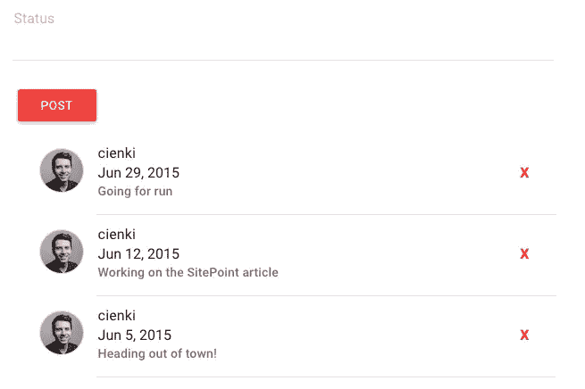
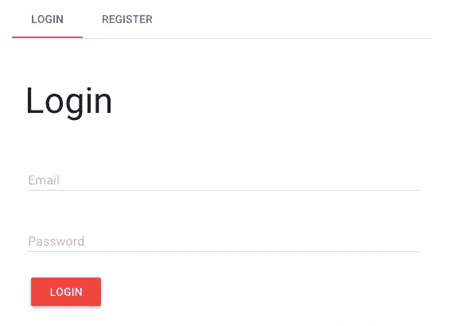
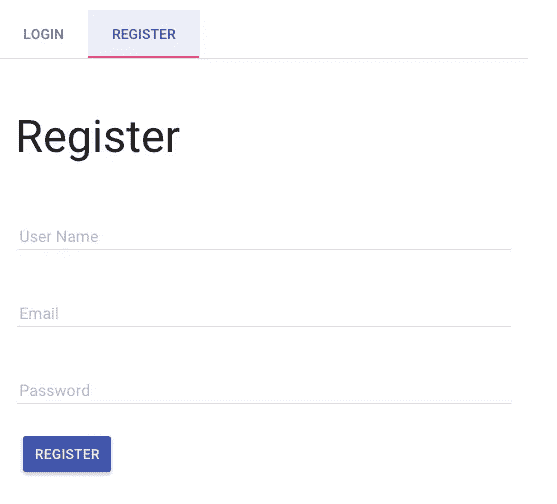
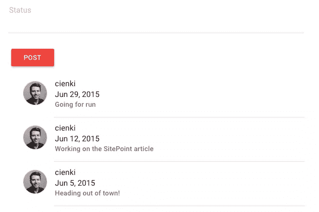

# 用 AngularJS & Firebase 构建一个实时状态更新应用

> 原文：<https://www.sitepoint.com/real-time-status-update-app-angularjs-firebase/>

如果你曾经使用过 AngularJS，那么你可能会对 [Firebase](https://www.firebase.com) 很熟悉——这是一个实时数据存储，可以非常容易地在任何平台上保存和同步数据。Firebase 为其平台提供了一个名为 [AngularFire](https://www.firebase.com/docs/web/libraries/angular/) 的 AngularJS 绑定，这使得使用 Firebase API 更加容易。

在本教程中，我们将创建一个简单的状态更新应用程序，让我们看看 AngularJS 和 Firebase 如何交互。对于 UI，我们将使用 [Angular Material](https://material.angularjs.org/) ，它是 Google Material Design 的 AngularJS 实现，并附带了一大组很棒的 UI 组件。Angular Material 基于 flexbox，如果你还不熟悉的话，可能需要一点时间来适应。我们还将重点关注应用程序的身份验证部分，正如我们将看到的，Firebase 的内置身份验证系统使这一部分变得很简单。



本教程假设你熟悉 AngularJS，并且对 Firebase 及其工作原理有粗略的了解。

和以往一样，本教程的代码可以在 GitHub 上找到[。](https://github.com/sitepoint-editors/fire-status)

## 安装依赖项

让我们从使用`npm`安装应用程序所需的东西开始。

从命令行:

```
mkdir status-app && cd status-app
npm install angular-material angular-ui-router angularfire angular-md5 
```

安装 Angular Material 也会给我们其他的包，包括 AngularJS 的最新版本。我们包含了 UI 路由器，因为我们需要处理两种不同的状态——一种用于登录/注册，另一种用于查看状态。Angular MD5 将为我们提供一种快速散列电子邮件地址的方法，这是为我们的用户获取 Gravatar 图像所需要的。

你还需要某种服务器来查看应用程序并与之交互。为此目的，http 服务器是理想的选择。

## 设置应用程序

我们需要一个文件夹结构，让我们能够清晰地划分不同的职责范围。为此，我们使用一个名为`components`的文件夹。整个文件夹结构应该如下所示:

```
status-app
|-- components
    |-- auth
    |-- status
    |-- user
|-- node_modules
    * dependencies
-- app.js
-- index.html
-- style.css 
```

让我们设置我们的`index.html`文件，引用我们已经安装的依赖项，以及我们还没有创建的应用程序脚本。

```
<!-- index.html -->

<!DOCTYPE html>
<html>
  <head>
    <title>Status App</title>
    <link rel="stylesheet" href="node_modules/angular-material/angular-material.css">
    <link rel="stylesheet"
          href="https://fonts.googleapis.com/css?family=RobotoDraft:300,400,500,700,400italic">
    <link rel="stylesheet" type="text/css" href="style.css">
  </head>
  <body ng-app="statusApp">
    <div layout="row">
      <div flex="33" offset="33">
        <div ui-view></div>
      </div>
    </div>
  </body>

  <!-- Application Dependencies -->
  <script src="node_modules/angular/angular.js"></script>
  <script src="node_modules/angular-ui-router/build/angular-ui-router.js"></script>
  <script src="node_modules/angular-material/angular-material.js"></script>
  <script src="node_modules/angular-animate/angular-animate.js"></script>
  <script src="node_modules/angular-aria/angular-aria.js"></script>
  <script src="https://cdn.firebase.com/js/client/2.2.6/firebase.js"></script>
  <script src="node_modules/angularfire/dist/angularfire.js"></script>
  <script src="node_modules/angular-md5/angular-md5.js"></script>

  <!-- Application Scripts -->
  <script src="app.js"></script>
  <script src="components/auth/authController.js"></script>
  <script src="components/auth/authService.js"></script>
  <script src="components/status/statusController.js"></script>
  <script src="components/status/statusService.js"></script>
  <script src="components/user/userService.js"></script>
</html> 
```

我们已经在`body`标签上启动了应用程序，并将其命名为`statusApp`。通过指定开始的`div`标签应该有一个`row`的布局，我们也立即在主体中使用了有角的材料。通过将布局设置为`row`，容器内的所有内容都将水平放置。如果我们将布局设置为`column`，所有内容都将垂直堆叠。

在下一个`div`中，我们通过在`flex`属性上设置值 33，将宽度设置为 33%。`offset`属性让我们将元素居中，告诉它应该向右移动三分之一。

最后一个元素是我们的`ui-view`标签，它是我们的(尚未创建的)UI 路由器状态将被加载的点。

我们还需要一个`app.js`文件来启动应用程序。

```
// app.js

(function() {
  'use strict';

  angular
    .module('statusApp', ['firebase', 'ngMaterial', 'angular-md5', 'ui.router'])
    .config(function($stateProvider, $urlRouterProvider) {

    // If a route other than status is requested,
    // go to the auth route
    $urlRouterProvider.otherwise('/auth');

    $stateProvider
      .state('auth', {
        url: '/auth',
        templateUrl: 'components/auth/authView.html',
        controller: 'AuthController as auth'
      })
      .state('status', {
        url: '/status',
        templateUrl: 'components/status/statusView.html',
        controller: 'StatusController as status'
      });
    });
})();
```

正如你将看到的，我们调用 AngularJS 模块`statusApp`，它与我们在`body`标签上的`ng-app`声明相匹配。我们通过在模块名称旁边的数组中指定模块来注入我们需要的模块，然后为应用程序设置一些配置。在配置块中，我们将为 UI 路由器设置规则，以处理不同的状态。为此，我们需要传递配置函数`$stateProvider`和`$urlRouterProvider`。

我们还没有为这些状态设置实际的控制器和模板，但是我们在这里要说的是，当我们处于`/auth`的 URI 时，我们想要加载授权视图和授权控制器。这个状态负责为用户提供一个登录和注册框。

登录后，我们想进入`/status`状态，加载状态控制器和视图。最后，我们想要否定任何其他路由，所以我们告诉`$urlRouterProvider`如果有疑问，将用户发送到`/auth`状态。

## 一点 CSS

我们需要一点 CSS 来设计应用程序中的状态列表。

```
/* style.css */

.face {
  border-radius: 30px;
  border: 1px solid #ddd;
  width: 48px;
  margin: 16px;
}

.remove-status {
  cursor: pointer;
  color: red;
  font-weight: bold;
} 
```

## 处理认证

我们的应用程序将需要能够注册和认证用户，幸运的是，Firebase 提供了一个易于使用的认证托管解决方案。虽然它提供了与谷歌、脸书和其他公司认证的方法，但我们将依靠他们的[电子邮件和密码方法](https://www.firebase.com/docs/web/guide/login/password.html)来保持事情的简单。

注意:代码示例引用了我自己创建的 Firebase 应用程序，您可以免费使用。或者，您可以创建自己的 Firebase 帐户，并在代码中更改对的引用以指向它。要做到这一点，请参阅文章末尾的[添加您自己的 Firebase 帐户](#adding-your-own-firebase-account)一节。

首先，让我们创建一个认证服务。

```
// components/auth/authService.js

(function() {
  'use strict';

  angular
    .module('statusApp')
    .factory('Auth', AuthService);

  function AuthService($firebaseAuth) {
    var ref = new Firebase("https://statusapp.firebaseio.com");
    return $firebaseAuth(ref);
  }

})();
```

我们给这个`factory`起了个名字`Auth`，并建立了一个到已经创建好的名为`statusapp`的 Firebase 应用的连接。我们将应用程序引用传递给负责处理 Firebase 认证方法的服务`$firebaseAuth`。从我们的`Auth`服务返回这个将允许我们从我们的控制器挂钩到它。

接下来，让我们用一些登录和注册用户的方法来设置身份验证控制器。

```
// components/auth/authController.js

(function() {
  'use strict';

  angular
    .module('statusApp')
    .controller('AuthController', AuthController);

  function AuthController(Auth, $state) {

    var vm = this;

    vm.createUser = createUser;
    vm.login = login;

    function createUser() {

      // If there is already a user logged in,
      // log them out before proceeding
      Auth.$unauth();

      Auth.$createUser({
        email: vm.email,
        password: vm.password
      }).then(function(userData) {
        login();
      }).catch(function(error) {
        vm.error = error;
      });
    }

    function saveUser() {
      // TODO: save the user data at the /users endpoint
    }

    function login() {

      Auth.$authWithPassword({
        email: vm.email,
        password: vm.password
      }).then(function(data) {
        vm.email = null;
        vm.password = null;
        $state.go('status');
      }).catch(function(error) {
        console.log(error);
      });
    }
  }

})();
```

我们在这个控制器上的第一个方法是`createUser`，它负责接受用户输入，并使用我们之前创建的`Auth`服务在 Firebase 中创建新用户。你会注意到我们调用的`Auth`方法不是我们在任何地方创建的。相反，这些方法实际上是从`$fireabaseAuth`服务中访问的，这是我们从`Auth`服务中返回的。

当新用户成功创建后，我们调用`login`方法，其中我们再次使用内置的 Firebase 身份验证方法之一`$authWithPassword`。这个方法接受一个带有电子邮件和密码键的对象，我们将它设置为用户在这些字段中输入的任何值。`then`中的成功处理程序让我们清除用户输入，如果他们登录成功，就将他们重定向到主状态页面。如果登录不成功，我们会捕获它，现在只是将错误记录到控制台。

您将会看到，在`saveUser`方法中，我们目前只有一个代码注释，我们需要添加支持，以便在 Firebase 的`/users`端点保存用户数据。我们需要创建另一个服务来处理这个问题，这将在下一节中进行。

在继续之前，让我们将身份验证页面的 HTML 放在适当的位置，以便我们可以看到我们得到了什么。

```
<!-- components/auth/authView.html -->

<md-content class="md-padding">
  <md-tabs md-dynamic-height md-border-bottom>

    <md-tab label="login">
      <md-content class="md-padding">
        <h1 class="md-display-2">Login</h1>
        <md-input-container>
          <label>Email</label>
          <input ng-model="auth.email" type="text">
        </md-input-container>
        <md-input-container>
          <label>Password</label>
          <input type="password" ng-model="auth.password" type="text">
        </md-input-container>
        <md-button class="md-raised md-warn" ng-click="auth.login()">Login</md-button>
      </md-content>
    </md-tab>

    <md-tab label="register">
      <md-content class="md-padding">
        <h1 class="md-display-2">Register</h1>
        <md-input-container>
          <label>User Name</label>
          <input ng-model="auth.username" type="text">
        </md-input-container>
        <md-input-container>
          <label>Email</label>
          <input ng-model="auth.email" type="text">
        </md-input-container>
        <md-input-container>
          <label>Password</label>
          <input type="password" ng-model="auth.password" type="text">
        </md-input-container>
        <md-button class="md-raised md-primary" ng-click="auth.createUser()">
          Register
        </md-button>
      </md-content>
    </md-tab>

  </md-tabs>
</md-content> 
```

这是一些相当密集的 HTML！棱角分明的材料很棒，有助于很好的 UI 设计，但是 HTML 可能会越来越多。然而，好的方面是我们有非常描述性的定制 HTML 标签，帮助我们了解每个元素的用途。

我们使用 Angular Material 的标签页作为登录/注册页面。我们这里有两个按钮——一个用于登录，另一个用于注册。您将看到我们为它们中的每一个都声明了一个`ng-click`，并且它们从`authController`中调用适当的方法。

如果一切正常，您应该会看到:





## 保存新用户数据

Firebase 身份验证使得使用电子邮件和密码管理简单的用户身份验证变得非常容易；然而，它的一个限制是，当我们为用户创建帐户时，我们不能存储任何其他关于用户的任意数据。这将是伟大的有能力存储用户名和任何可能感兴趣的传记信息。

幸运的是，我们可以通过创建一个专用于用户及其数据的端点来轻松解决这个问题，然后可以通过我们的应用程序访问这些数据。

首先，让我们创建一个新的服务，负责处理与用户相关的数据存储。

```
// components/user/userService.js

(function() {

  'use strict';

  angular
    .module('statusApp')
    .factory('User', UserService);

  function UserService($firebaseObject) {

    function newUserRef(user) {
      var ref = new Firebase("https://statusapp.firebaseio.com/users/" + user.uid);
      return $firebaseObject(ref);
    }

    function getUserData(user) {
      var ref = new Firebase("https://statusapp.firebaseio.com/users/" + user);
      return $firebaseObject(ref);
    }

    function getLoggedInUser() {
      var user = localStorage.getItem('firebase:session::statusapp');
      if(user) {
        return JSON.parse(user);
      }
    }

    return {
      newUserRef: newUserRef,
      getUserData: getUserData,
      getLoggedInUser: getLoggedInUser
    }

  }

})();
```

这里我们有一个名为`User`的新工厂服务，它返回三个方法。你会注意到我们在这里利用 Firebase 的`$firebaseObject`服务来设置一个[同步对象](https://www.firebase.com/docs/web/libraries/angular/guide/synchronized-objects.html)。

`newUserRef`方法负责在`/users`端点为新注册的用户创建一个密钥。我们依赖于新用户的`uid`,这是 Firebase 为我们创建的唯一标识符，它保证在 Firebase 支持的所有身份验证提供者中是不同的。使用 provider 方法格式化`uid`,然后用一个数字表示用户。在我们简单的登录方法中，第 30 个用户将获得一个`simplelogin:30`的`uid`。当一个新用户注册时，成功返回的对象包含该用户的`uid`，这允许我们在`User`服务中使用它。

第二种方法是`getUserData`，负责在`/users`端点访问特定用户的用户数据，这为我们提供了一种跨应用访问用户信息的简单方法。

最后，`getLoggedInUser`方法允许我们访问 Firebase 为当前登录用户存储在本地存储中的数据。对于我们的应用程序，Firebase 将这些数据保存在一个名为`firebase:session::statusapp`的密钥中。由于数据是以字符串的形式存储的，我们必须应用`JSON.parse`将它转换成有用的对象。

现在我们的`User`服务已经就绪，让我们给我们的`authController`添加一些逻辑来使用它。

```
// components/auth/authController.js

(function() {

  'use strict';

  angular
    .module('statusApp')
    .controller('AuthController', AuthController);

  function AuthController(Auth, User, $state) {

    var vm = this;

    vm.createUser = createUser;
    vm.login = login;
    vm.loggedInUser;  

    function createUser() {

      // If there is already a user logged in,
      // log them out before proceeding
      Auth.$unauth();

      Auth.$createUser({
        email: vm.email,
        password: vm.password
      }).then(function(userData) {
        saveUser(userData);       
        login();
      }).catch(function(error) {
        vm.error = error;
      });
    }

    function saveUser(userData) {

      var user = User.newUserRef(userData);
      user.username = vm.username;
      user.email = vm.email;

      user.$save().then(function(success) {
        vm.username = null;
        vm.email = null;
        vm.password = null; 
        $state.go('status');
      }, function(error) {
        console.log("there was an error! " + error);
      });
    }

  ...
```

我们首先将`User`服务注入到`AuthController`函数中，这样我们就可以在`saveUser`中使用它的方法。`saveUser`方法将一些用户数据作为参数，在我们的例子中，当创建一个新用户时，它将是 Firebase 返回的对象。这个用户数据被传递给`User`服务上的`newUserRef`方法，正如我们前面看到的，该方法在`/users`端点建立一个新的用户密钥。

你会看到我们正在新建立的`user`上建立一些属性——`username`和`email`。如果我们调用 AngularFire 的`$save`方法，数据将被推送到 Firebase。

如果保存成功，我们清除用户输入并将用户重定向到`status`状态。

这是一个很大的设置！现在让我们进入有趣的部分，实际保存和检索用户的状态。

## 保存状态

我们将在 Firebase 数据存储中的`/status`端点保存所有用户状态。为了建立连接，让我们创建一个名为`Status`的新服务。

```
// components/status/statusService.js

(function() {

  'use strict';

  angular
    .module('statusApp')
    .factory('Status', StatusService);

  function StatusService($firebaseArray) {
    var ref = new Firebase("https://statusapp.firebaseio.com/status");
    return $firebaseArray(ref);
  }

})();
```

在这个服务中，我们看到了第三个 AngularFire 服务包装器——`$firebaseArray`——它用于设置一个[同步集合](https://www.firebase.com/docs/web/libraries/angular/guide/synchronized-arrays.html)。

有了`Status`服务，我们现在可以在一个控制器中使用它，该控制器将负责向视图提供状态数据并添加新的状态。

```
 // components/status/statusController.js

(function() {

  'use strict';

  angular
    .module('statusApp')
    .controller('StatusController', StatusController);

  function StatusController($rootScope, Status, md5) {

    var vm = this;  

    vm.addStatus = addStatus;
    vm.md5 = md5;
    vm.statusData = Status;

    function addStatus() {
      if(vm.statusText) {       
        vm.statusData.$add({

          // Add the status data to Firebase
          date: Firebase.ServerValue.TIMESTAMP,
          text: vm.statusText,
          user: {
            username: $rootScope.loggedInUserData.username,
            email: $rootScope.loggedInUserData.email
          }
        });
        vm.statusText = '';
      }
    }
  }

})();
```

我们可以通过简单地调用`Status`服务并将该调用分配给一个键，将我们所有的状态数据作为一个数组，这就是我们在这里对`vm.statusData = Status`所做的。我们现在可以在我们的视图中对这个数据做一个`ng-repeat`，我们接下来会看到。

我们想让 Gravatar 图像显示在用户的状态更新旁边，这需要我们散列他们的电子邮件地址。为了保持简单，我们将在视图中处理所有这些权利，但是为了做到这一点，我们需要访问模板中的 Angular MD5。这是通过设置`vm.md5 = md5`完成的。

在我们的`addStatus`方法中，我们首先检查视图中是否存在状态条目，如果存在，我们使用 AngularFire 的`$add`方法将条目添加到数据存储中。我们传入一个带有一些额外数据的对象，包括与服务器上实际时间戳相同的日期。使用 Firebase 服务器的时间戳很重要，因为它是记录条目的“官方”时间。如果我们依赖于用户自己计算机上的时间戳，那么通过网络发送数据时的微小延迟将意味着记录数据的实际时间不准确，这可能会导致以后数据排序错误。

你会看到在传递给`$add`方法的`user`对象中，我们设置了一个从`$rootScope`获取数据的`username`和`email`键。我们还没有为此设置`$rootScope`,但我们将在下一节中这样做。

最后，在添加状态后，我们清除`vm.statusText`字段。

现在控制器已经就位，让我们来看看模板。

```
<!-- components/status/statusView.html -->

<md-input-container>
  <label>Status</label>
  <textarea ng-model="status.statusText" type="text"></textarea>
</md-input-container>
<md-button class="md-raised md-warn" ng-click="status.addStatus()">Post</md-button>

<md-content>
  <md-list>
    <md-list-item class="md-3-line" ng-repeat="statusItem in status.statusData | orderBy:'-date'">
      
      <div class="md-list-item-text">
        <h3>{{statusItem.user.username}}</h3>
        <span>{{statusItem.date | date:'mediumDate'}}</span>
        <p>{{statusItem.text}}</p>          
      </div>
      <md-divider md-inset></md-divider>
    </md-list-item>
  </md-list>
</md-content> 
```

在视图的顶部，我们有一个文本区域和提交按钮，供用户记录他们的状态。我们设置`ng-model`等于我们的`statusText`键，提交按钮上的`ng-click`等于`addStatus`。

为了显示保存的状态，我们使用 Angular Material 的`md-list-item`元素，并在其上设置一个`ng-repeat`来循环状态数组。您会看到我们在这里是按日期排序的，但顺序相反，这样我们就可以在顶部看到最新的状态。要做到这一点，我们可以简单地在日期前加一个负号，这样我们就得到了`orderBy:'-date'`。

要为我们的用户获取 Gravatar 图像，我们只需将一个`img`标签的`ng-src`设置为 Gravatar 的域，并在末尾添加用户的散列电子邮件地址。因为我们在控制器中引用了 Angular MD5，所以我们现在可以在视图中使用它。我们调用`createHash`方法并传入用户的电子邮件地址来生成散列。

在那里，我们只是显示用户名、日期和状态更新的文本。如果一切顺利，您应该会看到:



## 将当前用户添加到$rootScope

正如我们前面提到的，为了让`addStatus`方法正常工作，我们需要向`$rootScope`添加一些属性，这些属性引用当前登录用户的数据。我们可以通过使用 Angular 的`$on`事件监听器和 UI 路由器附带的`$stateChangeStart`事件，在我们的`app.js`文件中的`run`方法中实现这一点。本质上，我们想要的是从我们之前设置的`/users`端点获取我们已登录用户的数据，当新用户注册时，该端点会被填充。为了完成这一步，我们将使用前面在`User`服务中看到的一些方法。

```
//app.js

(function() {

  'use strict';

  angular
    .module('statusApp', ['firebase', 'ngMaterial', 'angular-md5', 'ui.router'])
    .config(function($stateProvider, $urlRouterProvider) {

    // If a route other than status is requested,
    // go to the auth route
    $urlRouterProvider.otherwise('/auth');

    $stateProvider
      .state('auth', {
        url: '/auth',
        templateUrl: 'components/auth/authView.html',
        controller: 'AuthController as auth'
      })
      .state('status', {
        url: '/status',
        templateUrl: 'components/status/statusView.html',
        controller: 'StatusController as status'
      });
    })
    .run(function($rootScope, $state, User) {

      // Listen for changes to the state and run the code
      // in the callback when the change happens
      $rootScope.$on('$stateChangeStart', function() {

        // Use the User service to get the currently
        // logged-in user from local storage
        var loggedInUser = User.getLoggedInUser();

        // Check that we actually have a logged-in user
        // saved in local storage
        if(loggedInUser) {

          // Use the getUserData method on the User service
          // to grab the data from the /users endpoint in
          // Firebase for the logged-in user
          $rootScope.loggedInUserData = User.getUserData(loggedInUser.uid);
        }
      });
    });

})();
```

在`run`方法中，我们监听应用程序状态的变化——例如，在用户登录或注册并被重定向到`status`状态之后。当这种情况发生时，我们希望使用`User`服务来获取当前登录的用户，这依赖于使用 Firebase 为具有密钥`firebase:session::statusapp`的用户保存在本地存储中的数据。如果那里存储了数据，我们想调用`User`服务上的`getUserData`方法，并为我们的登录用户传入`uid`。从那个调用返回的数据然后被放在`$rootScope`的`loggedInUserData`属性上，这让我们可以通过应用程序访问它。

现在我们在`$rootScope`上有了当前用户的数据，我们可以在`StatusController`中访问它，这样当用户进行状态更新时，他们的用户名和电子邮件将与他们的状态一起保存。

## 删除状态

这里我们要做的最后一件事是让登录用户能够删除他们自己的状态。为此，我们可以使用 AngularFire 提供的`$remove`方法。让我们在`StatusController`中创建一个新方法来处理删除。

```
// components/status/statusController.js

(function() {

  'use strict';

  angular
    .module('statusApp')
    .controller('StatusController', StatusController);

  function StatusController($rootScope, Status, md5) {

    var vm = this;

    vm.addStatus = addStatus;
    vm.deleteStatus = deleteStatus;
    vm.md5 = md5;
    vm.statusData = Status;

    function addStatus() {
      if(vm.statusText) {

        // Add the status data to Firebase
        vm.statusData.$add({
          date: Firebase.ServerValue.TIMESTAMP,
          text: vm.statusText,
          user: {
            username: $rootScope.loggedInUserData.username,
            email: $rootScope.loggedInUserData.email
          }
        });
        vm.statusText = '';
      }
    }

    function deleteStatus(status) {

      // Remove the status that was passed in
      // from the views
      vm.statusData.$remove(status);
    }
  }

})();
```

我们添加了一个名为`vm.deleteStatus`的方法，它引用了新定义的`deleteStatus`函数。这将接受一个状态，并使用 AngularFire 的`$remove`将其从 Firebase 中删除，并自动更新视图以反映删除。有了这个方法，我们需要让它在视图中工作。

```
<!-- components/status/statusView.html -->

...

<md-content>
  <md-list>
    <md-list-item class="md-3-line" ng-repeat="statusItem in status.statusData | orderBy:'-date'">
      
      <div class="md-list-item-text">
        <h3>{{statusItem.user.username}}</h3>
        <span>{{statusItem.date | date:'mediumDate'}}</span>
        <p>{{statusItem.text}}</p>                
      </div>
      <md-divider md-inset></md-divider>
      <md-icon class="remove-status" 
          ng-if="statusItem.user.username === loggedInUserData.username" 
          ng-click="status.deleteStatus(statusItem)">
          X
      </md-icon>
    </md-list-item>
  </md-list>
</md-content> 
```

在这里您会看到我们已经向视图添加了一个新的`md-icon`元素。`ng-if`指令说，如果状态的用户名等于当前登录用户的用户名，我们只希望包含这个元素。这样，删除状态的选项只会显示给该状态的所有者。我们将`ng-click`设置为在`StatusController`中创建的`deleteStatus`方法，并传入当前的`statusItem`。现在，当用户单击 X 时，该状态将被删除。


## 添加您自己的 Firebase 帐户

获得自己的 Firebase 帐户并使用状态应用程序非常容易。你首先需要[注册 Firebase](https://www.firebase.com/signup/) ，这样你就可以进入免费的初级用户层。注册后，通过在仪表盘中选择“创建新应用程序”来添加应用程序，并为其指定您喜欢的名称。接下来，你需要启用简单认证，方法是选择“管理应用”，然后从侧边栏中选择“登录和认证”，并选中“启用电子邮件和密码认证”旁边的框。最后，您需要更改应用程序与之通信的 Firebase 帐户的名称，方法是在三个不同的文件中将`statusapp`替换为您的应用程序的名称:

*   components/auth/authService.js
*   组件/状态/状态服务. js
*   components/user/userService.js

## 关于安全性的说明

在投入生产之前，我们确实需要为应用程序增加一层额外的安全性。如果没有它，知道 Firebase 如何工作的用户可以篡改应用程序，创建和删除属于其他用户的状态。具体来说，我们需要在我们的应用程序中添加规则，定义谁可以做什么。例如，我们需要说明的是，用户必须通过身份验证才能添加新的状态，并且只有当用户是状态的所有者时，才能删除状态。

Firebase 规则是用 JSON 编写的，可以在应用程序仪表板的 Security and Rules 选项卡中定义。要了解更多关于 Firebase 规则以及如何在您的应用程序中实现它们的信息，请阅读关于[基于用户的安全性](https://www.firebase.com/docs/web/libraries/angular/guide/user-auth.html#section-security)。

## 包扎

在本教程中，我们已经看到了如何将 AngularJS 和 Firebase 应用程序放在一起，使用 AngularFire 和 Angular Material 进行造型。我们非常关注应用程序的认证部分，但也关注如何创建和删除用户状态。

希望这将有助于您在下一个项目中实现 Firebase。我很想在评论中听到你在做什么！

## 分享这篇文章