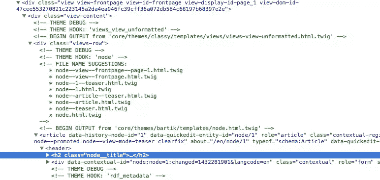

# Drupal 8 主题改进——更新和新特性

> 原文：<https://www.sitepoint.com/drupal-8-theming-revamped-updates-and-new-features/>

如果你是一个 Drupal 开发人员，曾经涉足过 Drupal 老版本的主题化(5，6，7)，你就会理解为什么挫折是任何 Drupal 主题化的可靠伙伴。不过幸运的是，Drupal 8 承诺了如此多的改进，以至于愤怒的主题者也乐于做出改变。我们理所当然地开始研究这些改进是什么。


在本文中，我们将研究 Drupal 8 中主题化的一些更重要的变化。虽然我们将保持事情简单，从基础开始，但我确实假设您至少有一点 Drupal 7 中主题化的经验。因为主题化是一个很大的主题，而这只是一个介绍，你会找到各种各样的链接来获得更多可以帮助你的信息。

## 启动

与定制模块一样，新的主题总是以一个文件夹和里面的必需的 [.info.yml](https://www.drupal.org/node/2349827) 文件开始(与旧的`.info`文件相反)。这些放在 Drupal 代码库的根`themes`文件夹中(相对于旧的`sites/all/themes`目录)，它们应该有相同的名字(例如`my_theme`文件夹中的`my_theme.info.yml`)。

在`.info.yml`文件中，我们提供了几个必需的键:

```
name:  Theme name
description:  Theme description
type: theme
core:  8.x
```

其余的都是可选的，需要的时候再来。有了这个，你已经可以导航到`admin/appearance`并启用新主题或将其设置为默认。你会注意到，从老好人巴提克那里，你现在有了一个真正赤裸的主题。但是与 Drupal 7 最大的不同是你可以**轻松**开始主题化你网站的每一个方面。

一个主要的改进是我们现在有了一个名为**classic**的中间核心主题，它在 Drupal 后端(通常是`system`模块)输出的数据和实际主题之间架起了一座桥梁。所以所有其他可用的核心主题所做的(你也可以做的)是使用**经典**作为它们的基本主题，并覆盖它的模板:

```
base theme: classy
```

或者，你也可以不这样做，而是将它的所有模板文件复制到你的主题中，你将在同一个地方结束。但是你可能不需要所有这些文件(有些可能不需要修改),所以在我看来，最好使用 **Classy** 作为基本主题，只需覆盖你所需要的。

虽然我不赘述，[区域定义](https://www.drupal.org/node/2469113)也是一个主题的`info.yml`文件中相当重要的一个方面:

```
regions: header:  'Header' content:  'Content' footer:  'Footer'
```

这样，在你的`page.html.twig`模板文件中，你可以像这样打印这些区域:

```
{{ page.header }}
```

如果您还不熟悉 Twig 模板语法，那么您应该开始熟悉它。

## 嫩枝

到现在为止，我想每个人都知道 [Twig](http://twig.sensiolabs.org/) 是 Drupal 8 中使用的模板语言。我不会深入研究它，因为有很多[资源](http://twig.sensiolabs.org/doc/templates.html)提供了大量关于小树枝语法如何让[主题立刻忘记 PHPTemplate](https://www.drupal.org/node/1918824) 的信息。

但是需要记住的一件重要的事情是，在 Drupal 8 中不再有主题功能。这意味着所有可编辑的输出都通过一个`html.twig`文件运行。我们仍然可以使用 [hook_theme()](https://api.drupal.org/api/drupal/core%21modules%21system%21theme.api.php/function/hook_theme/8) 来定义可重用的主题实现，但是它们现在都将使用 Twig 文件。最酷的是这些树枝模板是可扩展的。这意味着它们可以只定义与它们相关的必要位，并从它们的父代继承其余的位。查看 [Twig extends](http://twig.sensiolabs.org/doc/tags/extends.html) 文档，了解更多关于我的意思的信息。

## 模板

我之前提到过，在 Drupal 8 中，我们可以完全控制我们网站的标记，因为所有的东西都整齐地组织在**经典**主题的模板文件中。因此，构建主题的下一步是覆盖`html.html.twig`和/或`page.html.twig`文件，为页面提供标记。这样做，你就可以使用语义 [HTML5 标记](https://www.drupal.org/community-initiatives/drupal-core/html5)，因为这是 Drupal 8 默认输出的内容。

所有这些模板文件的顶部都有关于可用变量的文档。此外，您可以利用各种分支[过滤器](https://www.drupal.org/node/2357633)和[函数](https://www.drupal.org/node/2486991)直接从模板文件中操作这些数据。[事实上，我们推荐](https://www.drupal.org/node/1920746#utility)，例如，直接在那里而不是在预处理器中构建可翻译的字符串或 URL，以避免不必要的函数调用(如果这些没有被打印出来的话)。

说到预处理函数，它们仍然存在。然而，不再有一个`template.php`文件来存放它们，而是在根主题文件夹中有一个`.theme` PHP 文件(`my_theme.theme`)。

关于预处理程序的一个有趣的注意事项是，在 Drupal 8 中，我们必须总是为模板文件变量准备渲染数组，而不是像在 Drupal 7 中那样为最终标记准备数组。当然，这只是在数据需要呈现，而不仅仅是一个简单的字符串或类似的原语的情况下。重点是不再在我们的预处理器函数中调用`drupal_render()`,而是让 Twig magic 为我们处理它。

## 排除故障

对主题信息的调试也做了很多改进。通过打开`sites/defaults/services.yml`文件中的 Twig 调试(`debug: true`)，您可以在页面源代码中得到一堆有用的 HTML 注释。



这些允许您查看哪个模板文件负责一个特定的标记，它位于哪里，以及您可以使用什么主题建议来覆盖它。不用再花时间去想该覆盖什么。这是一个伟大的胜利！

此外，Twig 附带了 [dump()](https://www.drupal.org/node/1906780) 函数，该函数允许您从 Twig 中将特定变量打印到页面。然而，如果这还不够，那么 [Devel](https://www.drupal.org/project/devel) 模块附带了`kint()`函数，它提供了一个更好的(可遍历的)变量检查工具。这是新的克鲁莫。

## 资产和库

这里我们要讨论的最后一件事是资产的话题(CSS 和 JavaScript 文件)。一个显著的变化是，Drupal 8 附带了 jQuery 2.x 以及其他现代前端库，如 Modernizr、Backbone.js 和 understand . js。再加上这意味着不再支持 IE8 及更低版本！

此外，Drupal 8 [已经采用了基于 SMACSS 的](https://www.drupal.org/node/1887922) CSS 文件组织，我们也有一些【好的架构和最佳实践】(【https://www.drupal.org/node/1887918#best-practices】)在适当的位置。我们的主题中不再有混乱的 CSS 的借口！

一开始，人们会犯的一个错误是，出于性能原因，资产不再被不加选择地添加到每个页面。因此，如果您正在尝试的 Ajax 功能不起作用，请确保 Drupal 已经为它加载了必要的脚本。你可以通过[声明它们依赖于你自己的](http://www.webomelette.com/drupal-8-core-javascript-files-anonymous-users)来实现。

最棒的是，我们现在有了一个[统一的方式在整个开发范围内完成所有这些](https://www.drupal.org/theme-guide/8/assets)。我们使用包含 javascript 和 css 文件的*库*，这些文件可以依赖于其他资产*并获取`#attached`来呈现数组。如果你想把它们加载到所有的页面上，你也可以把它们添加到你的主题的`info.yml`文件中，或者实现 [hook_page_attachments()](https://api.drupal.org/api/drupal/core!lib!Drupal!Core!Render!theme.api.php/function/hook_page_attachments/8) 来添加它们。但是，建议始终将库附加到渲染数组，以确保您的资源不会被加载，除非真正需要它们，并且它们与它们所服务的数据一起被正确缓存。*

## 结论

在本文中，我们已经看到了 Drupal 8 中主题化的一些显著变化。我们已经通过查看我们创建新主题的起点，并通过与此过程相关的一些主要主题，做到了这一点。然而，这绝不是所有变化的完整概括。我建议及时了解关于 Drupal.org 的文档(这些文档也在不断更新),并自己动手编写代码。应该很好玩吧！

## 分享这篇文章