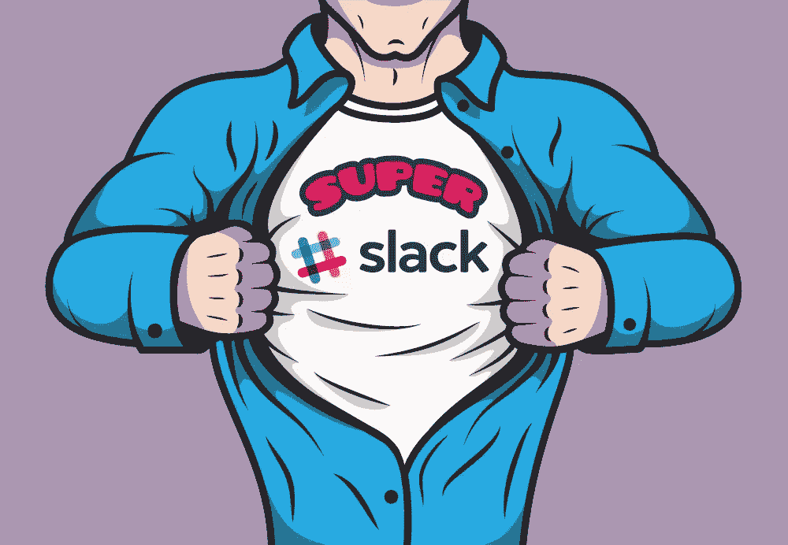

# 如何在业务中使用 Slack 个用例

> 原文：<https://www.sitepoint.com/slack-use-cases/>

Airbnb。Vox 媒体。Spotify。条纹。Eventbrite。

这份可能是一些硅谷宠儿的名单——但它不是。使用群聊平台 [Slack](http://www.slack.com/) 的公司名单很不完整。

截至 6 月，每天有超过 100 万用户登录 Slack，这使其成为迄今为止 T2 增长最快的商业应用。

当然，随着使用 Slack 的公司的数量和多样性，并不是所有的社区都是平等的。看看这六种公司使用 Slack 来增强、现代化甚至改造他们的业务的创新方法。

## 1.[脆皮山](http://crispymtn.com/)

Crispy Mountain 是一家总部位于德国的开发公司，于 2014 年从竞争对手 HipChat 转投 Slack。

脆皮山的合伙人克里斯蒂安·怀尔[解释道【Slack 迅速成为布拉克山的心跳。](https://www.crispymtn.com/stories/how-we-use-slack-to-make-our-clients-part-of-the-team)

“我们将 GitHub、Circle CI 和 Heroku 消息发布到我们的项目频道，并通过 IFTTT 将工作机会发布到机会频道。我们的销售团队会转发客户的重要电子邮件，因此整个团队都在全力以赴。”

该机构甚至使用 Slack 集成来接收客户需要支持时的通知，并控制他们的办公室播放列表。

但可以说，布拉克山使用 Slack 最出人意料的方式是什么呢？对客户更加透明。

该公司向客户开放了项目频道，邀请他们查看团队为他们的产品所写的一切:bug、进度、问题等等。

Weyer 说，即使客户并不总是理解技术语言，他们也能看到他们的项目发生了一些事情。透明度也能带来更大的信任。总体而言，客户的电子邮件数量大幅下降，满意度大幅上升。

## 2.[数字海洋](https://www.digitalocean.com/)

这家云基础设施公司([估值 6.8 亿美元](http://www.bloomberg.com/news/articles/2015-07-08/amazon-web-services-competitor-digitalocean-raises-83-million))<3 Slack，据其产品设计负责人乔尔·卡里法(Joel Califa)称。Slack 帮助 DigitalOcean 的团队更有效地团结和工作。

第一个结果在古怪的空闲频道中很明显 [Califa 和他的同事已经开始](https://www.designernews.co/stories/38905-ask-dn-how-do-you-use-slack)。

有一个#无缝频道，帮助每个人组织他们的午餐和晚餐订单，一个#乒乓频道，帮助团队跟踪他们的乒乓功率排名算法，以及(我们不骗你)一个#catpix 频道。

然而，在数字海洋并不全是乐趣和游戏。该公司几乎所有的内部沟通都依赖 Slack——Califa 报告称，他几乎再也收不到电子邮件了。

GitHub 集成让每个人都知道已经提交和合并了什么代码(翻译:开发团队在做什么)，而 Twitter 集成在任何时候提到@DigitalOcean 时都通知团队(这样他们就可以与他们的社区保持联系)，而 Dribble 集成给了产品设计师源源不断的灵感。

## 3.[创始人](https://efounders.co/)

eFounders 是一家初创工作室，这意味着它有一个核心团队与一系列早期公司合作。

为了简化沟通和协作，eFounders 为其网络中的每个初创企业创建了三个核心渠道。

第一个频道用于日常任务、更新和对话；第二个是 tech 的产品讨论；第三个是公共空间，初创企业的任何人都可以接触到电子创始人，反之亦然。

每个初创企业的部门都有临时项目和永久项目的特设渠道。

但是 eFounders 使用 Slack 最酷的方式是管理它的内部识别系统。

“由于我们的大部分网络遍布世界各地，我们建立了一种虚拟货币，用我们自己的钱来代替‘谢谢’:Briqs，”创意合伙人 Didier Forest 解释道。

使用 Slack 命令“/give”使 eFounder 社区成员能够互相奖励 briqss，然后这些 briq 可用于在 eFounder 商店购物。

## 4.[松弛](http://www.slack.com/)

当然，Slack 用 Slack。(这就是[吃自己狗粮](http://www.forbes.com/sites/michaeldefranco/2014/03/04/not-eating-your-own-dog-food-you-probably-should-be-2/)的好例子。)

根据 Slack 创始人斯图尔特·巴特菲尔德的说法，他和他的员工“每天都在使用这个平台”

他们发现，为了最大限度地提高工作效率和透明度，谈话应该尽可能在最公开的场合进行。例如，如果让你选择在给团队成员的直接信息中、在私人渠道或在公司范围的渠道中问问题，大多数懒散的员工会默认最后一个选项。

“有时候在最大的公共论坛上问一个问题并得到答案是很有价值的，”斯图尔特告诉《快速公司》的记者。

这不仅给了每个人提供帮助的机会，而且由于 Slack 将每个对话存档，将来遇到同样问题的人可以很容易地找到答案。

为了防止对话变得难以控制，该公司开辟了新的渠道来进行真正受欢迎的讨论。福利成了 Onboarding 频道的热门话题，所以它最终获得了自己的反馈。

## 5. [OneSpaceMedia](http://www.onespacemedia.com/)

像这个名单上的许多公司一样， [OneSpaceMedia 充分利用了 Slack 的集成选项](http://www.onespacemedia.com/news/2015/may/14/how-we-use-slack-onespacemedia/),并将其开发人员的几乎所有活动与该计划捆绑在一起。

然而，这家数字创意机构也在用 Slack 做一些我们以前从未见过的事情。首先，由于 Slack 允许您预览文件或页面，而无需实际打开它，OneSpaceMedia 的设计师团队使用该平台来审查和迭代设计，而无需离开他们的计算机。

该公司还减少了许多不必要的电子邮件链。它建立了一个#办公频道，员工可以在这里申请办公用品；一个#出勤频道，如果他们不在办公桌前，人们可以在这里发帖；还有一个#社交频道，人们可以在这里提交行业新闻、酷文章和其他“网络最佳”链接。

最后，OneSpaceMedia 有一些很棒的[自定义命令](https://sscaas.eu/)，包括查找单词定义、链接到子编辑、甚至在 SoundCloud 上查找音轨的命令。

## 6.[石英](http://qz.com/)

作为大西洋媒体的全球商业品牌，Quartz 开发出一种独特的方式来为其新闻编辑室提供闲置工作，我们对此并不感到惊讶。

由于一般的故事都有一个相当结构化的工作流程(概念、草稿、编辑、出版)， [Quart 为流程的每一步都设置了渠道](http://www.niemanlab.org/2015/07/how-7-news-organizations-are-using-slack-to-work-better-and-differently/)。

这样，每个人都很容易看到一篇文章的状态。这也确保了不止一个人不会试图做同样的任务——这是媒体中的一个常见问题。

为了进一步简化工作，Quart 依赖于——等等——表情符号。

执行编辑扎克·苏厄德告诉内曼实验室“当编辑声称一个故事时，他们会使用特定的表情符号反应——拳头，以显示他们正在‘抓住’编辑。”很快就发现这真的很有用……表情符号反应有助于给工作流程添加一些结构。"

这六个 Slack 用例证明了其有用性的唯一限制是你的公司有多有创造力。借用一些这样的想法——然后发展你自己的想法！

## 分享这篇文章