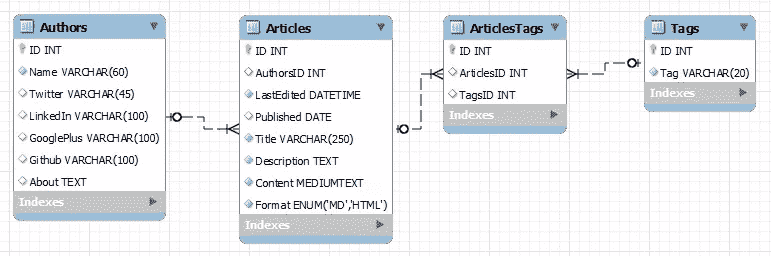
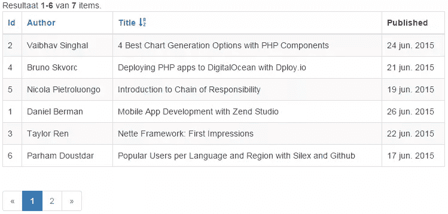

# 用 GridView 和 ListView 在 Yii 2 中呈现数据

> 原文：<https://www.sitepoint.com/rendering-data-in-yii-2-with-gridview-and-listview/>

在我之前关于 Yii 2.0 的文章中，我介绍了 [ActiveRecord](https://www.sitepoint.com/yii-2-0-activerecord-explained/) 的实现。一旦你的数据库中有了一些数据，你就会希望能够显示出来。Yii 使用 DataProviders 与数据源交互，并提供一些小部件来输出数据。其中，ListView 和 GridView 提供了最多的功能。


## 这个例子

我将再次使用我在上一篇文章中介绍的数据库示例。不是很原创，但作为例子还是挺有用的；像 SitePoint 这样的博客。



这个数据库设计及其 Yii 模型的一个小总结，我将在这个例子中使用:

*   `Authors`模型有一个关系方法调用`getArticles()`，它为模型提供了一个`Articles[]`属性。
*   `Articles`模型有一个提供`Author`的关系方法调用`getAuthor()`和一个提供`Tags[]`的方法`getTags()`。
*   `Tags`模型有一个提供`Articles[]`的关系方法调用`getArticles`。

我不会使用 ArticlesTags 表，因为它只用于 N:M 关系。当然，有一个模型可用于其他模型的关系定义中。

## 数据提供者

有三种不同的类型:

*   `ActiveDataProvider`是通过一个 ActiveQuery 实例提供的，通常包含一组模型。您通常将使用它来保存和呈现数据，这些数据可以通过正常的 ActiveRecord 实例及其关系来构建。
*   `ArrayDataProvider`是使用一组数据构建的。这在基于多个模型和/或自定义聚合构建各种报告时非常有用。
*   对于我们当中的 SQL 高手来说，`SqlDataProvider`是非常有用的一个。这是获取这些复杂查询数据的一种简单方法。

除了在观点上略有不同，他们没有太大的分歧。数据提供程序本身是一个基本组件，它保存数据并处理分页和排序。

### ActiveDataProvider

我已经解释过这是用一个 ActiveQuery 对象填充的。任何`model::find()`都将返回一个 ActiveQuery 对象，所以创建一个非常简单。

```
/* A dataprovider with all articles */
$dataProvider = new ActiveDataProvider([
    'query' => Articles::find()->with('tags'),
]);

/* Get all the articles for one author by using the author relation define in Articles */
$dataProvider = new ActiveDataProvider([
    'query' => Articles::find()->with('author')->where(['Name'=>'Arno Slatius']),
]);

/* Be careful with this! */
$dataProvider = new ActiveDataProvider([
    'query' => Articles::find()->with('author')->where(['Name'=>'Arno Slatius'])->orderBy('Published'),
]);
```

最后一个例子需要小心，您将限制 DataProvider 的能力，因为它可以自己进行排序。请记住这一点，稍后我将解决这个问题。

### SqlDataProvider

这个将基于 SQL 语句收集您的数据。我的例子并没有证明使用 SQL 是正确的，但是我还是要展示一些东西，并加入一些聚合；

```
$dataProvider = new SqlDataProvider([
    'sql' => 'SELECT Name, Title, COUNT(ArticleTags.ID) AS TagCount ' . 
             'FROM Authors ' .
             'INNER JOIN Articles ON (Authors.ID = Articles.AuthorID) ' .
             'INNER JOIN ArticleTags ON (Articles.ID = ArticleTags.ID) ' .
             'WHERE Name=:author' .
             'GROUP BY ArticleID',
    'params' => [':author' => 'Arno Slatius'],
]);
```

使用 SQL 查询作为数据提供者的输入有很好的理由。ActiveRecord 是处理数据库的一种非常好的方式，但是您可能会发现为大型数据库定义标准变得有些复杂。如果您擅长编写 SQL，并且需要大量的连接、联合和/或聚合，您可能会发现首先构建一个 SQL 查询并简单地将其用作 DataProvider 的输入会更容易。

### ArrayDataProvider

这可能是最有用的组成部分。通常放在表中需要更多工作才能完成的任何内容都非常适合数组数据提供者。文档使用了一个非常简单的例子，在一个数组中插入几个模型，如下所示:

```
$dataProvider = new ArrayDataProvider([
    'allModels' => Authors::find()->all(),
]);
```

这将向提供者填充所有的作者。确实非常简单，但是让我们把它变得更加实际，做一些这个组件非常有用的事情；我想输出所有作者的列表，包括他们的文章数量和最后出版日期。我将通过扩展 ArrayDataProvider 并创建自己的来实现这一点。我使用几乎所有组件都有的`init()`函数。当创建并使用类(在本例中)准备提供程序中的数据时，将调用该函数。

```
namespace app\data;

use \app\models\Authors;
use \app\models\Articles;

class AuthorsReportProvider extends \yii\data\ArrayDataProvider
{
	/**
     * Initialize the dataprovider by filling allModels
     */
    public function init()
    {
        //Get all all authors with their articles
	    $query = Authors::find()->with('articles');
		foreach($query->all() as $author) {

			//Get the last published date if there are articles for the author
			if (count($author->articles)) {
				$lastPublished = $query->max('Published');
			} else {
				$lastPublished = null;
			}

			//Add rows with the Author, # of articles and last publishing date
			$this->allModels[] = [
				'name' => $authors->Name,
				'articles' => count($author->articles),
				'last' => $lastPublished,
			];
		}
	}
}
```

您可以看到，包含要显示的表的所有行的变量`$this->allModels`，填充了我们需要的数据。

## 可视化数据

我们已经有了一个数据提供者，但现在我们想呈现其中的内容，对吗？Yii 提供了两个组件来可视化放入数据提供者的数据。

*   `GridView`将把数据放入一个 HTML 表中。如果配置得当，它会自动添加标题，你可以点击更改排序，分页，以限制一次向用户显示的项目数量，以及显示可用结果总数的摘要。
*   `ListView`允许您指定一个局部视图，通过它您可以以特定的方式呈现数据提供者中的每个模型。一种非常常见的方法是使用它来呈现有序或无序列表中的`<li>`元素的内容。

最好用几个例子来说明。让我们假设以下数据提供者:

```
/* A dataprovider with all articles */
$dataProvider = new ActiveDataProvider([
    'query' => Articles::find()->with('tags','authors'),
]);
```

注意，我通过指定`with()`方法，立即让 ActiveRecord 执行 ArticleTags 和 Tags 表上文章的连接。这被称为“急切加载”，使相关数据立即可用。在没有`with()`的情况下完成时，您仍然可以在视图中使用来自`author`和`tags`关系的可用数据，但是它将在运行时加载，也称为“延迟加载”。如果你知道你要使用相关数据，使用`with()`。急切加载比延迟加载表现好得多。

在视图中，我们将使用 GridView 呈现一个表格。我以递增的复杂度展示了几个专栏，首先是文章的简单列表:

```
<?= GridView::widget([
    'dataProvider' => $dataProvider,
    'columns' => [
        'ID',
        'Author',
        'Title',
        'Published:date',
    ],
]); ?>
```

看起来像这样:



我承认，我定义了一个 6 的页面大小和三个可以排序的列，这有点作弊；稍后会详细介绍。请注意顶部的摘要、列标题中的排序链接和底部的页面。在适用的情况下，所有内容都被格式化为本地化格式(对我来说是荷兰语)。我不需要额外的代码来处理排序或后续页面的链接。链接都是由小部件自动生成的，操作由 DataProvider 处理。该组件使开箱即用变得非常简单。

因为我将文章与其他表格结合在一起，所以我们也可以以非常简单的方式使用这些数据。还可以使用匿名函数自定义数据的格式:

```
<?= GridView::widget([
		'dataProvider' => $dataProvider,
        'columns' => [
	        'Title',
	        'author.Name',
	        [
	            'attribute' => 'author.Twitter',
	            'type' => 'html',
	            'value' => function($model) {
		            return Html::link('@' . $model->author->Twitter, 'https://twitter.com/' . $model->author->Twitter);
	            }
	        ],
	        [
		        'attribute' => 'tags',
		        'value' => function($model) {
			        return implode(', ', ArrayHelper::map($model->tags, 'ID', 'Tag'));
			    }
			],
			'Published:date',
		],
	]); ?>
```

在定义列的输出时，关键是要记住每个列都是从`yii\grid\Column`开始扩展的，所以要经常回头看那个类，看看所有可以使用的属性和函数。例如，`yii\grid\DataColumn`有一个`$footer`属性。将它添加到列的配置数组中以设置页脚文本，并且不要忘记在 GridView 中将`showFooter`设置为 true。

GridView 实际上有很多额外的属性，你可以通过它们来配置它。我再举一个例子:

```
<?= GridView::widget([
		'dataProvider' => $dataProvider,
        'columns' => [
        ...
        ],
        'layout' => '{summary}{items}{pager}',
		'filterPosition' => FILTER_POS_FOOTER,
		'rowOptions' => function ($model, $key, $index, $grid) {
		},
		'emptyText' => '-',
		'showFooter' => true,
    ]); ?>
```

`layout`属性是一个非常有用的属性。它允许您更改基本元素的显示方式。可以多次添加`{summary}, {errors}, {items}, {sorter}, {pager}`；您可能希望在项目列表的上方和下方有一个分页器，对于基本上显示结果总数和当前显示结果数的摘要也是如此。错误是过滤器输出的错误列表(如果有)。
`filterPosition`允许你将滤镜移动到底部，或者身体内部。通常它会包含在表格的标题部分等。

## 自定义排序和分页

默认情况下，GridView 会为您进行排序和分页。它的功能实际上是通过配置`yii\data\BaseDataProvider`提供的，可以通过在类初始化期间提供附加参数来初始化。让我们从简单的分页开始；默认情况下，它被设置为`defaultPageSize`，通常每页给出 20 个结果。通过提供一个`pageSize`来改变它，或者使用它来显示所有内容并关闭分页:

```
/* show 80 items per page */
$dataProvider = new ActiveDataProvider([
    'query' => Articles::find()->with('tags'),
    'pagination' => [
	    'pagesize' => 80,
    ],
]);

/* disable pagination, shows all items at once */
...
    'pagination' => false,
...
    'pagination' => [
	    'pagesize' => -1,    //Alternate method of disabling paging
    ],
...
```

排序有更多的选项，这取决于您提供和显示的数据。首先，您可以自定义排序。您可以为每列提供多个属性作为排序依据。使用 GridView 时，您可能会发现，对于更复杂的属性或使用未命名函数输出的值，默认排序处理有时会失败。在这些情况下，提供排序属性也会有所帮助。

让我们来看一些代码:

```
$dataProvider = new ActiveDataProvider([
    'query' => Articles::find()->with('authors'),
    'sort' => [
	    'defaultOrder' => [
	        'Published' => SORT_DESC,
	        'LastEdited' => SORT_DESC,
	    ],
	    'attributes' => [
		    'name' => [
                'asc' => [
                    'author.Name' => SORT_ASC, 
                    'Published' => SORT_ASC,
                    'Title' => SORT_ASC,
                ],
                'desc' => [
                    'author.Name' => SORT_DESC
                    'Published' => SORT_DESC,
                    'Title' => SORT_DESC,
                ],
            ],
            ... etc ...
	    ],
    ],
]);
```

正如您可能猜到的那样，`defaultOrder`改变了 GridView 的初始排序，如果它被呈现的话。在本例中，将按照“已发布”降序排列，然后按照“上次编辑”降序排列。

`attributes`将包含 GridView 列中所有可排序属性的列表(此处的属性名应该与 GridView 中的属性名相匹配)。您可以独立定义如何对升序和降序结果进行排序——同样，这可以在 DB 中的多个列上完成。

需要注意的一点是，为了使分页工作，DataProvider 需要知道可用结果的总数。默认情况下，`ActiveDataProvider`和`SqlDataProvider`能够使用数据库查询来完成。如果您使用`ArrayDataProvider`，您可能需要做一些额外的工作，这取决于您如何填充提供者。

## 结论

ListView 和 GridView 是非常实用的小部件，可以让你快速显示你想要的数据。如果你想从 GridView 中得到更多，那么一定要看看 Kartik Visweswaran 制作的“ [GridView on steroids](https://demos.krajee.com/grid-demo) ”。这为您的网格添加了许多额外的功能，允许用户完全定制数据的显示方式。请务必查看 Kartik 的所有其他组件！

你希望看到更多关于 Yii 2.0 的话题吗？欢迎建议！

## 分享这篇文章