# 面向前端开发人员的 20 多份文档和指南(第 5 位)

> 原文：<https://www.sitepoint.com/20-docs-guides-front-end-developers-5/>

又到了选择我们想要复习的工具或技术的时候了。如果你觉得你一直在努力建设，但可能没有学到你想要的那么多，我会帮你的。

请享受我们的文档和指南系列的第五部分，不要忘记让我们知道我们还没有包括在这个或以前的帖子中的任何其他内容。

## [1。SitePoint Sass 参考](https://www.sitepoint.com/sass-reference/)

SitePoint 自己的项目，一个基于 Sass 的参考网站，由我们的常驻专家 Hugo Giraudel 和 SitePoint 的 Sass 编辑器 Stu Robson 构建。

[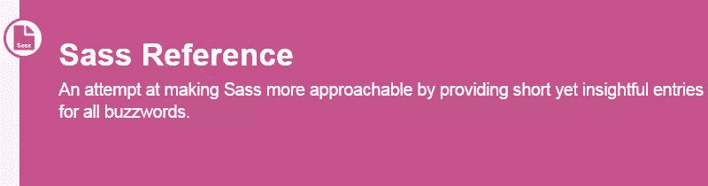](https://www.sitepoint.com/sass-reference/)

## [2。SVG 视图框和 preserveAspectRatio 交互演示](http://sarasoueidan.com/demos/interactive-svg-coordinate-system/)

这是一个交互式页面，与 Sara Soueidan 的相关文章系列一起提供。这个演示有助于读者理解与 SVG 元素上使用的`viewBox`和`preserveAspectRatio`属性相关的一些概念。值得注意的是，演示页面有一个相关的备忘单。

[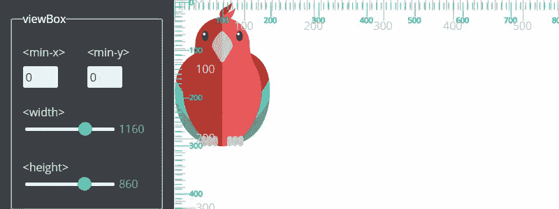](http://sarasoueidan.com/demos/interactive-svg-coordinate-system/)

## [3。CSS 2.1 索引列表](https://www.w3.org/TR/CSS2/indexlist.html)

这是我最近偶然看到的一个 W3C 文档。这是一个庞大的列表，包含了几乎所有的 CSS 术语，以及每个术语或特性的链接。在某些情况下，链接指向规范中某处的简单定义，在其他情况下，链接指向规范中该特性的位置。

[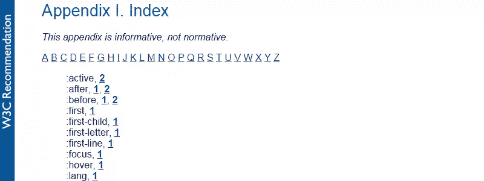](https://www.w3.org/TR/CSS2/indexlist.html)

## [4。Github 上流行的编码惯例](http://sideeffect.kr/popularconvention/)

从不同的语言中选择，包括 JavaScript、Ruby 和 PHP，然后这个页面将向您显示基于图表的数据，以表明某些编码模式在 GitHub 托管的项目中有多普遍。

## [5。地下城与开发者](http://www.dungeonsanddevelopers.com/)

这不是一个交互式游戏，而是一个类似 RPG 的网页开发技能的天赋树表示，带有各个地方的链接，可以学习列出的不同技能。

[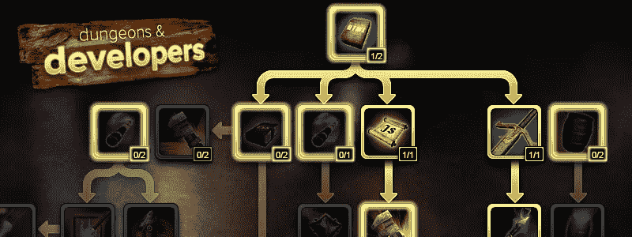](http://www.dungeonsanddevelopers.com/)

## [6。JSON API](http://jsonapi.org/)

“如果你曾经和你的团队争论过你的 JSON 响应应该如何格式化，JSON API 就是你的反 bikeshedding 武器。通过遵循共享的约定，您可以提高生产率，利用通用工具，并专注于重要的事情:您的应用程序。”

[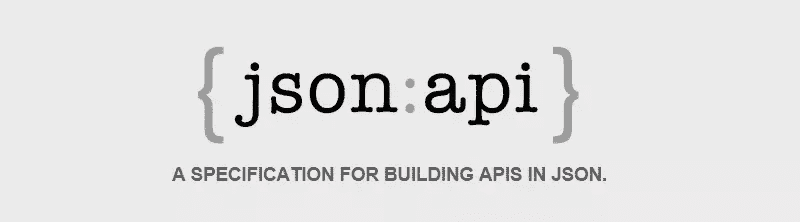](http://jsonapi.org/)

## [7。jQuery UI 事件清单](http://bitsofco.de/2015/jquery-ui-events/)

指定哪些 jQuery 事件适用于桌面与移动以及鼠标与键盘的图表。

[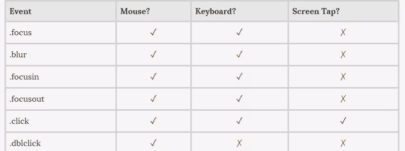](http://bitsofco.de/2015/jquery-ui-events/)

## [8。Weightof.it](http://weightof.it/)

一个快速参考应用程序，可以通过权重查看和比较 JavaScript 库，并可以选择查看大小是否压缩。该应用程序还允许您将不同的库添加到“堆栈”(就像添加到购物车一样)，以便您可以查看您的总库重量。

[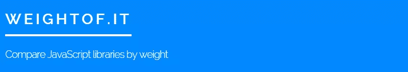](http://weightof.it/)

## [9。一张图中的 JavaScript](https://github.com/coodict/javascript-in-one-pic)

这是 JavaScript 所有原生特性的非常好的可视化。不完全是学习语言的最实际的方法，但是通过浏览，你可能会发现一些有趣的东西来做进一步的研究。

[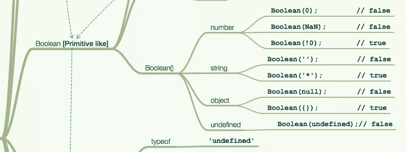](https://github.com/coodict/javascript-in-one-pic)

## 10。了解 NPM

“自创建以来，npm 的角色已经扩展到满足 JavaScript 和 Node.js 开发人员社区的更广泛需求，包括前端 web 应用程序、移动应用程序和其他 JavaScript 开发工具和框架的管理[…]这种可视化旨在帮助您了解 npm 的角色和范围。”

[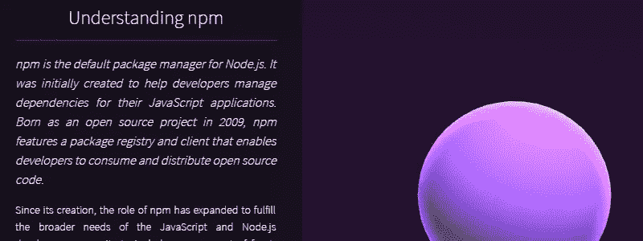](https://unpm.nodesource.com/)

## [11。网络上的 SVG](https://svgontheweb.com/)

Jake Giltsoff 对 SVG 的概述，让您快速了解如何在网站上使用 SVG，并提供一些提示和技巧来帮助您。

[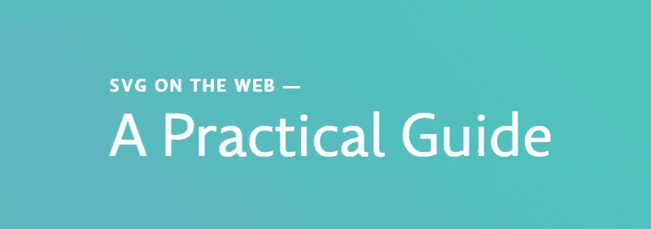](https://svgontheweb.com/)

## [12。格林斯托克备忘单](https://ihatetomatoes.net/greensock-cheat-sheet/)

PDF 格式的快速参考使用 GreenSock 强大的 JavaScript 动画库。

[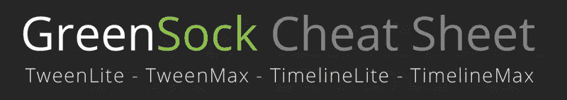](https://ihatetomatoes.net/greensock-cheat-sheet/)

## 13。JavaScript 图形库比较

比较 JavaScript 图形/图表库的简单方法。只需将鼠标悬停在一个图块上，您将获得有关支持的图表类型、价格和依赖关系的信息。您还可以选择按类别(图表类型、价格、选项和相关性)过滤库。

[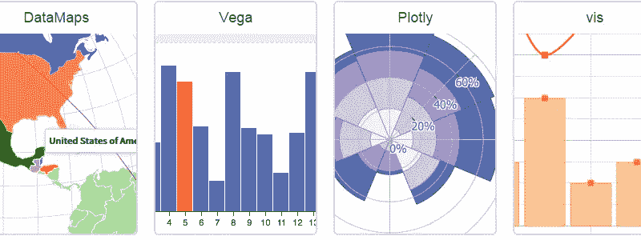](http://www.jsgraphs.com/)

## [14。可访问性备忘单](http://bitsofco.de/2015/the-accessibility-cheatsheet/)

来自 Ire Aderinokun，这是网络内容可访问性指南(WCAG)的压缩版，由一些实际例子支持。

## 15。AngularJS 风格指南

“本风格指南的目标是为一个 AngularJS 应用程序提供一套最佳实践和风格指南。”

[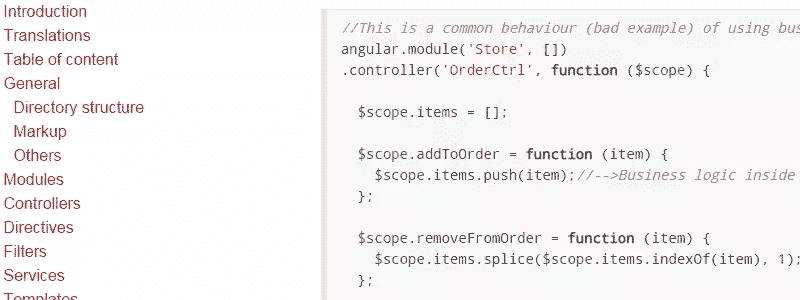](https://mgechev.github.io/angularjs-style-guide/)

## 16。默认浏览器焦点轮廓样式

这是一个使用截屏显示不同浏览器在不同情况下如何处理各种表单元素上的焦点样式的表格。

[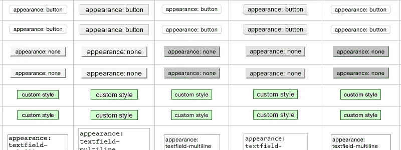](http://medialize.github.io/ally.js/tests/focus-outline-styles/index.html)

## 17.Flexbox 在 5 分钟内

新 flexbox 规范的所有主要特性的交互式浏览。包括演示，并允许您使用页面上的功能。

## 18。Sass 函数备忘单

一个可搜索的 Sass 函数列表(颜色、不透明度、数字、字符串等)。)作为方便的参考。您可以下载两页彩色或黑白 PDF 或 LaTeX 文档。

[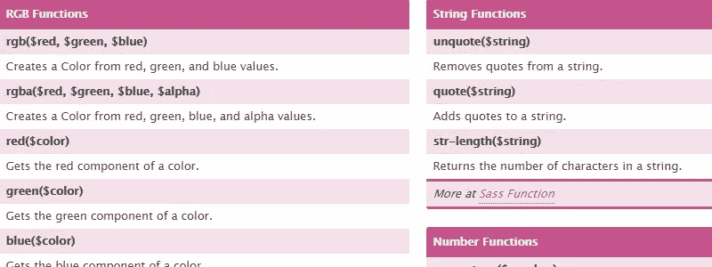](http://www.cheatography.com/hamidyfine/cheat-sheets/sass-functions/)

## [19。网页类型的状态](http://stateofwebtype.com/)

"关于支持网络上的类型和印刷特征的最新数据."

[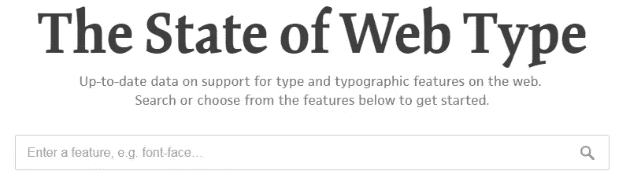](http://stateofwebtype.com/)

## 20。ES6 卡塔斯

“一个简单的网站，列出了通过实践学习 ECMAScript 6 的各种 katas(小任务)。每个 kata 链接到 tddbin，并在那里加载相应的源代码。你所要做的就是修复失败的测试。通过这样做，你应该一次一个小任务和功能地使用和学习 ES6。”

[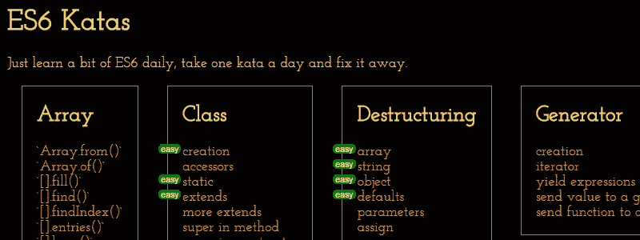](http://es6katas.org/)

## 荣誉奖……

*   [如何用 Git 撤销(几乎)任何事情](https://github.com/blog/2019-how-to-undo-almost-anything-with-git)
*   [命令行的艺术](https://github.com/jlevy/the-art-of-command-line)
*   [SVG 诡异](https://github.com/emilbjorklund/svg-weirdness)
*   [Web 组件的黄金标准清单](https://github.com/webcomponents/gold-standard/wiki)
*   Git 好吃的食谱
*   [Unix 简介](http://www.oliverelliott.org/article/computing/tut_unix/)
*   [JSON.is](http://json.is/)
*   [CSS:好的部分](https://github.com/bevacqua/css)

## 还有吗？

以下是本系列之前的帖子:

*   [20 份前端开发者文档和指南(第一期)](https://www.sitepoint.com/20-docs-guides-front-end-developers/)
*   [20 份前端开发者文档和指南(第二期)](https://www.sitepoint.com/20-more-docs-guides-front-end-developers/)
*   [20 份前端开发者文档和指南(第三期)](https://www.sitepoint.com/another-20-docs-guides-front-end-developers/)
*   [20 份前端开发者文档和指南(第 4 期)](https://www.sitepoint.com/20-docs-guides-front-end-developers-4/)

如果你已经为前端开发人员建立或知道另一个学习资源，请在评论中提出来，我会在以后的帖子中考虑它。

## 分享这篇文章