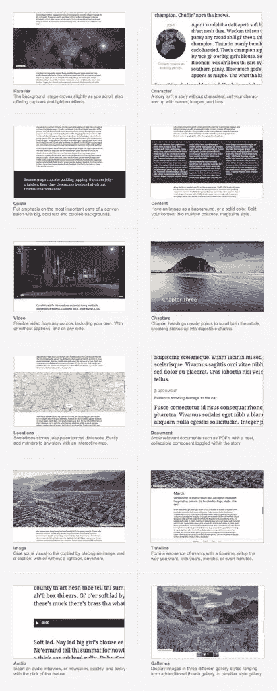
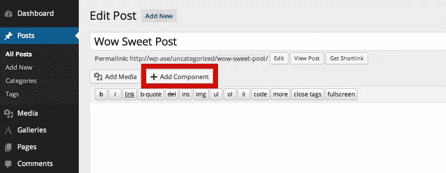
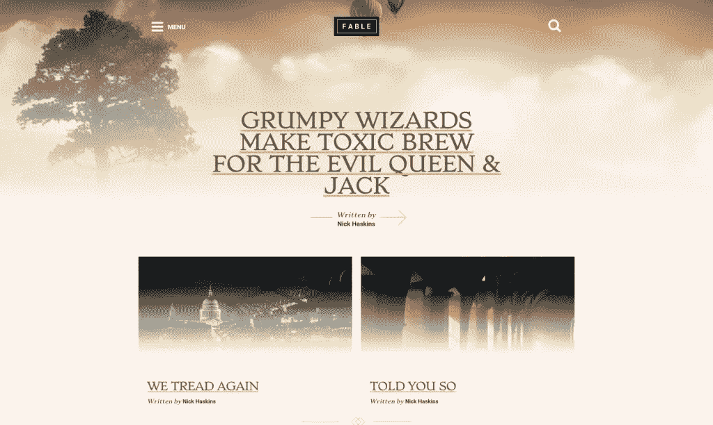
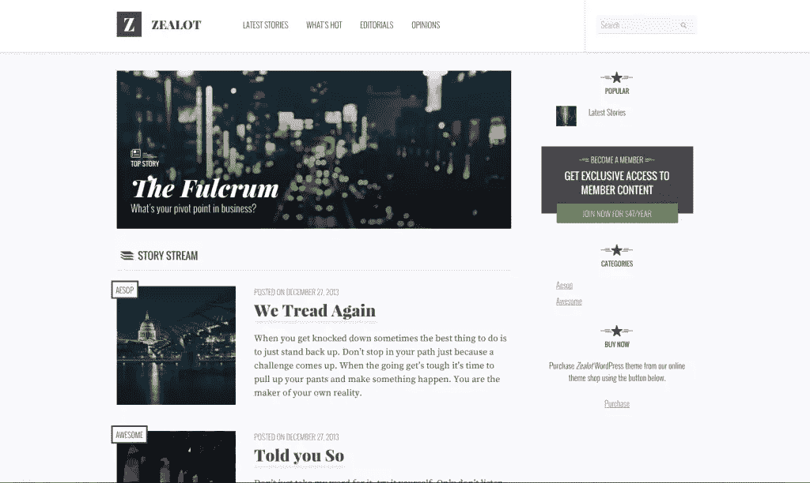

# 伊索故事引擎:写故事而不是代码

> 原文：<https://www.sitepoint.com/aesop-story-engine/>

我第一个承认。我内心绝对是一个文案，一个讲故事的人，一个内容营销的人。这是我的激情所在。我进入 WordPress、web 开发和 HTML 的世界已经很晚了。比起`h1`和`h2`的世界，我在代词和形容词的世界里还是舒服得多。也许这就是我如此热爱 WordPress 的原因；它让不到一个技术专家(比如我自己)不仅能建立网站，还能管理网站。它让每个人都更容易接触到网络。

所以，当我偶然发现[伊索故事引擎](http://aesopstoryengine.com/)时，可以说我的兴趣被激起了。似乎伊索故事引擎的标语是为我而写的:写故事而不是代码。

毕竟，最关键的是，我用 WordPress 来讲故事。这里有一个插件承诺把我变成一个现代寓言家，一个让我专注于写散文而不是 HTML 的插件。这当然好得令人难以置信。

## 什么是伊索故事引擎？

伊索故事引擎是一个免费的 WordPress 插件。它由 13 个不同的组件和工具组成，所有这些组件和工具都是为了让 web 开发者(和作者)能够构建专门用于长篇故事的 WordPress 主题。

那么，这十三个成分到底是什么呢？让我看看，有:

*   **音频**:通过它你可以显示一个音频播放器，完全支持 MP3。
*   **视频**:对所有类型的视频文件格式使用这个，包括 YouTube、Vimeo、Kickstarter 和 Blip.TV。
*   **章节**:所以你可以把你的长篇内容分解成，你猜对了，章节，以简单的滚动点为特色。把老派平装本功能数字化。
*   **内容**:使用这个组件来格式化你的内容——把它分成多列，改变背景颜色，甚至插入背景图片。
*   人物:你可以通过显示每个人物的头像、头衔，甚至是简短的传记来让你的人物栩栩如生。
*   **报价**:满足您所有的拉式报价需求。您可以根据个人喜好定制字体、颜色和背景。
*   就像主题一样，这是一个全幅组件，当你向下滚动你的站点时，它会显示一个移动的灯箱和标题。
*   **图像**:格式化你的图像，直到你满意为止。改变它们的大小或位置。对齐或居中标题。插入灯箱。
*   **图库**:如果图片组件没有提供足够的功能，也许可以选择使用图库。创建网格，堆叠或缩略图画廊，完成标题。
*   地点:如果你正在开发新的《权力的游戏》,那么一个显示自定义信息的交互式地图可能是个不错的选择。(一旦你确定了地理位置，《权力的游戏》不是更简单了吗？！)
*   时间线:使用伊索，你可以将你的长篇内容分成按时间顺序排列的部分，让读者只需点击一下就可以滚动到你故事中的某个特定点。
*   **文档**:以防万一，你想包括一个 PDF 或其他文件。
*   Collections:Collections 组件有点像标签，它允许你将同一类别的故事组合在一起，显示在你网站的任何页面上。

当我和尼克·哈斯金斯联系时，他是伊索背后的人，据他说，

> (伊索必须提供的)主要好处是让你的客户能够以真正互动的方式表达他们的故事，而你自己根本不用写任何代码。这些组件可以在可视界面中完全编辑，而不必直接编辑 WordPress shortcode。另一个主要的好处是，我们有相当多的插件贡献者，在这个时候，它真的稳定下来，成为用 WordPress 创作故事的事实上的标准，

> 当与我们的 WordPress 前端编辑器 Lasso 结合使用时，[伊索故事引擎]允许完全的拖放功能，以及所有组件中的实时编辑。这真的很令人兴奋，因为它允许用户以创造性的方式真正表达他们的想法，而不受后端界面的限制，因为一切都是实时发生的，就在帖子中

## 伊索故事引擎如何工作

伊索插件加载两个独立的文件到你的 WordPress 安装中:

*   一个 CSS 文件，控制所有最基本的样式
*   运行上述所有 13 个组件的 JS 文件

一旦你安装了伊索插件，将这两个轻量级文件添加到你的 WordPress 配置中，一个新的按钮将会出现在 WordPress 文章编辑器中:“添加组件”。

点击此按钮将强制打开一个新的弹出窗口，您可以在其中插入您需要的任何组件。

该视频更详细地解释了伊索故事引擎的工作原理:

[https://www.youtube.com/embed/84BFGxkHby0?feature=oembed](https://www.youtube.com/embed/84BFGxkHby0?feature=oembed)

## 伊索和 WordPress 主题开发

伊索故事引擎允许用户插入以 HTML 标记形式显示的组件。其中一些组件应用了基本的 CSS，所以它们在大多数 WordPress 主题中都是可显示的。然而，大多数组件都被设计成完全没有标记。这样做是为了让开发人员能够自由构建，而不是与覆盖 CSS 进行斗争。

伊索背后的团队已经很容易地将所有 CSS 全部移除，并完全覆盖组件。你所需要做的就是将整个函数粘贴到你的孩子主题 functions.php 中。伊索还有 60 多个内置过滤器和动作，这意味着很难找到任何不可能的功能。

也就是说，是主题决定了伊索寓言组件的外观。伊索只是负责组件如何工作。可以这样想:伊索给你所有的砖；该由你来决定如何建造这座房子。

虽然这种设置为 WordPress 主题开发者提供了极大的自由，但这也意味着要充分利用伊索，你必须知道如何使用 WordPress，以及如何构建一个 WordPress 主题。

不过不要绝望(作为一个非技术主管，当我发现这一点时，我也很沮丧！)，伊索有大量的主题供你选择，如果你既没有时间，也没有必要的资金来建立自己的主题。

## 伊索主题

理论上，伊索故事引擎可以用于任何 WordPress 主题。只有一个问题:你选择和伊索一起使用的主题将决定上面每个组件的实际显示和功能。当与专门为其组件设计和开发的主题结合使用时，伊索看起来和工作起来都是最好的。进入伊索主题。

目前有七个不同的主题可以和伊索故事引擎一起使用。每个主题标价 120 美元，是市场上最贵的主题(幸运的是伊索插件本身是免费的！).不仅如此，伊索主题是所有 WordPress 主题中选项最少的。但是，不要因此而放弃:有了伊索提供的所有组件，功能应该不是问题。

*伊索故事引擎寓言主题*

这些主题包括:

*   寓言:所有伊索主题中最新的一个，寓言主页会自动将你的最后一篇文章设置成一个超级巨大的图片，后面是一个网格布局的旧文章。或者，你可以将任何帖子设置为“粘性”，使其成为永久的特色图片。由于它强调图像，这是一个视觉导向的故事讲述的伟大主题。
*   狂热者:接下来，我们有狂热者。这是 120 美元的价格标签授予您访问一个专门为新闻和会员网站设计的主题。这是唯一一个同时提供侧边栏和全幅帖子选择的伊索主题，可以逐个帖子地设置，给用户提供了相当多的选择。
*   [中篇](http://aesopthemes.com/novella/):中篇首页是堆叠的网格排列。你可以选择为每个网格使用图像或色块。而且，随着最近的更新，这个主题加入了视差滚动效果，可以快速轻松地激活。
*   凯鲁亚克:如果你在寻找一些美好的事物，那么凯鲁亚克可以满足你。帖子出现在网格布局中，显示图像，一旦悬停在图像上，就会切换到帖子详细信息。您可以轻松定制颜色和字体，它支持所有 13 个组件。
*   安德森(Anderson):安德森是专为个人博客、小型新闻机构和故事讲述者设计的，他有着非常简单、流畅的外观和感觉。清新干净，左边是菜单栏，右边是滚动贴吧。根据您的需要，这可能太简单了，但这也是所有其他主题出现的地方。
*   桂鑫:有趣的是，这个主题实际上是从一个演示开始的，用来展示伊索故事引擎的强大，再加上一个为讲故事量身定制的主题。反应是深刻的:每个人都希望演示可以作为一个主题。在这里，它完成了网格布局和悬停效果。
*   源氏物语:伊索故事引擎的第一个主题非常简单。演示清晰、干净、白色、明亮，每个帖子都有小圆形图案。帖子有很多格式选项，图片和背景颜色都很容易改变。

*伊索故事引擎狂热者主题*

尼克·哈斯金斯对伊索的未来发展非常乐观，

> 我们真的开始加大力度将伊索故事引擎引入企业领域。将近三分之一的伊索故事引擎用户是学校和大学，其次是地方新闻机构，

## 判决

虽然伊索不一定是每个网站的正确插件(特别是当它的功能受到网站运行的主题的限制时)，但它确实做到了它的设计目的:改进长格式内容。它的 13 个组件为您提供了更多的灵活性和功能，使您能够更好地讲述故事。

## 分享这篇文章