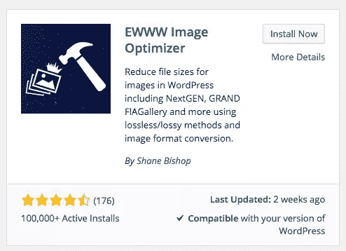
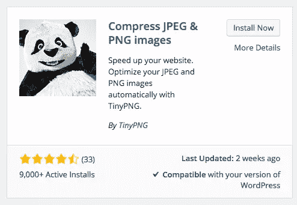
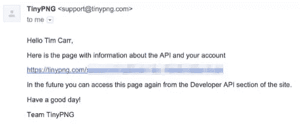
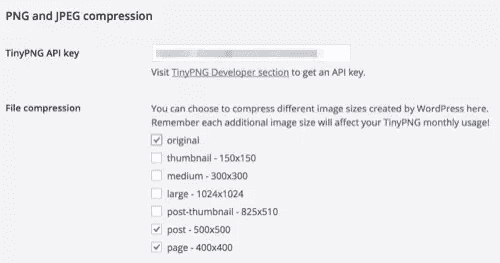
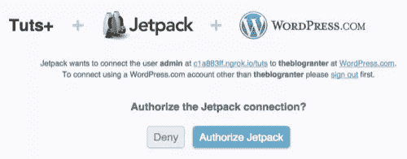
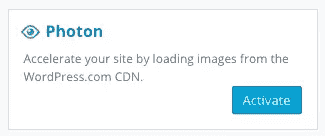
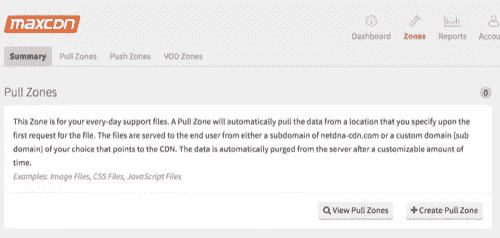
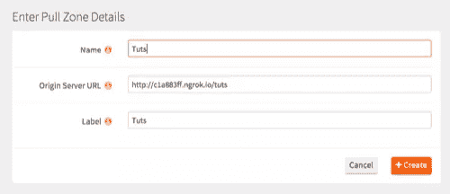
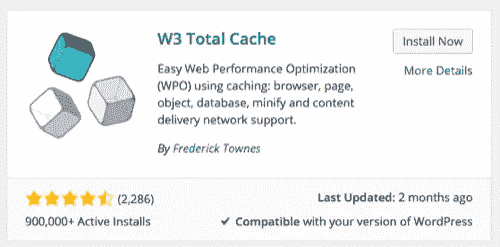
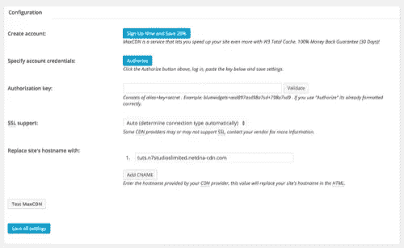

# 掌握 WordPress 中的图像优化

> 原文：<https://www.sitepoint.com/mastering-image-optimization-in-wordpress/>

当建立和维护 WordPress 网站时，找到提高网站性能和减少页面加载时间的方法是很重要的。这有助于降低跳出率，提高在搜索引擎上的排名。

通过 WordPress 站点的主题和插件代码，有几种方法可以提高性能——例如，缩小 JavaScript、CSS 和图片。还有基于服务器的配置选项——例如，启用缓存，或者使用 WordPress 插件来帮助缓存静态内容。

然而，我们无法控制客户添加到 WordPress 网站的内容——尤其是图片。图像可能以原始形式上传，导致网站性能问题和增加页面加载时间。

在这篇文章中，我们将探索优化 JPEG 和 PNG 图像的不同方法，这些图像是由客户和网站所有者上传到 WordPress 的。

### 主题图像大小

当一个 WordPress 用户上传一张图片时，WordPress 提供了两个功能，我们可以用它们来创建原始图片的副本，以特定的尺寸。这在我们希望在主题中输出特定大小的图像时非常有用。

#### 缩略图，中等和大尺寸

在 WordPress 管理中，在设置>媒体下，有三种预定义的图像尺寸:`thumbnail`、`medium`和`large`。每个都可以设置自己的尺寸。

因为 WordPress 总是会将图片调整到这些大小(结果会存储 4 个图片——原始、缩略图、中等和大尺寸),所以首先设置这些大小并在可能的情况下在你的 WordPress 主题中使用它们是值得的。

要在你的 WordPress 主题中使用预定义的图像尺寸，请使用:

```
while ( have_posts() ) {
    the_post();
    the_post_thumbnail( 'thumbnail' ); // Or 'medium', or 'large'
}
```

#### set_post_thumbnail_size()

如果您需要额外的图像尺寸，我们可以使用`set_post_thumbnail_size()`:

> 设置默认特色图像(以前称为帖子缩略图)的尺寸。

这允许我们为帖子、页面和自定义帖子类型定义特色图片的宽度和高度，我们使用`the_post_thumbnail()`在主题中输出这些图片。

要定义特色图像的大小，请将以下代码添加到主题的 functions.php 文件中。这会将特色图像设置为 500 像素宽 x 500px 像素高:

```
add_theme_support( 'post-thumbnails' );
set_post_thumbnail_size( 500, 500, true );
```

要以指定的尺寸输出帖子的特色图片，在 WordPress 循环中使用`the_post_thumbnail()`:

```
while ( have_posts() ) {
    the_post();
    the_post_thumbnail();
}
```

#### add_image_size()

虽然`set_post_thumbnail_size()`很有用，但我们只能调用它一次来定义一组图像尺寸，以及 WordPress 缩略图、中尺寸和大尺寸。如果我们想输出额外的尺寸，例如，一个 500 像素 x 500px 像素的图片，一个 400 像素 x 400px 像素的图片。

谢天谢地，WordPress 还提供了`add_image_size()`功能:

> 注册新的图像尺寸。这意味着当一个新的图片上传时，WordPress 将会创建一个指定尺寸的图片副本。

我们可以根据需要在主题的`functions.php`文件中多次调用这个函数，以便根据主题的需要注册尽可能多的图像尺寸。让我们分别为文章和页面注册两种图像大小:

```
add_image_size( 'post', 500, 500, true );
add_image_size( 'page', 400, 400, true );
```

现在，我们可以通过修改 _post_thumbnail()调用来指定要输出的图像大小:

```
while ( have_posts() ) {
    the_post();
    the_post_thumbnail( 'post' ); // Or 'page'
}
```

#### 结果

使用我们的测试 [JPEG](https://uploads.sitepoint.com/wp-content/uploads/2015/07/1437403267jpeg.jpg "JPEG Image Test") 和 [PNG](https://uploads.sitepoint.com/wp-content/uploads/2015/07/1437403417png.png "JPEG Image Test") 图像，我们可以看到文件大小的减小和性能的提高:

##### JPEG 图像

| **原始尺寸-文件大小:504KB** |
|  |
|  |
| **500 像素 x 500px 像素–文件大小:29KB** |
|  |
|  |
| **400 像素 x 400px 像素–文件大小:21KB** |
|  |

##### PNG 图像

| **原始尺寸–文件大小:697KB** |
|  |
|  |
| **500 像素 x 500px 像素–文件大小:354KB** |
|  |
|  |
| **400 像素 x 400px 像素–文件大小:236KB** |
|  |

### 图像压缩

图像压缩旨在通过删除冗余数据来进一步减小图像文件的大小，而几乎不牺牲图像质量。

图像压缩主要有两种方法:有损和无损。

#### 有损图像压缩

有损压缩使用不精确的近似法，丢弃部分图像数据，以生成文件大小较小的图像，同时尽可能保持原始图像。

元数据(如 EXIF 信息，告诉我们相机的品牌、型号和位置)可以被丢弃，而不会影响图像质量。

缺点是图像质量可能会受到影响，所以在快速图像加载时间和图像质量之间找到正确的平衡很重要。

有损压缩通常用于 JPEG 图像和照片，其中图像文件中有大量数据用于渲染图像输出。

使用我们的测试图像和[tinypng.com](http://tinypng.com)，我们可以看到有损压缩对我们的 JPEG 和 PNG 图像的影响:

##### JPEG 图像

| **原始尺寸-原始文件大小:504KB，有损压缩文件大小:367KB，保存率:27%** |
|  |
|  |
| **500 像素 x 500px 像素–原始文件大小:29KB，有损压缩文件大小:17.1KB，保存率:41%** |
|  |
|  |
| **400 px x 400 px–原始文件大小:21KB，有损压缩文件大小:12.5KB，节省率:39%** |
|  |

##### PNG 图像

| **原始尺寸-原始文件大小:697KB，有损压缩文件大小:229.6KB，保存率:67%** |
|  |
|  |
| **500 px x 500 px–原始文件大小:354KB，有损压缩文件大小:94.3KB，保存率:73%** |
|  |
|  |
| **400 px x 400 px–原始文件大小:236KB，有损压缩文件大小:64.6KB，保存率:73%** |
|  |

#### 无损图像压缩

无损压缩允许部分丢弃和压缩图像数据，而不会损失图像质量。“无损”压缩的图像将呈现与原始图像相同的效果。

缺点是对于更复杂的图像，比如照片，它通常不会提供任何文件大小的改进。因此，它最好用于 PNG 和 GIF 图像。

### 图像压缩:WordPress 解决方案

WordPress 提供了两种调整图像质量的方法，使用有损压缩。我们可以通过向主题的 functions.php 文件中添加以下代码来使用这两者:

```
add_filter( 'jpeg_quality', 'custom_image_quality' );
add_filter( 'wp_editor_set_quality', 'custom_image_quality' );
function custom_image_quality( $quality ) {

    return 60;

}
```

定义上传到 WordPress 或者在 WordPress 的图像编辑器中编辑的 JPEG 图像的质量。

定义在 WordPress 的图像编辑器中编辑的任何图像的质量。对于 JPEG 图像，因为我们已经指定了`jpeg_quality`过滤器，这将覆盖这个过滤器。

将我们的测试图片上传到 WordPress 并进行这些修改会产生以下结果:

##### JPEG 图像

| **原始尺寸-原始文件大小:504KB，60%质量文件大小:504KB，保存率:0%** |
|  |
|  |
| **500 像素 x 500px 像素–原始文件大小:29KB，60%质量文件大小:14KB，保存率:51%** |
|  |
|  |
| **400 像素 x 400px 像素–原始文件大小:21KB，60%质量文件大小:10KB，保存率:52%** |
|  |

##### PNG 图像

|  | 原创 | 500 像素 x 500px 像素 | 400 像素 x 400px 像素 |
| --- | --- | --- | --- |
| 文件大小 | 697KB | 354KB | 236KB |
| 60%质量文件大小 | 697KB | 354KB | 236KB |
| 节约 | 0% | 0% | 0% |

你会注意到我们上传的 PNG 图像没有改变——这是因为`jpeg_quality`过滤器只影响 JPEG 图像，而`wp_editor_set_quality`仅在我们通过媒体库编辑图像时使用。

此外，我们的原始图像没有改变——这是因为 WordPress 只对调整大小的图像应用质量过滤器。

### 图像压缩:插件解决方案

虽然我们已经探索了图像压缩是如何工作的，并使用在线工具进行了一些测试，但我们希望我们的图像能够在 WordPress 中自动压缩。这意味着我们不依赖客户(或我们自己)在上传图片到 WordPress 之前记得使用第三方工具，我们正在简化这个过程。

有几个 WordPress 插件提供自动图像压缩:

#### 图像优化器

[EWWW 图像优化器](https://wordpress.org/plugins/ewww-image-optimizer/)提供无损压缩，使用各种 JPEG、PNG 和 GIF 压缩库/服务。它需要`exec()`访问权限，而一些共享主机可能没有——但是他们确实提供了 EWWW 映像优化器云，这是一种付费服务，可以在其服务器上处理映像。

同样，对于有损压缩，你需要为一个 API 密钥付费，1000 张图片的价格从 1 美元开始。

要设置 EWWW 图像优化器，在你的 WordPress 管理界面导航到插件>添加新的，然后搜索“EWWW 图像优化器”:



点击*立即安装*按钮，安装后激活插件。

默认情况下，该插件将对我们的图像提供无损压缩，无需进一步配置。让我们创建一个新帖子，并将我们的特色图片设置为我们的测试图片，以获得一些结果:

##### JPEG 图像

| **原始尺寸-原始文件大小:504KB，有损压缩文件大小:503KB，节省:0.2%** |
|  |
|  |
| **500 像素 x 500px 像素–原始文件大小:29KB，有损压缩文件大小:28KB，保存率:3.5%** |
|  |
|  |
| **400 px x 400 px–原始文件大小:21KB，有损压缩文件大小:20KB，保存率:4.8%** |
|  |

##### PNG 图像

| **原始尺寸-原始文件大小:697KB，有损压缩文件大小:669KB，保存率:4%** |
|  |
|  |
| **500 px x 500 px–原始文件大小:354KB，有损压缩文件大小:300KB，节省率:15.3%** |
|  |
|  |
| **400 px x 400 px–原始文件大小:236KB，有损压缩文件大小:200KB，节省率:15.3%** |
|  |

我们能够在无损压缩 PNG 图像时获得比 JPEG 图像更好的性能，这是意料之中的。然而，这些图像仍然相当大，所以让我们尝试另一个提供有损压缩的插件。

#### 压缩 JPEG 和 PNG 图像

除了提供基于网络的图像压缩服务之外，TinyPNG 还提供了一个 WordPress 插件来自动对 JPEG 和 PNG 图像进行有损压缩。

每月前 500 次图像压缩是免费的。之后，每次图像压缩的费用为 0.009 美元。

要设置 TinyPNG 插件，在你的 WordPress 管理界面中导航到插件>添加新插件，然后搜索“压缩 JPEG & PNG 图像”:



点击*立即安装*按钮，安装后激活插件。

接下来，通过访问[https://tinypng.com/developers](https://tinypng.com/developers)并输入您的姓名和电子邮件地址来获取 API 密钥:


您将收到一封电子邮件，其中包含获取 API 密钥的链接。单击链接，记下您的 API 密钥:



在 WordPress 插件中，导航到设置>媒体，然后插入你的 TinyPNG API 密钥。您还可以选择要压缩的图像大小——每个图像大小都算作每月 500 次免费分配压缩中的一次压缩，因此我们只需选择原始图像、页面和帖子大小进行测试:



让我们创建一个新帖子，并将我们的“特色图片”设置为我们的测试图片，以获得一些结果:

##### JPEG 图像

| **原始尺寸-原始文件大小:504KB，有损压缩文件大小:367KB，保存率:27.2%** |
|  |
|  |
| **500 像素 x 500px 像素–原始文件大小:29KB，有损压缩文件大小:19KB，保存率:34.5%** |
|  |
|  |
| **400 px x 400 px–原始文件大小:21KB，有损压缩文件大小:13KB，保存率:38.1%** |
|  |

##### PNG 图像

| **原始尺寸-原始文件大小:697KB，有损压缩文件大小:230KB，保存率:67%** |
|  |
|  |
| **500 像素 x 500px 像素–原始文件大小:354KB，有损压缩文件大小:94KB，保存率:73%** |
|  |
|  |
| **400 px x 400 px–原始文件大小:236KB，有损压缩文件大小:65KB，保存率:73%** |
|  |

仅从一张图像，使用特定的图像大小和压缩插件，我们可以将 504KB 的 JPEG 图像压缩到 13KB——节省了 491KB，或者比 2 Mbps 连接快 1 秒左右。对于 697KB 的 PNG，我们可以将其减少到 65KB，节省 632KB，或者比 2 Mbps 连接快 1.2 秒左右。

既然我们已经优化了想要在 WordPress 网站上展示的图片，让我们看看如何根据访问者的位置和其他因素来优化这些图片的展示。

### 内容交付网络(CDN)

内容交付网络是大量的服务器，通常分布在世界各地的多个数据中心。它们旨在提供静态内容，如文本、图像、CSS 和 Javascript，以及更大的文件下载。

cdn 还可以利用缓存和缩小，以确保交付的内容尽可能优化。

由于 cdn 的地理位置，大多数将检测访问者的国家，并试图从最近的可用数据中心提供文本、图像、CSS 和 Javascript。这有助于减少响应时间和页面加载时间，以及减少服务器带宽和服务器上的负载。

让我们看看 WordPress 的两个可用的 CDN 解决方案。

#### 光子

光子被描述为:

> …一种图像加速和编辑服务，适用于 WordPress 网站或与 Jetpack 相连的 WordPress 网站。这意味着你的主机负载更少，你的读者的图像速度更快

它自动抓取 JPEG、PNG 和 GIF 图像，提供调整大小的版本以满足浏览器的要求。如果我们在移动设备上浏览一个 WordPress 网站，它有 500px x 500px 的图片，但是我们只需要一个 250px x 250px 的版本，这是很有用的。

要设置 Photon，我们需要安装并激活 Jetpack。在你的 WordPress 管理界面中导航到插件>添加新插件，然后搜索“Jetpack”:


点击*立即安装*按钮，安装后激活插件。

接下来，点击 WordPress 管理菜单中的 *Jetpack* ，然后点击【连接到 WordPress】中的*。*然后，您将被要求登录您的 WordPress.com 帐户(如果您没有帐户，请不要担心，您现在可以注册一个免费帐户):



如果一切顺利，你会被重定向回你的 WordPress 管理界面，在那里你会看到几个可用的模块，包括 Photon。让我们点击*激活*按钮来激活光子:



光子现在被激活，图像将从他们的 CDN 提供。

让我们来看看我们现有的帖子和页面，其中包含了 TinyPNG 优化的特色图片。你会注意到图像现在是从 i2.wp.com 提供的——这是光子的 CDN。我们可以获得图像源，并调整调整大小参数以获得原始的 500px 和 400px 版本，以测试优化的文件大小:

##### JPEG 图像

| **原始尺寸–原始文件大小:504KB，有损压缩文件大小:318KB，保存率:37%** |
|  |
|  |
| **500 像素 x 500px 像素–原始文件大小:29KB，有损压缩文件大小:14KB，保存率:51.7%** |
|  |
|  |
| **400 px x 400 px–原始文件大小:21KB，有损压缩文件大小:10KB，保存率:52.4%** |
|  |

##### PNG 图像

| **原始尺寸-原始文件大小:697KB，有损压缩文件大小:239KB，保存:65.7%** |
|  |
|  |
| **500 px x 500 px–原始文件大小:354KB，有损压缩文件大小:101KB，保存率:71.5%** |
|  |
|  |
| **400 px x 400 px–原始文件大小:236KB，有损压缩文件大小:69KB，保存率:70.8%** |
|  |

我们仍然能够实现与 TinyPNG 类似的文件大小节省，我们的 JPEG 图像在 Photon 上性能更好，我们的 PNG 图像在使用 TinyPNG 时性能更好。

#### 第三方 CDNs

如果你不想安装 Jetpack，而想使用它附带的其他功能(36 个模块，还在增加！)，可以用第三方 CDN，比如 MaxCDN。

这种方法的优势在于，您不仅仅局限于优化图像交付；您可以指定由 CDN 提供 CSS、JavaScript 文件和其他静态文件类型。我们也可以在 WordPress 安装上保留一个图像优化插件，比如 TinyPNG，确保我们的图像在存储到 CDN 之前得到优化。如果你的网站有更多的 CSS 和 Javascript 内容，而不是图片，那么这可能是一个更好的解决方案。

要设置 MaxCDN，请访问他们的网站，并点击*获得免费测试帐户*按钮。

按照屏幕上的说明填写您的个人信息。然后，您将收到一封电子邮件，允许您创建自己的 MaxCDN 帐户并开始使用。

注册后，您需要创建一个区域。区域本质上是一个网站。

要创建区域，点击主菜单中的区域选项，然后点击*创建拉动区域*



输入您的拉区的名称(通常是您的网站名称)、URL 和可选标签:



接下来，我们需要配置我们的 WordPress 安装来使用 MaxCDN。我们将使用 W3 Total Cache，这是一个带有 MaxCDN 支持的 WordPress 插件。

要设置 W3 总缓存，在你的 WordPress 管理界面导航到插件>添加新的，然后搜索“W3 总缓存”:



点击*立即安装*按钮，安装后激活插件。

一旦激活，导航到 WordPress 管理菜单中的性能> CDN，向下滚动到配置面板。



点击*授权*按钮，复制授权密钥，粘贴到插件的*授权密钥*字段:


如果一切正常，屏幕上将显示一个有效的*键*通知。点击*保存所有设置*按钮完成配置。

重新加载一个现有的页面或帖子，您应该会看到 CSS、JS 和图像是从 CDN 提供的。

### 结论

在这篇文章中，我们回顾了一些 WordPress 的图片优化和 CDN 插件。光子 CDN 是 Jetpack 插件的一部分，它提供了一个最有效的解决方案来提供优化的图像，可针对所有分辨率进行缩放，并由 CDN 提供服务，最重要的是，它是免费的。

对于那些已经有 CDN 的人，或者不喜欢使用 CDN 的人，或者使用 Jetpack 的人，TinyPNG 的 WordPress 插件在 PNG 图像的图像优化方面比 Photon 略有改进，并且可以与第三方 CDN 提供商结合使用。

## 分享这篇文章