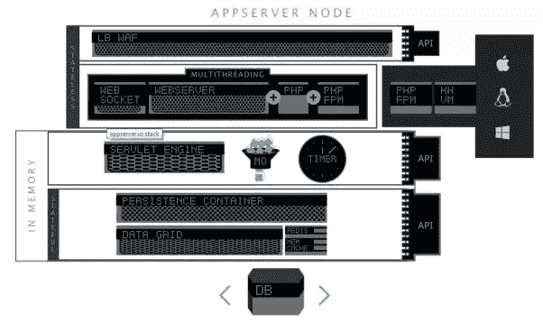
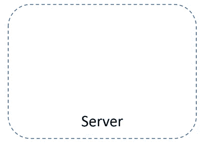
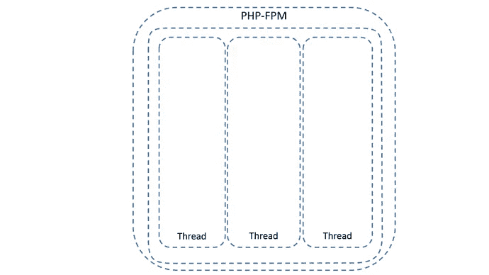
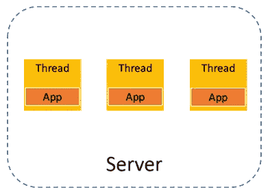
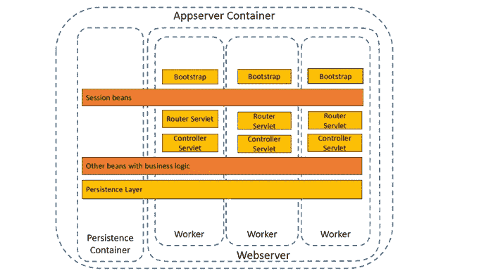
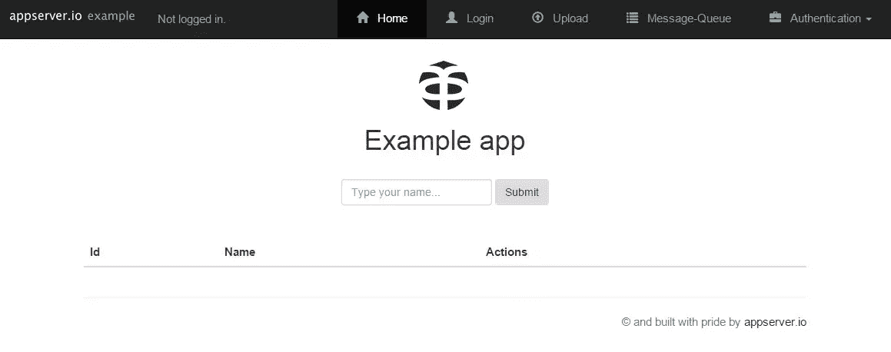

# appserver——一个基于 PHP 的生产就绪型服务器

> 原文：<https://www.sitepoint.com/appserver-a-production-ready-php-based-server/>

自从 [TechDivisionGmbH](https://www.techdivision.com/) 的团队[在 Sitepoint](https://www.sitepoint.com/interview-appserver-io-crew/) 接受采访以来，已经过去一年半多了，他们的 PHP 应用服务器系统被称为 [appserver.io](http://appserver.io/) 。在采访的时候，appserver 才刚刚开始成为 alpha。从那时起，发生了很多事情，appserver 现在作为一个生产系统正式发布，目前版本为 1.0.6，版本 1.1.0 即将推出。



您可能会问，“为什么 appserver 范式会发生变化？”

答案是肯定的，因为它解决了 PHP 应用程序开发的最后一个前沿问题:从服务器资源优化和协作的角度来看，大型应用程序的高性能。这是许多专业 PHP 开发人员一直在呼吁的 PHP 开发领域，比如曼纽尔·莱默斯在他的“ [PHP7 特性和发布日期](http://www.phpclasses.org/blog/post/242-PHP-7-Features-and-Release-Date.html)”博客中(参见关于“独立多线程 Web 服务器”的部分)，以及 Symfony 之父杨奇煜·普登西耶在他的演讲“我对 PHP 的看法”中提到他自己也在研究这样一个应用服务器解决方案。好了，不要再看杨奇煜了，我们已经有了一个非常好的 appsever.io 解决方案

Appserver Community Edition 根据[开源许可 3.0](http://opensource.org/licenses/OSL-3.0) 进行许可。TechDivsion 团队还提供了[专业版](http://appserver.io/products/professional-edition.html)和[企业版](http://appserver.io/products/enterprise-edition.html)。

## Appserver 仍然需要开发人员

尽管 appserver 有潜力在 web 应用程序环境中提供更高的性能和更好的 web 服务器之间的协作，但它无法单独做到这一点。这也需要 PHP 开发人员的新思维。正是这种解决问题的不同视角，我们将在这个 3 部分系列中深入探讨。

在第一部分中，我们将介绍使 appserver 与众不同的高级概念，并让您开始第一次安装。在第 2 部分中，我们将详细介绍 appserver 提供的开箱即用组件。最后，在第 3 部分中，我们将通过安装包中提供的示例应用程序来运行一些用例。

本系列的总体目标是让您了解一个可能具有更高性能的 PHP 和 appserver 应用系统的新世界，以及它如何要求开发思维和某些情况下的工作流的变化。

## 螺纹和螺纹

您可能会将线程理解为允许现代计算机同时做多件事情的技术。这是正确的，也是术语“[多任务处理](http://en.wikipedia.org/wiki/Thread_%28computing%29)”的来源。

PHP 世界中的线程或多任务实际上相当罕见。在 PHP 诞生的时候，计算机中的线程并不是一个很重要的问题。PHP 一直保持着它的单线程架构，也称为“无共享”架构，甚至直到今天。

然而，大多数人没有意识到的是，PHP 实际上也支持多任务处理。在乔·沃特金斯创造出强大的 [PHP 扩展](http://php.net/manual/en/book.pthreads.php)pthreads 之前，这种宝贵的功能基本上不为人知，它允许开发者用 PHP 构建线程化应用。除了其他重要特性之外，appserver 实现这一功能是为了支持线程化应用程序的开发。

不过，您可能和我一样，想知道为什么线程技术会对 PHP 应用程序产生任何影响。为此，我们实际上必须鸟瞰一下今天的 web 服务器技术。

## 标准的 PHP Web 服务器场景

对于我们 PHP 开发人员来说，在 web 服务器的环境中，线程化的想法离我们很远。这是因为 web 服务器和/或 PHP 进程管理器本身实际上在做这项工作。你可能会说，“太好了！我担心的问题少了一个”你这么说完全正确。然而，这种在 webserver / PHP 进程管理级别处理线程的方式会带来相当大的成本。下面是一个动画，展示了 PHP 当前使用类似 Nginx 的 web 服务器运行进程的方式。



对于服务器收到的每个请求，线程都是通过一遍又一遍地复制、构建和销毁相同的东西来完成的。你可能会想，这看起来没那么糟，对吧？要看到真正的成本，我们实际上必须更深入一点，进入过程的“构建/破坏”部分。



这幅图展示了一个由 MVC 框架支持的普通的、通常更大的应用程序对每个调用必须做的事情。我们可以争论事件的顺序。然而，需要注意的是，在发送响应后，有许多工作会被完全销毁。如上所述，这对机器来说是大量重复和浪费的工作。这种浪费=性能损失！

现在让我们从鸟瞰图的角度来看一个 appserver 场景。

## Appserver 场景



如你所见，一切都没什么不同。然而，使用 appserver，web 服务器是用 PHP 编写的，是应用程序的一个集成部分。现在，您少了一个顾虑，如果有必要，您可以更好地控制 web 服务器中发生的事情。此外，由于集成了 web 服务器，处理 HTTP 请求和响应的现代 PHP 框架的一个公共部分基本上放在了 web 服务器本身的堆栈中的适当位置。

就这一点而言，这将是对标准 web 服务器的巨大改进，然而，它还会变得更好。让我们看下一层，就像我们之前做的那样。



请注意程序的某些部分不再被破坏。毁坏与否，现在掌握在开发商手里。这意味着开发人员可以，例如，允许引导过程保持“线程化”,而不必为每个请求重新构建。自举应用程序随时可以运行。

## 思维上的差异

当 appserver 带来的变化在我脑海中“点击”时，这就是我的感受(点击查看)。

[](https://www.youtube.com/watch?v=A23bzMN3vSg)

开心吗？哦是的！而电影最重要的部分就是这一幕之后上帝说的话。

> 分汤不是奇迹，布鲁斯。这是一个魔术。一个单亲妈妈做两份工作，还能抽出时间带她的孩子去踢足球，这真是个奇迹。一个青少年对毒品说“不”,对教育说“是”,这是一个奇迹。人们希望我为他们做任何事。但是他们没有意识到的是*他们*有这个权力。你想看奇迹吗，孩子？成为奇迹。

好吧，也许这有点夸张，但是可以肯定的是,“奇迹”或者说让程序的一部分在服务器本身中持久化的能力是提高应用程序性能的强大工具。作为 PHP 开发人员，它允许您从不同的角度思考应用程序如何更好更快地工作。不过，按照规则来说…

> 权力越大，责任越大。

换句话说，尽管 appserver 为您提供了新的功能，但您也必须了解这些功能的含义、使用方法以及不小心可能会产生的副作用。我们将在本系列的后面部分更详细地讨论这些内容。

现在，让我们启动并运行一个 appserver 实例。

## 安装和入门

Appserver 已经准备好安装大量的操作系统。本地开发的一个推荐方法是使用用 Virtualbox 构建的[流浪虚拟机。或者你可以根据布鲁诺的快速提示](https://www.sitepoint.com/build-virtual-machines-easily-puphpet/)[建造他的家园盒子](https://www.sitepoint.com/quick-tip-get-homestead-vagrant-vm-running/)。我们将安装 Debian Wheezy 版本的 appserver，你实际上只需要运行操作系统。

在您安装了 VM 并且它正在运行之后，以超级用户的身份 SSH 到它并执行这些命令。

```
echo "deb http://deb.appserver.io/ wheezy main" > /etc/apt/sources.list.d/appserver.list
wget http://deb.appserver.io/appserver.gpg -O - | apt-key add -
apt-get update
apt-get install appserver-dist
```

安装过程和其他操作系统一样简单。

无论您使用哪种方法安装 appserver，都应该启动并运行 appserver。安装例程在安装完成后自动启动 appserver 进程。要快速检查这一点，请输入以下内容。

```
service appserver status
```

您应该会看到一个正在运行的 appserver。

```
[ ok ] appserver is running.
```

**一个小注意:**如果重启 VM，appserver 不会自动运行。如果你想让它在重启时运行，你需要设置服务在启动时启动。使用 Debian，您可以执行这个命令。

```
update-rc.d appserver defaults
```

如果您希望 appserver 实际上为您的 web 应用程序提供服务，您也可以将 appserver 的监听端口更改为`80`。为此，您现在需要对 appserver 中的核心配置文件进行简单的更改。转到/opt/appserver/etc/appserver，你会发现一个名为 appserver.xml 的文件，这是 webserver 的核心配置文件，很像 Apache 的 httpd.conf 或者 Nginx 的 nginx.conf 文件。

在您最喜欢的编辑器中打开它，找到这些行。

```
<server
            name="http"
            ....
            <param name="admin" type="string">info@appserver.io</param>
            <param name="transport" type="string">tcp</param>
            <param name="address" type="string">0.0.0.0</param>
            <param name="port" type="integer">9080</param>
```

如果您只是在尝试，最好让端口保持原样。这样，您可以在任何其他 PHP 项目旁边使用 appserver。

使用 web 服务器和这个配置文件，您可以做更多的事情。我们将在后面的文章中讨论一些可能性。

如果您对配置文件做了任何更改，您需要重新启动 appserver 以使更改生效。

```
service appserver restart
```

如果一切顺利，您应该能够使用`:9080/example`输入您的 VM 的 IP 地址，就像`http://10.10.10.10:9080/example`一样，并且您应该看到已经安装在 appserver 中的示例应用程序的起始页。



就是这样！您现在有了一个正在运行的 appserver。在本系列的下一部分中，我们将深入探讨 appserver 的特性，看看它提供了哪些现成的功能。敬请关注更多内容！

## 分享这篇文章