# 消除网络印刷中的猜测

> 原文：<https://www.sitepoint.com/taking-guesswork-typography-web/>

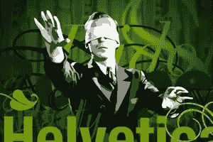

太多的设计师猜测他们的方式通过印刷术。

来自世界各地的书籍和文章都以一种过于附庸风雅的“你必须知道”风格来呈现排版。

事实上，排版背后有很多逻辑。有许多指导方针，如果遵循，会让你的字体设计变得更好——即使你不是设计师。

在这篇文章中，我们将介绍一些实用的技巧，你可以用它们来消除排版中的猜测。

## 选择和配对字体

至少可以说，可供选择的字体数量之多令人不知所措。

以经典的 Garamond 为例:在 [MyFonts](http://www.myfonts.com/search/garamond/fonts/) 上搜索，仅这一个字体家族就显示出不到 60 种不同的变体！

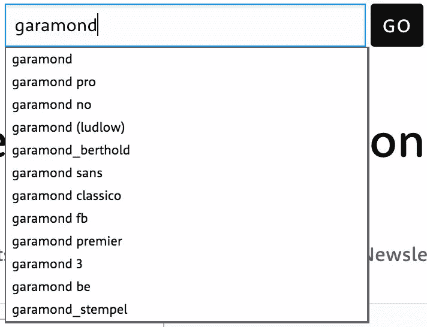

对于非打字爱好者来说，筛选所有这些字体是一项艰巨的任务，但对你的印刷工作的成功至关重要。

### 如何找到你的完美字体

诀窍是找到几个你喜欢的字体，然后坚持使用。如果你选择风格多样的系列(浅色、常规、粗体、斜体等)。)你会发现你可以一遍又一遍地使用它们。你将感受到它们是如何最好地工作的。

我几乎从不使用字体铸造网站来选择我的字体。他们太强大了。

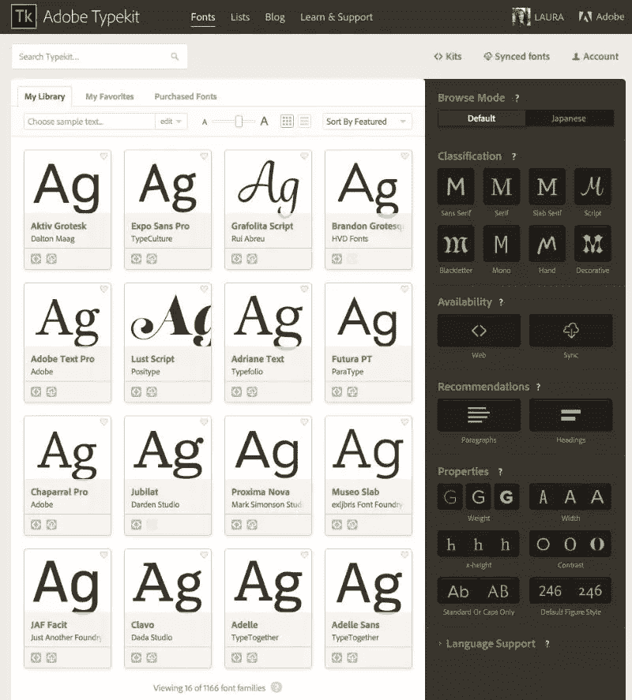

为你的项目找到一些好字体的最好方法是从你周围已经存在的字体中选择。

我发现最简单的方法就是在你的浏览器中安装一个名为 [WhatFont](https://chrome.google.com/webstore/detail/whatfont/jabopobgcpjmedljpbcaablpmlmfcogm/related?hl=en) 的 Chrome 扩展。只需突出显示并点击任何活动文本，它会显示您的名称，大小，行高和颜色。

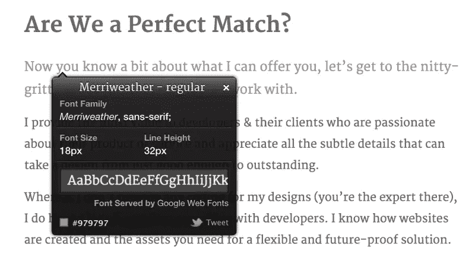

当然，浏览器并不是你识别你喜欢的字体的唯一方式。如果你有一张静态图像(甚至是手机照片)，你可以上传到 [What 字体](https://www.myfonts.com/WhatTheFont/)，它会为你进行分析，或者你可以使用 [Identifont](http://www.identifont.com/) ，它会根据你面前的人物问你一些简单的问题。

### 什么是好的字体选择？

选择字体时，最好从正文开始。这将是你的网站中使用最多的，也是最重要的。

选择正文字体时，有 3 个要点需要牢记:

### 1.检查对比度

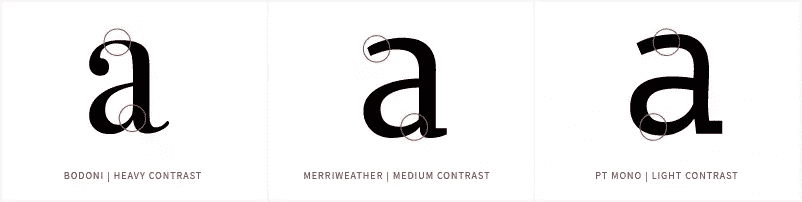

在左图中，你可以看到字母的宽度有很大的变化。当这涉及到大量文本时，阅读起来会很困难。

出于同样的原因，一个没有任何变化的字体(正确的图像)也同样糟糕，因为很难区分一个字母和其他字母。

对于较长的文本，最好选择中低对比度的字体，因为这样不会打断阅读。

把极端留给你的标题。

### 2.它有足够的重量吗？

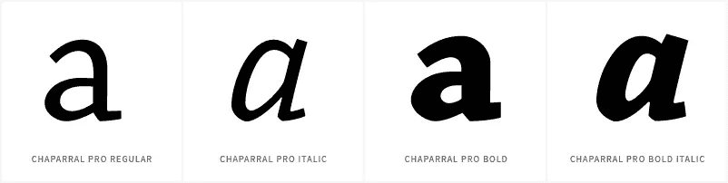

作为*绝对最小值*，你需要一个普通、斜体、粗体和粗斜体的粗细。少一点，你就不能正确地格式化你的文本。

最好是使用真正的粗体和斜体字体，而不是“强迫”一个正常的重量显示为另一个。你可以在上面的图像中看到这一点，注意当它以斜体显示时，a 是如何从双筒变成单筒的。

你应该以最灵活的组合为目标。考虑你将如何使用你的字体。您计划使用小型大写字母吗？如果是这样，确保你的字体是小型大写字母。要不要在轻量中使用大块引号？**确保你的字体能够处理你要扔给它的内容**

### 3.可读性强吗？

我知道这是一个显而易见的问题，但却很容易出错。检查一种字体是否可读的最好方法就是去读它。一个好用的工具是 [Typetester](http://www.typetester.org/) ，在这里你可以并排测试和比较超过 2200 种字体，包括来自 Google Web Fonts 和 Typekit 的字体。

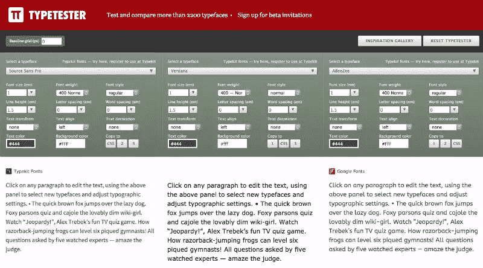

另一种检查方法是遵循来自[的](http://webdesign.tutsplus.com/articles/choosing-the-right-font-a-practical-guide-to-typography-on-the-web--webdesign-15)[Max Luzuriaga](http://tutsplus.com/authors/max-luzuriaga)Tuts+的建议:

> 如果你能把你的副本设置为 10px，并且你仍然能理解它所说的，那么这是一个很好的迹象，表明你选择了一个可读的字体。

### 我应该使用多少种字体？

如果你的正文字体足够灵活，你不需要为你的标题选择另一种字体。在印刷术中，少就是多。

在任何设计中，你的目标应该是最多两种字体。一个用于显示文本(标题、英雄文本)，一个用于其余部分(正文文本)。如果这听起来太少，考虑一下*字体可以有 4-80 种不同的风格。*

### 为标题选择字体

为标题选择字体(如果你有一个单独的字体)可能比正文更难。这是一个有特色的网站，也是一个会形成你网站整体印象的网站。

如果你很纠结，记住你可以在设计过程的后期回来改变字体。没人会知道。

如果你遵循这两个简单的建议，你就能更好地第一次找到正确的答案。

### 1.不要让它们太相似

如果你打算在正文中使用 Helvetica 字体，不要在标题中使用 Arial 字体。要么选择一个并坚持到底，要么放弃一个，选择更有个性的。

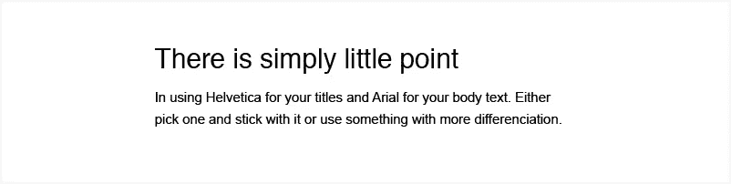

一个很好的经验法则，尤其是如果你刚刚开始，是在你的设计中使用一个衬线和一个无衬线。这样你可以确保他们有足够的差异化来工作。

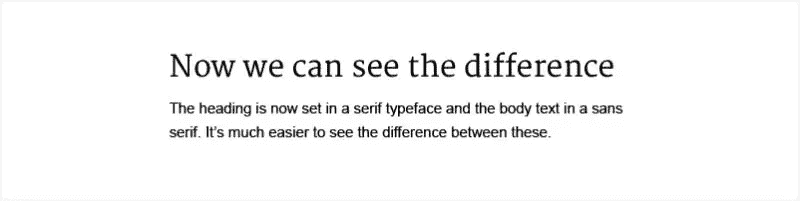

### 2.选择有个性的字体…但不要太多

你希望你的标题字体像你最好的朋友。你希望他们有足够的性格来吸引人，但又不要太多，以至于完全专横。

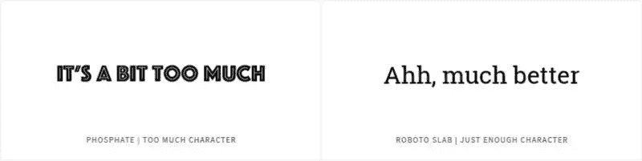

如果和你的字体(和最好的朋友)一起玩的想法让你筋疲力尽。甩掉他们。他们两个都是。

### 还在纠结？尝试这些组合

如果以上都做完了，你还在纠结，这里有一个我个人的常用字体配对列表，可以帮助你开始。在你认为合适的时候使用和扩展这个列表。

#### [查帕拉尔·普罗](https://typekit.com/fonts/chaparral-pro)和[拉托](https://www.google.com/fonts/specimen/Lato)

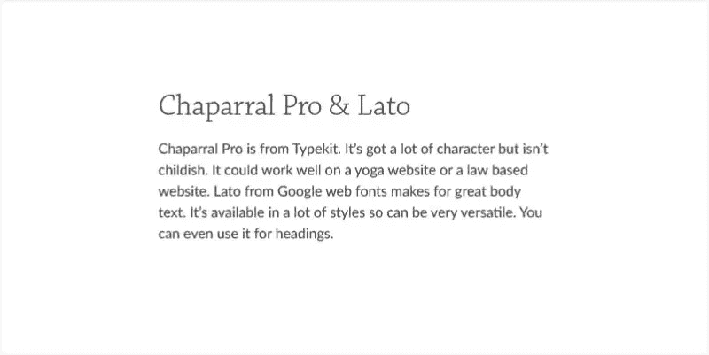

#### [Calluna Sans](https://typekit.com/fonts/calluna-sans) 和 [Expo Serif Pro](https://typekit.com/fonts/expo-serif-pro)

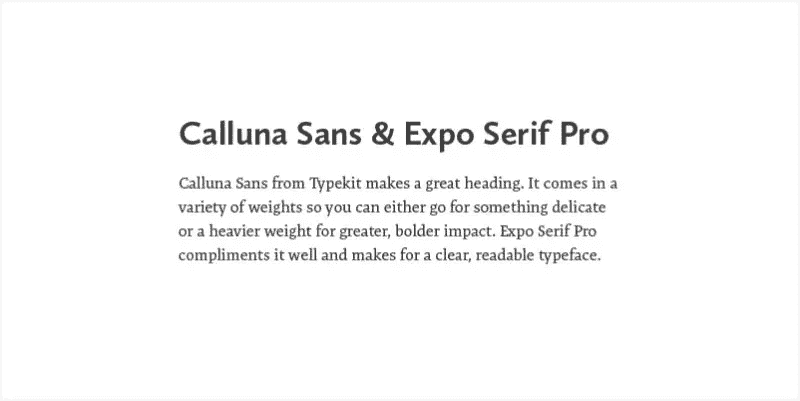

#### [Exo 2](https://www.google.com/fonts/specimen/Exo+2) 和[开 Sans](https://www.google.com/fonts/specimen/Open+Sans)

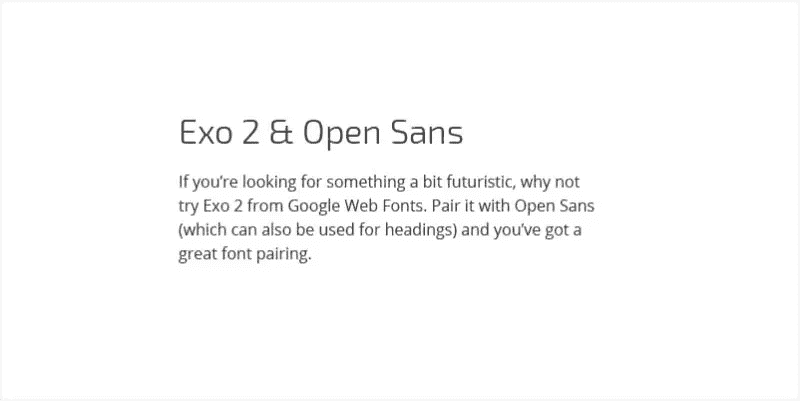

#### [梅里韦瑟](https://www.google.com/fonts/specimen/Merriweather)和[来源 Sans Pro](https://www.google.com/fonts/specimen/Source+Sans+Pro)

## 排版你的字体

排版是一门学问。这也很简单，这就是为什么我不明白为什么大多数人没有正确地做。

如果你遵循下面的规则，你将为自己赢得有声望的排印员的地位。人们会惊叹你对细节的关注，你会被邀请参加最酷的派对。

随着你越来越有经验，你会学会相信你的直觉，但现在这里有一些通用的提示让你开始。

### 不要猜测你的比例

如果你曾经想知道你的文字应该用多大的尺寸来保持比例，或者你从来没有想过要用多大的尺寸，那么我可以帮你摆脱这个负担。

你可以用数学来决定你的字体大小！你可以使用所谓的**模块标度**，它本质上给你一个你可以使用的尺寸列表，这些尺寸都与你的基本字体大小(最常见的是你的正文)成正比。

只需选择你的基本字体大小。对于正文，建议在 15-25px 之间(尽管我通常使用 16px 作为起点)。

为了让你免去自己计算的麻烦，我推荐你使用在线工具 [Type Scale](http://type-scale.com/) ，它会帮你计算出所有数据。

对于那些想学习如何自己解决问题的人来说，蒂姆·布朗的这篇内容广泛的文章解释了这一切。

### 给自己一些喘息的空间

我几乎从不坚持字体的默认行高。离网上阅读太近了。看起来挤在一起的单词更难读，看起来也不那么吸引人。

一个好的经验法则是保持行高为字体大小的 125%。所以 16px 字体的行高是 20px。通常，我会使用 150%的字体大小，使上面的字体高度为 24px。

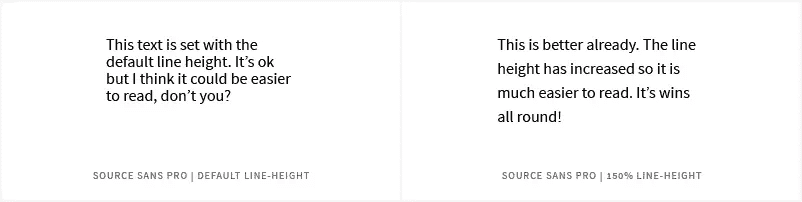

### 获取正确的详细信息。这很重要。

媒介是排版中细节的完美例子。这就是为什么它有来自世界各地的设计师对它的编辑器垂涎三尺。所以，如果你想让设计师对你的网站垂涎三尺，让我们从他们那里得到一些快速的提示。

### 使用弯引号而不是直引号。

直引号是你键盘上讨厌的小东西。它们看起来像“这个”和“这个”。像大多数印刷错误一样，它们源于打字机时代，那时键盘空间有限。

所以尽量不要使用它们，而是使用像“this”和“this”这样的引号。

以下是键入它们的方法:

#### 单引号

|  | 苹果个人计算机 | 个人电脑 | 超文本标记语言 |
| --- | --- | --- | --- |
| 开始 | **选项+】** | **alt 0145** | **&lsquo；** |
| 关闭 | **option+shift+】** | **alt 0146** | **&rsquo；** |

#### 双引号

|  | 苹果个人计算机 | 个人电脑 | 超文本标记语言 |
| --- | --- | --- | --- |
| 开始 | **选项+ [** | **alt 0147** | **&的现状；** |
| 关闭 | **option + shift + [** | **alt 0148** | **&的现状；** |

### 正确使用破折号和连字符

1.  一个**连字符**是你会在键盘上看到的。它是用来分词的。
2.  描述范围时，用一个**破折号**代替单词 to。从 1968 年到 1979 年。Mac: **选项+连字符**| PC:**alt 0150**| HTML:**&ndash；**
3.  破折号用于在句子中添加停顿，你可以用它来代替逗号。Mac: **option + shift +连字符**| PC:**alt 0151**| HTML:**&mdash；**

## 结论

这就是我实用的排版技巧。我真的希望你学到了新的东西，或者享受了一个很好的复习。正确的排版真的很令人满意。当你将这些建议付诸实践时，你会开始注意到你周围的一切。

你甚至可能会经历我称之为印刷工人启蒙的事情，在那里你会在餐馆菜单上挑出一个排版错误。经典。

**交给你了。你有什么我错过的实用技巧吗？你最大的排版秘密是什么？请在评论中告诉我！**

## 分享这篇文章