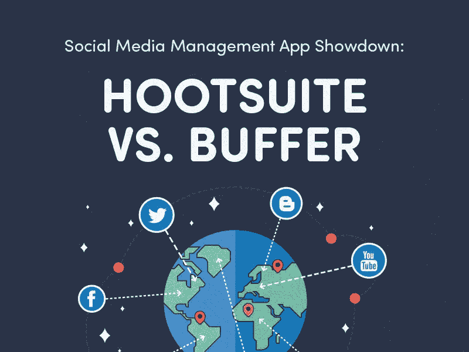
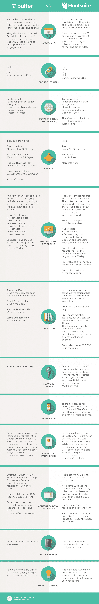

# 社交媒体管理应用摊牌:Buffer vs Hootsuite

> 原文：<https://www.sitepoint.com/buffer-hootsuite/>



打造一款颠覆性产品几乎没有时间做其他事情。生活突然变成了测试、修复和升级的重复例行公事。最重要的是，你专注于为用户提供惊人的体验。

许多初创公司的创始人忘记了，除非你在相关的观众面前持续分享这个故事，否则所有的努力都将隐藏在你办公室的范围内。

因此，社交媒体成为传达你的产品特征和产生转化的重要工具。

请放心:在我们的世界里，社交媒体管理是不可或缺的增长黑客。

每天向几个社交网络发布信息似乎是一项艰巨的任务。

幸运的是，有许多社交媒体管理工具可以让我们的生活变得更轻松，更轻松。

简单地说，社交媒体管理应用程序是人们用来管理其品牌在各种社交媒体渠道中的存在的工具。

这些社交媒体管理工具让我们对不同网络中发生的事情有一个大致的了解，允许我们同时向其中几个发布信息，并提供许多其他优势，例如:

*   **日程安排:**提前提交帖子，决定你的受众何时看到。Hootsuite 是下面将要介绍的工具之一，它提供了一个名为“自动日程安排”的有用功能，可以决定何时是发帖的最佳时间，并在该时间发布。

*   缩短的网址:由于 Twitter 的字符数有限，长链接可能是一场噩梦。社交媒体管理工具缩短了你的网址，给你更多的空间来放真正重要的东西:你的信息。它们还允许应用程序“跟随”你的信息，并跟踪点击。

*   **多个简介**:虽然某些类型的内容更适合特定平台(例如，Pinterest 和 Instagram 中的一些图片，脸书中的其他图片以及 Twitter 和 Linkedin 中的短链接)，但有时您可能希望跨平台广播一条消息。想想看，打开五到六个标签，并且必须独立发布相同的次数——这种方法时间效率很低。更明智的做法是使用社交媒体管理工具将内容同时推送到几个平台。没错:一键，多平台发布。

*   **分析和报告:**一旦你的帖子发布到(互联网)世界，你需要知道有多少人点击和阅读它们。分析这些指标可以帮助你决定哪些品牌信息引起了良好的共鸣，并做出相应的调整。

*   团队合作:这些工具中的一些为团队提供了分工的可能性。几个用户可以安排和发布内容，每个人都可以看到谁创建了什么。我怎么强调这个特性在过去对我和我的团队有多重要都不为过。你甚至可以创建一个工作流程，在发布之前，有人创建草稿，有人校对/编辑。它只是工作*。*

*   关键词研究:其中一些工具支持标签搜索，你可以把它添加到你的仪表盘上，这就是:全天候实时关键词研究。浏览一下，寻找新的内容发布思路，了解竞争对手的最新动向，了解客户对你的品牌的看法。

 ****## 摊牌

在这一点上，我们已经弄清楚为什么，什么和在哪里我们应该张贴。我们还知道有一些工具可以帮助我们处理 *how，*我们已经回顾了它们提供的一些最佳特性。您将在下面找到这些工具的列表，以及它们的核心优势和功能比较。



### 在你的网站上分享这张图片

**请在此图中注明 https://www.sitepoint.com/entrepreneur 的贡献。**

```
<textarea onclick="this.focus();this.select()" style="width:540px;height:100px"><a href=":%20https://www.sitepoint.com/buffer-hootsuite/"></a></textarea>
```

## 一些最后的想法:我应该买 Hootsuite 还是 Buffer？

在我的职业生涯中，我测试过很多社交媒体管理平台，我能给你的最好建议是充分利用你免费试用的权利。

虽然 Hootsuite 提供了稳定性、更大的支持团队和越来越多的有趣的第三方集成，但 Buffer 的 UX 方法可能正是你正在寻找的东西。

最后，我相信每个人都有一个工具，并且它不依赖于简单的功能列表。测试测试测试！

## 分享这篇文章****