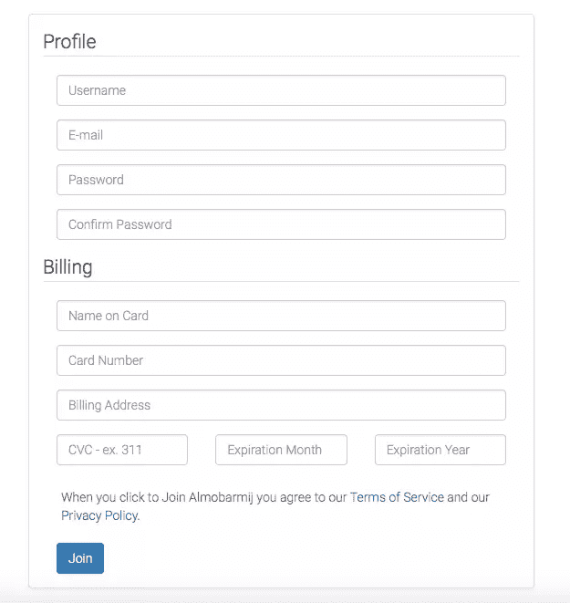
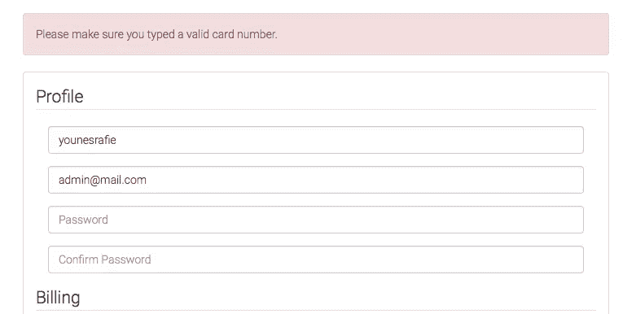
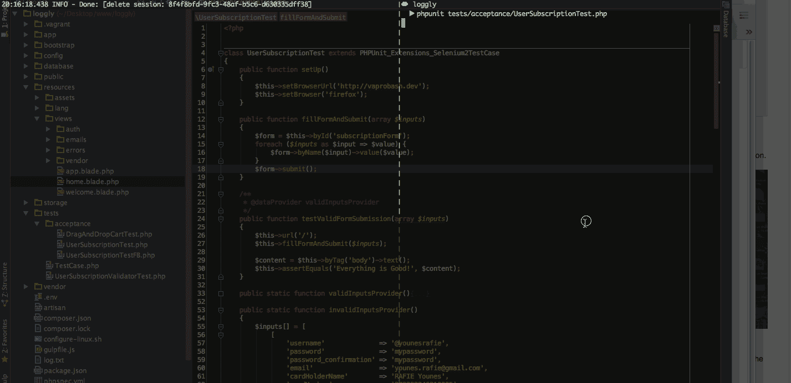
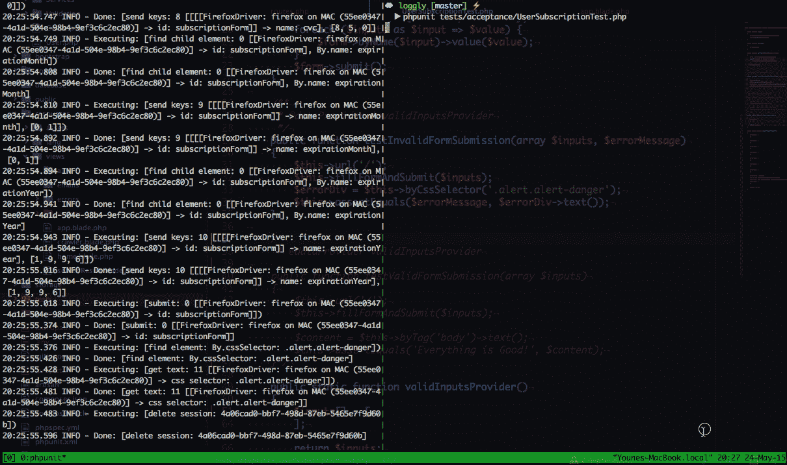
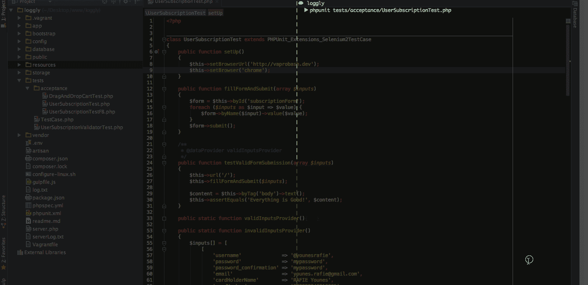

# 将硒与 PHPUnit 一起使用

> 原文：<https://www.sitepoint.com/using-selenium-with-phpunit/>

测试是一个非常广泛的主题，无论是单元测试、功能测试、验收测试等等。在本文中，我们将看到如何使用 [Selenium](http://www.seleniumhq.org) 进行验收测试。我将用一个实际的例子来说明一个真实的用例。我假设您已经知道如何使用 PHPUnit 进行[单元测试](https://www.sitepoint.com/basic-tdd-new-php-package/)，或者您至少已经掌握了它的全部内容。让我们开始吧。


## 什么是验收测试？

验收测试是通过测试讲述用户故事的过程，我喜欢用这句话来描述它:

> 为确定系统是否满足其验收标准并使客户能够决定是否接受该系统而进行的正式测试。

## 硒是什么？

Selenium 是一个自动化用户界面测试的工具。它有助于根据浏览器测试您的应用程序。这个过程可以这样描述:

*   转到页面`http://myapp.dev/videos`。
*   断言页面包含 20 个视频的列表。
*   点击页码上的第二个。
*   断言页面包含 20 个视频的列表。
*   退出浏览器。

您可能想知道:“它是如何使用所描述的测试来操作网页的？”

答案是“看情况”。如果您使用的是 Selenium RC(以前称为 Selenium 1)，它会将自动生成的 JavaScript 代码注入到页面中，以执行所需的操作。Selenium RC 已被弃用，仅在维护模式下受支持；你应该使用 Selenium WebDriver。

当使用 Selenium WebDriver (Selenium 2)时，测试被翻译成命令并传递给 Selenium 服务器(稍后将详细介绍)，然后使用 web 浏览器本机 API 传递给浏览器。

## 应用程序设置

因为我们实际上没有要测试的应用程序，所以我将使用一个用户注册页面。用户将输入他的个人信息和一些账单信息。如果一切正常，页面应该输出`Everything is Good!`。否则，页面将显示带有验证错误消息列表的订阅表单。



我们将使用 PHPUnit 和 Selenium 扩展开始测试我们的应用程序。启动之前，请务必使用 Composer 安装它们。

```
composer require --dev phpunit/phpunit
composer require --dev phpunit/phpunit-selenium
```

我们之前说过，命令被传递给 Selenium 服务器，然后由 Selenium 服务器转发给浏览器。我们需要[下载 Selenium 服务器](http://docs.seleniumhq.org/download/)，它只是一个 JAVA 归档可执行文件。可以使用`java -jar selenium-server-standalone-<version>.jar`运行服务器。因为我们会经常使用它，所以把它移到一个 bin 目录中，并在我们的`.bashrc`或`.zshrc`中为它起一个别名是个好主意。

```
alias sserve="java -jar /usr/local/bin/selenium-server-standalone-<version>.jar"
```

## PHPUnit 和硒

PHPUnit 支持 Selenium RC 和 WebDriver，并为此提供了两个类。`PHPUnit_Extensions_SeleniumTestCase`用于 RC 版本，`PHPUnit_Extensions_Selenium2TestCase`用于 WebDriver 版本。因此，您的测试必须扩展其中一个才能开始。请记住 RC 版本已被弃用，所以我们将在下面的例子中使用 WebDriver 版本。

```
// tests/acceptance/UserSubscriptionTest.php

class UserSubscriptionTest extends PHPUnit_Extensions_Selenium2TestCase
{
    public function setUp()
    {
        $this->setHost('localhost');
        $this->setPort(4444);
        $this->setBrowserUrl('http://vaprobash.dev');
        $this->setBrowser('firefox');
    }
}
```

`setUp`方法用于准备测试环境。在本例中，我们用它来告诉 PHPUnit 我们的 Selenium 服务器在哪里运行，我们将使用什么浏览器以及我们的应用程序的 URL。`setHost`方法默认为`localhost`，`setPort`方法默认为`4444`，这里可以省略。但是，如果您的测试服务器位于支持 Internet Explorer 的 Windows 机器中，而您从另一台不同的机器上运行测试，就可以使用这种方法。

当测试完成时，调用`tearDown`方法，并使用它来清除阶段。我们用它来关闭浏览器并终止当前会话。

```
public function tearDown()
{
    $this->stop();
}
```

## 数据提供者

PHPUnit 数据提供者允许我们用特定的数据来填充我们的测试，而不必迭代它。您可以在[文档](https://phpunit.de/manual/3.7/en/writing-tests-for-phpunit.html#writing-tests-for-phpunit.data-providers)中了解更多信息。

```
// tests/acceptance/UserSubscriptionTest.php

class UserSubscriptionTest extends PHPUnit_Extensions_Selenium2TestCase
{
    public function validInputsProvider()
    {
        $inputs[] = [
            [
                'username'              => 'younesrafie',
                'password'              => 'mypassword',
                'password_confirmation' => 'mypassword',
                'email'                 => 'mymail@gmail.com',
                'cardHolderName'        => 'RAFIE Younes',
                'cardNumber'            => '378282246310005',
                'billingAddress'        => 'Narjiss B Fez Morocco',
                'cvc'                   => '850',
                'expirationMonth'       => '01',
                'expirationYear'        => '2016',
            ]
        ];

        return $inputs;
    }

    public static function invalidInputsProvider()
    {
        $inputs[] = [
            [
                'username'              => '@younesrafie',
                'password'              => 'mypassword',
                'password_confirmation' => 'mypassword',
                'email'                 => 'mymail@gmail.com',
                'cardHolderName'        => 'RAFIE Younes',
                'cardNumber'            => '378282246310005',
                'billingAddress'        => 'Narjiss B Fez Morocco',
                'cvc'                   => '850',
                'expirationMonth'       => '01',
                'expirationYear'        => '2016',
            ],
            "Username must only contain alpha numeric characters and dashes."
        ];
        // ...

        return $inputs;
    }
}
```

`invalidInputsProvider`返回除一个字段之外的有效输入列表，在验证失败后，我们传递预期的错误消息。



## 使用 DOM 元素

处理网页时的一个常见任务是元素选择。PHPunit 的 Selenium 扩展为此提供了一个非常好的 API。可以通过类名、标签、名称、ID、CSS 选择器、XPath 等选择元素。该方法将返回一个`PHPUnit_Extensions_Selenium2TestCase_Element`实例，您可以用它来选择其他子元素、属性等。您还可以设置或获取元素值，更新元素 CSS 和其他一些常见的任务。对于我们的页面，我们可以做如下的事情。

```
class UserSubscriptionTest extends PHPUnit_Extensions_Selenium2TestCase
{
    public function testFormSubmissionWithUsername()
    {
        $this->byName('username')->value('younesrafie');
        $this->byId('subscriptionForm')->submit();
    }
}
```

该测试将选择用户名输入并设置一个值，然后提交订阅表单。我们可以在那之后添加一个断言，看看响应是否如预期的那样。如果验证通过，页面主体将包含`Everything is Good!`。

```
public function testFormSubmissionWithUsername()
{
    $this->byName('username')->value('younesrafie');
    $this->byId('subscriptionForm')->submit();

    $content = $this->byTag('body')->text();
    $this->assertEquals('Everything is Good!', $content);
}
```

我们的数据提供者包含输入名称和相应的值。我们将创建一个单独的方法来处理表单输入和提交。

```
public function fillFormAndSubmit(array $inputs)
{
    $form = $this->byId('subscriptionForm');
    foreach ($inputs as $input => $value) {
        $form->byName($input)->value($value);
    }
    $form->submit();
}
```

## 有效表单提交

为了将浏览器指向特定的页面，我们使用了来自`PHPUnit_Extensions_Selenium2TestCase`类的`url`方法。这个 URL 是相对于提供给`setBrowserUrl`方法的 URL 的。因此，在将浏览器指向索引页面后，我们填写并提交表单，然后测试预期的成功消息。

```
// tests/acceptance/UserSubscriptionTest.php

/**
 * @dataProvider validInputsProvider
 */
public function testValidFormSubmission(array $inputs)
{
    $this->url('/');
    $this->fillFormAndSubmit($inputs);

    $content = $this->byTag('body')->text();
    $this->assertEquals('Everything is Good!', $content);
}
```

假设您的 Selenium 服务器已经启动并运行，那么继续使用`phpunit tests/acceptance/UserSubscriptionTest.php`运行您的测试。这将创建一个新的浏览器会话，并开始填写表单。我们期待着一切都随着一个成功的断言而过去。



一些测试失败了，测试持续时间太短，我们无法观察出了什么问题。PHPUnit 能够使用`currentScreenshot`方法捕获失败测试的截图，该方法返回一个 BLOB 图像，我们可以保存该图像。

```
file_put_contents(__DIR__ . '/../../public/screenshots/screenshot.jpg', $this->currentScreenshot());
```

## 表单提交无效

无效表单提交与前面的方法几乎相同。我们填写表单输入并提交。然后，我们验证验证错误消息是否符合预期。我们将使用我之前提到的`invalidInputsProvider`。

```
// tests/acceptance/UserSubscriptionTest.php

/**
 * @dataProvider invalidInputsProvider
 */
public function testInvalidFormSubmission(array $inputs, $errorMessage)
{
    $this->url('/');
    $this->fillFormAndSubmit($inputs);
    $errorDiv = $this->byCssSelector('.alert.alert-danger');
    $this->assertEquals($errorMessage, $errorDiv->text());
}
```

`byCssSelector`方法允许我们使用 CSS 选择器从页面中检索元素，在本例中是错误段落。我们使用数据提供者方法中的错误消息字段来断言错误消息是否是预期的。

我们的表单只包含基本的交互，比如选择元素、设置值、提交表单等。然而，我们也可以在按钮或链接元素上使用`click`方法来验证目标页面是否按预期工作。



## 使用另一个浏览器

我们在测试中使用了 Firefox 浏览器。然而，我们也能够使用任何其他浏览器。Selenium 使用驱动程序方法，每个浏览器供应商都提供自己的驱动程序。你可以在文档中查看[支持的驱动列表。](http://docs.seleniumhq.org/docs/03_webdriver.jsp#selenium-webdriver-s-drivers)

要启用 Chrome 浏览器，需要下载 [`chromeDriver`](https://code.google.com/p/selenium/wiki/ChromeDriver) ，并在启动 Selenium 服务器时指定路径作为选项。

```
sserve -Dwebdriver.chrome.driver=/Users/admin/Downloads/chromedriver
```

```
// tests/acceptance/UserSubscriptionTest.php

public function setUp()
{
    // ...
    $this->setBrowser('chrome');
}
```



## 文件准备好了吗？

如果您的页面内容是通过 AJAX 加载的，并且您不希望在页面加载时直接触发测试，那么您会希望等到您的页面被加载并且您的元素出现之后。

```
public function testCategorySelected()
{
    $webdriver = $this;
    $this->waitUntil(function() use($webdriver){
        try{
            $webdriver->byId('rootElement');

            return true;
        }catch (Exception $ex){
            return null;
        }

    }, 2000);
}
```

回调函数将一直等待，直到我们返回一个非空值，并在两秒钟后超时，并显示一条错误消息。lookup 方法将继续查找元素，但是如果您想要指定一个搜索间隔，您可以使用`implicitWait`方法。

```
$this->timeouts()->implicitWait(300); //milliseconds
```

## 结论

本文简要介绍了使用 Selenium 和 PHPUnit 进行验收测试。一般来说，您可以将 Selenium 用于任何需要浏览器自动化的事情。如果您有任何意见或问题，请务必在下面发布，我将尽我所能回答您的问题。

## 分享这篇文章