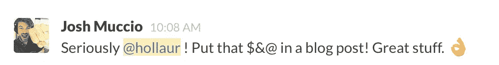
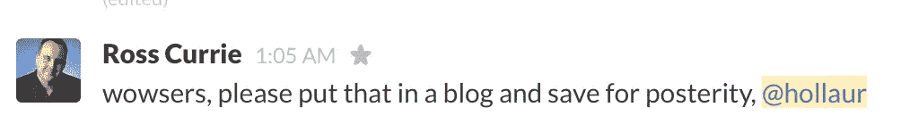
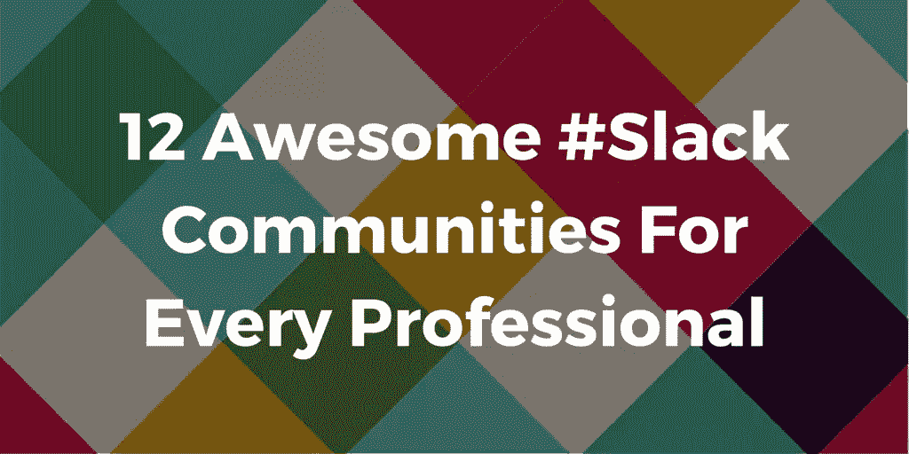
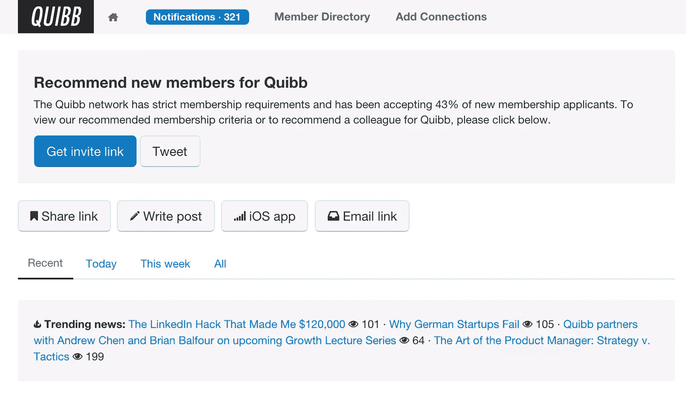
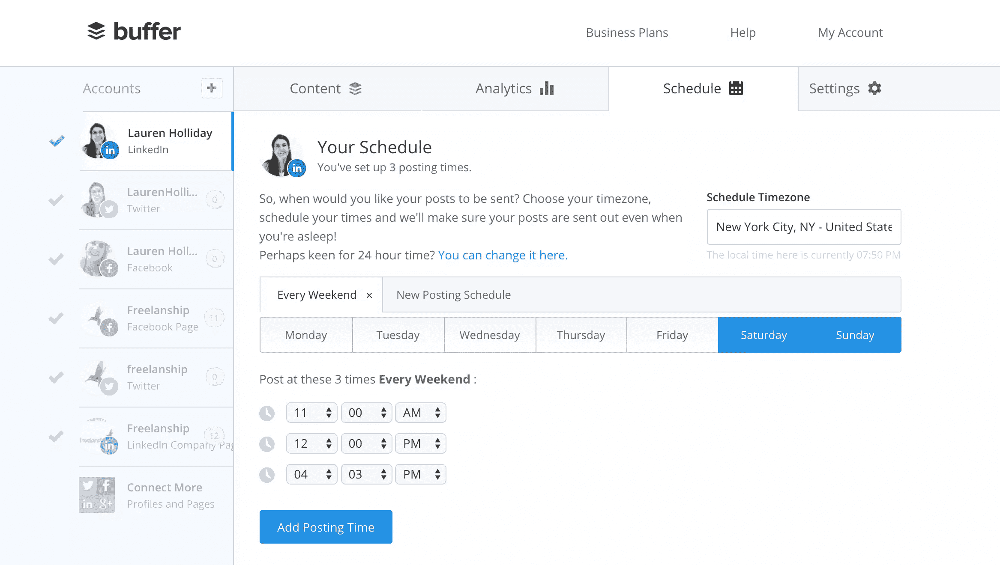
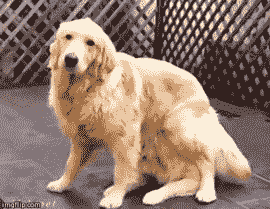
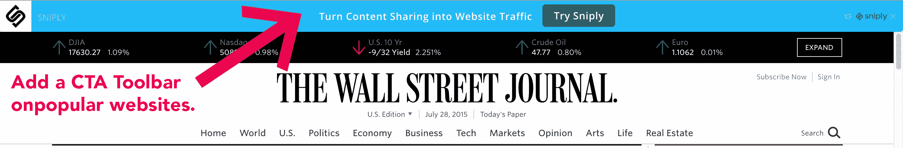
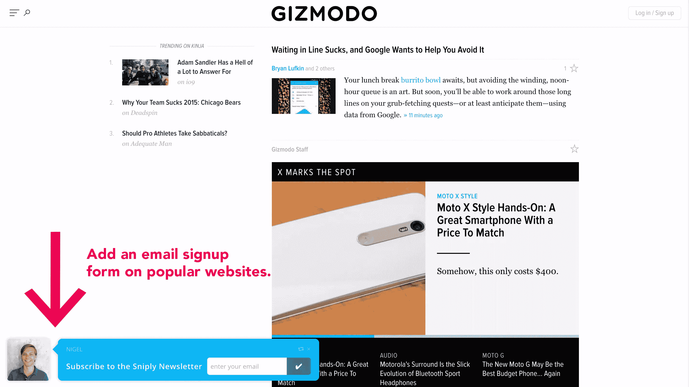

# 如何让你的博客像病毒一样传播

> 原文：<https://www.sitepoint.com/how-to-make-your-blog-post-viral/>

前几天在 [Maker Hunt 的 Slack group](https://www.makerhunt.co/) 中，一位企业家要求#content channel 通读他的 [Medium post](https://medium.com/@marckohlbrugge/1d430cdc7322) ，然后提交给 *TNW、FastCompany、Entrepreneur* 和其他类似的出版物。

这引出了一位酷品猎人 Gabe Roeloffs 的两个问题。

1.  您如何提交内容以发布到热门网站？

2.  *除了写好内容，你如何让你的帖子受欢迎？* 

我对 Gabe 的问题的回答得到了积极的回应，形式是**“发表那条鱼**”

结果就是这篇关于内容分发的文章，在这篇文章中，我告诉你我是如何通过九种分发策略让我的文章受欢迎的。

但首先，让我们从 Gabe 的第一个问题开始。

## 您如何提交内容以发布到热门网站？

我要当一会儿黛比·唐纳，说[出版](https://www.sitepoint.com/editor-confessions/)真他妈的难；也就是说，很有可能你第一次尝试就不会被发表。

除非你的媒体帖子像病毒一样传播，或者除非你是保罗·贾维斯，否则大型出版物——比如上面提到的任何一种——不太可能会重新发表已经在其他地方发表过的东西。

没有人希望马虎秒，再加上这导致内容重复，对 SEO 不利。我当然知道作为一名编辑，我不喜欢聚合内容，除非它真的是好东西。

一般来说，在你的媒体文章被整合之前，你必须先制造一些轰动效应。

你不能只是发布它，然后希望它得到关注，或者某个大的出版物会穿过所有的噪音找到它。

*好消息是 [Medium 是一个大型网络](https://medium.com/the-story/medium-is-not-a-publishing-tool-4c3c63fa41d2)。这就像有一个新的博客，有一个内置的受众。我喜欢它。* 

无论如何，你通过把你的文章分发给正确的地方和/或正确的人来使你的文章受欢迎，然后出版物就会来找你联合发行。

如果出版物没有来找你，去找他们——**假设这个帖子得到了火一样的结果，当然是**。

从 Medium 中截取你的帖子分析的截图，并向编辑发送一份[杀手电子邮件推介](https://blog.growth.supply/how-i-got-6-2-million-pageviews-and-144-920-followers-d4d3fa440802)。

**我强烈推荐阅读[这篇 15 分钟的指南](https://blog.growth.supply/how-i-got-6-2-million-pageviews-and-144-920-followers-d4d3fa440802)来获得出版。**

另外，如果有一家[大众媒体](https://medium.com/me/publications)也分享你的帖子，那真的会很有帮助。这样会得到更多的关注。

[这里有](https://medium.com/the-story/submitting-a-story-to-a-publication-d234638b3577)更多关于向媒体出版物提交你的媒体文章的信息。

## 除了写好内容，你是如何让自己的帖子受欢迎的？

Gabe 绝对是对的——你一定写了一篇很棒的内容才能受欢迎。

以下是我为**非常非常好的**博客帖子制定的九个发布策略。

### 1.在[懈怠](http://slack.com)中分担。

我是几个不同的 Slack 小组的成员。SitePoint 实际上刚刚在这里写了一篇关于 12 个最适合创业者的 Slack 社区的文章。你也可以在这里查看[的热门聊天目录。](http://chats.directory)

### 2.在 [Quibb](http://quibb.com) 上分享。

Quibb 只接受 40%的申请人，但即使如此，我还是建议注册，因为它每天都会给你发送精彩的内容。如果你不是 Quibb 的会员，找一个会员，和他们分享你的好文章。

### 3.在社交媒体上分享。

我更喜欢在脸书、Twitter 和 LinkedIn 上通过 [Buffer](http://bufferapp.com%20) 分享我的博客文章。

对于社交媒体来说，你的**“分享声明”**非常棒是至关重要的，即它让社交媒体用户点击进入你的帖子，或者至少喜欢或转发它。你希望你的“分享声明”如此惊人的原因是因为社交媒体算法倾向于支持获得更多喜欢、点击等的链接。很快。

p . s .–*关注 Kissmetrics 这篇文章的[第 2 期。](https://blog.kissmetrics.com/17-advanced-methods/)* 

p . p . s——总是在你的社交媒体文案中包含漂亮的视觉效果，我建议在 Twitter 上使用 gif，因为它会让你停下来看看。

### 4.与有影响力的顾问和/或导师分享。

我有几个真正有影响力的顾问，我请他们与他们的社交媒体追随者分享我在 T2 非常非常好的内容。对我来说，他们有时是巨大的交通司机。

附言[看看这个工具](http://content.onalytica.com/)，它在产品搜索中帮助你找到有影响力的人来发布推文。

P.P.S. [这是另一个很酷的影响者工具](https://contentmarketer.io/)。

### 5.在论坛和社区上分享。

这里有一篇关于最好的社区和论坛的综述文章。

记住:只把**非常非常好的**文章提交到上面链接的综述文章中列出的网站，这里再一次。

P.S. [HackerNews (HN)](http://news.ycombinator.com) 和 [Reddit](http://reddit.com) 都是难啃的骨头，但这并不意味着做不到。阅读[这篇文章了解更多关于黑掉 HN](https://www.groovehq.com/blog/hacker-news) 的信息，阅读[这篇关于黑掉 Reddit](http://www.searchenginejournal.com/the-reddit-guide-to-massive-traffic/42368/) 的文章。这里是 Reddit 上的[又一个。](http://www.robbierichards.com/social/reddit-traffic/)

### 6.在 [Scoop.it](http://scoop.it) 上分享。

阅读本帖的第二篇[，了解更多关于 Scoop.it 的信息。](http://blog.autopilothq.com/blog-post-promotion-strategies/)

### 7.使用[点火](http://startafire.com/)和[剪断](http://snip.ly)。

我个人两者都不使用，因为[我发现这些工具令人困惑](http://www.business2community.com/digital-marketing/snip-ly-works-website-traffic-01033468)，而且我对[道德与否持观望态度。](http://www.websearchsocial.com/an-absurdly-reasonable-conversation-with-the-founder-of-snip-ly-in-which-we-vehemently-disagree-without-yelling-or-name-calling/)

### 8.在 Quora 上分享。

[本文第二条](http://unbounce.com/social-media/3-ways-to-make-quora-your-secret-marketing-weapon/)关于 Unbounce 提供了一个很好的在 Quora 上推广你的内容的用例。

### 9.通过电子邮件分享。

如果你有一个注册接收你的帖子的人的名单，那么这是一个显而易见的事情。

记住:钱在你的电子邮件里。

另外，试着把你令人惊叹的新博客文章添加到你的电子邮件签名中。如果你安装了[助手](http://getsidekick.com)或 [Yesware](http://yesware.com) ，你甚至可以追踪点击。

### 更多资源

以下是我最喜欢的几篇关于内容分发策略的文章:

*   [分发内容营销-完整指南](http://www.startupmoon.com/distributing-content-marketing-the-complete-guide/)
*   [推广新内容的 17 种先进方法](https://blog.kissmetrics.com/17-advanced-methods/)
*   [如何在 11 周内从零增加到 30，000 页面浏览量(没有预算)](http://www.digitalmarketer.com/content-promotion-tools/?)
*   [16 个爆款内容推广策略](http://www.robbierichards.com/seo/16-explosive-content-promotion-strategies/)

我知道我错过了什么。请在下面的评论里告诉我我忘记了哪些战术，我会回应的。

## 分享这篇文章