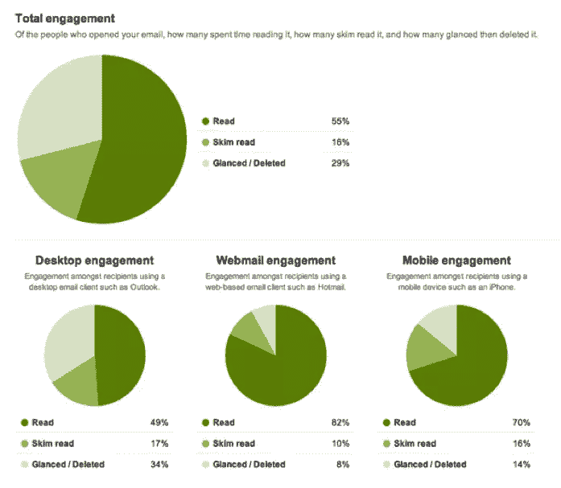

# WordPress 电子邮件营销插件与一体化选项

> 原文：<https://www.sitepoint.com/wordpress-email-marketing-plugins-vs-all-in-one-options/>

就现金而言，签约电子邮件营销服务提供商是一项重大承诺；对很多人来说太大了。

运行一个 WordPress 博客的美妙之处在于有免费和低成本的插件。有几十种电子邮件营销插件可以让你的网站立即投入使用。

不像一刀切的解决方案，插件是用来满足特定的需求，无论你在哪里找到它们。他们让你可以灵活地定制你的网站，以接近你的规格。虽然这非常划算，但是一堆插件会破坏你网站的加载速度，这是一个主要的营销禁忌。

高级插件可能更好，但您仍然会遇到服务器和可送达性问题。

## DIY 电子邮件营销的问题

这种“MacGyver”营销方法通常被称为“自己动手”或“DIY ”,试图从网站服务器上运行 DIY 电子邮件营销活动有两个大问题:

*   服务器限制
*   供应能力

### 服务器限制

大多数网站所有者使用资源有限的共享服务器进行托管。在这些服务器上，你只能非常缓慢地发送电子邮件。你会发现你的网络主机可能会对你正在使用的服务器资源不满意，可能会要求你升级到 VPS 或具有更强处理能力的专用服务器。你可以在这里了解更多关于[各种类型的托管。](https://www.hostt.com/beyond-shared-dedicated-hosting-many-types-web-hosting/)

### 供应能力

在共享服务器上，您与该服务器上的其他站点共享一个 IP 地址。如果其中一个网站之前尝试过发送电子邮件，该 IP 地址可能已经被标记为垃圾邮件的来源，因此您的重要邮件将直接进入垃圾邮件文件夹，永远不会被看到，更不用说打开了。

## 电子邮件营销任务细分

*   设计订阅表单
*   将表单放到网站上
*   捕获电子邮件地址
*   双重选择加入电子邮件确认
*   供应能力
*   自动回复器
*   发送大量电子邮件
*   发送电子邮件
*   根据位置、以前的电子邮件操作等对列表进行分段。
*   告诉你退订率、打开率和删除率的分析
*   A/B 测试

当您看到电子邮件管理服务(EMS)必须处理的任务列表时，您开始理解 DIY、多插件方法的困难。

当你加入图像库，模板和支持，EMS 的收费可以看起来非常合理。

你需要这些功能中的每一项，尤其是分析你发送的电子邮件发生了什么的能力。没有这些信息，你怎么能改进你的电子邮件呢？如果你不能衡量你的结果，就不可能改进它们。

没有分析，你就没有细分或分割测试的能力，你也就失去了让你的邮件更有效的能力。

## 分析学

电子邮件分析不仅仅是数字。一个好的分析仪表板意味着您可以在不看任何复杂的统计分析的情况下做出决策:一切都为您完成，并以简单易懂的图形呈现。

在上面的例子中(摘自 [GetResponse](http://www.getresponse.com/) )，您可以看到典型的电子邮件管理服务分析是多么容易理解。只要看看图表，你就能看出一场运动有多有效。

## A/B 测试

A/B 测试，也称为分割测试，会对你的底线产生巨大的影响。这可能意味着巨大的成功和糟糕的失败之间的差别，然而许多网站所有者还没有费心去测试他们的网站。

[图像来源](http://www.emailaudience.com/wp-content/uploads/2013/04/a-b-split-testing.jpg)

每次拆分测试的差别可能只有 5%，但是如果你对同一封邮件运行 100 次拆分测试，每次都有 5%的差别，那么你的总体结果会好 131 倍(1.05100)。

当使用一个整合了一个好的 AB 测试界面的 EMS 提供者时，获得这些结果比使用 WordPress 插件要简单得多。

## 分割

电子邮件分析意味着你可以根据用户对你之前邮件的反应对他们进行分类。你可以逐渐让那些采取行动的人进一步降低你的转化漏斗。

我们都在收件箱里看到越来越多的营销邮件，这意味着越来越难以区分开来。细分可以让你根据对特定人群最有吸引力的东西来锁定他们。

## 结论

WordPress 插件对于[多](https://www.sitepoint.com/wordpress-popup-plugins/)、[多](https://www.sitepoint.com/free-wordpress-plugins-to-help-boost-your-sites-revenue/)的营销目的来说是很棒的。然而，简单地说，对大多数用户来说，试图用插件“操纵”电子邮件营销系统是个坏主意。

从 DIY 所需的时间，到极端的服务器限制，到网站速度的消耗，到缺乏测试和细分等重要功能，使用专用的电子邮件系统是非常值得的。SitePoint 有一个完整的企业家类别，[经常涵盖电子邮件营销](https://www.sitepoint.com/the-ultimate-guide-for-creating-email-campaigns-in-2016/)，我强烈推荐你去看看。

此外，对于大多数在线业务来说，电子邮件营销无疑是最大的赚钱工具。做对很重要。

你怎么想呢?你成功使用 WordPress 营销插件了吗？你遇到了什么问题？请在下面的评论中分享你的经历。

## 分享这篇文章