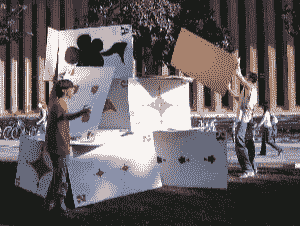
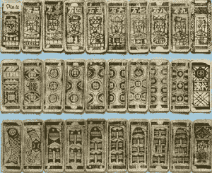
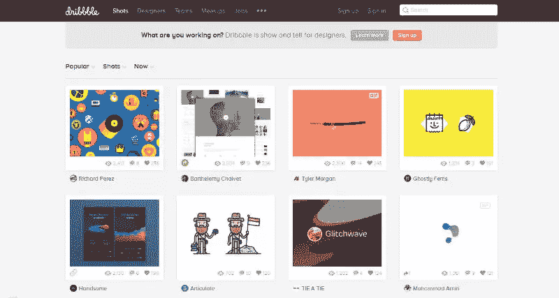
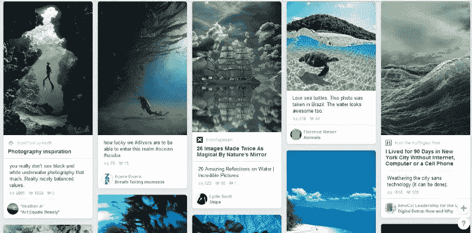
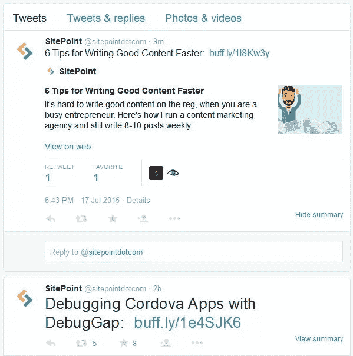
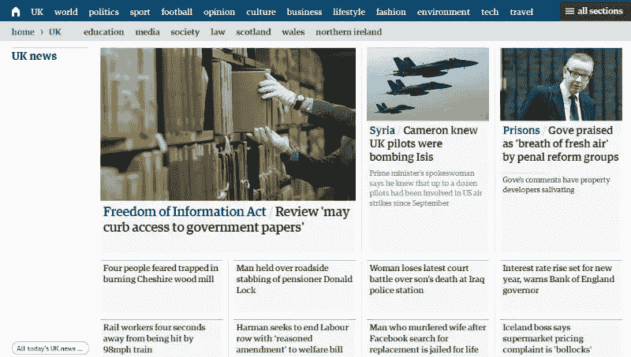

# 卡片技巧:在网页设计布局中使用卡片

> 原文：<https://www.sitepoint.com/card-tricks-using-cards-in-web-design-layouts/>

[摄影:布拉德利·纽曼](https://www.flickr.com/photos/bradley_newman/68924523/)

从社交网络到新闻网站，从在线商店到普通网站，如今卡片在网络上无处不在。

移动技术的兴起，一点一点地，导致了一个新的网站架构，以至于响应式设计和适应性现在是必须的。这促成了“卡片”的成功，它是 2015 年的顶级设计趋势之一。

然而，我们可以合理地肯定，卡片不仅仅是一种短暂的设计时尚，而是 web 开发的未来，因为它们提供了一种以一致的方式组织和显示内容的最佳方式。

所以，在这篇文章中，我将向你解释什么是“卡片设计”，以及它如何影响你的设计。

我们走吧！

## 古往今来的卡片设计

中国古代扑克牌:via [Strangehistory](http://www.strangehistory.net/2012/06/23/the-eastern-origins-of-playing-cards/trackback/)

尽管现在卡片在网页设计中变得非常流行，但至少一千年来，它们一直是视觉传达的有效手段。纸牌最初是在 9 世纪的中华帝国作为一种游戏引入的，后来在商业领域变得很有用。

事实上，在 17 世纪，“商业名片”第一次出现在伦敦，帮助人们寻找生意:它们是现代“商业名片”的早期范例。

今天，卡片是商店和超市发行的优惠券的首选形状，人们收集这些优惠券以获得特殊折扣。

我们大多数人只需看看自己的钱包，就能找到更多值得一提的卡:我们有信用卡、积分卡、购物卡，甚至连标准的驾驶执照都有卡的标准格式。

无论如何，在卡片的传统使用和他们在网页设计中发现的应用之间有一个很强的联系:因为普通的材料卡片通常在两个不同的面上包含信息，所以网页卡片重定向到进一步的内容。

网络上的卡片是什么？

从网络的角度来看，我们可以将“卡片”定义为一个与单一思想相关联的小矩形。卡片充满了互动元素，如文本、链接、按钮或图像，但它们只暗示了一个主要动作:通过“点击”卡片来进一步发现内容。

事实上，卡片的主要目的是在一个压缩的空间里提供某个主题的概述，如果读者感兴趣，只需点击一下就可以在另一页打开该主题。

这对于像脸书或推特这样采用卡片设计模式的网站来说是一个很大的优势，因为它们可以展示大量的内容，同时节省宝贵的空间。

因此，卡片最重要的特点是它们所要传达的互动思想。在设计时，网站开发者应该记住，卡片不仅要突出新闻，还要吸引读者。这就是为什么卡片上有喜欢、分享或阅读全文链接的按钮。

除了有用之外，卡片也是一种常见的设计选择，因为它们与响应式框架兼容。“分块”结构可以创建引人注目的用户界面，但它也非常适合移动平台开发。事实上，卡片的设计与手机屏幕的形状非常相似。

我们经常谈论“流畅”的布局。卡片为我们提供了小单元，允许我们将页面组件“注入”到不同大小和形状的屏幕布局中。

## 为什么要用卡？

由于卡给了我们内在的多功能性，它们可以根据所需的功能以不同的方式使用。那么，让我们来看看使用卡片的一些理由:

*   它们是一种趋势:虽然趋势本质上是短暂的，但使用卡片你可以让你的设计成为不可否认的潮流。
*   **他们注入顺序**:卡片的使用迫使你的内容有一个组织层次。
*   **它们是响应式设计的理想之选:**它们可以轻松融入移动设备的网站和应用程序。最重要的一点是，在智能手机上，卡片很容易垂直堆叠，形成类似饲料的布局。
*   它们鼓励思想的经济性:因为它们是小卡片，所以卡片永远不会包含很多内容。起初，这似乎是一个缺点，但我认为这是一件好事！在卡片中，你应该只突出全部内容的提示，然后鼓励想要更多内容的读者点击查看。
*   **它们是社交的:**卡片非常适合社交媒体，不仅因为它们被社交网络所使用，还因为它们使用户能够轻松地通过社交平台和电子邮件分享内容。
*   所有内容的权重更加均衡:卡片有助于解决你将哪篇文章放在网站顶部的问题。有了卡片，同等重要的内容可以放在同一个页面上，而不必对它们进行排序。读者自己将选择什么是重要的，什么是他想读的。

## 谁在用卡？

## Dribbble

网站的布局是以卡片为基础的，卡片上有一幅图像和一些关于每个设计的信息。我喜欢 Dribbble 设计的原因是，你可以点击卡片来发现更多细节，但你也可以将鼠标指针停在卡片上，让工作的小描述出现。

## 拼趣

说到卡片设计，我们不能不提到 Pinterest。事实上，许多人认为 credit Pinterest 是第一个采用卡片比喻的网站。Pinterest 清楚地证明了“所有内容都很重要”，因为在 Pinterest 上，没有任何卡片比其他卡片更具视觉优势。

### 推特

Twitter 起源于短信 144 个字符的限制，因此诞生了“卡片就绪”的布局。去年，这家社交网络推出了他们自己的产品，名为“ [Twitter Cards](https://dev.twitter.com/cards/overview) ”，这是一款应用程序，旨在帮助你在将自己的内容发布到他们的系统时将其“卡片化”。他们将该应用程序描述为一个机会:

> “在推文中附上丰富的照片、视频和媒体体验，为您的网站增加流量”。

结果是，现在 Twitter 的主页上布满了与推文相关的卡片。点击其中任何一个都会放大内容，有时还会提供第三方选项。

### 《卫报》

这家著名的英国报纸将卡片布局应用到他们的网站上，以便“想出新的方法来改进内容的发现和推广”。

他们已经能够创建一个由不同卡片组成的模块化方案:每张卡片都与一个标题相关联，如果你点击它，就会被重定向到整篇文章。该网站给人一种优雅清晰的整体印象。

## 结论

卡片为创建有吸引力的网站提供了一种有用的方法，也是一种高度灵活的格式，可以实现各种布局，给用户带来很好的体验。

平板电脑和智能手机越来越重要，这将有助于卡片在网页设计中长期占据主导地位。

同时，你会在作品中使用卡片吗？

## 分享这篇文章