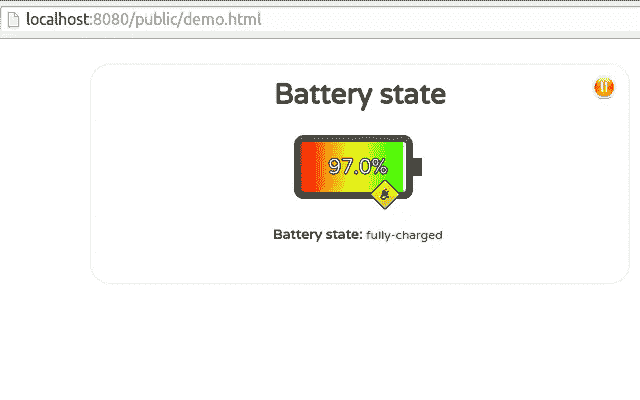

# 使用 Node.js: Client 创建 Battery viz

> 原文：<https://www.sitepoint.com/creating-a-battery-viz-using-node-js-client/>

在这个迷你系列的第一部分[中，我们讨论了我们正在构建的服务的细节以及您将了解到的内容。然后我们讨论了为什么我们需要一个服务器，以及为什么我选择创建一个 RESTful 服务。在讨论如何开发服务器时，我趁机讨论了如何识别当前的操作系统，以及如何使用 Node.js 在其上运行命令。](https://www.sitepoint.com/creating-a-battery-viz-using-js-getting-started-and-server/)

在本系列的第二部分，也是最后一部分，您将发现如何构建客户机部件，以一种良好的方式向用户呈现信息。为了实现这个目标，我们应该每 X 分钟(或秒)更新一次电池的状态，而不需要重新加载页面。此外，我们应该能够暂停/恢复更新，以避免当我们不需要信息时，甚至当我们不看页面时淹没我们的系统。为此，我们将:

*   定期安排 Ajax 调用我们的后端服务；
*   使用声明性框架，该框架响应于数据的变化而自动且有效地更新 DOM
*   使用一些 jQuery 实用函数，让我们的生活更轻松；
*   使用一些漂亮的图片和 CSS 让仪表板看起来更有吸引力(作为奖励！).

## 反应式设计

讨论 Ajax 和异步调用肯定超出了本文的范围(我将在文章末尾提供一些有用的链接)。出于我们的目的，我们甚至可以将它们视为黑盒，允许我们向服务器请求一些数据，并在数据被发送回来后执行一些操作。

相反，让我们花一点时间来讨论反应式设计和声明式框架。

默认情况下，HTML 页面是一个静态实体。这意味着对于纯 HTML 页面，每次在浏览器中呈现时，页面上显示的内容都保持不变。然而，我们知道使用 JavaScript 和一些模板库，比如 [Mustache](https://mustache.github.io/) ，我们可以动态更新它们。

有许多库可以帮助开发人员将数据绑定到 DOM 节点。它们中的大多数使用 JavaScript 来描述数据应该被转换到的 DOM 元素，并且需要手动触发页面更新(通过 JavaScript)。因此，我们最终依赖应用程序的逻辑来决定何时应该更新可视化，以及应该做出哪些更改来响应数据更改。

声明性框架将数据绑定到 DOM 元素，并在每次数据改变时自动更新 DOM。这种绑定也是使用表示中的模板(HTML 标记)而不是 JavaScript 来提供的。

这些框架的附加价值可以通过几个关键点来确定:

*   它们加强了内容和表现之间的分离。这是通过让您在表示层中定义数据绑定、事件处理程序甚至视图结构(比如迭代和复合对象，例如表)来实现的；
*   它们提供了一种简单的方法来保持您的数据模型和您的演示同步；
*   他们通常以一种非常有效的方式做到这一点，确保只回流 DOM 树的最小可能子集。在这方面，请记住，回流和重绘通常是客户端浏览器应用程序的瓶颈。

## Ractive.js

对于 [Ractive.js](http://www.ractivejs.org/) 这个我们要用的库，数据和 DOM 的同步是通过*容器对象*获得的。该库创建包装数据的对象。这些对象可以访问数据，因此每当您设置或获取任何属性时，库都可以捕获您的操作，并在内部将其传播给所有订阅者。

### 亲自动手

现在我们已经看到了 Ractive.js 的用处，是时候将我们的第一个 Ractive 模板添加到我们的页面中了。为此，您可以在`<body>`中的任意位置添加一个带有您选择的 ID 的脚本标签。我建议你明智地选择 ID，因为我们以后会用到它。我们还需要添加一个`type='text/ractive'`属性:

```
<script id='meterVizTemplate' type='text/ractive'></script>
```

对你的浏览器来说实际上毫无意义，因为它会忽略这个脚本，除非你也把 Ractive 的脚本添加到你的页面上:

```
<script src='http://cdn.ractivejs.org/latest/ractive.js'></script>
```

现在，在 Ractive 脚本中，您可以添加 HTML 标签、模板变量和条件/循环。Ractive.js 将负责评估`{{}}`组中的所有内容。

```
<script id='meterVizTemplate' type='text/ractive'> {{#batteryState}}
      <br>
      <div class='battery-div'>
        <div class='battery-shell'>
          <div class='battery-percent-text'>{{batteryPercent.toFixed(1) + '%'}}</div>
        </div>
        <div class='battery-level'>
          <div class='battery-mask' style="width:{{(100 - batteryPercent) + '%'}};">
          </div>                
        </div>
        {{#batteryCharging}}
          <div class='battery-plug' intro-outro='fade:1000'></div>
        {{/batteryCharging}}
        {{#batteryPercent <= batteryRedThreshold}}
          <div class='battery-warning' intro-outro='fade:1000'></div>
        {{/batteryLife}}                
      </div>
      <br>
      <br>
        <span class='key'>Battery state:</span> <span class='value {{batteryStateClass(batteryState)}}'>{{batteryState}}</span>
        <br>
        {{#batteryLife}}
          <span class='key'>Time to empty:</span> <span class='value {{batteryLifeClass(batteryPercent)}}'>{{batteryLife}}</span>
        {{/batteryLife}}                  
    {{/batteryState}}
    {{^batteryState}}
      <br>
      LOADING...
    {{/batteryState}} </script>
```

在上面的示例中，您可以看到:

*   变量:`{{batteryState}}`
*   条件句:`{{#batteryState}}`
*   函数调用:`{{batteryStateClass(batteryState)}}`

为了让这些东西工作，我们必须在 JavaScript 中添加一些绑定。为此，我们必须创建一个新的 Ractive.js 对象:

```
ractive = new Ractive({
    el: 'panels',
    template: '#meterVizTemplate',
    data: {
        // Percentage at which the battery goes to 'red' zone (export for Ractive templates)
        batteryRedThreshold: BATTERY_RED_THRESHOLD,
        // Percentage at which the battery enters 'yellow' zone (export for Ractive templates)
        batteryYellowThreshold: BATTERY_YELLOW_THRESHOLD,
        // The capacity of the battery, in percentage. Initially empty
        batteryPercent: NaN,
        // How much more time can the battery last?
        batteryLife: "",
        // True <=> the update daemon for the battery has been paused
        batteryPaused: false,
        // True <=> the update daemon for the battery has reported an error at its last try
        batteryUpdateError: false,
        // Is the battery connected to power?
        batteryCharging: false,
        batteryStateClass: function (state) {
            return state === 'discharging' ? BATTERY_RED_CLASS : BATTERY_GREEN_CLASS;
        },
        batteryLifeClass: function (percent) {
            return percent <= BATTERY_RED_THRESHOLD ? BATTERY_RED_CLASS : (percent <= BATTERY_YELLOW_THRESHOLD ? BATTERY_YELLOW_CLASS : BATTERY_GREEN_CLASS);
        }
    }
});
```

我们传递给构造函数的选项非常重要。首先，`el`需要匹配一个 DOM 元素的 ID，Ractive.js 将在其中呈现模板。在这种情况下，我们需要添加一个`div`到我们的 HTML 页面:

```
<div id='panels'></div>
```

插入这个标签的位置很重要。它将是 Ractive.js 模板系统渲染的所有元素的*父*元素。你必须小心的第二个重要参数是`template`。它的值必须与页面上的`text/ractive`脚本的 ID 相匹配。最后，我们给`data`分配一个对象，它的键是我们在模板中引用的变量名，或者我们调用的函数。

使用 Ractive.js，我们甚至可以定义库将响应的自定义事件:

```
ractive.on({
    "battery-pause": function () {
        clearInterval(batteryUpdateTimerId);
        ractive.set('batteryPaused', true);
    },
        "battery-play": function () {
        updateBatteryStatus(); //Checks the status immediately, then starts the daemon
        batteryUpdateTimerId = setInterval(updateBatteryStatus, BATTERY_CHECK_INTERVAL);
        ractive.set('batteryPaused', false);
    }
});
```

在几行代码中，我们建立了一个暂停/恢复更新的机制。但是，我们仍然需要定义`updateBatteryStatus()`函数。

## 异步检索数据

正如所承诺的，这是一个负责从 REST 服务中检索数据的函数。通过使用 [jQuery 延迟对象](https://api.jquery.com/category/deferred-object/)，我们设置了一个回调，一旦从服务器接收到一些数据，就会调用这个回调。因为我们在这个回调中也使用了 Ractive.js，所以我们不需要经历我们如何更新表示层的逻辑。事实上，我们只是更新模板脚本中使用的变量的值，Ractive.js 会处理好一切。

我刚才描述的是通过下面报告的代码实现的:

```
function updateBatteryStatus() {
    $.getJSON(BATTERY_SERVICE_URL)
        .then(function (battery) {
        ractive.set('batteryUpdateError', false);
        var batteryLife = battery.timeToEmpty,
            batteryState = battery.state;
        ractive.animate('batteryPercent', parseInt(battery.percentage, 10), {
            easing: 'easeOut'
        });
        ractive.set('batteryLife', batteryLife);
        ractive.set('batteryState', batteryState);
        ractive.set('batteryCharging', batteryState !== BATTERY_STATE_DISCHARGING);

    }).fail(function () {
        ractive.set('batteryUpdateError', true);
    });
}

//Start the daemons that will check the battery and networks status...
batteryUpdateTimerId = setInterval(updateBatteryStatus, BATTERY_CHECK_INTERVAL);
```

## 把所有的放在一起

当然，要让所有这些功能一起工作，还需要更多的布线。我们完全跳过了仪表板 UX 的设计。一旦你知道如何使用模板系统，这最终取决于你！例如，如果我们可以使用图像和动画，以文本和一些很酷的电源指示器来显示充电百分比，那该有多酷？有了 Ractive.js，就没那么难了！看看最后的结果:



如果你想检查代码，你可以在 GitHub 上再次找到它。

## 结论

我们的多平台电池仪表盘现在应该可以使用了。但这应该是一个起点，而不是最终结果，我希望你在这个过程中学到的要点是:

*   如何使用 Node.js 设置 HTTP 服务器
*   RESTful APIs
*   如何在 Node.js 服务器上运行操作系统终端命令
*   声明性框架的基础，尤其是 Ractive.js

如果你想更上一层楼，我的建议是开始尝试这些工具，并挖网加深这些领域的知识。如果您想深化本文涉及的主题，我强烈建议您看看这些好资源:

*   [架构风格和基于网络的软件架构设计](http://www.ics.uci.edu/~fielding/pubs/dissertation/top.htm)
*   [创建 RESTful API 的指南](http://www.programmableweb.com/news/guidelines-creating-restful-api/how-to/2014/07/11)
*   使用 REST API 相对于原生库有什么优点/缺点？
*   [模板方法模式](https://www.youtube.com/watch?v=aR1B8MlwbRI)
*   JavaScript 中的异步请求
*   JavaScript 上的 Crockford 第四集:Ajax 的变形-像往常一样，很棒的洞察力，加上一个关于 Ajax 这个术语起源的超级有趣的故事，作为奖励！
*   [jQuery `$.getJSON`方法](http://api.jquery.com/jquery.getjson/)
*   [RactiveJs 教程](http://learn.ractivejs.org/hello-world/1/)

## 分享这篇文章