# 海明威编辑 2 评论

> 原文：<https://www.sitepoint.com/hemingway-editor-2-review/>

*2014 年， [Jacco Blankenspoor 看了看海明威编辑器的新桌面应用](https://www.sitepoint.com/review-hemingway-desktop-app/)。当时，Jacco 决定坚持使用网络版的海明威——尤其是因为桌面版的显示错误。现在，一年后，我们的常驻 PHP 编辑布鲁诺·什科沃茨带我们看看海明威编辑器 2，看看它怎么样——特别是从一个技术作家的角度。*

* * *

作为 SitePoint 的 PHP 频道编辑，我要处理大量的文本。每周都有数百封邮件和数十份草稿在我眼前飞来飞去。这可能不是显而易见的，但是为了使草案可以发表，做了很多工作。有格式化、语言修正、图像处理、代码测试、语法高亮等等。

因此，尽可能多地将低脑力劳动自动化是非常重要的。自动化允许编辑更多地关注内容和代码。这反过来又防止了时间的浪费。这是像海明威这样的工具最能发挥作用的地方。

## 海明威是什么？

海明威是一个写作辅助工具。它会留意一个人的措辞和句子结构，并提出修改建议。典型的修正包括缩短句子，用主动语态代替被动语态，减少副词。该应用程序还配有针对几种英语方言的内置拼写检查器。

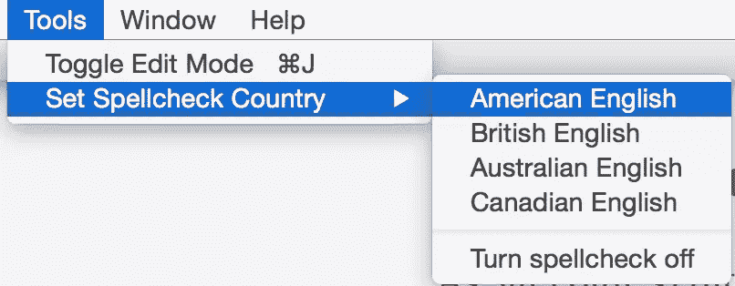

我已经彻底研究了海明威编辑器 2，下面是利弊清单。该列表可能适用于您，也可能不适用于您；这要看你做了多少写作或编辑，用了什么格式。作为一名程序员，我也对海明威如何处理代码和 Markdown (MD)语法等事情感兴趣。我的希望是，当考虑日常使用的工具时，这个列表将作为一个有用的指南。

## 赞成的意见

语言分析和修正建议是海明威的核心，也是迄今为止最有用的功能。

海明威突出了它不喜欢的句子，让你在继续之前停下来思考。复杂的长句会发出红光，首先吸引你的注意力。那些稍微有点长的用黄色突出显示。

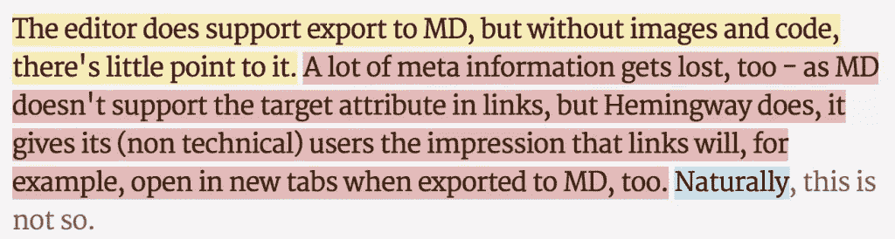

在版本 2 中，我还没有遇到桌面应用刚推出时似乎困扰它的显示错误。

有时候感觉好像是假设读者太笨了:

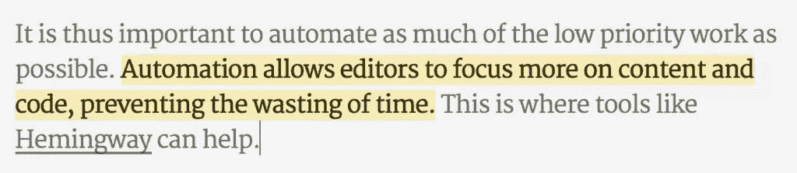

这个句子真的太长了吗？在大多数情况下，它确实以一种好的方式减慢了作者的速度:

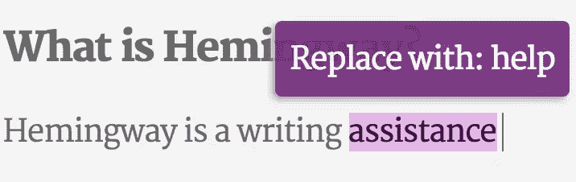

这迫使作者思考语言结构和重新措辞以获得更广泛的吸引力。老实说，我确实认为 SitePoint 的读者高于阅读水平。“首选等级”设置对于更科学/技术的文本将是有用的。

我不确定我是否同意对副词的激烈否定:

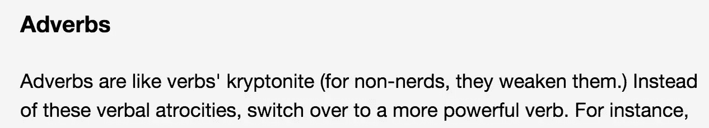

…但我绝对同意避免被动语态，所以能察觉到这一点是很棒的:

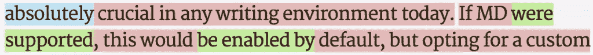

这里有一个需要重写的段落的例子:

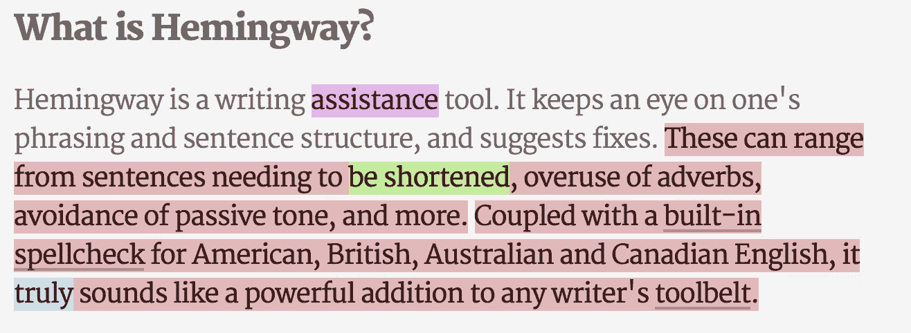

哇，那一段亮得像棵圣诞树，是吧？让我们试着修理它。第一个红色句子使用被动语态，过于复杂。

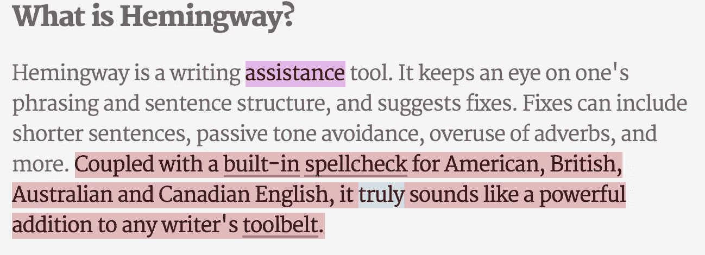

那更好。那么第二个怪物呢？

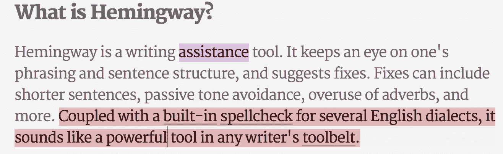

嗯，这不管用。我想知道为什么。如果海明威能告诉我到底是什么困扰着我，那就太好了。不过，这确实让我思考最后一部分是否有必要，所以我把它删掉了。

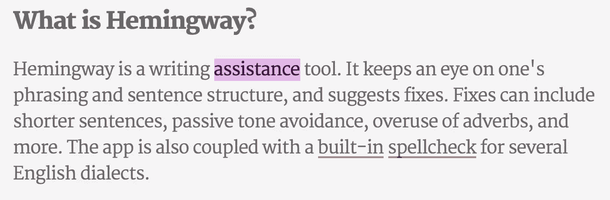

修复该段落将文本的等级从 8 级降至 7 级。成功！

不幸的是，好的部分也就这么多了。

## 骗局

立刻，不支持 Markdown 是一记耳光。版本 1 曾经有过，但是因为某种原因，被去掉了。

海明威的编辑领域由 CKEditor 支持，并且使用 CK 的丰富文本功能。这意味着我们得到了理论上可以导出到 MD 和/或 HTML 的内嵌格式。然而，我们受出口商的支配，在这种情况下，出口商是完全不灵活的。

不支持图片。对我来说，这在今天的任何写作环境中都是必须的。如果它支持 MD，这将是默认启用的。在编辑器有机会起飞之前，选择一个定制的“丰富”格式使它停飞了。

也没有办法定义自定义导出方法，尽管海明威网站声称是 CMS 友好的:

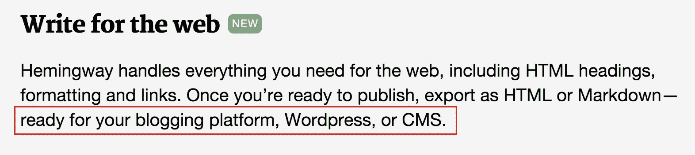

遗憾的是也不支持代码片段。

编辑器确实支持导出到 MD，但是没有图像和代码，所以它对我的工作流没有什么意义。许多其他信息也会在导出过程中丢失。比如 MD 不支持链接中的目标属性(即`"_blank"`)。海明威有。因此，它给它的(非技术)用户的印象是，当导出到 MD 时，链接将在新的标签中打开。

该编辑器有一个另存为选项，虽然它允许用户用他们想要的任何扩展名保存文件，但它不会打开这些文件。因此，将文件保存为 MD 格式，甚至尝试打开 MD 格式的文件，都是不可行的。此外，使用“另存为”保存文件实际上不会确认保存，并且会警告用户未保存的更改。

除了缺乏降价支持，还有一些小的 UI/UX 问题。首先，字计数器只在编辑模式下可见，在写入模式下不可见。写有长度范围的文章时，计数器非常非常有用。不得不切换会分散注意力，打断写作流程。

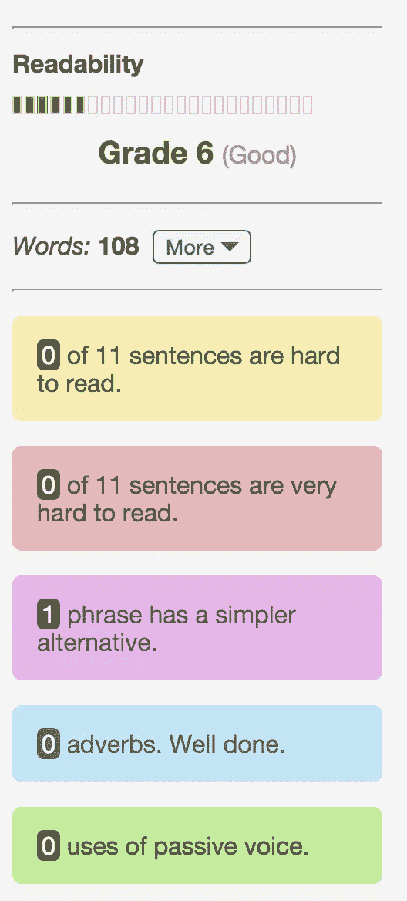

第二，全屏模式可以更饱满。有很多浪费的空间可以更好地用于提高更宽屏幕上的可读性:

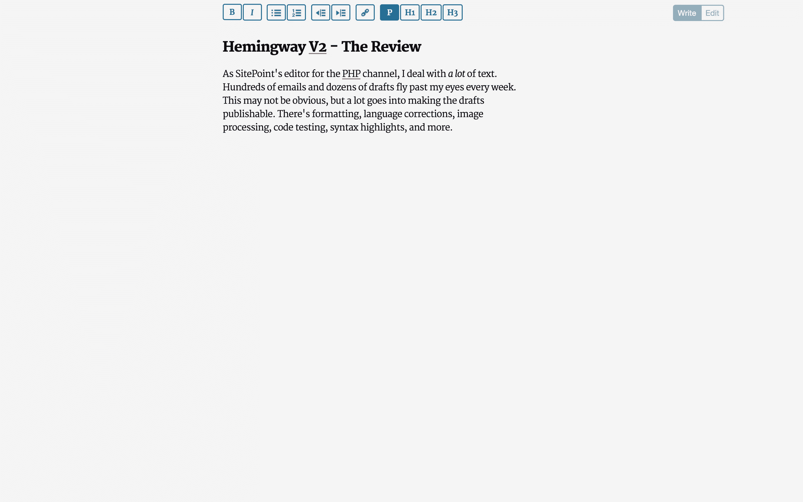

同样由于 CKEditor，浏览器的拼写检查器不会在拼写错误后立即触发。对于较大的文本来说尤其如此。问题不大，但是会让人分心。

还有用户界面的不一致性。要获取 HTML 输出，你去另存为，而获取 MD 或 Docx 需要去文件->导出。说到导出，在屏幕上查看导出要比基于文件的导出好得多。通常情况下，你只是想把它放在你的剪贴板上。

一些 UI 分组也很奇怪。例如,“凸排”和“缩进”按钮与所有其他格式控件处于同一级别。尽管如此，它们只对列表元素有效，而且只能在两个方向的一个级别上有效。粘贴也是不确定的:它会让屏幕跳转到文本中一个奇怪的位置。

然后还有 bug。我发现的两个交易破坏者是:

*   将文件导出到已经存在同名文件的文件夹中，并确认覆盖会自动失败
*   HTML 实体在导出时会得到编码，所以你的 MD 最后看起来是这样的:
    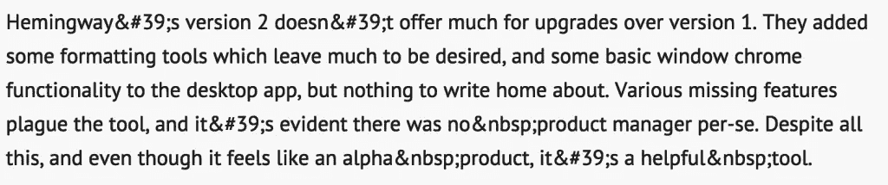这是不可接受的；就好像这个应用根本没有经过测试一样。

## 其他想法

Hemingway 应用程序完全是用 JavaScript 编写的，因此公开了它的代码[，如这里看到的](https://www.hemingwayapp.com/dist/final/hem-obf.js)。它的离线版本是一个精简版的 Chrome，使用的是同样的东西。因此，很容易对它进行逆向工程，构建更好的东西。这是一个想法:一个降价编辑器—

*   由 [Woofmark](https://github.com/bevacqua/woofmark) 提供动力
*   具有由 [CommonMark](https://commonmark.thephpleague.com/) 支持的可定制导出器
*   有一个标题规格化器，由标题大写驱动
*   有一个由海明威的 JS 驱动的身体检查器
*   有一个图片上传器，由类似 [Dropzone](https://www.dropzonejs.com/) 的东西驱动
*   等等。

## 结论

海明威的第二版并没有比第一版提供更多。新的格式化工具还有很多需要改进的地方，新的、相当基础的窗口镶边功能也不太令人兴奋。写作过程令人分心，错误百出，而不是有益的。各种缺失的特性困扰着这个工具，让我感觉它仍然是一个 alpha 产品。尽管如此，它仍然是一个有用的工具。

从我的角度来看，作为一个喜欢 Markdown 和写代码的人，我不能建议购买桌面版。但我一定会关注它，对它的未来保持乐观。它正在成为一个好的文本编辑器，而且没有多余的。

我给海明威目前的迭代打 2/5 分。

*附:这篇课文完全是海明威写的，得了 5 分。你怎么想？简化的太明显还是刚刚好？让我知道！*

## 分享这篇文章