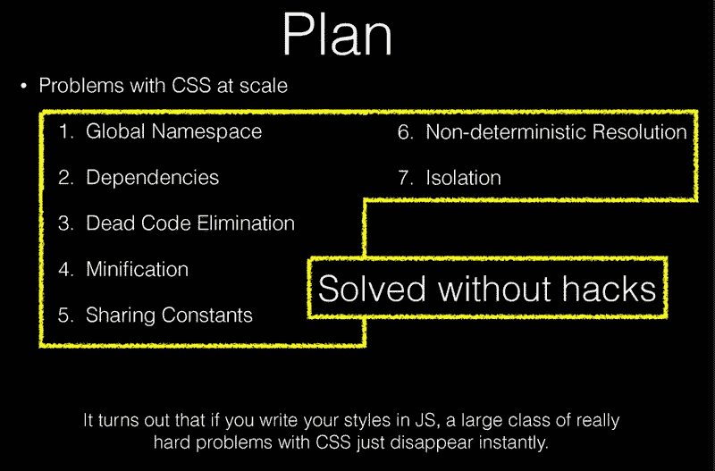
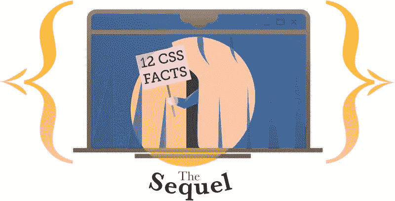
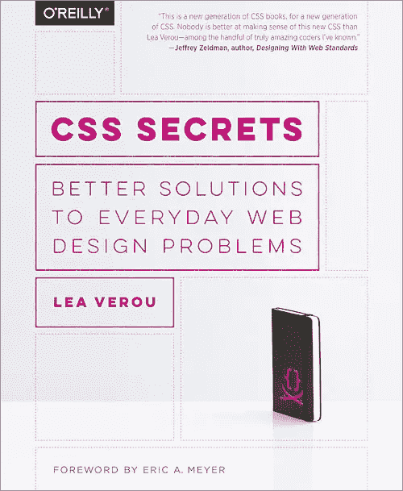
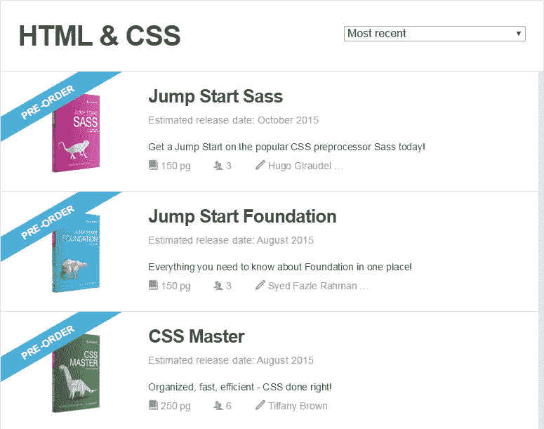

# CSS 还活着，而且很好

> 原文：<https://www.sitepoint.com/css-is-alive-and-well/>

由于脸书的用户界面库 [React](http://facebook.github.io/react/) 越来越受欢迎，已经有一些关于 CSS 主题的讨论，以及它在当前形式下是否有未来——也就是说，在单独的样式表中声明的形式，为给定的页面或标记部分提供表示信息。

我不打算在这里重复讨论或利弊。对于那些不熟悉的人，这里有几个链接你可以看看:

*   围绕“我们还需要 CSS 吗？”克里斯·科伊尔
*   [React:JS 幻灯片中的 CSS](https://speakerdeck.com/vjeux/react-css-in-js)和[视频演示](https://vimeo.com/116209150)

但是我要做的是提供一些强有力的证据来证明 CSS 仍然存在并且发展良好。

## 开发者们焦躁不安

当我在像[这一篇](http://www.smashingmagazine.com/2013/10/challenging-css-best-practices-atomic-approach/)或[这一篇](https://www.sitepoint.com/using-helper-classes-dry-scale-css/)这样的文章的评论区中读到反应和激烈的争论时，有两件事变得很清楚:

*   开发者对 CSS 充满热情
*   开发人员对为大型 CSS 项目提出的一些解决方案不满意

上面介绍的第二个要点中的两个链接是幻灯片和 Christopher Chedeau 的视频演示，他是脸书 React 项目的开发人员。在过去的一周里，我第一次尝试对 React 有所了解，这要感谢 Shu Uesegi 的这个很棒的教程。简单的介绍之后，幻灯片给了我更多的背景知识。

Christopher 提出了 7 个 CSS 架构问题，他认为可以通过使用 JavaScript 来管理和实现样式来解决这些问题。这是让许多纯粹主义者不寒而栗的事情，因为使用 React，您基本上是在 JavaScript 中编写您的标记和样式——为了保持“关注点分离”,通常不鼓励这样做。

下面的截图捕捉到了 Christopher 在这方面的相关幻灯片，概述了 React 试图解决的 7 个问题:

Christopher 为用 JavaScript 解决 CSS 的问题提供了一个很好的例子，所以我强烈建议你保持开放的心态，看看他的幻灯片(虽然我会原谅他说 w3schools 是他最喜欢的学习 JavaScript 的网站！).

所以很明显，感觉需要一场 CSS 革命，有些人可能会说这场革命已经开始了。但同样清楚的是，当前形式的 CSS 不会很快消失。

## CSS 技巧和窍门需求量很大

如果你在过去一周左右关注你的 RSS 订阅和 Twitter 流，那么你可能会看到我最近的 CSS 文章。这是写得最愉快的文章之一，从评论和社交媒体上令人难以置信的反应来看，我很高兴看到读者也同样愉快。

SitePoint/ [Natalia Balska](http://scncf-lab.com/) 的作品。

这些类型文章的流行表明开发人员仍然喜欢传统形式的 CSS。伊利亚·格里戈利克、T2、粉碎杂志、T4 和其他人的推文被分享和收藏了数百次。这篇文章和它的前身的流量惊人。

我文章中的内容大多涵盖了浏览器中已经存在多年的东西，而不仅仅是新的“CSS3”特性。事实上，我有意尝试使用尽可能多的跨浏览器 CSS 技巧，得到的回应是压倒性的。

但是这种事情并不是我的文章所独有的。考虑过去在社区中其他站点上的热门 CSS 文章。两个立即浮现在脑海中的，并非巧合，都是海登·皮克林的作品:

*   [俄罗斯方块和 CSS 的力量](http://www.heydonworks.com/article/tetris-the-power-of-css)
*   [CSS 数量查询](http://alistapart.com/article/quantity-queries-for-css)

读者们喜欢这种东西！各种水平的 CSS 开发者，甚至后端开发者，肯定喜欢那种内容。它有一个特殊的吸引力，因为它是独一无二的，它表明在 CSS 中总是有新的东西可以学习。我不知道这些文章的流量是多少，但我敢肯定，与同一时间同一网站上的其他文章相比，它们的流量是非常高的。

## CSS 书籍需求量很大

上个月，因在 CSS 秘密会议上的演讲而闻名业界的 Lea Verou([第一](http://lea.verou.me/css3-secrets/)和[第二](http://lea.verou.me/more-css-secrets/))根据她广受欢迎的“秘密”前提为[奥赖利](http://shop.oreilly.com/product/0636920031123.do)写了一本书。

在过去的 5 年里，她的“秘密”演讲是会议中分享最多、最受欢迎的演讲之一。难怪她用这个前提来催生一个图书项目。

在撰写本文时，Lea 的书在亚马逊上排名前 3，000 名(包括所有书籍，不仅限于 web 开发)，并且在许多不同的特定于开发人员的亚马逊类别中排名前二或前三。

这再次表明，当前形式的 CSS 仍然有很高的需求，而且不会很快消失。

同样，在 SitePoint，我们仍然在 SitePoint Premium (以前的 Learnable)上以书籍和课程的形式提供大量 CSS 内容。SitePoint Premium 上一些最受欢迎的标题是基于 CSS 的内容。还有[更多的 CSS 内容](https://www.sitepoint.com/premium/books/jump-start-sass) [在酝酿](https://www.sitepoint.com/premium/books/css-master)。因此，需求并没有放缓。

## React 不会杀 CSS

正如 Chris Coyier 在他的文章中指出的那样(链接见上文介绍):

> 没有人说我们不需要风格。我们仍然需要设计风格，现在讨论的是如何以及在哪里做。

这意味着，即使业界赶上了 React 这样的东西，我们开始在 JavaScript 中生成我们的标记和样式，我们仍然需要研究 CSS，学习新的技巧，并发现鲜为人知的新事实。我们只是在 JavaScript 中管理它们，而不是在单独的样式表中。Chris 目前在 CSS-Tricks 上进行的一项民意调查也表明，大多数开发人员不喜欢 React 在 CSS 方面带来的东西。

还应该注意的是[有很多重要的东西反应不好](https://github.com/reactjs/react-future/issues/8)。因此，在我们挂起我们的`.css`文件并将所有内容移入我们的脚本之前，我们还有很长的路要走。

## 最后的想法

CSS 受欢迎的部分原因是它容易学习但很难掌握。当 CSS 与 JavaScript 混合在一起时，“简单易学”的部分开始消失。仅仅因为这个原因，我认为我们会一直使用传统的样式表。但一些前端工程师可能会选择使用更高级的选项来应对 Christopher Chedeau 在幻灯片中试图应对的挑战。

这是我目前的观点，可能有点无知，基于我在过去一周观察到的一些事情。你怎么想呢?传统 CSS 可以和 React 类实现共存吗？还是 React 目前的模式只是一种时尚，可能会演变成更符合我们习惯的东西？让我知道你的想法。

## 分享这篇文章