# 用 AngularJS、Stripe 和 Stamplay 创建一个读书俱乐部应用程序

> 原文：<https://www.sitepoint.com/creating-a-fully-featured-book-club-app-with-stamplay/>

*本文由 [Stamplay](https://stamplay.com/) 赞助。感谢您对使 SitePoint 成为可能的赞助商的支持。*

作为一名前端开发人员，我经常发现自己在用 Angular 和 React 这样的框架为自己的项目创建丰富的 UI，但有一点是，你的应用程序需要数据、持久性、业务逻辑、电子邮件和一系列其他行为，这些通常是后端开发人员的领域。Stamplay 是一项服务，旨在使应用程序开发的这些方面像填写表格一样简单。

让我们通过使用 Stamplay 构建一个“后端”来充实一个简单的图书俱乐部应用程序。用户将能够对他们读过的书籍发表带有评级的评论。他们也可以投票支持其他评论。我们会对用户进入读书俱乐部收费，当他们注册时，我们会给他们发一封欢迎邮件。

## 入门指南

我已经为图书俱乐部应用程序创建了一个前端的外壳。随着本教程的深入，我们将使用 Stamplay 来填补空白。

要开始，您需要克隆以下 [repo](https://github.com/bradbarrow/sp-stamplay/) :

```
git clone git@github.com:bradbarrow/sp-stamplay.git
```

在项目目录中，检查`starter`分支:

```
git checkout starter
```

然后运行以下命令:

```
bower install
```

这将安装以下内容:

*   安古斯
*   [Stamplay SDK](https://github.com/Stamplay/stamplay-js-sdk)
*   Bootstrap CSS
*   角度引导用户界面
*   离子体
*   Algolia 搜索客户端

我们还包括了 Stripe 的 JavaScript 客户端。

要运行该应用程序，您需要安装一个 http 服务器。我喜欢使用`lr-http-server`,你可以通过运行:

```
npm install -g lr-http-server
```

然后在您的项目目录中简单地运行`lr-http-server -p 8080`。

## 设置 Stamplay

Stamplay 很容易上手。只需访问[他们的注册页面](https://editor.stamplay.com/register)并点击**创建新账户**按钮即可获得一个账户。

### 创建我们的第一个应用程序

在 [Stamplay 编辑器](https://editor.stamplay.com/)中，给你的新应用一个唯一的名字，然后点击创建按钮。我们把我们的应用程序叫做**读书俱乐部**

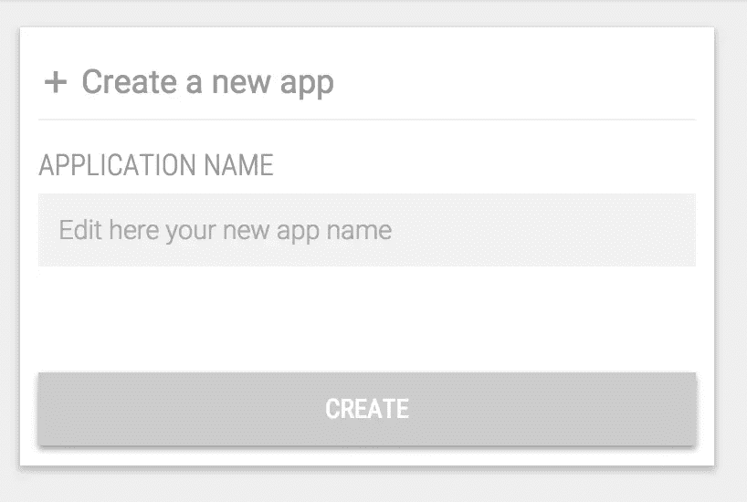

现在，您将登陆该应用程序的仪表板。请注意这一页，因为它包含一些将我们的前端连接到 Stamplay 的重要信息。

### Stamplay CLI

为了使用 Stamplay，我们需要将我们的应用程序连接到 Stamplay 的 API。Stamplay 为此提供了一个 npm 包。继续安装 [stamplay-cli](https://www.npmjs.com/package/stamplay-cli) 软件包。

```
npm install -g stamplay-cli
```

现在您可以在您的项目目录中运行`stamplay init`来生成一个`stamplay.json`文件。

你需要你的应用程序的**应用程序 ID** 和 **API 密钥**，它们都可以在你的应用程序仪表板上找到，如上所述。

## 读书俱乐部需要书

如果我们要成立读书俱乐部，我们就需要书。我们的应用程序已经在`index.html`有一个书单，在`scripts/app.js`有一个`BooksController`。在将我们的 Book *CustomObject* 连接到我们的应用程序之前，让我们转到 Stamplay 并设置它。

在你应用的仪表盘上，点击左边菜单中的对象链接，然后点击 *+添加*。在对象名字段中输入`book`，然后点击`enter`开始填写它的属性。

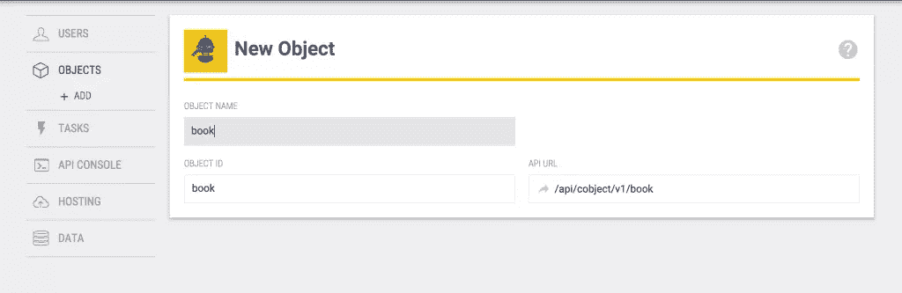

我们将只添加一个名为“title”的字符串属性。

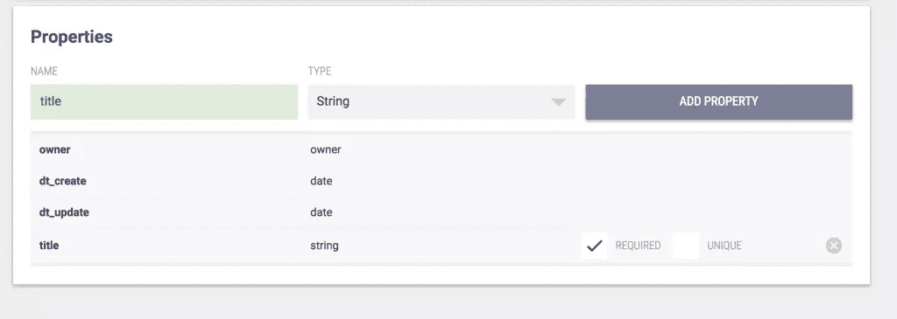

## 试用 Stamplay API 控制台

Stamplay 有一个 API 控制台，可以帮助您与应用程序进行交互。它允许您执行 API 操作来获取/设置数据，并查看您的应用程序如何响应。

让我们使用控制台添加我们的第一本书(稍后我们将使用自己的应用程序添加书籍)。

点击 Stamplay 编辑器左侧菜单中的 API 控制台。

从操作菜单中，选择“创建对象”。

在 API URL 字段中，从下拉列表中选择“book”。

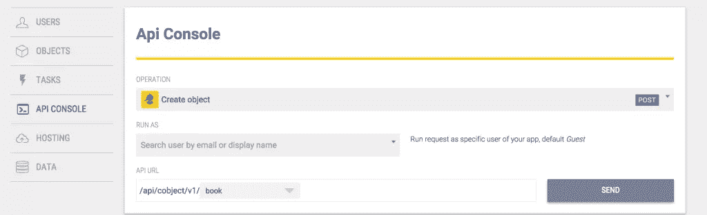

将出现一个表单，询问您要添加的图书的书名。再加一句“杀死一只嘲鸟”。点击发送按钮。

当请求被发送到你的应用程序的 API 时，我们会看到它，最终我们会得到响应。一切顺利的话，应该是 200 OK。

我们把操作改为“获取所有对象”，再次选择“图书”。再次点击发送，我们应该会得到一个包含“杀死一只嘲鸟”的响应。

现在是时候将数据输入我们的前端了。

### 将书籍连接到我们的前端

打开`scripts/app.js`。在文件的顶部添加以下行:

```
Stamplay.init('YOURAPPID');
```

这是使用来自我们包含在`index.html`中的 Stamplay SDK 的`Stamplay`全局。init 函数标识我们的应用程序，以便我们的其余调用到达正确的应用程序。

接下来，我们将创建一个图书服务来从 Stamplay 获取我们的图书。更新`app.js`如下:

```
Stamplay.init("bookclub");

var app = angular.module('stamplay', ['ngStamplay']);

app.controller('BooksController', function($scope, $rootScope, $stamplay, Book){
  $scope.books = [];

  Book.all().then(function(books){
    $scope.books = books;
  });
});

app.factory('Book', function($q, $stamplay){
  function all() {
    var deferred = $q.defer();

    var BookCollection = $stamplay.Cobject('book').Collection;
    BookCollection.fetch().then(function() {
      deferred.resolve(BookCollection.instance);
    });

    return deferred.promise;
  }

  return {
    all: all
  }
});
```

> 你会注意到我们在这里使用了`$stamplay`。这是因为我们包含了 ngStamplay 模块。

我们在这里做的是使用 Angular Stamplay SDK 来获取我们的图书收藏。我们用一个`all()`方法创建了一个简单的图书服务。

all 方法在内部调用 Stamplay book 集合上的`fetch()`，该集合返回一个[承诺](https://stamplay.com/docs/jssdk#promises-using-then)。一旦它被解析，BookCollection 将被填充。(记住，Stamplay 模型和集合本质上是 [Backbone.js](http://backbonejs.org/#Collection) 结构。

在 BooksController 中，我们简单地注入我们的服务并调用`all()`方法来填充作用域上的 books 数组。

在 index.html，我们需要将{{book.title}}行更改为{{book.instance.title}}，以符合 Stamplay 的数据结构。你也可以调用 book.get('title ')。

现在，当您在浏览器中查看应用程序时，您应该会在图书列表中看到“杀死一只嘲鸟”。

### 添加新书

让我们添加从应用程序创建新书的功能。首先，我们将在图书列表的顶部创建一个表单:

```
<div class="panel panel-default" ng-controller="BooksController">
   <div class="panel-heading">
     Books
   </div>
   <div class="panel-body">
     <form class="form-horizontal" ng-submit="addBook()">
       <div class="form-group">
         <label for="title" class="col-sm-2 control-label">Book Title</label>
         <div class="col-sm-10">
           <input
             type="text"
             ng-model="newBook.title"
             class="form-control"
             id="title"
             placeholder="The Lord of the Rings"
             autocomplete="off">
         </div>
       </div>
       <div class="form-group">
         <div class="col-sm-offset-2 col-sm-10">
           <button type="submit" class="btn btn-default">Add Book</button>
         </div>
       </div>
     </form>
   </div>
   <div class="list-group">
     <div class="list-group-item" ng-repeat="book in books">
       {{book.instance.title}}
     </div>
   </div>
 </div>
```

然后，我们将向我们的图书服务添加一个名为`add`的新方法:

```
app.factory('Book', function($q, $stamplay){
  function all() {
    ...
  }

  function add(book) {
    var deferred = $q.defer();

    var BookModel = $stamplay.Cobject('book').Model;
    BookModel.set('title', book.title);
    BookModel.save().then(function() {
      deferred.resolve(BookModel);
    });

    return deferred.promise;
  }

  return {
    all: all,
    add: add
  }
});
```

这里你可以看到我们使用了自定义对象的模型，而不是集合。我们创建一个新的空书，指定它的标题，然后保存它。然后，我们用最终保存的 book 实例来解决我们的承诺。

剩下的工作就是让我们的 BooksController 来处理表单提交:

```
app.controller('BooksController', function($scope, $rootScope, $stamplay, Book){
  ...

  $scope.newBook = { title: '' }; // Empty book for form

  $scope.addBook = function() {
    Book.add($scope.newBook).then(function(savedBook){
      $scope.books.push(savedBook); // Immediate UI response
    });

    $scope.newBook.title = ''; // Blank out the form
  }
});
```

如果你填写表格，你会看到你的书被添加到列表中。刷新页面，它应该还在那里。我们刚刚用 Stamplay 为我们的应用程序添加了持久性。简单吧。

## 允许用户注册/登录

目前，我们网站的任何访问者都可以添加书籍。假设我们只希望注册用户能够向列表中添加新书。

Stamplay 使登录变得容易。首先，在 Stamplay 编辑器的左侧菜单中点击“用户”,然后点击“认证”。

在这里，您可以为您的 Stamplay 应用程序选择一系列认证解决方案。今天，我们将使用 Google Plus。

你可以在这里找到这个过程的说明[。这很容易，只需要几分钟。](https://stamplay.com/docs/users#google-plus)

一旦你有了你的 Google Plus 应用程序 Id 和密码，点击 Stamplay 认证部分的 Google Plus 标志，输入你的详细信息，然后点击保存。

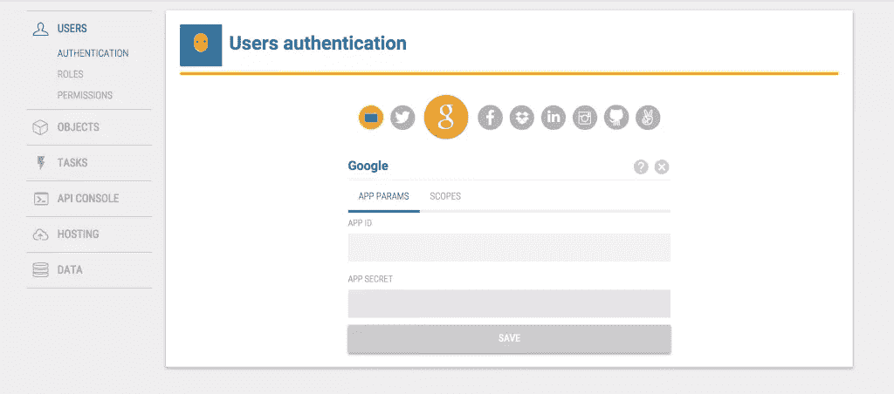

出于本教程的目的，我们还将设置应用程序的公共权限，这样我们就不需要担心谁登录了，谁可以做什么。也就是说，Stamplay 中的角色和权限系统非常强大，可以轻松处理应用程序中复杂的用户权限设置。

要将权限设置为公共，请单击用户菜单下的“权限”，然后单击“公共”选项卡。

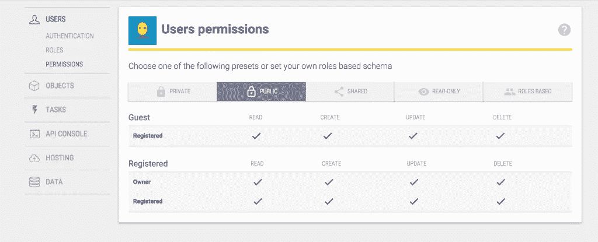

### 在我们的应用程序中实现 Auth

既然我们已经连接了 Google Plus，登录就变得简单了。

我们将创建一个用户服务，允许我们登录和注销，并获取当前登录用户的信息:

```
app.factory('User', function($q, $stamplay){
  function login() {
    var deferred = $q.defer();

    var User = $stamplay.User().Model;
    User.login('google').then(function(){
      deferred.resolve(User);
    });
  }

  function active() {
    var deferred = $q.defer();

    var User = $stamplay.User().Model;
    User.currentUser().then(function() {
      deferred.resolve(User);
    }).catch(function(err) {
      deferred.reject(err);
    });

    return deferred.promise;
  }

  function logout() {
    var User = $stamplay.User().Model;
    User.logout();
  }

  return {
    active: active,
    logout: logout,
    login: login
  };
});
```

只需调用`User.login('google')`，Stamplay 就会在让用户登录之前，让他们通过 OAuth 过程。

我们将在导航栏中添加一个登录链接，但首先让我们创建一个 NavController 来处理这些操作:

```
app.controller('NavController', function($scope, User, $rootScope){
  $scope.login = function(){
    User.login().then(function(user){
      // Add their details to root scope
      $rootScope.$emit('User::loggedIn', {user: user});
    });
  }

  $scope.logout = function(){
    User.logout();
  }
});
```

当登录成功时，我们将发出一个包含用户详细信息的事件。让我们为该事件设置一个监听器:

```
app.run(function($rootScope, User){
  // Listen for login events
  $rootScope.$on('User::loggedIn', function(event, data){
    $rootScope.loggedIn = true;
    $rootScope.user = data.user;
  });

  // Check if there's a user logged in already
  User.active().then(function(activeUser){
    if(activeUser.isLogged()){
      // Add their details to rootScope
      $rootScope.$emit('User::loggedIn', {user: activeUser});
    }
  });
});
```

在 Angular 的`run()`函数中，我们将为登录事件设置一个监听器。如果您以前没有使用过`run()`函数，它基本上是一个在应用程序启动后立即运行的函数。

当用户登录时，我们将存储有一个登录用户的事实，并且我们将存储他们的详细信息。

下一部分检查是否有活动用户，如果他们已经登录，它将发出登录事件。这是为了当已经登录的用户访问您的站点时，他们的详细信息被放回到`$rootScope`中。

现在我们知道了是否有人登录，并且我们有登录和注销的方法，我们可以添加一些链接到我们的 nav:

```
<div class="collapse navbar-collapse" id="bs-example-navbar-collapse-6" ng-controller="NavController">
   <ul class="nav navbar-nav">
     <li class="active"><a ng-href="#">Books</a></li>
     <li>
       <a
         ng-href="#"
         ng-show="!loggedIn"
         ng-click="login()">

         Login
       </a>
     </li>
     <li>
       <a
         ng-href="#"
         ng-show="loggedIn"
         ng-click="logout()">

         Logout {{user.instance.displayName}}
       </a>
     </li>
   </ul>
 </div>
```

如果你在你的浏览器中打开并试用它，你会注意到的第一件事是点击链接会把你带到`http://localhost/auth/v1/google/connect`或类似的地方。这是行不通的，因为 Google(出于安全原因)期望一个真实的 URL 来处理 auth。幸运的是，Stamplay 使得将我们的应用程序部署到一个真实的 URL 变得很容易。

只需在项目目录中运行`stamplay deploy`。

完成后，您可以在`http://yourappid.stamplayapp.com`看到您的应用程序。登录/注销过程现在也应该工作了。

最后，我们将只在用户登录时显示“添加图书”表单:

```
<div class="panel-body" ng-show="loggedIn">
  <form class="form-horizontal" ng-submit="addBook()">
    ...
  </form>
</div>
```

### 发送电子邮件

让我们给新用户发一封欢迎邮件。点击 Stamplay 左侧菜单中“任务”下的“管理”，然后点击“新任务”。我们将选择:“当用户注册时，电子邮件–发送电子邮件”

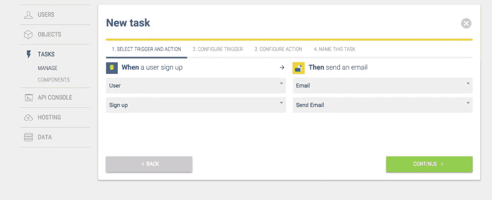

点击“继续”进入第 3 步，您可以使用右侧的值填写您的电子邮件。

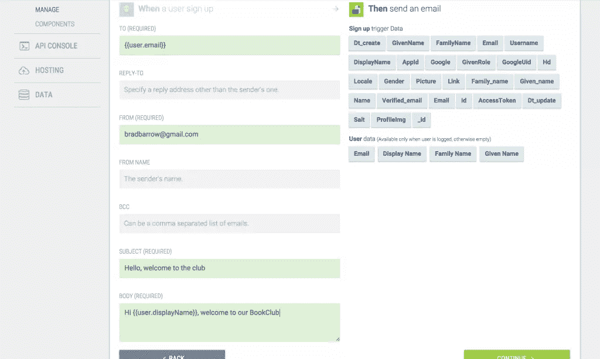

再“继续”，给你的任务起个名字就行了。当新用户注册时，他们现在会收到您的电子邮件:)

## 创建书评

我们将允许用户对他们读过的书发表评论。要做到这一点，我们在 Stamplay 中创建的 review 对象将被连接到书评所涉及的 book 对象，这样我们就可以使用该关联。我们还会将评论与登录用户相关联。

让我们从 Stamplay 编辑器返回到 Objects 选项卡，添加一个名为“review”的新自定义对象:

添加一个名为“text”的字符串属性来保存评论内容。

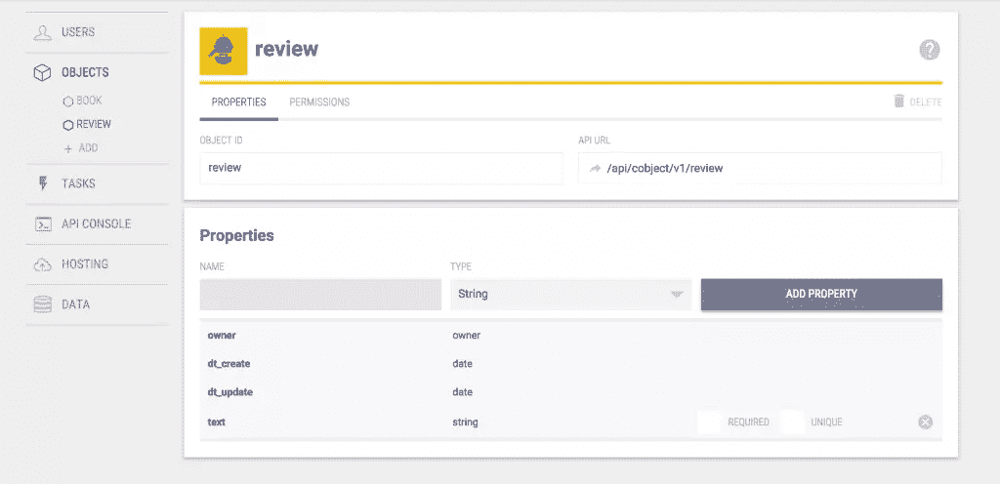

现在，转到 Stamplay 编辑器中的 book 对象。我们将向 book 对象添加一个字段，这是它的评论数组。

在 book 对象上创建一个名为 reviews 的新字段，并选择 Object relation–review 作为类型。

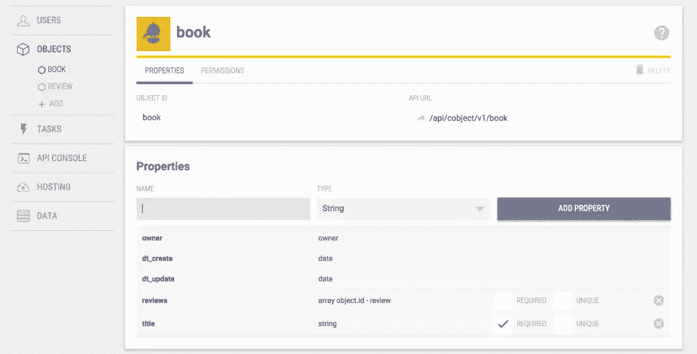

### 在我们的应用程序中用于审查的表单

现在我们已经在 Stamplay 上设置了评论，我们需要在我们的应用程序中添加写评论的功能。

首先，让我们创建一个服务来为我们的评论处理一些任务:

```
app.factory('Review', function($q, $stamplay, Book, $rootScope){
  function all() {
    var deferred = $q.defer();

    var ReviewCollection = $stamplay.Cobject('review').Collection;
    ReviewCollection.fetch().then(function() {
      deferred.resolve(ReviewCollection.instance);
    });

    return deferred.promise;
  }

  function add(review) {
    var deferred = $q.defer();

    var ReviewModel = $stamplay.Cobject('review').Model;
    ReviewModel.set('text', review.text); // The review text
    ReviewModel.set('owner', $rootScope.user.instance.id); //Associate with logged in user

    // Save the review
    ReviewModel.save().then(function() {
      // If it saves, update the book
      Book.find(review.bookId).then(function(BookToUpdate){
        // Store the saved review on the book
        var currentReviews = BookToUpdate.get('reviews') || [];
        currentReviews.push(ReviewModel.get('_id'));
        BookToUpdate.set('reviews', currentReviews)
        BookToUpdate.save().then(function(){
          // We're done
          deferred.resolve(ReviewModel);
        });
      });
    });

    return deferred.promise;
  }

  return {
    all: all,
    add: add,
  }
});
```

这里重要的是:

*   添加评论时，我们将登录用户的 ID 保存为评论的所有者
*   添加评论时，我们会找到相关的书籍，并在保存书籍之前将我们的评论推送到书籍评论列表中。

我们需要为我们的预订服务添加一个`find()`方法:

```
function find(id) {
  var deferred = $q.defer();

  var BookModel = $stamplay.Cobject('book').Model;
  BookModel.fetch(id).then(function() {
    deferred.resolve(BookModel);
  }).catch(function(err) {
    deferred.reject(err);
  });

  return deferred.promise;
}
```

然后将其添加到服务的导出中:

```
return {
    all: all,
    add: add,
    find: find // Now we can use Book.find()
}
```

`fetch()`方法使用一个 ID 进行搜索。

现在我们有了一个处理评论的服务，让我们为表单创建一个控制器:

```
app.controller('ReviewController', function($scope, Book, $rootScope, Review){
  $scope.bookOptions = [];

  Book.all().then(function(books){
    $scope.bookOptions = books;
  });

  $scope.newReview = {
    bookId: null,
    text: '',
  };

  $scope.leaveReview = function() {
    Review.add($scope.newReview).then(function(savedReview){
      $rootScope.$emit('Review::added', {review: savedReview});
      $scope.newReview.text = '';
      $scope.newReview.bookId = null;
    });
  }
});
```

在这个控制器中有一些事情需要注意。首先，我们得到一个显示在下拉列表中的书籍列表，这样用户就可以选择他们要评论的书。当用户离开评论时，我们将使用评论服务来添加它，当它完成时，我们将发出一个事件来通知应用程序的其余部分。

让我们在 book 表单上方添加一个新的评论表单(仅在登录时显示):

```
<div class="row" ng-show="loggedIn">
    <div class="col-md-12">
      <div class="panel panel-default" ng-controller="ReviewController">
        <div class="panel-heading">
          Add a review
        </div>
        <div class="panel-body" ng-show="loggedIn">
          <form class="form-horizontal" ng-submit="leaveReview()">
            <div class="form-group">
              <label for="book" class="col-sm-2 control-label">Book</label>
              <div class="col-sm-10">
                <select
                  ng-model="newReview.bookId"
                  ng-options="book.instance.id as book.instance.title for book in bookOptions"
                  class="form-control"
                  id="book"
                  autocomplete="off">
                  <option value="">-- Choose a book --</option>
                </select>
              </div>
            </div>
            <div class="form-group">
              <label for="text" class="col-sm-2 control-label">Review</label>
              <div class="col-sm-10">
                <input
                  type="text"
                  ng-model="newReview.text"
                  class="form-control"
                  id="text"
                  placeholder="I thought it was hilarious!"
                  autocomplete="off">
              </div>
            </div>
            <div class="form-group">
              <div class="col-sm-offset-2 col-sm-10">
                <button type="submit" class="btn btn-default">Leave Review</button>
              </div>
            </div>
          </form>
        </div>
      </div>
    </div>
  </div>
```

现在我们需要能够看到我们创建的评论。让我们把它们放在它们所属的书下面。

首先，当我们获取我们的书籍时，我们需要告诉 Stamplay 我们也希望所有相关的对象(评论)出现在响应中。为了做到这一点，我们在获取图书时将`{populate: true}`指定给 fetch 方法。按如下方式更新您的预订服务:

```
app.factory('Book', function($q, $stamplay){
  function all() {
    var deferred = $q.defer();

    var BookCollection = $stamplay.Cobject('book').Collection;
    BookCollection.fetch({populate: true}).then(function() {
      deferred.resolve(BookCollection.instance);
    });

    return deferred.promise;
  }

  ...
});
```

现在，在我们的 BooksController 中，一旦我们加载了书籍，我们还可以访问每本书的评论。

每次我们添加新书和新评论时，我们都希望刷新图书数据。因此，让我们听听这些事件，并在它们发生时再次加载书籍。

```
app.controller('BooksController', function($scope, $rootScope, $stamplay, Book, Review, User){
  $scope.books = [];

  var loadBooks = function(){
    Book.all().then(function(books){
      $scope.books = books;
    });
  }

  $scope.newBook = {
    title: ''
  };

  $scope.addBook = function() {
    Book.add($scope.newBook).then(function(savedBook){
      $scope.books.push(savedBook);

      // Emit new book was added
      $rootScope.$emit('Book::added');
    });

    $scope.newBook.title = '';
  }

  $rootScope.$on('Book::added', function(data){
    loadBooks();
  });

  $rootScope.$on('Review::added', function(data){
    loadBooks();
  });

  loadBooks();
});
```

我们将稍微调整一下图书列表的布局以适应评论，如下所示:

```
<div class="list-group" ng-repeat="book in books">
  <div class="list-group-item">
    <h4 class="list-group-item-heading">{{book.instance.title}}</h4>
  </div>
  <div class="list-group-item" ng-repeat="review in book.instance.reviews">
    {{review.text}}
  </div>
</div>
```

如果你现在打开浏览器，你应该可以添加一篇新的评论，当它被保存时，它应该会显示在正确的书下面。

很好，现在只剩下一件事要做了——在评论中显示用户的名字会很好。

对于每个评论，我们将执行对所有者信息的请求，并将其存储在评论中，以便我们可以在视图中取出它。

首先，我们需要一个用户服务的查找方法:

```
app.factory('User', function($q, $stamplay){
	function find(id) {
	  var deferred = $q.defer();

	  var User = $stamplay.User().Model;
	  User.fetch(id).then(function() {
	    deferred.resolve(User);
	  }).catch(function(err) {
	    deferred.reject(err);
	  });

	  return deferred.promise;
	}

	...
});
```

将此添加到您的服务的导出中:

```
return {
	active: active,
	logout: logout,
	login: login,
	find: find
};
```

然后，我们将在 BooksController 中使用它:

```
app.controller('BooksController', function($scope, $rootScope, $stamplay, Book, Review, User){
  $scope.books = [];

  var loadBooks = function(){
    Book.all().then(function(books){
      $scope.books = books;
      $scope.books.forEach(function(book){
        var reviews = book.instance.reviews || [];
        reviews.forEach(function(review){
          if(review.owner){
            User.find(review.owner).then(function(user){
              review.user = user.get('displayName');
            });
          } else {
            review.user =  'Anonymous';
          }
        });
      })
    });
  }

   ...
});
```

我们将在每次检查前展示这个新的用户属性:

```
<div class="list-group-item" ng-repeat="review in book.instance.reviews">
 <strong>{{review.user}}</strong> {{review.text}}
 </div>
```

现在我们有了。我们已经创建了一个发布新评论的表单，它们将显示在正确的图书下，并带有评论所有者的姓名。

现在可能是用几个不同的帐户部署和测试您的应用程序的好时机。

## 更多 Stamplay 集成

Stamplay 为我们提供了各种即插即用功能。让我们在 UI 中再添加一些元素，让我们的应用程序感觉功能丰富:

### 给我们的评论添加评分

一般来说，当你发表评论时，你也会给出一个星级。Stamplay 有一个内在的能力来评价项目。让我们现在就用它。首先，我们将在评估表中添加一个新字段:

```
<div class="form-group">
   <label for="text" class="col-sm-2 control-label">Rating</label>
   <div class="col-sm-10">
     <input
       type="number"
       ng-model="newReview.rating"
       class="form-control"
       id="text"
       ng-minlength="1"
       ng-maxlength="5"
       placeholder="Rating out of 5"
       autocomplete="off">
   </div>
 </div>
```

然后，当我们在点评服务中保存我们的点评时，我们只需要执行一个额外的操作来对图书进行评分:

```
// Save the review
ReviewModel.save().then(function() {
  // If it saves, update the book
  Book.find(review.bookId).then(function(BookToUpdate){
    // Rate it
    BookToUpdate.rate(review.rating);

    // Store the saved review on the book
    var currentReviews = BookToUpdate.get('reviews') || [];
    currentReviews.push(ReviewModel.get('_id'));
    BookToUpdate.set('reviews', currentReviews)
    BookToUpdate.save().then(function(){
      // We're done
      deferred.resolve(ReviewModel);
    });
  });
});
```

现在，我们可以使用 actions 对象在视图中显示这些附加信息(如星号所示):

```
<div class="list-group" ng-repeat="book in books">
   <div class="list-group-item">
     <h4 class="list-group-item-heading">{{book.instance.title}}</h4>
     <span ng-repeat="n in [1,2,3,4,5]">
       <i class="icon ion-ios-star" ng-if="book.instance.actions.ratings.avg >= n"></i>
       <i class="icon ion-ios-star-outline" ng-if="book.instance.actions.ratings.avg < n"></i>
     </span>
   </div>
   <div class="list-group-item" ng-repeat="review in book.instance.reviews">
     <strong>{{review.user}}</strong> {{review.text}}
   </div>
 </div>
```

### 给你的评论投票

评论可能会受欢迎，即使它们是不好的评论…所以让我们允许用户投票支持他们喜欢阅读的评论。

让我们扩大我们的评论服务，使它可以张贴投票

```
app.factory('Review', function($q, $stamplay, Book){
  function all() {
    ...
  }

  function upvote(review) {
    var deferred = $q.defer();

    var ReviewModel = $stamplay.Cobject('review').Model;
    ReviewModel.fetch(review.id).then(function(){
      ReviewModel.upVote().then(function(){
        deferred.resolve(ReviewModel);
      });
    }).catch(function(err){
      deferred.resolve(err);
    });

    return deferred.promise;
  }
});
```

然后补充:

```
return {
	all: all,
	add: add,
	upvote: upvote
	}
```

我们将为每个评论添加一个按钮，允许向上投票:

```
<div class="list-group-item" ng-repeat="review in book.instance.reviews">
  <button class="btn-default btn btn-xs" ng-click="upvote(review)">
    {{review.actions.votes.total}} <i class="icon ion-arrow-up-a"></i>
  </button>
  &nbsp;
  <strong>{{review.user}}</strong> {{review.text}}
</div>
```

然后我们将把`upvote()`方法添加到我们的 BooksController 来保存 upvote

```
  $scope.upvote = function(review){
  Review.upvote(review).then(function(){
    $rootScope.$emit('Review::upvoted');
  });
}

$rootScope.$on('Review::upvoted', function(data){
  loadBooks();
});
```

现在，当你点击向上投票按钮，你会看到计数上升。用户每次评论只能投票一次。尝试以其他人的身份登录并投票支持一篇评论。

## 连接条纹

我们的读书俱乐部很棒，让我们向我们的访问者收费吧。您需要一个 Stripe 帐户来完成此部分。

我们首先需要设置条带组件。在 Stamplay 编辑器的 tasks 菜单下，单击 Components，然后单击 Stripe 图标。

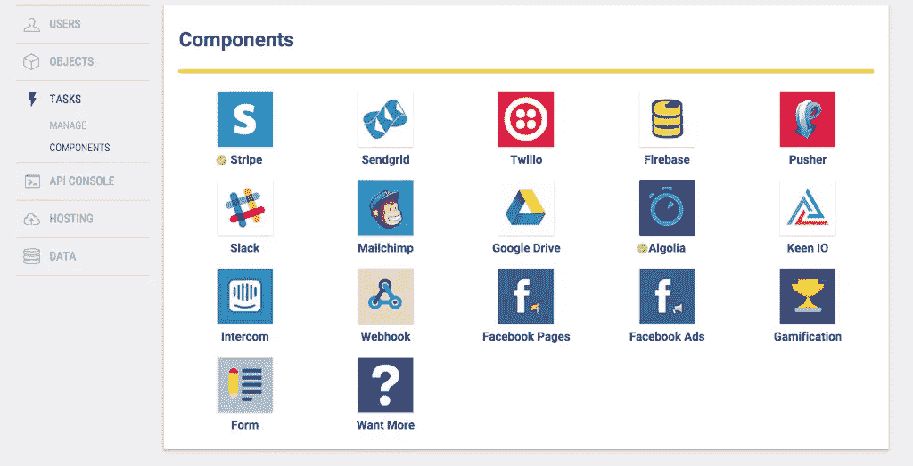

单击绿色的大连接按钮，您将被要求登录到您的 Stripe 帐户。如果你没有，你可以在[stripe.com](https://stripe.com)创建一个。您将需要输入您的银行详细信息(以便人们向您付款)，尽管在本教程中我们将只使用测试模式。

按照提示登录并连接您的 Stripe 帐户。

完成后，您应该会看到一个绿色按钮，上面写着“组件已激活”

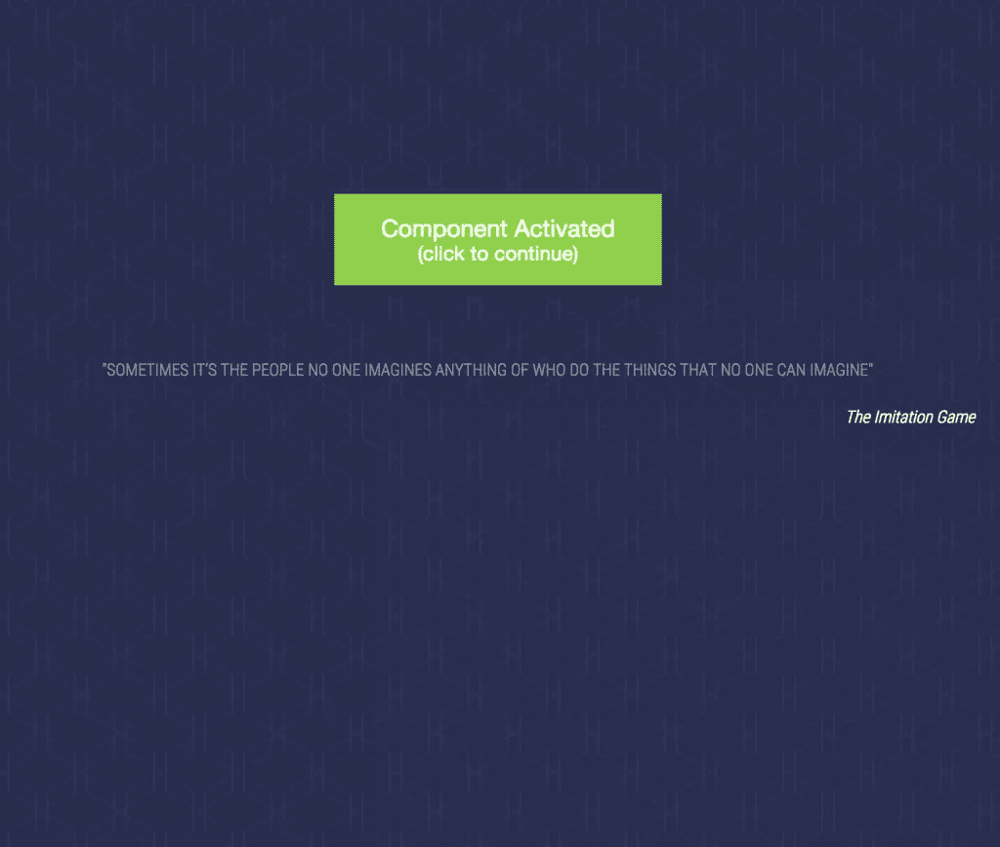

回到条带组件页面，您应该会看到您的详细信息(测试密钥等)。**确保实时模式被禁用。**

现在，我们需要创建一个任务，以便当用户注册时，我们为他们创建新的 Stripe 客户。点击任务菜单下的管理，然后点击“新任务”。

从下拉列表中，我们将选择“当用户注册时”，然后选择“条带化–添加客户”。

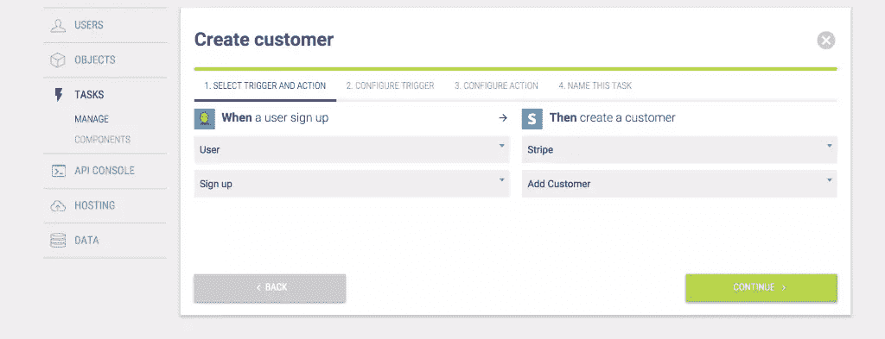

点击下一步，在步骤 3 中确保您通过了`{{user._id}}`。

单击“下一步”并为任务命名，如“创建客户”，然后单击“保存”。

现在，当用户注册时，我们将在 Stripe 中创建一个新客户。

现在我们有了与用户相关联的客户，我们可以在登录用户访问应用程序之前向他们收费。

首先，我们首先将变量`paid`设置为 false，并使用它来隐藏应用程序，直到用户付费。稍后我们还将为登录的用户设置一个属性`paid`,所以我们在这里也检查一下:

```
app.run(function($rootScope, User){
  $rootScope.paid = false;

  // Listen for login events
  $rootScope.$on('User::loggedIn', function(event, data){
    $rootScope.loggedIn = true;
    $rootScope.paid = data.user.instance.paid || false; // Has the user already paid?
    $rootScope.user = data.user;
  });

  // Check if there's a user logged in already
  User.active().then(function(activeUser){
    ...
  });
});
```

在我们目前使用`ng-show="loggedIn"`的地方，让我们也添加一张付款支票:

例如

```
<div class="panel-heading">
   Books
 </div>
 <div class="panel-body" ng-show="loggedIn && paid">
   <form class="form-horizontal" ng-submit="addBook()">

   ...
```

我们将创建一个控制器和一个表单来处理支付:

```
<div class="row" ng-show="loggedIn && !paid">
   <div class="col-md-12">
     <div class="panel panel-default" ng-controller="PaymentController">
       <div class="panel-heading">
         Pay to subscribe
       </div>
       <div class="panel-body" ng-show="loggedIn">
         <form class="form-horizontal" ng-submit="pay()">
           <div class="form-group">
             <label for="book" class="col-sm-2 control-label">Card Number</label>
             <div class="col-sm-10">
               <input
                 type="text"
                 ng-model="card.number"
                 class="form-control"
                 id="text"
                 autocomplete="off">
             </div>
           </div>
           <div class="form-group">
             <label for="book" class="col-sm-2 control-label">CVC</label>
             <div class="col-sm-10">
               <input
                 type="text"
                 ng-model="card.cvc"
                 class="form-control"
                 id="text"
                 autocomplete="off">
             </div>
           </div>
           <div class="form-group">
             <label for="book" class="col-sm-2 control-label">Expiry Month</label>
             <div class="col-sm-10">
               <input
                 type="text"
                 ng-model="card.exp_month"
                 class="form-control"
                 id="text"
                 placeholder="02"
                 autocomplete="off">
             </div>
           </div>
           <div class="form-group">
             <label for="book" class="col-sm-2 control-label">Expiry Year</label>
             <div class="col-sm-10">
               <input
                 type="text"
                 ng-model="card.exp_year"
                 class="form-control"
                 id="text"
                 placeholder="2015"
                 autocomplete="off">
                </div>
              </div>
              <div class="form-group">
                <div class="col-sm-offset-2 col-sm-10">
                  <button type="submit" class="btn btn-default">Pay</button>
                </div>
              </div>
            </form>
          </div>
        </div>
      </div>
    </div>
```

```
app.controller('PaymentController', function($scope, $rootScope, $stamplay, User){
  Stripe.setPublishableKey('your_stripe_TEST_key');

  $scope.card = {
    number: '',
    cvc: '',
    exp_month: '',
    exp_year: ''
  }

  $scope.pay = function(){
    Stripe.card.createToken($scope.card, function(status, response){
      if (response.error) {
        console.log('error', response.error);
      } else {
        var token = response.id;
        var customerStripe = new $stamplay.Stripe();
        customerStripe.charge($rootScope.user.instance.id, token, 50, 'USD').then(function (response) {
          $scope.$apply(function(){
            User.update($rootScope.user.instance.id, 'paid', true).then(function(){
              $rootScope.paid = true;
            });
          })
        }, function(err){
          console.log('error', err);
        })
      }
    });
  }
});
```

在我们的控制器中，我们使用 Stripe 的 JavaScript 客户端来获取卡的令牌，然后使用 Stamplay 的 Stripe 函数来创建收费。最后，我们更新用户的一个属性`paid`,以实现持久性。我们需要在用户上创建更新方法。

```
function update(id, key, value) {
  var deferred = $q.defer();

  var User = $stamplay.User().Model;
  User.fetch(id).then(function() {
    User.set(key, value);
    User.save().then(function(){
      deferred.resolve(User);
    });
  }).catch(function(err) {
    deferred.reject(err);
  });

  return deferred.promise;
}
```

要测试条带实现，可以使用下面的测试值。有关条带测试的信息，请查看文档。

```
n.4242 4242 4242 4242
date: 07/2020
cvc: 424
```

## 实施搜索

随着越来越多的书加入到我们的俱乐部，使用下拉菜单来选择我们想要评论的书将变得不切实际。让我们实现一个类型先行搜索。

Stamplay 允许我们整合 Algolia，一个托管搜索后端。我们需要一个 [Algolia 账户](https://www.algolia.com/)用于此部分(有免费试用)。

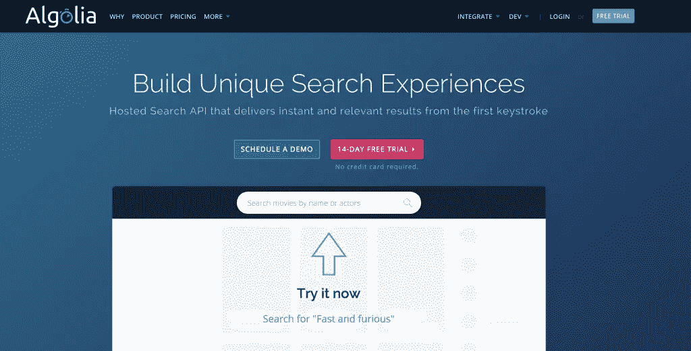

在 Stamplay 中，我们需要连接到 Algolia。进入组件页面，点击 Algolia。输入您的详细信息(在 Algolia 仪表板的凭据选项卡上提供)，然后单击连接。

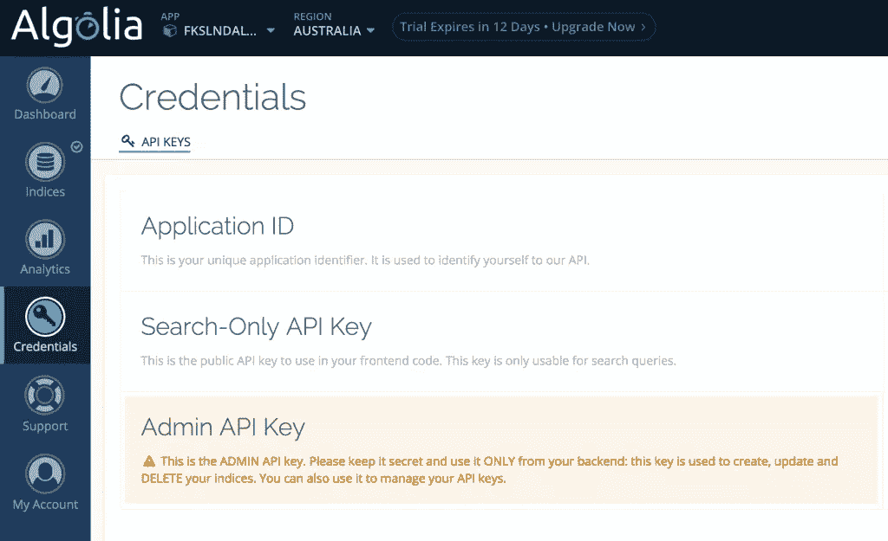

我们需要在阿尔戈利亚创建一个索引。Algolia 的在线应用程序可以很容易地添加索引，他们的教程也很清楚。

我们将我们的索引称为“书籍”——确保索引中没有数据(虚拟数据)。

现在我们可以在 Stamplay 中添加一个新任务。

从标准选择:当一个新的对象被创建，推数据到 Algolia。

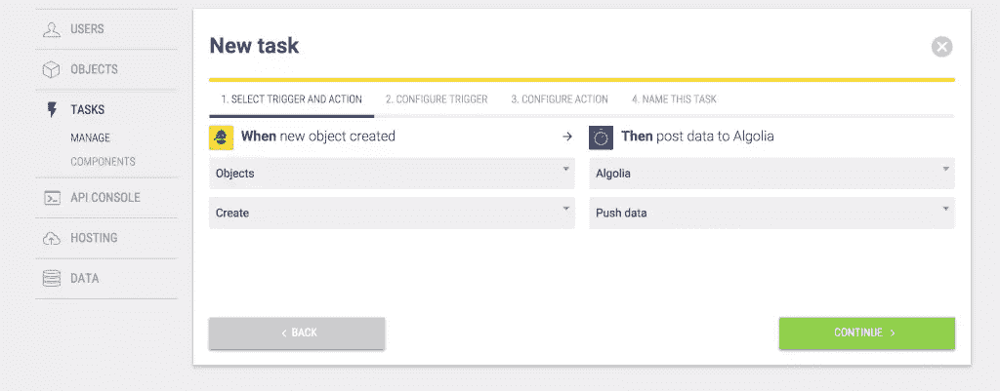

在接下来的页面中，我们将选择书籍(我们要搜索的对象)，并将它们放入名为 Books 的索引中。

我们将标题属性索引为“title”，将“_id”属性索引为 bookId:

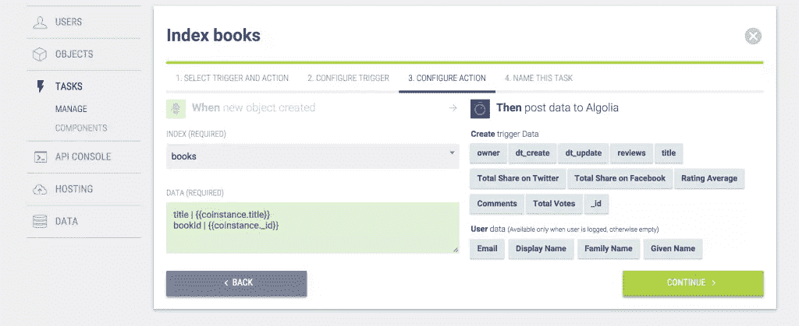

您在此之前添加的任何图书都不会被编入索引。您可以添加另一个任务，在它们更新时对它们进行索引，或者因为它是测试数据，您可以删除旧的书籍并添加新的书籍。您添加的新书应该出现在您的 Algolia 索引中。

我们现在可以进入 Algolia，选择要搜索的属性。您可以在图书索引的“排名”选项卡上进行配置。我们将使标题属性可搜索。

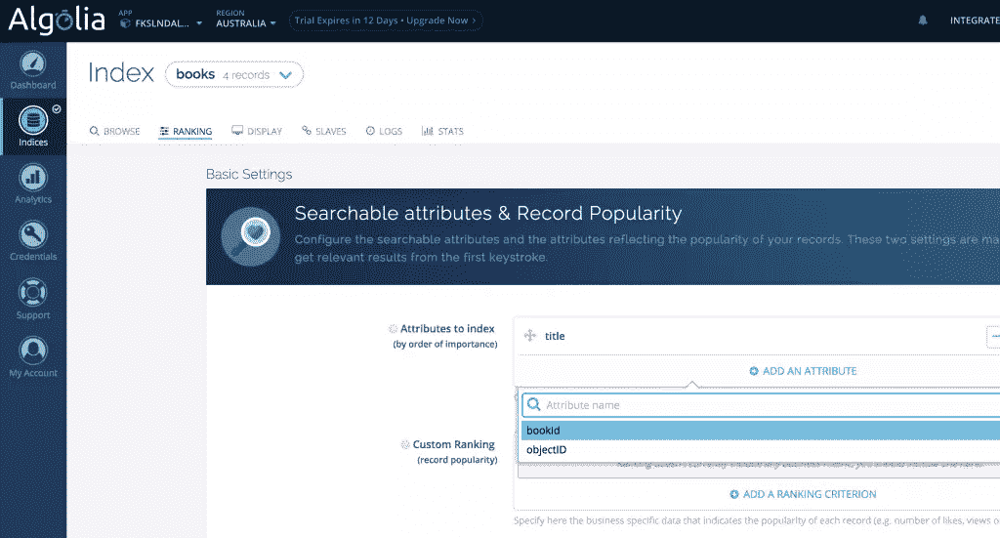

让我们把下拉菜单换成一个字体。我们已经在`index.html`中包含了 Algolia 搜索客户端。我们需要将它作为一个角度模块:

```
var app = angular.module('stamplay', ['ngStamplay', 'algoliasearch']);
```

我们将使用 Angular Bootstrap 的 typeahead 指令。我们已经将 JS 包含在`index.html`中，所以让我们也将它作为一个角度模块:

```
var app = angular.module('stamplay', ['ngStamplay', 'algoliasearch', 'ui.bootstrap']);
```

我们将把旧的选择下拉菜单换成 typeahead 指令:

```
<div class="form-group">
    <label for="book" class="col-sm-2 control-label">Book</label>
    <div class="col-sm-10">
      <input
      type="text"
      ng-model="newReview.book"
      placeholder="Find a book"
      typeahead="book as book.title for book in findBook($viewValue)"
      typeahead-loading="loadingBooks" class="form-control">
      <i ng-show="loadingBooks" class="glyphicon glyphicon-refresh"></i>
    </div>
  </div>
```

你会注意到前面的文字会在结果中显示书名。值(模型)将是图书对象本身。显示的列表是`findBook()`函数的结果。现在让我们来实现它:

```
app.controller('ReviewController', function($scope, Book, $rootScope, Review, algolia, $q){
  // Replace the following values by your ApplicationID and ApiKey.
  var client = algolia.Client('FKSLNDAL5R', 'b1c739979a51be636bf6d2eb4eee8243');
  // Replace the following value by the name of the index you want to query.
  var index = client.initIndex('books');

  $scope.findBook = function(value) {
    var deferred = $q.defer();

    index.search(value, { hitsPerPage: 5 }).then(function(content) {
      if (content.query !== value) {
        // do not take out-dated answers into account
        return;
      }
      deferred.resolve(content.hits);
    }, function(content) {
      deferred.resolve([]);
      return [];
    });

    return deferred.promise;
  };

  $scope.newReview = {
    book: null,
    text: '',
  };

  $scope.leaveReview = function() {
    Review.add($scope.newReview).then(function(savedReview){
      $rootScope.$emit('Review::added', {review: savedReview});
      $scope.newReview.text = '';
      $scope.newReview.book = null;
    });
  }
});
```

您还会注意到，我们已经更新了`newReview`,将`book`属性替换为`bookId`,因为我们的 typeahead 将把整个 book 对象分配给模型。*(这是由于 Bootstrap 指令对表示值的限制)*

我们需要更新我们的评论服务，以从 Algolia book 对象中获取 bookId 属性:

```
// Save the review
 ReviewModel.save().then(function() {
   // If it saves, update the book
   // Access bookId on review.book (an Algolia object)
   Book.find(review.book.bookId).then(function(BookToUpdate){
     // Rate it
     BookToUpdate.rate(review.rating);

     // Store the saved review on the book
     var currentReviews = BookToUpdate.get('reviews') || [];
     currentReviews.push(ReviewModel.get('_id'));
     BookToUpdate.set('reviews', currentReviews)
     BookToUpdate.save().then(function(){
       // We're done
       deferred.resolve(ReviewModel);
     });
   });
 });
```

如果你运行你的应用程序，你现在应该能够通过输入找到书籍并从结果中选择。添加评论应该将评论与正确的书相关联。

## 结论

您可以在 bookclub.stamplayapp.com 查看该应用程序的完整版本。完整的代码也可以在主[这里](https://github.com/bradbarrow/sp-stamplay/)获得。

我们几乎把所有的时间都花在构建用户界面的前端应用程序上，现在我们也有了一个强大的后端。Stamplay 确实使完成普通的后端任务变得容易，让你可以专注于创建功能丰富的复杂应用程序。我很想看看你用 Stamplay 创造了什么。

Stamplay 为 SitePoint 用户提供了一张独家优惠券，免费提供 3 个月的高级计划(价值 600 美元)。优惠券代码是 STAMPLAY4SP，7 月 30 日到期。

## 分享这篇文章