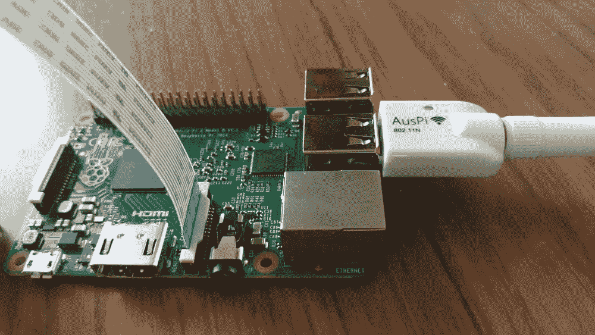
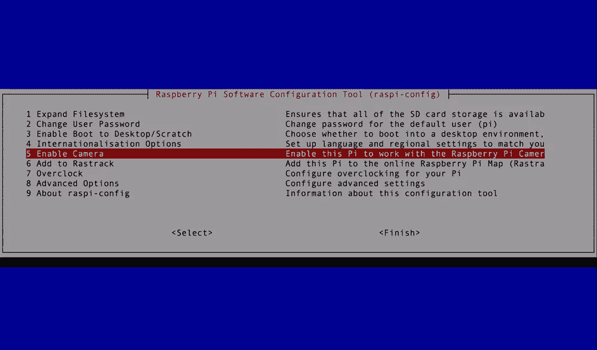
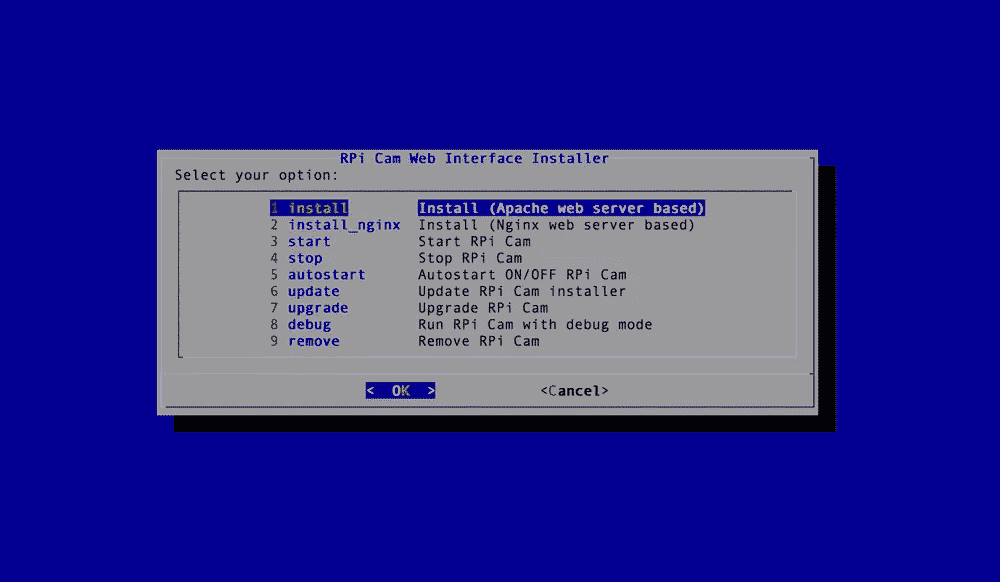
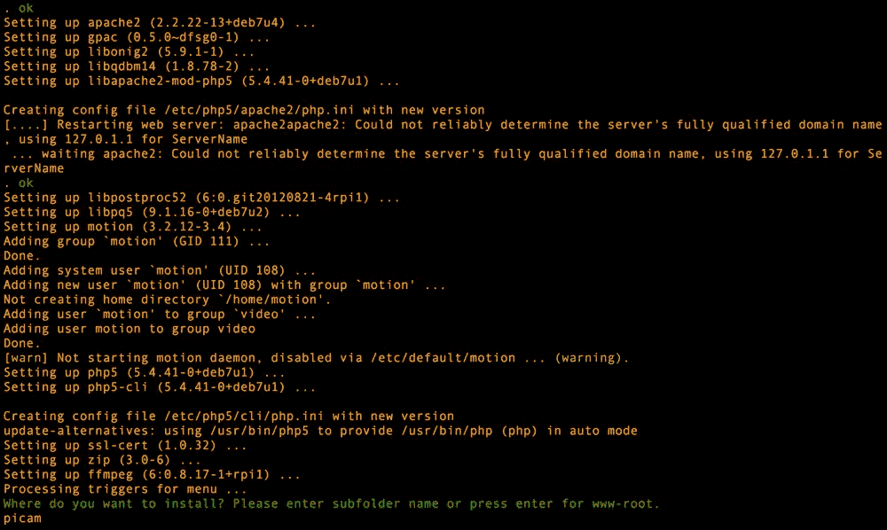
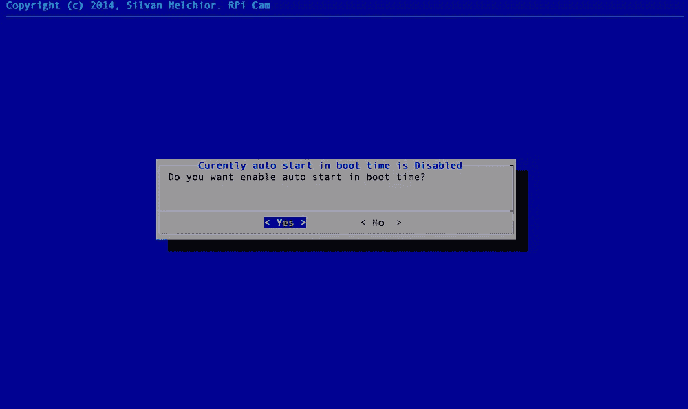
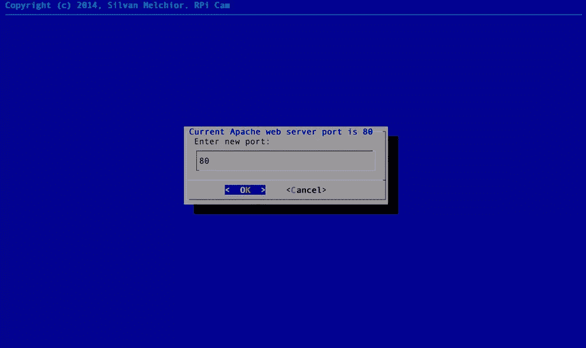
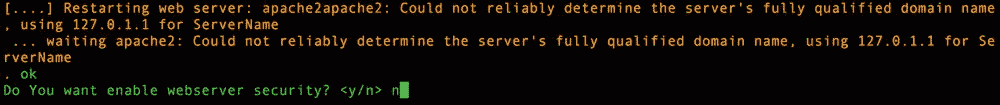
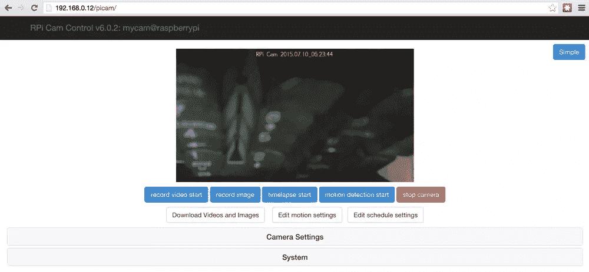
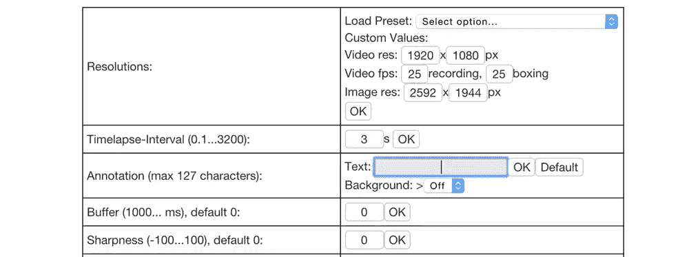
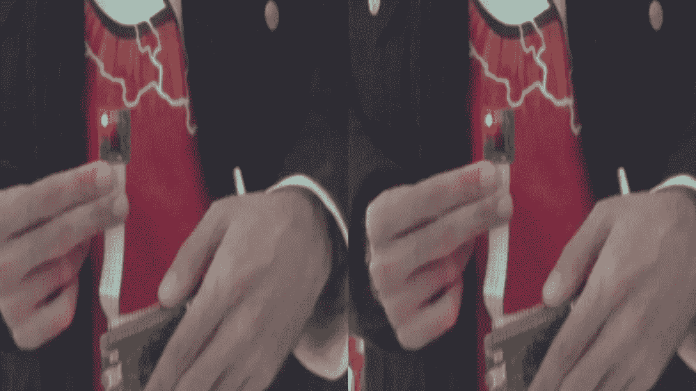

# 用 JavaScript 将树莓 Pi 摄像机流式传输到虚拟现实中

> 原文：<https://www.sitepoint.com/streaming-a-raspberry-pi-camera-into-vr-with-javascript/>

我花了一周时间摆弄树莓 Pi 相机，并探索让它将图像传输到网络浏览器的方法。在本文中，我们将探索我发现的将图像流式传输到客户端 JavaScript 的最简单和最有效的方法。最后，我们将把这些图像流式传输到虚拟现实查看器中，这是我在之前的一篇关于用 JavaScript 和 Google Cardboard 过滤现实的文章中构建的。

## 你需要什么

对于这个演示，你目前需要一个树莓 Pi(我用的是[树莓 Pi 2 型号 B](https://www.raspberrypi.org/products/raspberry-pi-2-model-b/) )和一个[相机模块](https://www.raspberrypi.org/products/camera-module/)，树莓 Pi 安装了 Raspbian([NOOBS 在这里为你介绍了](https://www.raspberrypi.org/help/noobs-setup/))，一个互联网连接(我建议你买一个 Wi-Fi 适配器，这样你的 Pi 就可以相对便携)。

如果您的 Pi 是全新的，并且当前没有设置，请按照 [Raspberry Pi NOOBS 设置页面](https://www.raspberrypi.org/help/noobs-setup/)上的说明让您的 Pi 准备就绪。

如果你的 Pi 上已经有了一堆东西，请确保你**备份了所有东西**，因为安装过程会替换各种文件。希望一切顺利，但安全总是很重要的！

## 代码

我们使用相机数据的演示代码可以在 [GitHub](https://github.com/sitepoint-editors/PiViewer) 上获得，供那些渴望下载并尝试的人使用。

## 连接您的 Pi 摄像机

如果你不熟悉树莓派和相机，我会在这里快速介绍一下。基本上，开口周围有一个塑料容器(称为柔性电缆连接器),您需要轻轻地打开它。为此，将连接器顶部的卡舌向上拉向以太网端口。一旦你把它松开，你就可以插入你相机的软电缆了。电缆的一侧有一条蓝色的带子，连接电缆时，请将该侧朝向以太网端口。小心保持线缆笔直(不要将线缆倾斜放入插槽，线缆应该笔直插入)。这是一张我的相机柔性电缆连接正确的照片，展示了我们在这里寻找的东西:



## RPi Cam Web 界面

我发现的从 Pi 摄像机传输图像的最简单的方法是使用 [RPi Cam Web 界面](http://elinux.org/RPi-Cam-Web-Interface)。您运行几个基本的终端命令来安装它，然后它在一个 Apache 服务器上设置您的相机以备使用。

如果你已经从头开始安装了 Raspbian，你可能已经在随后出现的配置屏幕中启用了摄像头。如果没有，您可以通过键入以下命令来获得它:

```
sudo raspi-config
```

在该屏幕上，您可以选择“启用摄像头”，单击该选项，然后从出现的屏幕中选择“启用”。



接下来，确保你的树莓派是最新的(在此之前，我想重申一下——备份东西以确保安全)。我们从下载最新的存储库包列表开始:

```
sudo apt-get update
```

然后，我们对我们的 Pi 上的现有存储库进行任何可能发现的更新:

```
sudo apt-get dist-upgrade
```

最后，我们还更新了我们的 Raspberry Pi 软件本身:

```
sudo rpi-update
```

然后，我们从它的 GitHub repo 安装 RPi Cam Web 界面本身。转到您的 Pi 上您想要克隆存储库的位置，并运行`git clone`命令:

```
git clone https://github.com/silvanmelchior/RPi_Cam_Web_Interface.git
```

这将创建一个带有 bash 安装程序的`RPi_Cam_Web_Interface`文件夹。首先，转到目录:

```
cd RPi_Cam_Web_Interface
```

更新 bash 文件的权限，以便您可以运行它:

```
chmod u+x RPi_Cam_Web_Interface_Installer.sh
```

然后运行 bash 安装程序:

```
./RPi_Cam_Web_Interface_Installer.sh install
```

安装程序有更多的视觉界面。我个人通过 Apache 服务器选项(第一个选项)安装了它，所以下面将集中讨论这种方法。如果你喜欢使用 Nginx 服务器，你可以。我想大部分过程都是相对相似的。



然后，您将指定您想要在服务器的`/var/www`目录上放置 RPi Cam Web 界面的位置。如果您不列出任何内容，它将安装在根`/var/www`文件夹中。我把它安装在一个名为`picam`的文件夹中，以保持它的独立性。



在下一个屏幕上，我选择“是”来决定是否让相机在开机时自动启动。



安装程序会询问你希望它在哪个端口上运行。我将它保留在默认的 80 端口。



然后会提示您是否需要 web 服务器安全性。这将为您的服务器创建一个 htaccess 用户名和密码。我说不是为了测试，因为我把它放在了一个子文件夹里。在这个演示中，我们将在其他子文件夹中创建其他功能，所以如果您担心有人监视您的 Pi 服务器，我建议您在根级别对整个服务器进行安全保护！



程序会问你是否想重启系统，输入`y`并让你的 Pi 自动恢复。当它重新打开时，你相机上的灯应该会亮，表明它正在观察周围的环境。

要查看您的摄像机看到的内容，您可以访问 RPi Cam Web 界面提供的预建摄像机界面。为此，您首先需要知道您的 Pi 的 IP 地址。不确定怎么做？为此，您可以键入:

```
ifconfig
```

这将是列表中为数不多的实际 IP 地址之一。根据您本地网络的设置，它应该是相对简单的东西，如`192.168.0.3`。对我来说，它是`192.168.0.12`,因为我的网络上有一堆其他设备。

在同一本地网络上的计算机上打开网络浏览器，输入您的 Pi 的 IP 地址，然后输入您安装 Pi camera web stuff 的文件夹名称(例如`http://192.168.0.12/picam`)。它应该打开你的相机的网络视图！这里有一个视图显示了我的键盘令人难以置信的沉闷景象:



如果您想删除顶部带有日期和时间的文本，请打开“相机设置”并删除“注释”中的文本:



## 通过 JavaScript 访问相机图像

虽然这个界面本身可以做很多非常漂亮的事情，包括远程图像捕捉、视频录制、运动检测等等，但作为一个喜欢修补和构建自己的东西的开发人员，我想将这些图像插入到我自己的创作中。特别是，我想试着把它放入我在之前关于用 JavaScript 和 Google Cardboard 过滤现实的文章中创建的 Google Cardboard VR/AR 设置中。这样，我们可以戴上谷歌 Cardboard 耳机，从远处观看我们的相机。将您的 Raspberry Pi 连接到您的家庭宠物(一辆遥控车)上，将它放在鱼缸或仓鼠围栏旁边，然后坐下来享受实时虚拟现实体验，从新的角度观看事物！

要从 JavaScript 远程访问相机中的图像，我们需要以下 URL 结构(用 IP 地址和文件夹替换您环境中的地址和文件夹):

```
"http://192.168.0.12/picam/cam_pic.php?time=" + new Date().getTime()
```

我们通过经由`new Date().getTime()`附加当前时间戳来确保获得最新的图像。

为了在 JavaScript 和 HTML5 画布中访问这些图像而不会遇到跨源资源共享错误，我们也将在 Pi 上运行这个 JavaScript。它让事情变得简单美好。如果您希望从不同的服务器访问映像，请仔细阅读[跨源资源共享和同源策略](http://enable-cors.org/index.html)。

我们不会在这篇文章中涵盖所有的 VR 和 Three.js 理论，所以如果你是新手，可以阅读一下我以前的文章，关于用 JavaScript 和 Google Cardboard 过滤现实的[和用 Google Cardboard 和 Three.js 把 VR 带到网上的](https://www.sitepoint.com/filtering-reality-with-javascript-google-cardboard/)和[。](https://www.sitepoint.com/bringing-vr-to-web-google-cardboard-three-js/)

与我的 JavaScript 和 Google Cardboard 文章中的过滤现实有所不同的是，实际过滤过程中涉及的所有部分都被删除了。你可以把它们放在那里，也可以过滤你的 Pi 相机图像！然而，为了保持我们的例子简单和代码相对干净，我已经删除了它们。

在我们的`init()`函数中，我调整了画布的宽度和高度，以匹配 RPi Cam 软件提供的默认输入尺寸:

```
canvas.width = 512;
  canvas.height = 288;
```

然而，当它运行`nextPowerOf2()`函数以确保它作为 Three.js 纹理工作得最好时，它将最终成为 512×512 的画布(根据我的经验，只是顶部和底部是黑色)。

我把我们的`PlaneGeometry`也调整为 512×512:

```
var cameraPlane = new THREE.PlaneGeometry(512, 512);
```

我还将相机移近我们的飞机，以确保它覆盖了视图:

```
cameraMesh.position.z = -200;
```

`animate()`功能非常不同，因为我们不再看设备的摄像头，而是在每个动画帧上从 HTTP 请求中提取图像到我们的 Pi 摄像头。该函数看起来像这样:

```
function animate() {
    if (context) {
      var piImage = new Image();

      piImage.onload = function() {
        console.log('Drawing image');
        context.drawImage(piImage, 0, 0, canvas.width, canvas.height);

        texture.needsUpdate = true;
      }

      piImage.src = "http://192.168.0.12/picam/cam_pic.php?time=" + new Date().getTime();
    }

    requestAnimationFrame(animate);

    update();
    render();
  }
```

我们将 Pi 的相机图像存储在一个名为`piImage`的变量中。我们将它的`src`设置为我们之前提到的 URL。当我们的浏览器加载了图像后，它会触发`piImage.onload()`函数，将图像绘制到我们网页的画布元素上，然后告诉我们的 Three.js 纹理需要更新。然后，我们的 Three.js `PlaneGeometry`纹理将更新为来自 Pi 相机的图像。

## 添加到我们的服务器

有很多种方法可以把这个放到我们 Pi 的服务器上。默认情况下，如果您刚刚设置了您的 Pi 及其 Apache 服务器，`/var/www`文件夹不允许您将文件复制到其中，因为您不拥有该文件夹。为了能够更改文件夹，您需要使用`sudo`命令或者使用以下命令更改文件夹和文件的所有者:

```
sudo chown -R pi www
```

然后，您可以作为默认的“pi”用户 FTP 到您的 Pi 中，并将文件复制到目录中，或者将您的项目添加到远程 Git repo 中，并将其克隆到文件夹中(我选择了第二个选项，因此可以只通过`sudo git clone https://mygitrepo`来完成，而不需要更改文件夹或文件的所有者)。

我将它们添加到了一个名为`/var/www`的文件夹中。

## 在活动

如果我们将这些代码添加到我们的服务器上，然后使用我们 Pi 的 IP 地址和自定义代码的文件夹名称(例如，我的是`http://192.168.0.12/piviewer`)从移动 Chrome 浏览器访问我们的服务器，您应该会看到一个可以在 Google Cardboard 中查看的 VR 设置！



## 结论

我们现在有了一个树莓派相机的虚拟现实视图，可以把它挂在任何我们想要的地方！虽然虚拟现实对于相机数据来说是一个有趣的选择，但是您也可以将它应用到任何数量的 JavaScript 或 web 应用程序中。如此多的可能性，如此少的时间！我有自己的计划，如果成功的话，我会在以后的文章中介绍。

如果你试用了这段代码，并用它做了一些有趣的事情，请在评论中留言或在 Twitter ( [@thatpatrickguy](http://www.twitter.com/thatpatrickguy) )上与我联系，我很想看看！

## 分享这篇文章