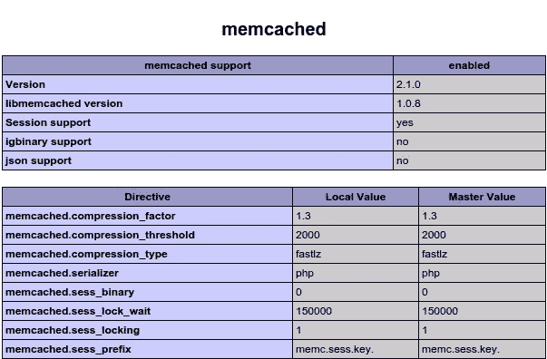
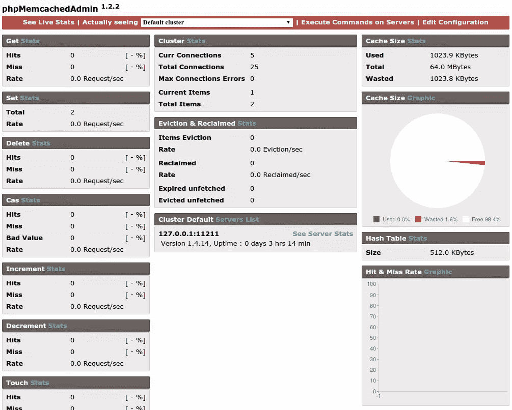
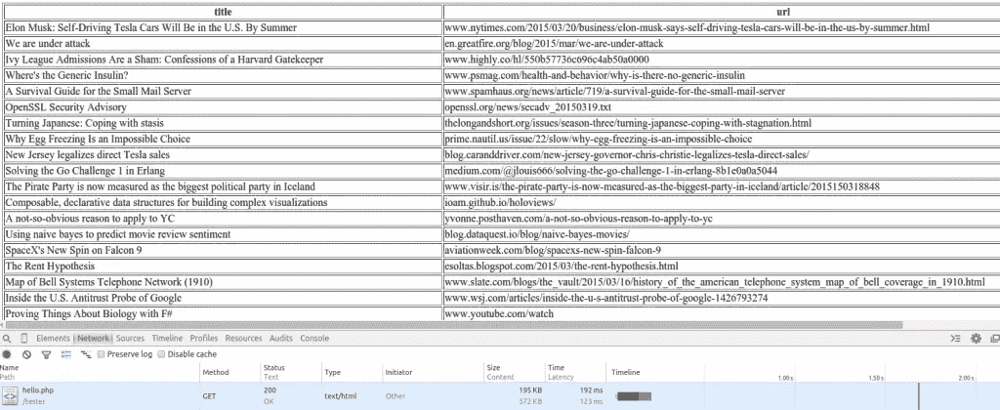
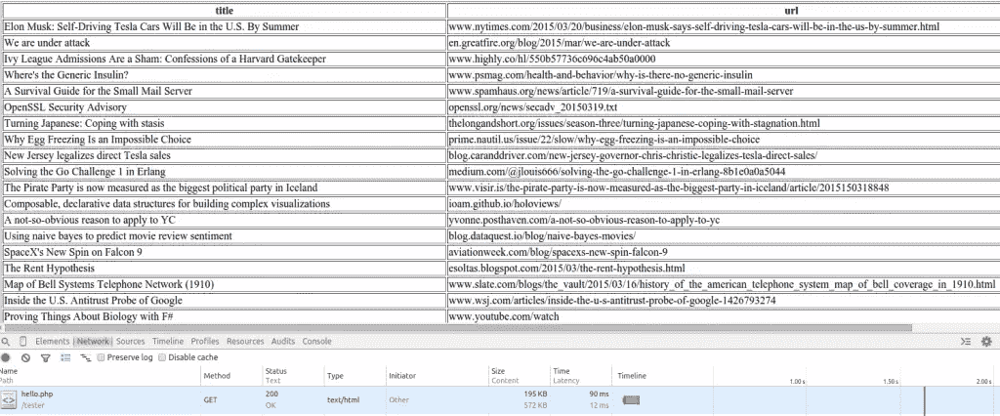
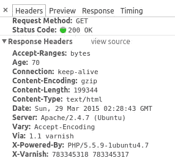

# 缓存帽子戏法:Varnish、Memcached 和 PHP 库

> 原文：<https://www.sitepoint.com/caching-hat-trick-varnish-memcached-and-php-libraries/>

之前，我们看了一些常见的缓存机制，我们可以轻松地利用它们来提高应用程序的速度。在这一部分中，我们将介绍一些可以和 PHP 一起使用的用于缓存的附加软件。


## Memcached

Memcached 是内存中的键值存储。你可以用它来存储字符串、数值、对象和数组。

### 安装 Memcached

您可以执行下面的命令在 ubuntu 或其他基于 debian 的操作系统上安装 memcached:

```
sudo apt-get install memcached
```

为了让它与 PHP 一起工作，您还需要安装 PHP 扩展:

```
sudo apt-get install php5-memcached
```

要检查 memcached 是否在工作，请在从页面调用`phpinfo()`方法时，在返回的输出中查找“memcached”。您应该会看到类似下面的内容:



### 使用 Memcached

要使用 memcached，首先我们创建一个新的`Memcached`类实例。然后我们通过调用`addServer`方法来指定我们想要连接到哪个服务器。`$memcached_host`是服务器的 IP 或域名，`$memcached_port`是运行 memcached 服务器的端口。默认值为 11211。

```
$mem = new Memcached();
$memcached_host = '127.0.0.1';
$memcached_port = 11211;
$mem->addServer($memcached_host, $memcached_port);
```

一旦完成，就可以使用`set`方法缓存特定的键值对。`set`方法接受一个惟一的键作为第一个参数，第二个参数是您想要缓存的数据，第三个参数是数据的生命周期，以秒为单位:

```
$id = 23;
$my_data = array('name' => 'gon', 'occupation' => 'hunter');
$ttl = 60;
$mem->set($id, $my_data, $ttl);
```

如果想取回数据，可以使用`get`方法。只需使用唯一键作为查询:

```
$my_data = $mem->get(23);
if($my_data){
    return $my_data;
}else{
    //fetch data from database
}
```

为了进一步优化 memcached，您可以配置它的设置。您可以通过编辑 memcached 配置文件:`/etc/memcached.conf`来实现。

以下是一些你可能会觉得有用的选项。只需取消注释或编辑现有值:

`-v`–如果您想在 memcached 运行时显示更多信息。
`-vv`–如果您在详细模式下找不到您想要的内容，您可以在设置此选项时查看更多信息。调试时非常有用。
`-m`–memcached 可以使用的最大内存量。默认情况下，该值设置为 64mb。
`-M`–告诉 memcached 在用尽最大内存量时返回错误。默认情况下，不设置此选项。相反，它会自动从缓存中移除项目。
`-c`–允许的最大同时连接数。默认值为 1024。

您还可以在 memcached 服务器上安装 [phpMemcachedAdmin](https://github.com/hgschmie/phpmemcacheadmin) 。它会向您显示当前连接的总数、连接错误、当前项目、使用的内存总量以及更多您可能会发现有用的数据。下面是截图:



## 光泽面

Varnish 是一个位于 web 服务器前端的程序，用于加速 web 应用程序。这意味着当用户访问您的网站时，Varnish 会收到初始请求，而不是 web 服务器。如果被请求的内容已经存在于缓存中，Varnish 从缓存中获取并服务它。如果不存在，它会请求 web 服务器为其提供服务，将响应放入缓存，然后发送给用户。下一次请求同一个页面时，它将从缓存中取出该页面。

### 安装清漆

要安装 Varnish，首先必须将存储库添加到您的源代码中:

```
sudo curl http://repo.varnish-cache.org/debian/GPG-key.txt | sudo apt-key add -
```

接下来，执行以下步骤安装清漆:

```
sudo apt-get update
sudo apt-get install varnish
```

### 配置清漆

接下来，您需要根据您的 web 服务器配置 Varnish。对于本教程，我将假设 web 服务器是 Apache。从在`/etc/default/varnish`打开清漆配置文件开始。

查找未注释的“DAEMON_OPTS”。确保它与下面的相同:

```
DAEMON_OPTS="-a :80 \
             -T localhost:6082 \
             -f /etc/varnish/default.vcl \
             -S /etc/varnish/secret \
             -s malloc,256m"
```

下面是我们在上面使用的选项的分类:

*   这是地址和端口清漆监听。在上面的配置中，我们没有指定地址。这意味着 Varnish 将在安装 web 服务器的同一个服务器上监听请求。通常，您必须将 Varnish 安装在不同的服务器上，这样它就不会承受与 web 服务器相同的负载。
*   `-T`–管理界面监听的地址和端口。
*   `-f`–允许您指定自己的 VCL 配置文件，而不是默认文件。
*   `S`–包含用于授权访问管理端口的密码的文件路径。
*   `-s`–用于指定存储后端。您可以使用页面[上的任何选项。通常是它的`malloc`，使用内存作为缓存。这要求指定最大内存大小。在本例中，它是 256MB 的`256m`。](https://www.varnish-cache.org/docs/trunk/reference/varnishd.html#storage-backend-options)

接下来，我们需要编辑清漆 VCL 配置文件(`/etc/varnish/default.vcl`)。这允许我们设置将作为源的服务器。

在本例中，我们在安装了 Varnish 的同一台机器上使用 Apache，这样我们可以将主机设置为`localhost`，将端口设置为`8888`。

```
backend default {
    .host = "localhost";
    .port = "8888";
}
```

默认情况下，Apache 运行在端口 80 上。之前，我们配置了 Varnish 来监听端口 80，所以我们需要用别的东西替换 Apache 的 80，否则 Apache 和 Varnish 之间会有冲突。

我们更新 Apache 配置:`/etc/apache2/sites-enabled/000-default.conf`。
我们确保虚拟主机现在设置为端口 8888。

```
<VirtualHost 127.0.0.1:8888>
```

接下来，我们还必须更新端口配置文件:`/etc/apache2/ports.conf`

我们确保它有一个虚拟主机定义，使用 Apache 配置文件中使用的相同主机和端口:

```
Listen 127.0.0.1:8888
```

然后，我们重新启动 Apache 以使更改生效。

```
sudo service apache2 restart
```

### 使用清漆

一旦完成，Varnish 现在就可以做一些缓存了。让我们试一试，创建一个新的 PHP 文件，向我们显示一些来自数据库的新闻。如果你想跟随，使用[这个 github 要点](https://gist.github.com/anchetaWern/cacb62ab830d1793e81b)来获取数据。下面你会发现我们将用于测试的 PHP 文件。它从新闻表中获取文章的`title`和`url`,并将它们输出到一个表中:

```
<?php
$db = new Mysqli(DB_HOST, DB_USER, DB_PASSWORD, DB_NAME);

$results = $db->query("SELECT title, url FROM news");
?>

<table border="1">
    <thead>
        <tr>
            <th>title</th>
            <th>url</th>
        </tr>
    </thead>
    <tbody>
    <?php
    while($row = $results->fetch_object()){
    ?>
        <tr>
            <td><?php echo $row->title; ?></td>
            <td><?php echo $row->url; ?></td>
        </tr>
    <?php   
    }
    ?>  
    </tbody>
</table>
```

在 chrome dev tools 中打开网络面板，检查获取整个页面所需的总时间。在我的测试中，用了 192 毫秒:



现在刷新页面，再次检查花费的总时间。我花了 90 毫秒:



让我们也检查一下从第二个请求中得到的响应头:



这里需要注意的是`Age`和`X-Varnish`头。在对特定页面的初始请求中，`Age`的值为`0`，它将在后续请求中递增。当您看到每次刷新同一页面时`Age`都会增加，您就知道 Varnish 正在工作。第一次请求页面时,`X-Varnish`头中有一个值。当它从缓存中获取数据时，它有两个值。第一个值是请求 ID——varnish 分配给特定页面请求的唯一 ID。第二个值是填充缓存响应的请求的请求 ID，它基本上是初始页面请求的请求 ID。

## 图书馆

在这一节中，我将快速浏览一些可以用于缓存的 PHP 库。

### 教义贮藏处

教条是教条对象关系映射器的缓存组件。它允许您使用不同的驱动程序来缓存自定义数据。驱动包括 APC，Memcache，Memcached，XCache 和 Redis。

您可以通过从终端执行以下命令来安装它:

```
composer require doctrine/cache
```

下面是一个如何在 memcached 服务器上缓存定制数据的例子:

```
require 'vendor/autoload.php';

$memcached = new Memcached();
$port = 11211;
$memcached->addServer($memcache_host, $port);

$cacheDriver = new \Doctrine\Common\Cache\MemcachedCache();
$cacheDriver->setMemcached($memcached);
$cacheDriver->save($cache_id, $my_data);
```

首先，我们初始化 memcached。然后，我们通过调用`setMemcached`方法来设置 memcached 服务器，并将我们之前声明的 memcached 实例传递给它。最后，我们通过调用`save`方法来缓存数据。这个函数需要一个惟一的 id 作为第一个参数，数据作为第二个参数。

你可以在官方文档中找到更多关于如何使用特定驱动程序连接的信息。

### 隐藏物

就像教义缓存一样，Stash 是 PHP 的缓存库。它允许我们缓存数据库调用的结果、昂贵的计算和我们可以在整个应用程序中重用的数据。它还支持不同的驱动程序:

*   **文件系统**–在文件系统中存储项目。
*   **Sqlite**–在 Sqlite 数据库中存储项目。
*   **APC**–基于内存的缓存，使用 APC PHP 扩展。
*   **Memcached**–使用 Memcached 服务器存储项目。
*   **Redis**–在键/值存储系统中存储项目。
*   **短暂的**–在脚本的生命周期内缓存项目。
*   **复合**–允许将上述驱动程序用作单个缓存。

在本文中，我将只向您介绍 Stash 和 Memcached 的用法，因为我们在前面已经使用过了。

#### 安装存储

您可以使用 Composer 安装 Stash:

```
composer require tedivm/stash
```

### 尝试隐藏

如果您已经按照前面的 Varnish 部分插入了 SQL 数据，那么您可以连接到同一个数据库。接下来，连接到 Memcached 服务器。与教义缓存不同，Stash 提供了自己的包装器来连接 Memcached，所以我们将使用它来代替 Memcached PHP 扩展提供的类。

```
$driver = new Stash\Driver\Memcache();
$driver->setOptions(array('servers' => array(MEMCACHED_HOST, MEMCACHED_PORT)));
```

现在我们可以声明一个新的池来使用 memcached 驱动程序。该池是缓存系统的代表。我们用它来从缓存中推入或取出项目。每一项都由一个惟一的键表示，值可以是 PHP 支持的任何数据类型。这包括整数、布尔值、字符串、数组和对象。我们使用`getItem`方法从这个库中取出一个特定的项目。

然后我们通过使用`isMiss()`方法检查我们正在获取的项目是否已经存在于缓存中。如果这个方法返回`true`,那么这个条目在缓存中还不存在，我们需要从它的原始来源获取它。在这种情况下，数据库。我们遍历返回的结果，并将它们存储在一个数组中。

一旦我们遍历了所有的条目，我们就调用池中的`lock()`方法。这通知其他进程当前进程正在生成一组新数据。然后我们调用`set()`方法将我们从数据库中获取的数据分配给池。一旦完成，我们就调用`get()`方法，这样我们就可以提取缓存的数据。

```
$pool = new Stash\Pool($driver);
$item = $pool->getItem('news');

if($item->isMiss()){

    $results = $db->query("SELECT title, url FROM news");

    while($row = $results->fetch_object()){
        $data[] = array(
            'title' => $row->title,
            'url' => $row->url
        );
    }

    $item->lock();
    $item->set($data);
}

$news_items = $item->get();
?>

<table border="1">
    <thead>
        <tr>
            <th>title</th>
            <th>url</th>
        </tr>
    </thead>
    <tbody>
    <?php
    foreach($news_items as $row){
    ?>
        <tr>
            <td><?php echo $row['title']; ?></td>
            <td><?php echo $row['url']; ?></td>
        </tr>
    <?php   
    }
    ?>  
    </tbody>
</table>
```

## 结论

在这篇文章中，我们看到了更多的技术、软件和库，可以用来提高我们使用 PHP 开发的应用程序和网站的性能。您使用哪些缓存方法？让我们知道！

## 分享这篇文章