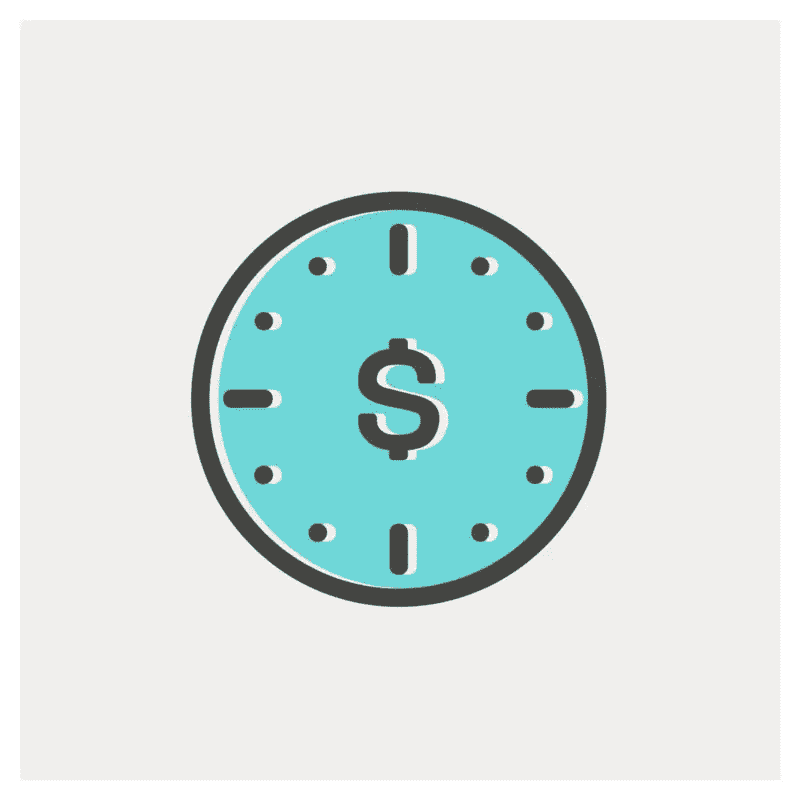
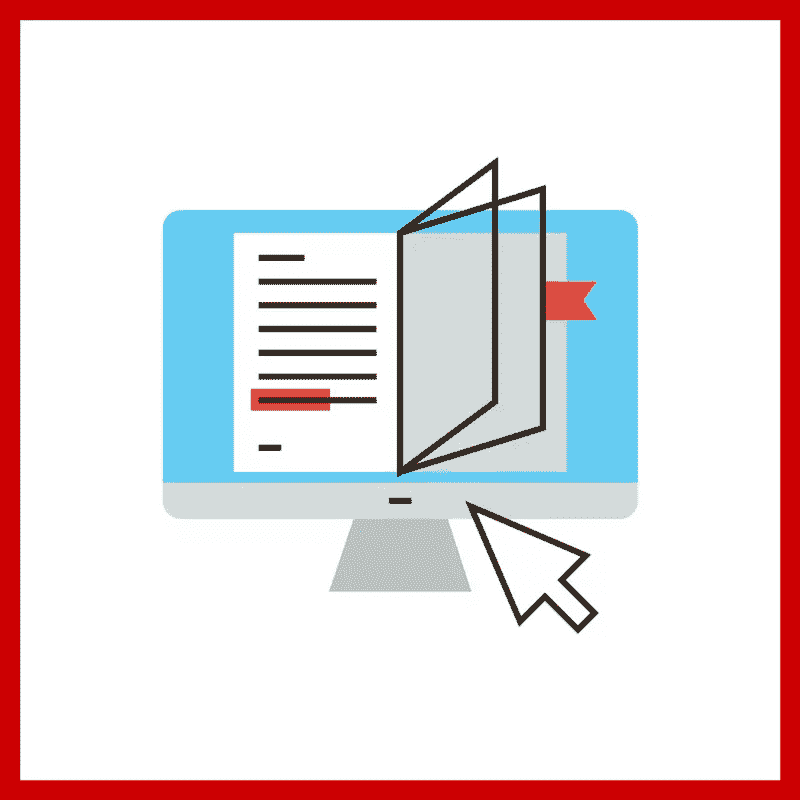
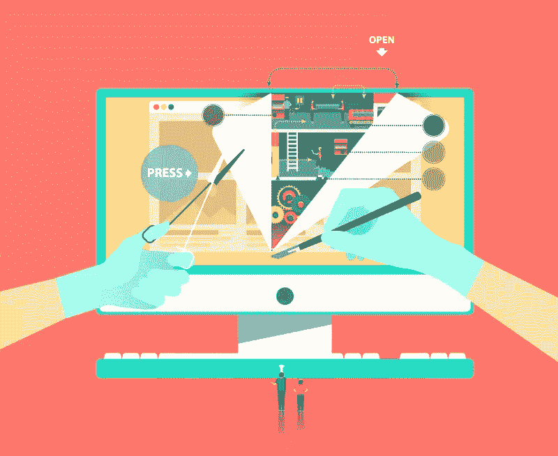
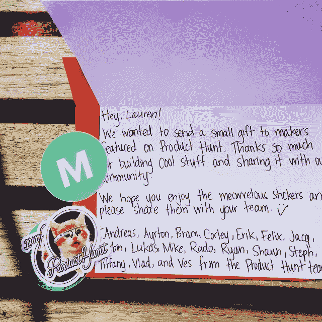

# 如何应对工作中的不景气

> 原文：<https://www.sitepoint.com/how-to-deal-with-slow-times-at-work/>

高中时，我在工作日从下午 4 点到 7 点经营我父亲的商店。

我喜欢它，因为我做作业每小时能得到 12 美元(这对没有账单要付的孩子来说是一大笔钱)，因为这是一天中最慢的时间。

从我记事起，我就不是一个浪费时间的人。

效率低下让我抓狂。因此，我总是确保自己在“空闲时间”有事情可做——无论是会议之间的 15 分钟，还是项目之间的两个月。

考虑这九种有效的方式来度过你的悠闲时光。

## 1.创造和/或货币化你的资产

你有没有一门你非常想上的课？你一直渴望写的一本电子书怎么样？也许你有很多自己拍摄的专业照片并拥有版权——为什么不[把它们卖给一个图片分享网站](http://www.thepennyhoarder.com/selling-stock-photography/)？

根据你的专业，很可能你有大量的资产，比如博客帖子、PowerPoint 演示、照片、矢量等等。慢时间是组织、组合和增加你的老歌和好东西的最佳时机，并将这些粗略的资产转化为被动收入。

## 2.创建和/或优化流程。

流程不会限制创造力。相反，他们通过减少管理工作让你专注于你的手艺。跟踪每个项目，进行离职面谈，收集优秀的评价。–[保罗·贾维斯](http://thecreativeclass.io)

从长远来看，记录和完善冗余流程和工作流所花费的额外时间是非常值得的。尤其是因为流程可以以多种方式重新调整用途。

例如，你可以记录你的过程，因为你想在将来把这个任务外包给一个虚拟助理(VA)，自由职业者或者实习生。然后，您可以在您的资源页面或博客上发布清单，这样您的客户和潜在客户也可以利用它。

这里有几个应用程序可以让你创建可重复使用的流程/清单:

*   [管道化](http://www.pipefy.com/)
*   (点击这里查看[公布的清单。](https://process.st/checklists-for-bloggers/))
*   [SweetProcess](http://sweetprocess.com)

## 3.补上学习。

谋生是去年的事了。[学习谋生的新领域。](http://www.shutterstock.com/blog/why-you-need-to-constantly-keep-learning-and-how-to-make-it-happen)

根据成人学习机构 Niace 的 2012 年学习调查，学习和持续就业之间有很强的相关性。

参与学习活动的员工更能适应组织不断变化的要求，并在就业市场上获得竞争优势。表现出对个人发展认真负责的候选人可能会被视为高度积极和投入。他们对学习的开放态度也表明他们灵活、适应性强，会给工作场所带来持续改进的风气——所有这些都对雇主有吸引力。”

参加[课程](http://www.producthunt.com/#!/s/posts/course)。如果你对此不感兴趣，那么[读一些你所在行业的顶级博客](http://alltop.com)。

## 4.刷新你的个人品牌和投资组合。

我通常一年只做一次，因为这非常耗时，但话说回来，这可能只是一个很长的过程，因为我每年只做一次。

缓慢时期是对你做过的、没有列在你的简历或网站文件夹上的所有事情进行一次大脑转储的好时机，并添加一些让你像超级明星一样闪耀的项目。

测试你网站上的所有东西，确保链接和联系方式也能正常工作。

## 5.创建一个辅助项目。

辅助项目是最新和最时尚的内容营销增长黑客。不相信我？然后[阅读这篇关于 one side project 如何拯救这个创业市场的帖子](https://blog.crew.co/how-side-projects-saved-our-startup/)。

如果你很难想出一个好主意，那么我建议你浏览以下网站和社区:

*   [黑客新闻](http://news.ycombinator.com)
*   [Reddit 端项目](https://www.reddit.com/r/sideproject)
*   [产品搜寻](http://producthunt.com)

## 6.为自己创造一个营销活动。

这里有一些让你自我推销的点子:

*   创建一个 [Buffer](http://bufferapp.com) 账户，创建一个月的社交媒体帖子。
*   [更新您的电子邮件签名](http://wisestamp.com)。
*   写一些博客文章，把它们安排在下一周、下个月或下一年。
*   创建一个[编辑日历](https://trello.com/b/PuwEhs4b/editorial-calendar-trello)。
*   在 [HARO](http://helpareporterout.com) 上注册账户。
*   加入几个[休闲小组](http://chats.directory/)。

## 7.整理你的电脑。

除了下载一个自动 Mac 清理应用程序，你最后一次真正清理你的笔记本电脑是什么时候？

你的电脑在努力工作，所以在电脑运行缓慢的时候，给它来个大扫除吧。

计算机组织本身就是一个深入的指南，所以[我谷歌了](https://www.google.com/webhp?sourceid=chrome-instant&ion=1&espv=2&ie=UTF-8#q=guide%20to%20organizing%20your%20computer)来找到一些链接来引导你完成这个过程。这是我最喜欢的发现。

*   [整理你的数据](http://lifehackerbook.com/ch2/)
*   [OS X Mavericks:在 Finder 中整理您的文件](https://support.apple.com/kb/PH13984?locale=en_US)
*   [清理&在 2 小时内整理好你的 Mac 电脑](https://www.udemy.com/organize-and-clean-your-messy-macbook/)
*   [整理杂乱:面向初学者的 Mac 文件组织和管理](http://computers.tutsplus.com/tutorials/cut-the-clutter-mac-file-organization-and-management-for-beginners--mac-49779)

## 8.说谢谢。

正如玫琳·凯·艾施曾经说过的，“每个人都希望被欣赏，所以如果你欣赏某人，不要藏在心里。”

在这段低迷时期，忘记建立公关和影响者名单，开始创建你最忠实的客户、导师和/或商业伙伴的电子表格。

一旦你建立了这个清单，然后通过[电子邮件](https://www.themuse.com/advice/how-to-write-an-interview-thankyou-note-an-email-template?ref=search)或[手写](http://thankbot.com/)定制[感谢信](https://www.themuse.com/advice/5-steps-to-an-utterly-perfect-thank-you-note?ref=search)。

这里还有另外四种非常有创意的方式来表达感谢。

## 或者，只是休息一下。

也许你需要这段缓慢的时间来防止你筋疲力尽。如果是这样的话，那就休息一下，想做什么就做什么，一天，一周，甚至两天。

#### 你最近有空吗？你决定怎么花？在下面的评论里告诉我。

## 分享这篇文章