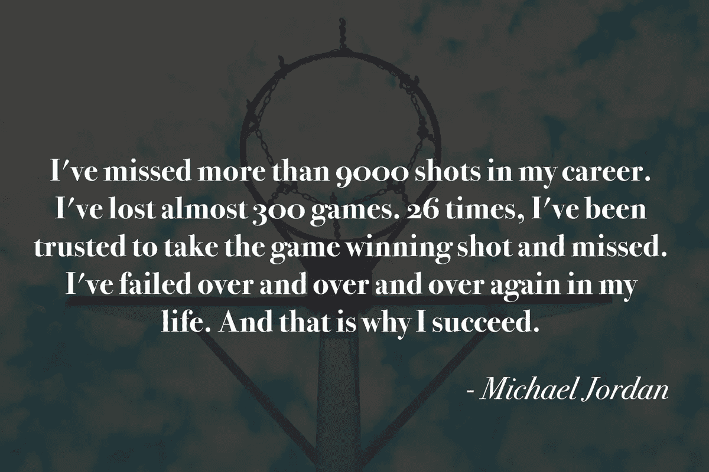
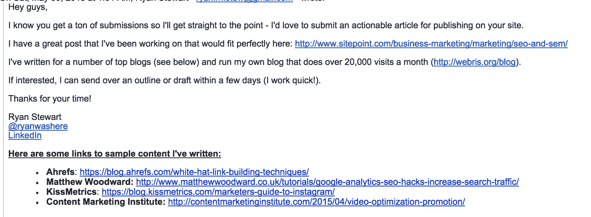
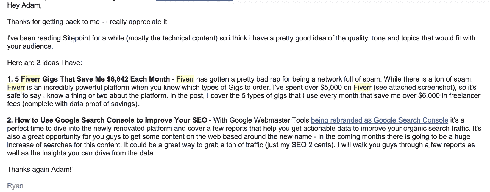
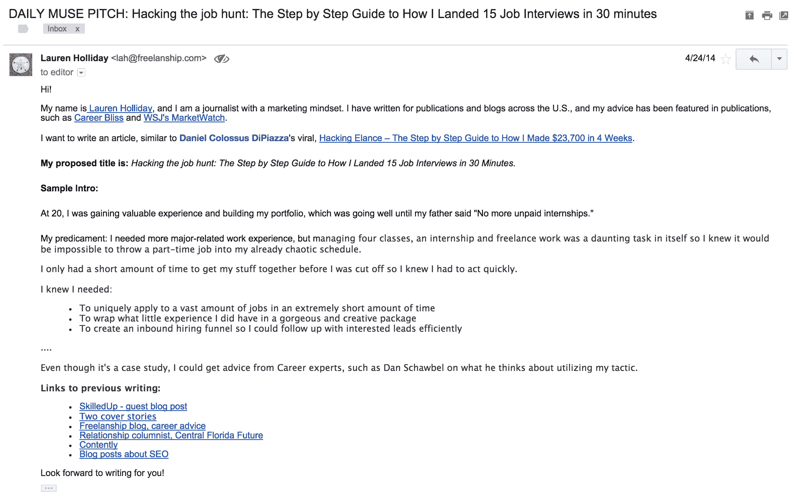

# 一位 SitePoint 编辑的自白

> 原文：<https://www.sitepoint.com/editor-confessions/>

我从很酷之前就开始写作了。

我在 20 岁的成熟年龄发现了我的激情。

事情开始于 2010 年，当时我承认我讨厌我的大学专业。我申请了中佛罗里达大学(UCF)新闻项目的一个职位。不久之后，我被录取了。

在那之后不久，我的第一门课——斯皮尔教授的新闻学导论——不及格。

当我试图说服自己不要重修这门课时，斯皮尔不为所动，于是我在下学期重修了这门课。

我不能出版来拯救我的生活。我的写作糟透了，简直是毁灭性的。

有几个月，我真的觉得自己很傻。我觉得我是靠欺骗进入这个独家项目的——我可能不够好，不属于这里。

我曾想过要逃离写作，但后来我意识到了一些事情——我真的真的很喜欢写作。

回想起来，斯皮尔的课不及格是我一生中最幸运的事情。在那之前，我的生活很轻松。失败激励我变得更好。

在接下来的两年里，我为当地一家著名报纸写了两篇封面故事，成为校报的关系专栏作家，并引用了 UCF 总统希特的一句话，他已经十年没有和学生记者说过话了。

第一个封面故事同学嘲笑我投球。就像第一份出版物一样，我把这个想法推销给了(*芝加哥论坛报的奥兰多哨兵报*)。[糖衣](http://www.orlandoweekly.com/orlando/sugar-coated/Content?oid=2246881)却很受欢迎，就在它出版几个小时后，一个全国性的广播节目要求采访我。

事情发生了显著的转变，我成了一名出版作家，采访过《纽约时报》著名作家的同一批人。我开始听到这样的事情:

你写了那个故事？！我喜欢那个故事。

你就是那个女孩，谁写的(插入标题)？！

从那以后，将近五年过去了，我不仅在你可能听说过的地方发表了相当多的文章，而且我也成为了一个相当好的(也就是强硬的)编辑——我想今天斯皮尔会为此感到骄傲。

话虽如此，但这绝对不意味着我不再被拒绝了。

在过去的三个月里，这是一次“差一点就被发表在 TechCrunch 上的机会——不是一次，而是两次。我离在纽约时报的现代爱情专栏发表文章还有一段路要走(这是我的一个大梦想)。

#### 我的观点是:出版是一种特权。

无论你本质上是一名作家还是一名企业家，想要通过博客来证明自己是思想领袖，我为你写了这篇文章。

这篇文章将教你如何获得发表的特权。

我们走吧。

## 如何被出版(至少被我)

我把它分成了两部分。第一部分详细介绍了最容易出版的作家的五个特点，然后是如何写一封推介邮件，让你在任何出版物中获得一席之地。

### 对编辑宠儿的剖析

虽然没有成为编辑宠儿的数学公式，但有一些获奖作家的趋势特征，即那些在 reg 上发表的作家。简而言之，它们让编辑的生活更轻松。原因如下。

#### 1.他们是可靠的。

可靠性是我清单上的第一位，因为不可靠性是阻碍职业发展的第一位习惯。没有什么比你可靠与否的名声更能决定你的成功。

作为一名编辑，我每周都有一定数量的帖子需要发布，所以当你放弃你唠叨着要我批准的帖子时，我不得不争先恐后地寻找另一篇内容来填充它的空间。

一个字:烦。

#### 2.他们很尽责。

最好的作家都有强迫症。他们知道我的名字不是劳拉。是劳伦。他们并不懒惰——如果单词下面有一条红色的曲线，他们就会高亮显示，右键单击并确保拼写正确。

#### 3.他们适应性很强。

最好的贡献者是那些灵活的人。他们在必要的时候会产生想法，他们也会接受我的建议。最好的作家都是很好的研究者和学习者，这让他们有能力写很多他们知之甚少甚至一无所知的话题。

#### 4.他们很愉快。

我怎么强调这一点都不为过。也许我应该把它放在第一位，因为它太重要了。

讨人喜欢很重要。

据《华尔街日报》报道，讨人喜欢的人更容易被雇用，在工作中得到帮助，从别人那里获得有用的信息，并原谅自己的错误。麻省大学(University of Massachusetts)的研究人员去年对 133 名经理进行了一项研究，发现如果一名审计师讨人喜欢，并且给出了条理清晰的论点，经理们往往会遵从他的建议，即使他们不同意，而且审计师缺乏支持证据。

讨人喜欢真的没那么难。

基本上，不要苛求；有个性；请不要告诉我如何经营我的出版物。直截了当地说:如果你不喜欢我的风格指南，那就不要给我编故事。

#### 5.他们是优秀的作家。

没有什么比一篇流畅的内容更好的了。编辑语法和拼写错误比编辑不连贯的博客文章要容易得多，所以请在开始写之前花点时间[组织你的文章](http://positionly.com/blog/copywriting/what-do-the-best-writers-do)。

## 通过写一封真正的黑仔推销邮件来打开你的大门

[杰西卡·里德](https://medium.com/@jessicaelisabethreed/how-to-pitch-to-me-plus-what-i-would-give-my-right-arm-to-read-more-of-f63cb82c4470)偷走了我脑海中的话，她说:“你是谁并不重要——如果你的想法不令人兴奋*(相信我，编辑是厌倦的生物，什么都读两遍)，*我们不会咬你。”

我只用了不到五秒钟就决定了我是否喜欢你的演讲，所以直接从主题开始吸引我吧。那就让你的电子邮件变得更好，即使是瑞恩·高斯林也不能把我从你的电子邮件中带走。是的，真的很迷人。有可能。

一个好的推销需要一个人擅长写非常好的电子邮件。

下面是最近 SitePoint 上一个非常好的电子邮件营销截图，它变成了一篇非常好的博客文章。

下面是我一年前写给《每日缪斯》编辑的另一个例子。这也变成了一篇很棒的博文。

(注:在我写这篇文章之前，我肯定在谷歌上搜索过这个问题的某个版本:“如何写一封推销邮件”，但我不记得我是从谁那里学到这个的，所以我想为我不能信任教我的人而道歉。)

以下是这些推介的要点:

1.  **名降。**你是否在某个非常非常棒的地方发表过作品或被特别报道过？然后告诉我——最好是超链接到它，这样它就突出来了，让我可以快速了解更多。
2.  写一个引人注目的标题。在我的书中，引人注目的标题是量化结果的标题。需要一些灵感。这里有一些:

    *   [数字营销人员 2014 年的 101 个最佳电子邮件主题(…以及我们的 10 个最差主题！)](http://www.digitalmarketer.com/101-best-email-subject-lines-2014/)
    *   [52 条头条新闻](http://www.cormacmoore.com/wp-content/uploads/2013/12/Headline-Hacks-08-18-2012.pdf)
    *   [波特内特的标题工具制造者](http://www.portent.com/tools/title-maker)
    *   [HubSpot 的博客话题生成器](http://www.hubspot.com/blog-topic-generator)
3.  **戏弄我。无论你是像我一样写一个简单的介绍，还是像 Ryan 一样写一个简洁但有内涵的两到三句话的概述，一定要让编辑感受到神圣的内容，让他们想读更多。**

## 结论

这就是你被出版的方式，至少是被我出版。

我还要补充一点，已经出版的作家还有一个我忘了提到的与生俱来的品质——他们有极端的毅力。

我被出版是因为我经历了每一个“不”——要么把它变成“是”,要么找到另一个“是”。

作为特殊待遇，我附上了一个资源礼包，可以帮助你实现出版的目标。

## 链接到关于此主题的好文章

*   [这个写作 GPS 帮助你创造好得离谱的内容](http://www.marketingprofs.com/articles/2014/25986/writing-gps-for-ridiculously-good-content#ixzz3epvEyrMO)
*   所有优秀的内容有什么共同点？
*   [撰写排名谷歌前十的博客文章的终极指南](http://neilpatel.com/2015/07/02/the-ultimate-guide-to-writing-blog-posts-that-rank-in-googles-top-10/)
*   最优秀的作家会做哪些其他作家不会做的事？
*   [斯蒂芬·金的《你需要知道的关于成功写作的一切——十分钟内》](http://www.aerogrammestudio.com/2015/02/24/stephen-king-everything-you-need-to-know-about-writing-successfully/)
*   [我是如何推销@TechCrunch 的，以及当你开始创业时获得媒体关注的 13 种方法](http://jasonlbaptiste.com/featured-articles/how-i-pitched-techcrunch-and-13-ways-to-get-press-when-you-launch-your-startup/)
*   [按下](http://austenallred.com/user-acquisition/book/chapter/press/)
*   [Mediabistro 的“如何推销”](http://www.mediabistro.com/content/archives/HowToPitch.asp)
*   [如何让编辑阅读你的推介](http://www.inc.com/ed-zitron/how-to-get-editors-to-read-your-pitch.html)
*   [发表客座博文的七个技巧](http://goinswriter.com/guest-post/)
*   [为什么大多数创业公司没有受到压力](http://firstround.com/review/why-most-startups-dont-get-press/)

## 分享这篇文章