# 如何咕噜咕噜地实现工作流自动化

> 原文：<https://www.sitepoint.com/how-to-grunt-and-gulp-your-way-to-workflow-automation/>

本文是微软网站开发系列的一部分。感谢您对使 SitePoint 成为可能的合作伙伴的支持。

当你刚接触前端开发并开始掌握 HTML5、CSS 和 JavaScript 时，显而易见的下一步是使用大多数开发人员用来在这个复杂领域保持理智的工具。你也应该拥有更多的灵活性和特性，同时用更少的代码编写 CSS 表单。您也应该通过缩减 JS 代码来优化带宽。您也应该能够使用 JSHint 自动检查您的 JS 代码是否良好。这些好东西是你应得的。

所以你开始手工使用这些伟大的工具；手工运行越来越多的命令行。有时候，你会忘记运行 Less 编译器。有时你忘记运行 JSHint，一个错误就出现了…

突然你发现自己在想:有没有什么解决方案可以自动化所有这些工具？你如何创建一个可重复的工作流程来防止你犯错？

显然有一个解决方案，特别是两个工具正等着你开始使用:**咕噜声**和**吞咽声**。

作为一个使用这些工具的新手，你想知道它们是如何工作的，以及使用哪一个，是吗？好极了，那么，你正在阅读正确的文章！

## 我们要用的样本

我会用一个非常简单的例子告诉你使用 Grunt 和 Gulp 的基础，你可以从这里下载:[http://aka.ms/gruntgulpplugin](http://aka.ms/gruntgulpplugin?WT.mc_id=13410-DEV-sitepoint-article34)

这是一个简单的网站，由三个文件组成:

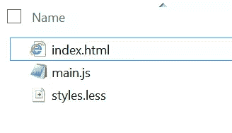

Styles.less 以比使用标准 CSS 文件更丰富的方式定义 CSS 表单。最后我们使用 Less 编译器创建一个`styles.css`文件。使用 less，我们可以在 css 文件中使用变量:

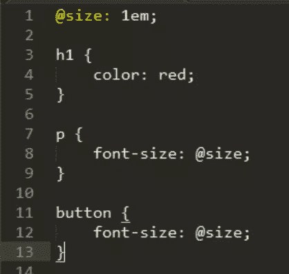

在这里获得更多关于 Less 的信息:[http://lesscss.org/](http://lesscss.org/?WT.mc_id=13410-DEV-sitepoint-article34)

JavaScript 和 HTML 代码非常简单。该页面应该如下所示:

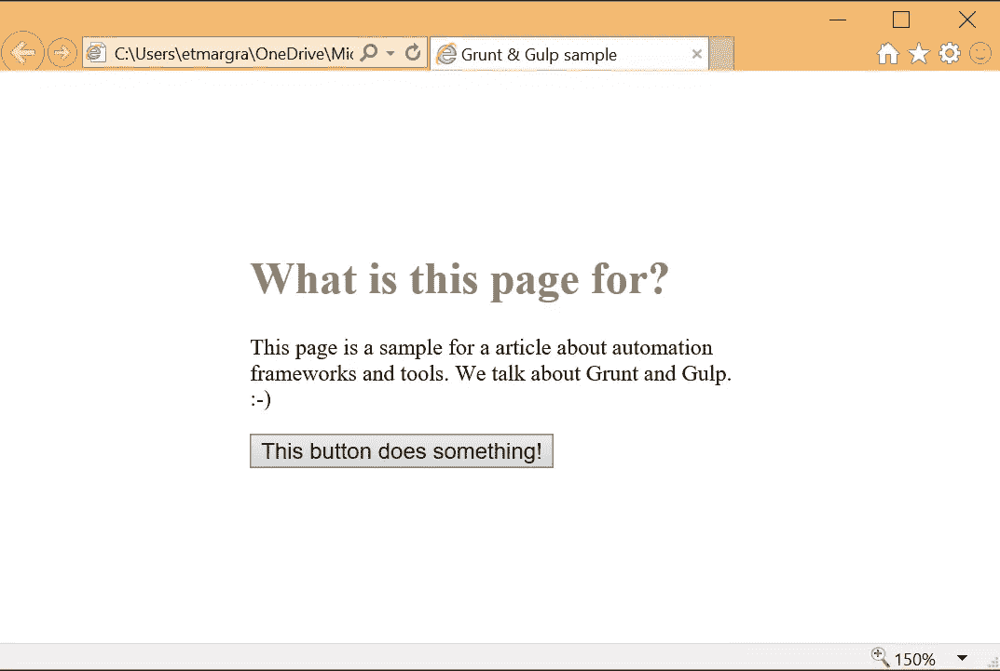

## 了解 Node.js 包管理器

你需要先了解节点。JS 包管理器(npm)工作。

Npm 是 Node.JS 提供的工具，用来获取工具和框架，同时自动解析它们的依赖关系。

例如，要使用 less 并将其编译成 web 可用的 CSS 文件，首先需要使用以下命令安装 less:

```
npm install -g less
```

*注意:要得到`npm`命令行，你必须从 http://nodejs.org/的*安装 nodejs

一旦完成，您就可以运行这个命令来编译。更少的文件进入。css:

```
lessc styles.less > styles.css
```

Npm 使用它创建并存储在其工作的本地文件夹中的文件:`package.json`。这个文件使用 JavaScript Object Notation (JSON)格式让 npm 知道安装了哪个工具和版本，以及当前`project`(由当前文件夹表示)使用的框架。

这个文件对于 Grunt 和 Gulp 非常重要，因为它将包含您的自动化工作流程中下载和可用的插件列表。

要创建空的 package.json 文件，可以使用以下 npm 命令:

```
npm init
```

您将完成一些可以使用默认选项回答的问题，然后就可以开始了。

在这个文件中，您将有两种依赖关系:

*   执行 web 应用程序/ nodejs 应用程序所需的那些
*   开发阶段所需的(比如 Less)和用于编译/检查代码的

Npm 基本上为您提供了三种安装包的方式:

*   使用`–g or` `-global`选项在您的机器上全局设置
*   出于执行目的，不使用任何选项(仅 npm 安装[工具或框架])，本地安装在您的项目文件夹中
*   出于开发目的，使用`--save-dev`选项在本地的项目文件夹中

第三个将在`package.json`文件中创建一个`devDependencies`节/属性。

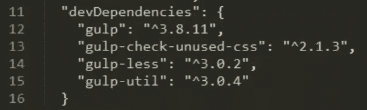

## 咕哝

### 什么是咕噜声？

Grunt 是 JavaScript 自动化工作流领域的先驱。有很多已知的 Grunt 用户，比如 Twitter、jQuery 和 Modernizr。

Grunt 的基本原理是给我们一个运行`tasks`的简单方法。任务是已经为您创建的一组代码文件和配置文件。你可以通过安装使用 npm 获得的 Grunt 插件来获得新任务。你可以为你可能使用的几乎所有工具找到一个插件，比如 [Less](https://www.npmjs.com/package/grunt-contrib-less?WT.mc_id=13410-DEV-sitepoint-article34) 和 [JSHint](https://www.npmjs.com/package/grunt-contrib-jshint?WT.mc_id=13410-DEV-sitepoint-article34) 。

要运行 Grunt，您必须创建一个 Grunt 文件，在该文件中指定您想要运行的任务以及每个任务的配置。一旦完成，你只需要运行`grunt`命令行来指定你想要运行的任务(默认的或者特定的)，它就会自动完成。

现在，让我们通过一步一步的指南来设置这一切。

### 第一步。创建 package.json 文件

使用 npm 来`init`文件:

```
npm init
```

你将不得不回答一些问题，如项目名称和什么是默认的。js 文件。您也可以选择手动创建文件，并将其内容设置为:

```
{
  "name": "project-name",
  "devDependencies": {},
  "dependencies": {}
}
```

### 第二步。在全球和本地安装 Grunt

您需要全局安装 Grunt 来获得命令行，并在本地初始化项目所需的一切。

运行:

```
npm install -g grunt
```

然后在本地运行它:

```
npm install grunt --save-dev
```

*注意:不要忘记`–dev`部分，因为它在`package.json`文件中被指定为`devDependencie`。*

### 第三步。创建 gruntFile.js

Grunt 使用一个名为 gruntFile.js 的文件工作，这个文件包含了 Grunt 需要的一切，也就是说:

*   任务的配置
*   自定义任务
*   任务加载

Grunt 期望文件导出一个带有一个名为`grunt`的参数的函数。您将使用该对象来执行所有与 Grunt 相关的操作。

这是一个最小的 gruntfile，它只读取`package.json`文件，并创建一个`default`任务，该任务不运行任何东西。

*注意:将文件放在项目文件夹中，与`package.json`文件*并排

```
module.exports = function(grunt) {

  // Project configuration.
  grunt.initConfig({
    pkg: grunt.file.readJSON('package.json'),
  });

  // Default task(s).
  grunt.registerTask('default', []);

};
```

您可以执行它来确保一切都配置正确。

为此，请在项目文件夹中打开命令提示符并运行:

```
grunt
```

您应该会看到类似这样的内容:

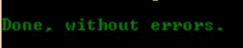

### 第四步。添加您的第一个任务:JSHint

现在你的 Gruntfile 已经准备好了，下一步是添加一个插件并使用它。所有插件都可以在这里找到:[http://gruntjs.com/plugins](http://gruntjs.com/plugins?WT.mc_id=13410-DEV-sitepoint-article34)。Gruntfile 中执行的一个常见任务是检查 JavaScript 语法是否正确。为此，我们通常使用 JSHint。

让我们将它添加到您的工作流程中。

如果你在 grunt 插件页面搜索 JShint，你会发现`grunt-contrib-jshint` ( [此处](https://www.npmjs.com/package/grunt-contrib-jshint?WT.mc_id=13410-DEV-sitepoint-article34))正是我们所需要的！

在项目文件夹中，运行:

```
npm install grunt-contrib-jshint --save-dev
```

一旦完成，你必须把它添加到你的 Gruntfile.js 中。有两个简单的步骤:

*   加载插件
*   配置任务

要加载插件，使用`loadNpmTasks`功能:

```
// Load the plugin that provides the "jshint" task
grunt.loadNpmTasks('grunt-contrib-jshint');
```

配置是在`initConfig`函数中完成的，您必须向参数中给定的对象添加一个新属性。这必须是你要添加的任务的名称，并且与你使用的插件相关。了解该名称和任务可用选项列表的最佳方式是查看插件文档。你总会找到一个记录良好的样本。

例如，在我们的示例中，我们想要检查除了`gruntfile.js`之外的所有 JavaScript 文件。我们还想激活一组规则来检查像`eqeqeq`这样的 JavaScript 文件，以确保我们在需要时使用 triple equals。

下面是修改后的 initConfig 函数:

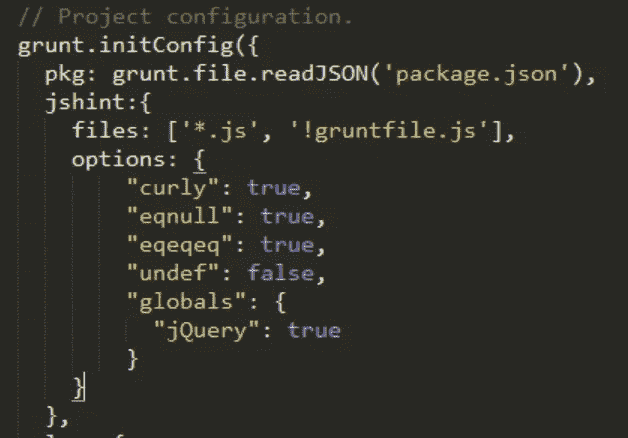

您可以使用下面的命令行运行您的任务(其中您将任务名称指定为`grunt`的参数):

```
grunt jshint
```

结果在这里:

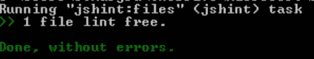

您只需运行该命令，它会自动提示您遇到任何错误。

祝贺你，你现在有了一个自动化的工作流程！

### 第五步。添加第二个任务:减少编译

您的 JShint 任务工作得很好，但是它在工作流中有点孤立。通常，我们使用 grunt 这样的工具来运行多个任务。

这是很容易添加更多的，因为你只需要按照同样的步骤。假设您现在想要在自动化过程中添加 less 文件的编译。如果您在 grunt 插件中搜索，您会发现一个 grunt-contrib-less 插件，您可以将它安装在您的项目文件夹中:

```
npm install grunt-contrib-less --save-dev
```

与 jshint 任务一样，您必须添加配置:

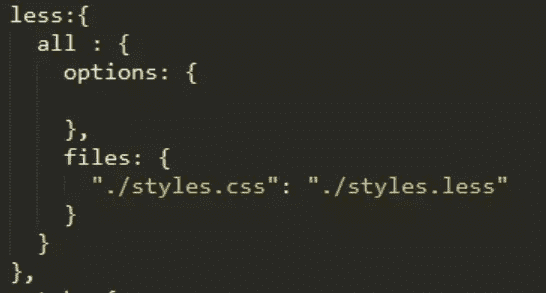

然后，加载任务:


现在您可以运行 Grunt 并指定`less`任务:这只会启动更少的任务。这没问题，但是您想运行所有的任务，对吗？这就是`default` 任务的作用。

当你只运行`grunt`而没有指定任何任务时，它会搜索一个`default`任务并运行其数组中指定的所有任务。你可以修改它来运行`less`和 jshint `.` 注意，要添加一组像`default`这样的任务，你需要调用`registerTask` 函数:

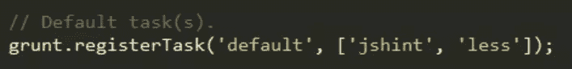

从现在开始，当你跑步时:

```
grunt
```

它将运行 jshint，然后运行 less:


您可以添加任何想要的任务，也可以指定其他任务组，如`default`，并通过将它们的名称作为参数传递给`grunt`命令行来调用它们。

简单对吗？

### 第六步。使用手表，这样你就不必手动运行咕噜

现在，你是一个快乐的开发者。在 grunt 工作流中，所有重复的任务都是自动化的，你只需要运行 grunt 就可以执行它们。但这可以更容易做到。这可以自动完成。

为此，您可以添加一个名为`watch`的特定任务。这个任务会不断地检查你的工作文件夹，当一个文件被修改时，grunt 会根据规则运行一个相关的任务。

首先，在您的项目文件夹中安装 watch:

npm 安装 grunt-贡献-观察-保存-开发

使用`loadNpmTasks`功能像所有其他任务一样加载并配置它。这里的配置部分有点不同，因为您需要使用`watch`为您想要覆盖的每个任务指定一个配置。

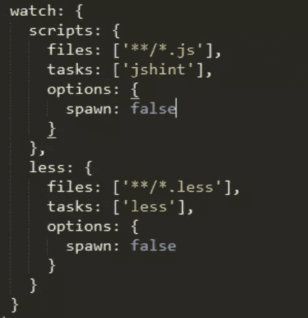

你可以在这里找到这个任务的完整文档:[https://www.npmjs.com/package/grunt-contrib-watch](https://www.npmjs.com/package/grunt-contrib-watch?WT.mc_id=13410-DEV-sitepoint-article34)

当您想要激活`watch`时，您只需运行以下命令:

咕哝手表

并且它将在每次文件被改变并且该文件在特定任务的监视文件的范围内时执行任务。

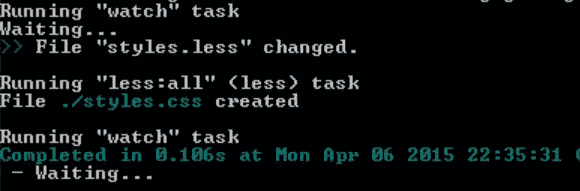

### 就是这样！现在，您已经了解了使用 grunt 创建自动化工作流的所有内容。

## 吞咽

什么是吞咽？

Gulp 是 grunt 的替代词。它是最近才出现的，并被誉为比 grunt 更灵活。在选择你将使用哪一个之前，让我们看看 gulp 是如何工作的。

gulp([http://gulpjs.com/](http://gulpjs.com/?WT.mc_id=13410-DEV-sitepoint-article34))是一个工作流自动化工具。像 grunt 一样，它使用 npm 和 package.json 文件工作。所有可用的插件也将使用 npm 下载，并作为 devDependencies 添加到 package.json 文件中。

与 Gulp 的主要区别之一是它使用流。流是一组函数，文件将通过它们被修改`in memory`。该文件将只在进程结束时写入磁盘，因此效率更高。另一方面，繁重的任务像筒仓一样工作，不能被链接。

让我们通过几个简单的步骤来快速了解一下 Gulp 是如何工作的。

### 第一步。创建 package.json 文件

与 Grunt 类似，您首先必须创建`package.json`文件。您可以使用与 grunt 样本完全相同的技术。

### 第二步。在全球和本地安装 Gulp 和 gulp-util

创建 package.json 文件后，使用以下命令在全局和本地安装 gulp:

```
npm install -g gulp
```

和

```
npm install gulp --save-dev
```

这将安装 gulp 命令行和运行 gulp 工作流所需的一切。

然后你必须安装 gulp utils，它包含其他插件共享的公共函数:

```
npm install gulp-util --save-dev
```

最后，创建最小的 gulp 文件，如下所示:

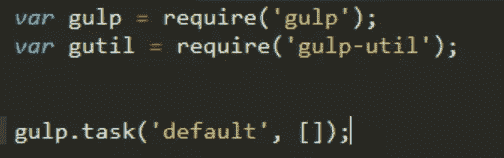

如您所见，它与 grunt 语法有点不同。总而言之，插件是使用 require 语法加载的，如果您是 nodeJS 开发人员，您可能已经习惯了。还有一个使用 gulp.task 函数定义的`default`任务。

如果您在项目文件夹中使用命令提示符运行`gulp` 命令行，您应该会看到如下结果:

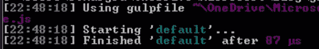

### 第三步。使用您的第一个任务:减少编译

要在 gulp 中使用插件，您需要使用与我们创建`default`任务相同的函数。这是因为您不必使用特定的名称来创建任务。您只需调用 gulp.task，设置您想要的名称，并给它一个 JavaScript 函数作为第二个参数。gulp 运行任务时，会运行这个函数。

要使用一个插件，你可以用你选择的名字来调用它。通常，您将其称为流式工作流的一部分，该工作流通常从选择文件开始。这是通过`gulp.src`功能完成的。它将选择一堆文件并返回一个流，这个流可以被另一个使用`pipe`的函数使用。这就是你如何链接多个动作而不把它们写到磁盘上。你只需要将流从一个插件传递到另一个插件。

下面是一个简单的例子:

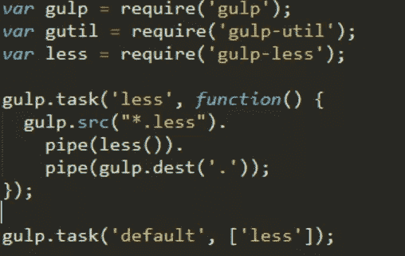

我们首先用`require (‘gulp-less’)`来加载`less`插件。(我们用`npm install gulp-less --save-dev`得到的)。

然后,`gulp.src`将选择所有的`.less`文件，我们将它“管道化”到`less()`函数，最后它被“管道化”到`gulp.dest` ,指示将结果写到哪里。由于`gulp.src`可以选择多个文件，`gulp.dest`指定一个文件夹。

一旦你理解了管道模型，你可以很容易地得到和我们用 grunt 得到的一样的结果。

gulp 的强大之处在于，你可以创建自定义任务，在这个任务中你可以调用多个插件，并且你可以按照你想要的方式将它们关联起来。

*注意:显然还有一个`gulp-watch`插件可以用来自动启动你的工作流程！*

## 结论:选哪个？

我希望你现在对为什么你需要一个自动化工作流以及如何使用`grunt`或`gulp`来得到它有一个更清晰的理解。

选择其中的一个，更多的是和你想要完成的任务有关。

Grunt 很好用。你不必了解管道系统和实现简单的任务将更加直接。这是一个非常成熟的工具，被很多知名的编辑和开发者使用，并且有很多可用的插件。

话虽如此，但 gulp 的设计方式可以给你很大的灵活性。它已经存在了一段时间了，即使你找不到和 grunt 一样多的插件，所有的经典插件都可以在 gulp 上找到。

如果你使用的是一个真正标准的工作流程，有一些常见的步骤，比如 jshint，uglifying，css 验证等等。，咕哝是个不错的选择。如果你要完成更复杂的任务，gulp 将是一个很好的僚机。

## 更多信息

*   咕哝网址: [http://](http://gruntjs.com/) [com/](http://gruntjs.com/)
*   一饮而尽网址: [http://](http://gulpjs.com) [com](http://gulpjs.com)
*   `Use grunt inside Microsoft Visual Studio:`[http://www . ASP . net/vnext/overview/aspnet-vnext/grunt-and-bower-in-visual-studio-2015](http://www.asp.net/vnext/overview/aspnet-vnext/grunt-and-bower-in-visual-studio-2015?WT.mc_id=13410-DEV-sitepoint-article34)

## JavaScript 的更多实践

微软有许多关于开源 JavaScript 主题的免费学习，我们的任务是用 [Microsoft Edge](http://blogs.windows.com/msedgedev/2015/04/29/introducing-microsoft-edge-the-browser-built-for-windows-10/?WT.mc_id=13410-DEV-sitepoint-article34) 创造更多。以下是一些要检查的:

*   【2015 年微软 Edge 网络峰会(关于新浏览器、新网络平台功能和社区演讲嘉宾的完整系列)
*   //BUILD/和 Windows 10 的构建(包括网站和应用的新 JavaScript 引擎)
*   [在不破坏网络的情况下推进 JavaScript](http://channel9.msdn.com/Events/WebPlatformSummit/2015/Advancing-JavaScript-without-breaking-the-web?WT.mc_id=13410-DEV-sitepoint-article34)(Christian heil Mann 最近的主题演讲)
*   [托管网络应用和网络平台创新](http://channel9.msdn.com/Events/Build/2015/2-665?WT.mc_id=13410-DEV-sitepoint-article34)(深入探讨流形等主题。JS)
*   [让你的 HTML/JavaScript 更快的实用性能技巧](http://channel9.msdn.com/Series/Practical-Performance-Tips-to-Make-Your-HTMLJavaScript-Faster/06?WT.mc_id=13410-DEV-sitepoint-article34)(从响应式设计到休闲游戏再到性能优化的 7 部分系列)
*   现代网络平台快速启动(HTML、CSS 和 JS 的基础)

以及一些免费的入门工具: [Visual Studio Code](https://code.visualstudio.com/?WT.mc_id=13410-DEV-sitepoint-article34) 、 [Azure 试用版](http://azure.microsoft.com/en-us/pricing/free-trial/?WT.mc_id=13410-DEV-sitepoint-article34)和[跨浏览器测试工具](http://dev.modern.ie/?utm_source=SitePoint&utm_medium=article34&utm_campaign=SitePoint)——都适用于 Mac、Linux 或 Windows。

本文是微软网站开发技术系列的一部分。我们很高兴与您分享[微软 Edge](http://blogs.windows.com/msedgedev/2015/04/29/introducing-microsoft-edge-the-browser-built-for-windows-10/?WT.mc_id=13410-DEV-sitepoint-article34) 和新的 [EdgeHTML 渲染引擎](http://blogs.windows.com/msedgedev/2015/02/26/a-break-from-the-past-the-birth-of-microsofts-new-web-rendering-engine/?WT.mc_id=13410-DEV-sitepoint-article34)。获得免费虚拟机或在您的 Mac、iOS、Android 或 Windows 设备上进行远程测试@ [modern。IE](http://dev.modern.ie/?utm_source=SitePoint&utm_medium=article34&utm_campaign=SitePoint)

## 分享这篇文章