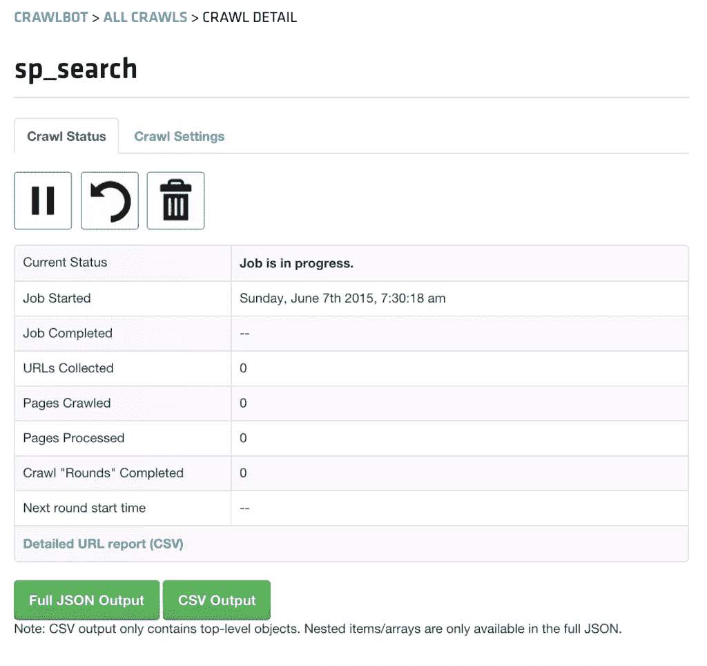
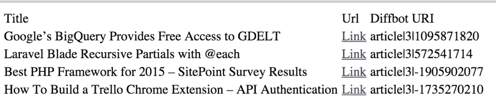
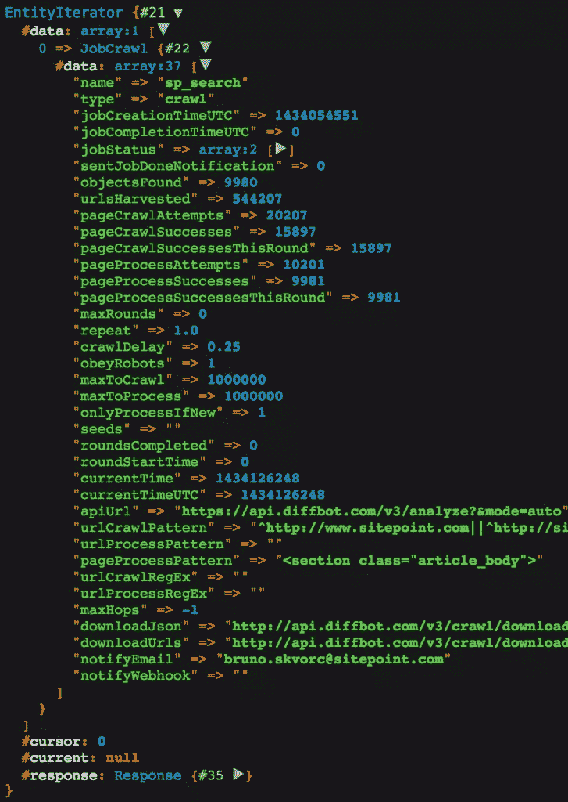

# 使用 Diffbot 爬行和搜索整个域

> 原文：<https://www.sitepoint.com/crawling-searching-entire-domains-diffbot/>

在本教程中，我将向你展示如何构建一个定制的 [SitePoint 搜索引擎](http://search.sitepoint.tools),它将远远超越 WordPress 可能发布的任何内容。我们将使用 [Diffbot](https://www.sitepoint.com/blog/) 作为服务从 SitePoint 自动提取结构化数据，并使用[这个匹配的 API 客户端](https://github.com/Swader/diffbot-php-client)进行搜索和抓取。


我还将使用我可信赖的 [Homestead 改进的](https://www.sitepoint.com/quick-tip-get-homestead-vagrant-vm-running/)环境来进行一个干净的项目，这样我就可以在一个专用于这个项目的 VM 中进行试验。

## 什么是什么？

要制作一个 SitePoint 搜索引擎，我们需要做到以下几点:

1.  构建一个爬网作业，该作业将索引和处理整个 SitePoint.com 域，并使用新发布的内容更新自身。
2.  构建一个 GUI，用于将搜索查询提交到由此 crawljob 生成的保存集。搜索是通过[搜索 API](http://www.diffbot.com/dev/docs/search) 完成的。我们将在后续的文章中这样做。

一个 [Diffbot Crawljob](http://www.diffbot.com/products/crawlbot/) 执行以下操作:

1.  它为 URL 爬行一个 URL 模式。这并不意味着处理——这意味着从你最初作为*种子*传入的域名开始，在它能找到的所有页面上寻找链接*来处理*。抓取和处理的区别见[这里](http://support.diffbot.com/crawlbot/whats-the-difference-between-crawling-and-processing/)。
2.  它使用指定的 API 引擎处理在蜘蛛抓取的 URL 上找到的页面——例如，使用产品 API，它处理在 Amazon.com 上找到的所有产品，并将它们保存到一个结构化的商品数据库中。

## 创建爬网作业

可以通过 Diffbot 的 GUI 创建作业，但我发现通过 crawl API 创建作业是一种更加可定制的体验。在一个空文件夹中，让我们首先安装客户端库。

```
composer require swader/diffbot-php-client
```

我现在需要一个`job.php`文件，按照[自述文件](https://github.com/swader/diffbot-php-client)，我将把工作创建过程转储到这个文件中:

```
include 'vendor/autoload.php';

use Swader\Diffbot\Diffbot;
$diffbot = new Diffbot('my_token');
```

Diffbot 实例用于创建对 Diffbot 提供的 API 类型的访问点。在我们的例子中，需要一个“爬行”类型。姑且称之为“sp_search”。

```
$job = $diffbot->crawl('sp_search');
```

这将在调用`call()`方法时创建一个新的 crawljob。接下来，我们需要配置作业。首先，我们需要给它一个种子 URL 来开始爬行过程:

```
$job
    ->setSeeds(['https://www.sitepoint.com'])
```

然后，我们让它在完成爬行时通知我们，这样我们就知道一轮爬行何时完成，并且我们可以期待数据集中有最新的信息。

```
$job
    ->setSeeds(['https://www.sitepoint.com'])
    ->notify('bruno.skvorc@sitepoint.com')
```

一个站点可以有几十万个链接到 spider，还有几十万个页面要处理——最大限制是一种成本控制机制，在这种情况下，我想要尽可能详细的集合，所以我将在这两个值中放入一百万个 URL。

```
$job
    ->setSeeds(['https://www.sitepoint.com'])
    ->notify('bruno.skvorc@sitepoint.com')
    ->setMaxToCrawl(1000000)
    ->setMaxToProcess(1000000)
```

我们还希望这项工作每 24 小时刷新一次，因为我们知道 SitePoint 每天都会发布几个新帖子。需要注意的是，重复意味着“从上一轮*完成*的时间开始”——因此，如果一个作业需要 24 小时才能完成，那么新的一轮爬行实际上将从上一轮开始的 48 小时后开始。我们将最大轮数设置为 0，以表示我们希望无限期重复。

```
$job
    ->setSeeds(['https://www.sitepoint.com'])
    ->notify('bruno.skvorc@sitepoint.com')
    ->setMaxToCrawl(1000000)
    ->setMaxToProcess(1000000)
    ->setRepeat(1)
    ->setMaxRounds(0)
```

最后，还有页面处理模式。当 Diffbot 在爬网期间处理页面时，只有那些被处理的页面(未被爬网的页面)实际上被计入您的限制。因此，为了我们的利益，尽可能具体地定义我们的 crawljob，以避免处理不是文章的页面——如作者简历、广告，甚至类别列表。找`<section class="article_body">`应该做的——每个帖子都有这个。当然，我们希望它在每一轮中只处理以前没有遇到过的页面——不需要一次又一次地提取相同的数据，这只会增加开销。

```
$job
    ->setSeeds(['https://www.sitepoint.com'])
    ->notify('bruno.skvorc@sitepoint.com')
    ->setMaxToCrawl(1000000)
    ->setMaxToProcess(1000000)
    ->setRepeat(1)
    ->setMaxRounds(0)
    ->setPageProcessPatterns(['<section class="article_body">'])
    ->setOnlyProcessIfNew(1)
```

在完成 crawljob 配置之前，我们需要添加一个更重要的参数——爬网模式。当向 Crawl API 传递种子 URL 时，Crawljob 也会遍历所有子域。因此，如果我们传入`https://www.sitepoint.com`，Crawlbot 将浏览`http://community.sitepoint.com`，以及现在已经过时的`http://reference.sitepoint.com`——这是我们想要避免的，因为它将大大减慢我们的爬行过程，并收获我们不需要的东西(我们现在不希望论坛被索引)。为了设置这一点，我们使用了`setUrlCrawlPatterns`方法，表明被抓取的链接*必须*以`sitepoint.com`开始。

```
$job
    ->setSeeds(['https://www.sitepoint.com'])
    ->notify('bruno.skvorc@sitepoint.com')
    ->setMaxToCrawl(1000000)
    ->setMaxToProcess(1000000)
    ->setRepeat(1)
    ->setMaxRounds(0)
    ->setPageProcessPatterns(['<section class="article_body">'])
    ->setOnlyProcessIfNew(1)
	->setUrlCrawlPatterns(['^http://www.sitepoint.com', '^https://www.sitepoint.com'])
```

现在我们需要告诉作业使用哪个 API 进行处理。我们*可以*使用默认的——分析 API——这将使 Diffbot 自动确定我们试图获取的数据的结构，但我更喜欢特异性，并希望它直接知道它应该只生成文章。

```
$api = $diffbot->createArticleAPI('crawl')->setMeta(true)->setDiscussion(false);
$job->setApi($api);
```

请注意，对于单个 API(如产品、文章、讨论等..)您甚至可以使用 Diffbot.com 的免费演示令牌来处理单个资源，该令牌允许您在通过 Crawlbot 进行批量处理之前测试您的链接并查看它们将返回什么数据。有关如何操作的信息，请参见自述文件。

现在作业已经配置好了，我们可以`call()` Diffbot 如何创建它:

```
$job->call();
```

创建该作业的完整代码如下:

```
$diffbot = new Diffbot('my_token');
$job = $diffbot->crawl('sp_search');

$job
    ->setSeeds(['https://www.sitepoint.com'])
    ->notify('bruno.skvorc@sitepoint.com')
    ->setMaxToCrawl(1000000)
    ->setMaxToProcess(1000000)
    ->setRepeat(1)
    ->setMaxRounds(0)
    ->setPageProcessPatterns(['<section class="article_body">'])
    ->setOnlyProcessIfNew(1)
    ->setApi($diffbot->createArticleAPI('crawl')->setMeta(true)->setDiscussion(false))
    ->setUrlCrawlPatterns(['^http://www.sitepoint.com', '^https://www.sitepoint.com']);

$job->call();
```

通过命令行(`php job.php`)调用这个脚本或在浏览器中打开它已经创建了这个任务——它可以在 [Crawlbot 开发屏幕](https://www.diffbot.com/dev/crawl/)中看到:



这需要一段时间才能完成(实际上是几天——site point 是一个很大的地方),但所有后续的回合都会更快，因为我们告诉作业只处理它以前没有遇到过的页面。

## 搜索

为了搜索数据集，我们需要使用搜索 API。数据集甚至在完成之前就可以被使用——搜索 API 将简单地搜索它所拥有的数据，忽略它并不拥有一切的事实。

要使用搜索 API，需要创建一个新的搜索实例，将搜索查询作为构造函数参数:

```
$search = $diffbot->search('author:"Bruno Skvorc"');
$search->setCol('sp_search');
$result = $search->call();
```

`setCol`方法是可选的，如果省略，将使搜索 API 遍历单个 Diffbot 令牌下的所有集合。由于我在之前的实验中有几个集合，所以我选择指定我们创建的最后一个:`sp_search`(集合与创建它们的作业共享名称)。

返回的数据可以被迭代，每个元素都将是 Article 的一个实例。下面是一个显示链接和标题的基本表格:

```
<table>
    <thead>
    <tr>
        <td>Title</td>
        <td>Url</td>
    </tr>
    </thead>
    <tbody>
    <?php
    foreach ($search as $article) {
        echo '<tr>';
        echo '<td>' . $article->getTitle() . '</td>';
        echo '<td><a href="' . $article->getResolvedPageUrl() . '">Link</a></td>';
        echo '</tr>';
    }
    ?>
    </tbody>
</table>
```



搜索 API 可以返回一些非常好的结果集。`query`参数将接受所有内容，从常见的关键字、日期范围、有针对性的特定字段(如`title:diffbot`)到各种参数的布尔组合，如`type:article AND title:robot AND (overlord OR butler)`，生成标题中包含单词“机器人”以及任何字段(标题、正文、元标签等)中包含单词“霸王”或“管家”的所有文章。我们将在下一篇文章中利用所有这些高级功能来构建我们的搜索引擎 GUI。

我们还可以通过在发出原始调用后将`true`传递给`call()`来获得关于搜索 API 请求的“元”信息:

```
$info = $search->call(true);
dump($info);
```

我们得到的结果是一个 SearchInfo 对象，其值如下所示(都可以通过 getters 访问):


使用 SearchInfo，您可以访问请求的速度、点击次数(不是返回的结果，而是总数——对分页有用)等。

要获得关于特定 crawljob 的信息，比如找出它的当前状态，或者有多少页面被抓取、处理，等等，我们可以再次调用`crawl` API，只需传入相同的作业名。然后，这作为一个只读操作，返回关于我们作业的所有元信息:

```
dump($diffbot->crawl('sp_search')->call());
```



此时，我们已经用从 SitePoint.com 抓取的数据填充了我们的集合。现在我们要做的就是围绕 Diffbot API 客户端的搜索功能构建一个 GUI，这正是我们在下一部分要做的。

## 结论

在本教程中，我们研究了 Diffbot 从任意格式的网站生成结构化数据集合的能力，以及它的搜索 API，该 API 可用作爬行站点背后的搜索引擎。虽然这个价格对于一般的个人开发者来说可能有点过高，但是对于团队和公司来说，这个工具是天赐之物。

想象一下，作为一家拥有数十或数百个不同网站的媒体集团，想要一个包含所有内容的目录。整合所有这些后端团队的努力，不仅要想出合并数据库的方法，还要在日常工作中找到时间来做这件事(包括保持过时网站的活力)，这将是一项不可能完成的超昂贵的任务，但有了 Diffbot，您可以在所有域上释放 Crawlbot，只需使用搜索 API 遍历返回的内容。更重要的是，您抓取的数据可以作为 JSON 有效负载完整下载，所以即使它太贵，您也可以在以后将数据导入到您自己的解决方案中。

值得注意的是，并不是很多网站都同意被抓取，所以你应该在你不拥有的网站上尝试抓取之前看看他们的服务条款——抓取会很快增加人们的服务器成本，未经批准窃取他们的内容供你个人使用，你也剥夺了他们潜在的广告收入和其他与网站相关的收入来源。

在第 2 部分中，我们将看看如何将我们到目前为止所得到的一切都变成一个 GUI，以便普通人可以很容易地将它用作一个深入的 SitePoint 搜索引擎。

如果您有任何问题或意见，请在下面留下！

## 分享这篇文章