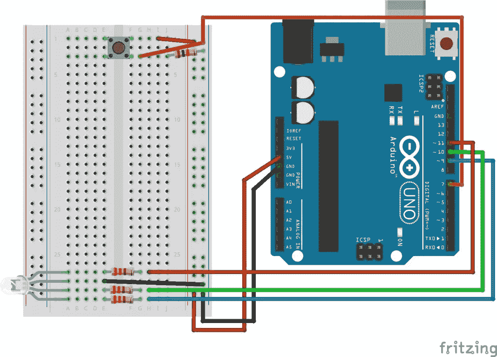
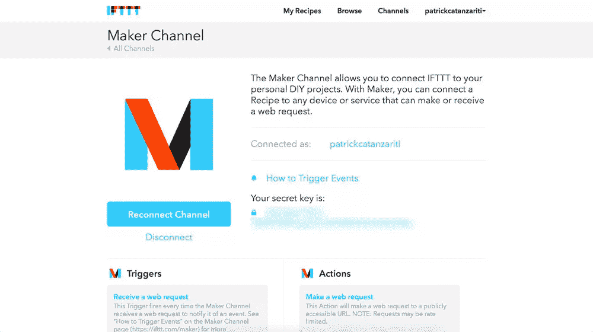
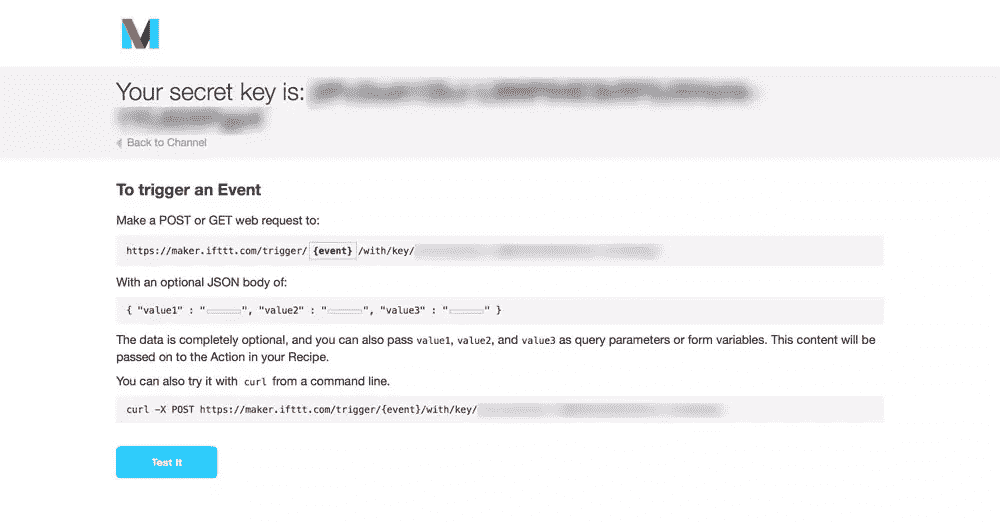
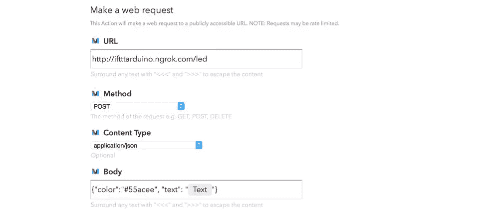
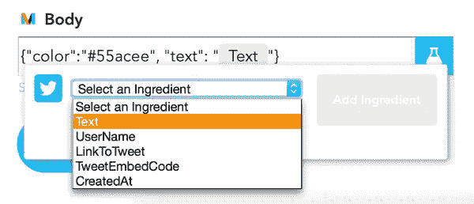

# 将物联网和 Node.js 连接到 IFTTT

> 原文：<https://www.sitepoint.com/connecting-the-iot-and-node-js-to-ifttt/>

IFTTT 在快速便捷地连接设备方面有着巨大的潜力。有一样东西它已经丢失了一段时间——发送和接收通用 HTTP GET 和 POST 请求的能力。如果你想用 IFTTT 做某件事，它的具体用途必须由 IFTTT 定义，并在频道内发布在他们的网站上。也就是直到现在！

IFTTT 最近发布了[创客频道](https://ifttt.com/channels/maker)。这正是开发商一直在等待的！它允许您定义在收到 HTTP 请求时触发的触发器，以及可以向定义的位置发出 HTTP 请求的操作。这使得 IFTTT 几乎可以用于任何事情。现在，这完全取决于开发人员社区的想象力。

为了展示 Maker channel 的能力，我们将设置一个简单的 Arduino，通过 Node.js 与 IFTTT 来回通信。为了试验向 IFTTT 发送触发信号，我们将通过 Arduino 供电的灯开关来开关 LIFX 灯泡。为了尝试 IFTTT Maker 操作，我们将在我们的 Arduino 上连接一个 RGB LED，只要在 Twitter 上提到我们，它就会改变颜色。不喜欢 Twitter 还是没有 LIFX 灯泡？一点问题都没有，用 IFTTT 上的其他东西来切换动作/触发器。使用脸书频道而不是 Twitter，或者在手机上触发动作而不是灯泡。这是一个非常有趣的修补。

如果您不熟悉 IFTTT，我之前在关于使用 IFTTT 将 LIFX 灯泡连接到物联网的文章[中介绍了基础知识。本文假设您已经了解了所有关于触发器和动作的知识，现在您已经准备好进入下一个阶段了！](https://www.sitepoint.com/connecting-lifx-light-bulbs-iot-using-ifttt/)

## 代码

如果你热衷于直接进入代码并尝试它，你可以在 [GitHub](https://github.com/sitepoint-editors/IFTTTArduinoDemo) 上找到它。

## 这将如何工作

我们将有一个本地 Node.js 服务器，通过 USB 连接 Arduino 运行。按下 Arduino 设置上的一个按钮将触发一个 HTTP 请求给 IFTTT，告诉它切换我们的 LIFX 灯。我们的 Node.js 服务器也将运行 Express 来处理任何传入的 HTTP 请求。每当 IFTTT 在 Twitter 上看到一个关于我们的新消息，它就会向我们的服务器发出 POST 请求，触发我们的 Arduino 的 LED。

## 我们的 Arduino 草图

我们将连接一个简单的按钮和一个 RGB LED 到一个 Arduino。



## 设置 Maker 频道

首先，我们需要进入 IFTTT 上的[创客频道](https://ifttt.com/channels/maker)并点击“连接”。设置完成后，您将看到一个如下所示的屏幕:



在这个屏幕上，它提供了通过 HTTP 命令触发 IFTTT 操作所需的密钥。当然，你需要更多的信息，而不仅仅是密钥，我们需要一个 URL 来发布触发动作。要找到它，请单击“如何触发事件”的链接。它将打开一个页面，其中包含您想要使用的 URL，并附带您的密钥。



我们将为 LIFX 灯泡使用的 URL 如下所示:`http://maker.ifttt.com/trigger/light_switch/with/key/{{yourkeyhere}}`。显示`light_switch`的 URL 部分是我们的事件名称。我们在整理 IFTTT 食谱时会用到这个。如果您没有触发 LIFX 灯泡，请选取一个与您的事件更匹配的名称。

## 使用 Maker 触发器切换 IFTTT

我们的创客频道是活跃的，随时可以使用。我们将从查看如何切换 IFTTT 动作开始——使用 Arduino 上的按钮打开和关闭 LIFX 灯泡。

制作食谱本身非常简单:

1.  我们转到 IFTTT 上的[创建新配方](https://ifttt.com/myrecipes/personal/new)页面。
2.  选择“制造商”作为我们的触发渠道。
3.  点击“接收 web 请求”作为我们的触发类型。
4.  输入我们的活动名称`light_switch`。
5.  选择“LIFX”作为我们的行动渠道。
6.  点击“开关灯”作为我们的行动类型。
7.  选择我们想要影响的 LIFX 灯光。
8.  给食谱起一个标题，然后点击“创建食谱”！

在 Node.js 代码中，我们使用`johnny-five`来访问 Arduino。当电路板准备好时，我们在`btn`变量中定义连接到引脚 7 的按钮:

```
board.on('ready', function() {
    console.log('Board ready');

    btn = new five.Button(7);
```

在棋盘的`ready`事件中，我们为按钮的`down`事件设置了一个观察器。如果我们检测到按钮被按下，我们会出于调试目的将该点击记录到控制台(在试验板上的电线松动或类似情况下，拥有这些控制台日志可以节省大量时间！).然后，我们使用 npm 模块`request`向上面找到的 URL 发出 HTTP POST 请求。为了调试的目的，我们已经得到了成功的控制台日志。

```
btn.on('down', function(value) {
    console.log('Light toggle pressed.');

    request.post({
      url: 'http://maker.ifttt.com/trigger/light_switch/with/key/{{yourkeyhere}}'
    }, function(error, response, body) {
      console.log('Body response was ', body);
      console.log('Error was ', error);
    });
  });
```

在运行代码时，当我们单击按钮并且请求成功时，它应该打开和关闭我们的 LIFX 灯泡！IFTTT 将返回一条很好的消息，在我们的 console.log 中看起来是这样的:

`Body response was Congratulations! You've fired the light_switch event`

它很容易组装，但是有很大的潜力。

有一点需要注意——如果你想通过 HTTPS 打电话给 IFTTT 服务，你也需要一个安全的 HTTPS 服务器。我在使用本地测试服务器时出错，所以它可能需要一个非自签名的证书。

## 响应 IFTTT 触发器

我们现在可以通过 Node.js 和我们的 Arduino 触发 IFTTT 动作。让我们看看如何以相反的方式做事情——让我们的 Arduino 响应 IFTTT 触发器。我们将设置 IFTTT 来告诉我们的 Node.js 服务器和 Arduino，只要在 Twitter 上提到我们。

我们把食谱倒过来放:

1.  我们转到 IFTTT 上的[创建新配方](https://ifttt.com/myrecipes/personal/new)页面。
2.  选择“Twitter”作为我们的触发渠道。
3.  点击“新提及您”作为我们的触发类型。
4.  单击“创建触发器”。
5.  选择“创客”作为我们的行动渠道。
6.  点击“提出 web 请求”作为我们的操作类型。
7.  输入你的帖子请求设置(我们将在下面介绍)，然后点击“创建操作”！

带有我们的 HTTP 请求设置的屏幕看起来如下:



1.  为您的节点服务器添加一个可公开访问的 URL。我个人使用 ngrok 来测试所有这些。我在关于从任何地方访问本地主机的文章中介绍了如何使用 ngrok 和类似的服务。选择 POST 作为方法(如果您愿意，GET 请求也可以)。
2.  选择“application/json”作为内容类型，因为我们的节点服务器将接收 json。
3.  最后，包括我们想要发送的 JSON 消息。我放下`{"color":"#55acee", "text":Text}`。`#55acee`是我从 Twitter 的小鸟吉祥物中找到的颜色，所以我觉得是最合适的选择！
4.  `Text`是一个由 IFTTT 动态填充的字段，其中包含它发现的提及您的推文中的文本。这些字段称为 IFTTT 成分。我们并不真的用它来改变我们的 LED 颜色，但我想在那里包括一个 IFTTT 成分来展示它是如何做到的。
5.  To add an ingredient into your JSON, click on the body field to enter in your JSON string and you’ll find a test tube icon on the right hand side. If you click it, you’ll open a menu which will let you choose a field to include:

    

在我们的节点代码中，我们设置了 LED，以便我们的`johnny-five`模块知道它，并设置服务器来监听 POST 请求。它会通过改变我们的 LED 来响应。

在电路板的`ready`事件中，我们在变量`led`中定义连接到引脚 9、10 和 11 的 LED，如下所示:

```
led = new five.Led.RGB([11,10,9]);
```

代码可能看起来很奇怪，因为引脚从 11 开始倒数，而不是向上。原因是我更喜欢在 Arduino 板上从上到下依次为红色、绿色和蓝色(例如 11、10 和 9)。

我们将其初始颜色设置为绿色:

```
led.color('#00ff00');
```

在 board 的`ready`事件之外，我们使用 express 为`/led` POST 请求创建路由。在这个路由的回调函数中，我们从`req.body`内部的 IFTTT 获取 JSON 数据，并在其中找到`color`键。我们将该颜色赋予`johnny-five`的`led.color()`函数，以将 LED 的颜色改变为给定的颜色。我们也在控制台中记录 JSON 数据。

```
app.post('/led', function (req, res) {
    var response = req.body;
    console.log('Response was ', response);

    led.color(response.color);
    res.send('LED request successful!');
  });
```

需要记住的是——如果你把它放在一个可公开访问的服务器上，这个服务器不仅仅用于测试目的，我建议检查所提供的 JSON 数据实际上是一种颜色，并且是一个合法的请求。

如果您运行节点服务器，然后在您的帐户上收到一条 tweet，过一会儿(它不会是即时的，因为 IFTTT 有时似乎需要时间来刷新来自 Twitter 的信息)，您的 LED 应该变成 Twitter 蓝色！在您的`console.log`中，您应该会看到如下内容:

`Response was { color: '#55acee', text: '@thatpatrickguy WOO HOO' }`

然后，如果您沿着相同的线但用不同的颜色设置各种其他服务，您可以有各种各样的 LED 颜色变化！

## 结论

让 IFTTT 的生态系统及其所有渠道对任何能够发送和接收 HTTP 请求的互联网技术的制造商可用是巨大的。虽然我们已经能够将 Twitter API 包含到 Node.js 应用程序中很长时间了，但这提供了一个更易于使用和令人难以置信的模块化 API 的一系列可能性。把 Twitter 换成别的东西，只要稍加调整，一切都应该还能工作！

如果你从这个指南中做出了一些非常好的 IFTTT Maker 频道创建，请在评论中留言或在 Twitter 上与我联系( [@thatpatrickguy](http://www.twitter.com/thatpatrickguy) )，我很想看看！

## 分享这篇文章