# 掌握菜单设计的视觉层次

> 原文：<https://www.sitepoint.com/mastering-visual-hierarchy-menu-design/>

当我们听到“菜单设计”这个词时，我们大多数人都会想到用户界面，但在设计和信息架构方面，我们可以从餐馆菜单设计的漫长而充满竞争的历史中学到许多精彩的课程。让我们来看几个我最喜欢的例子。

纽约市的 Eleven Madison Park 是一家名副其实的世界级餐厅。事实上，他们是世界前五名之一，在这里吃一顿饭会花掉你几百美元——不包括酒。

但是让我们假设你省吃俭用，设法预定了一个房间。您收到的菜单应该是这样的:

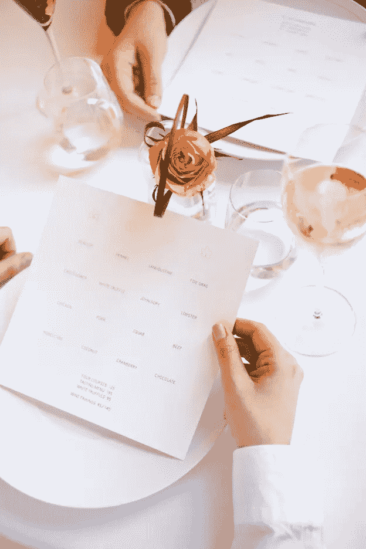
*朱丽叶·塞扎的《十一麦迪逊公园》(via [菜单艺术](http://www.underconsideration.com/artofthemenu/archives/eleven_madison_park.php) )*

太神奇了。由 Juliette Cezzar 设计，它绝对不杂乱，包含基本信息——每道菜的主要成分，排列在 4 x 4 的网格中。因此，它展示了视觉层次的一个关键原则:在重要的东西周围放置额外的空间，这样它们更容易被看到。

不幸的是，作为菜单设计的实用模型，它几乎没有用处。11 麦迪逊公园的情况极其特殊。在这里，餐馆的声誉是如此之好，顾客可以凭信心点菜，甚至不用看菜品的描述。

相比之下，大多数菜单需要提供更多的信息，至少包括类别(开胃菜、主菜、甜点)、描述和价格。

以下是典型加载菜单的外观:

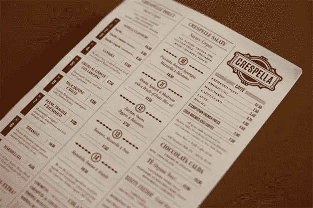
*【克雷斯佩拉 by Tag 集体(通过[菜单艺术](http://www.underconsideration.com/artofthemenu/archives/crespella_cafe.php) )*

我们会说，这个由 [Tag Collective](http://www.tag-collective.com/) 设计的设计非常坚固，但不够鼓舞人心。这是有序的，努力显然是为了增加多样性和魅力。但这里也有很多信息，视觉层次太弱。结果就是，乍一看，菜单显得密密麻麻，让人应接不暇。它缺少了 11 个麦迪逊公园的菜单所奢侈的成分:空间。

这种对比的目的是展示视觉层次在菜单设计中的重要性，设计师经常必须在不太大的空间里塞进大量的信息。如果你不熟悉视觉层次的概念，[这篇文章](https://99designs.com/designer-blog/2014/06/09/6-principles-of-visual-hierarchy/)将带你了解基本知识。

其基本思想是，有几个原则可以让某些图形信息比其他信息更容易被看到——在层次结构中更高。更大而不是更小，上面而不是下面，左边而不是右边(假设一个文化是从左到右阅读)，彩色而不是灰度，粗体而不是细长:这些都是分配视觉首要地位的方式。

在这篇文章中，我们将重新审视视觉层次，特别是菜单设计。我们将其分为五类:

1.  间隔
2.  对齐
3.  边界
4.  字体
5.  颜色

我们认为下面的菜单设计是这些原则的典范，在上面显示的两种方法中找到了很好的中间点。

### 间隔

11 麦迪逊公园设计和克雷斯佩拉设计都是良好间距的重要性的例子:前者有很多，后者有点太少。

我们认为下面的设计达到了一个很好的平衡，让重要的文本可以呼吸，所以它很容易辨认，并且突出了它的重要性。

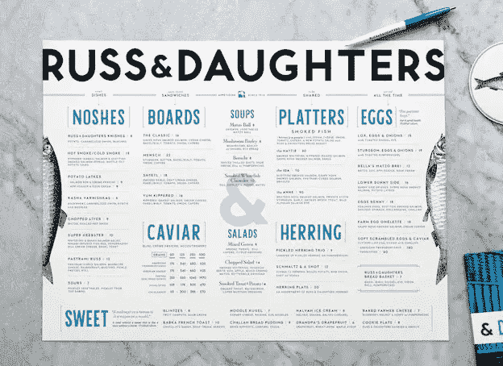
*鲁斯&众女由[凯丽安德森](http://kellianderson.com/blog/2014/05/designing-for-the-new-russ-daughters/)*

### 对齐

对齐是一个简单的层次原则:如果文本在一行中，它可能属于一个组。你可以用这个来代替，或者更有可能是除了其他分组提示，比如统一的字体、大小和粗细。

请注意，轻微的 *dis* 对齐也可以获得有用的效果。这在下面的第二个例子中很明显，对于 Ellie 的表，交错的菜单项赋予了信息更多的生命和个性。

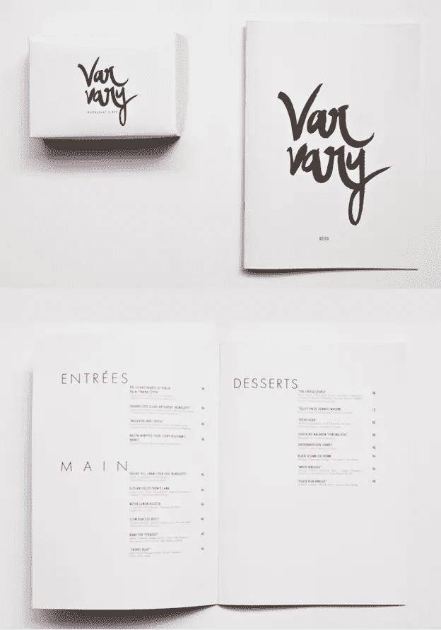
*谢利·DC(经[比昂斯](https://www.behance.net/gallery/Varvary/1413749) )*

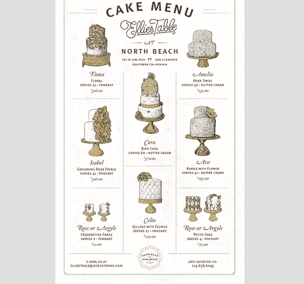
*布莱恩·劳的《艾莉的桌子》(via [dribbble](https://dribbble.com/shots/1300949-Cake-Menu) )*

### 边界

如果你的菜单开始变得拥挤，一个屡试不爽的选择总是简单地用线条或边框分隔不同的信息。这也是一种简单的方法，可以将一些额外的注意力吸引到层次结构中较低的部分，无论是因为它们位于页边空白还是为了节省空间而以小字体呈现。

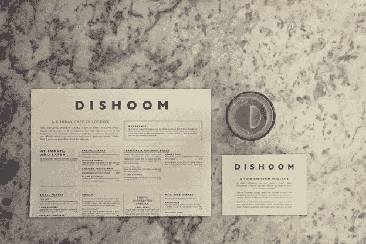

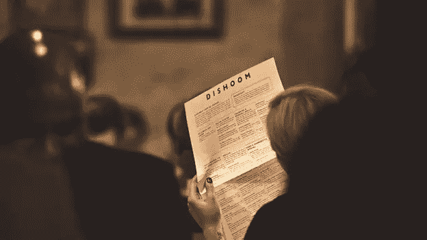
*史密斯设计&的迪厅(通过[菜单艺术](http://www.underconsideration.com/artofthemenu/archives/dishoom.php) )*

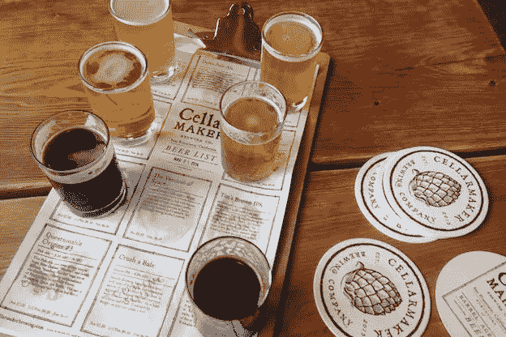
*窖匠乘[色域](http://gamutsf.com/)*

### 字体

事实上，字体包含多个方面:大小、粗细(粗体)、斜体和字样。更大的尺寸或重量显然会提升视觉层次中的信息，有时字体本身的设计会带有更明显或更含蓄的个性。

配对字体和改变上述属性会产生一种更无形的品质，设计师通常称之为“纹理”

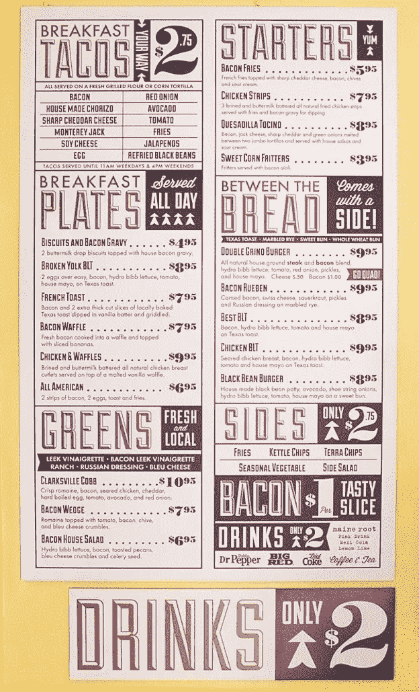
*培根 by 圣域打印店([设计灵感](http://designspiration.net/image/3491461143996/) )*

[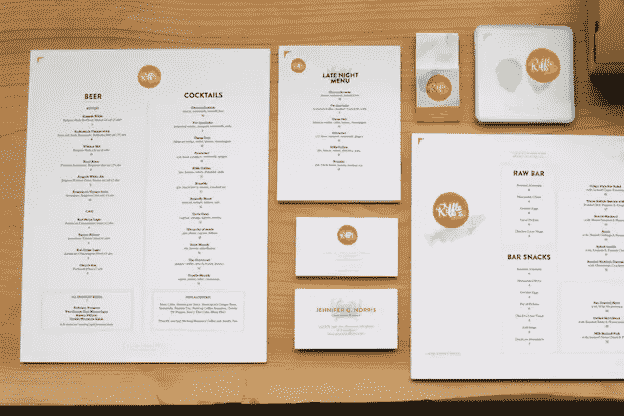](http://hovercraftstudio.com/project/riffle-nw/)
*[气垫船工作室](http://hovercraftstudio.com/project/riffle-nw/)*

[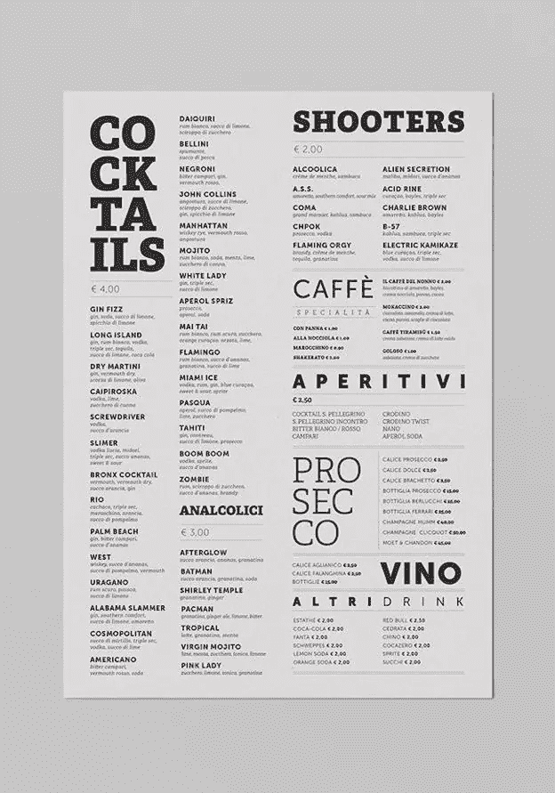](https://www.behance.net/gallery/20658083/Malo-Cocktail-Cafe) 
*朱塞佩·菲洛(via [【行为】](https://www.behance.net/gallery/20658083/Malo-Cocktail-Cafe)*煮坏的鸡尾酒咖啡。】

[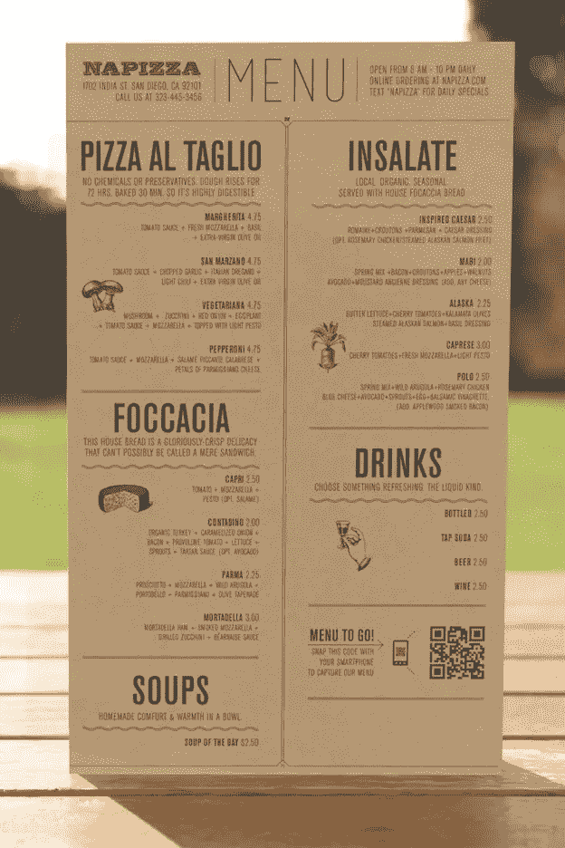](http://wearemiller.com/work/napizza-restaurant-brand-identity/) 
*纳皮扎由[米勒](http://wearemiller.com/work/napizza-restaurant-brand-identity/)*

### 颜色

不用说，将彩色与黑白并置是让彩色物品脱颖而出的不二之选。但是，它还有其他与层次相关的用途。

用不同的颜色放置不同类型的信息有助于区分它们，用彩色背景包围信息域也能达到类似的效果。永远不要忽视好的颜色搭配的重要性。

[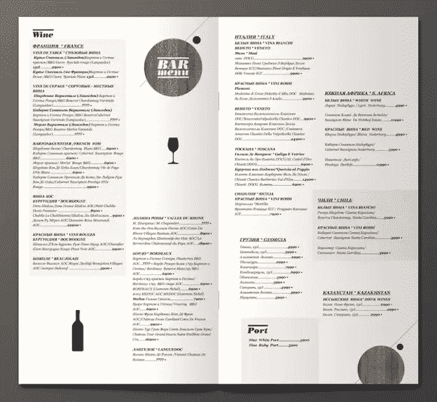](https://www.behance.net/gallery/Bar-menu/513962) 
*酒吧菜单由阿扎马特·萨伊夫(via [Behance](https://www.behance.net/gallery/Bar-menu/513962) )*

*经 [99designs 设计师博客](http://99designs.com/designer-blog/2015/06/16/visual-hierarchy-menu-design/)许可转载 T3*

#### 你认为菜单设计最重要的层次原则是什么？分享在评论里！

## 分享这篇文章