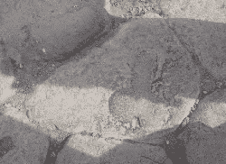
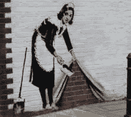

# 乐高如何通过“游戏化”让问题变得更糟

> 原文：<https://www.sitepoint.com/lego-made-problem-worse-gamifying/>

浴室墙壁、公共汽车候车亭和书的页边空白。给人们一支笔，一小部分人总会画一个“东”。

为什么？我们不知道，但是从希腊群岛到 T2 庞贝古城到 T4 埃及的考古证据向我们展示了这种情况已经存在了几千年。虽然创作工具可能已经变得更加复杂，但似乎*侗还是老样子*。

前乐高宇宙[设计师梅根·福克斯](https://twitter.com/glassbottommeg)最近给了我们[一个有趣的见解，关于这个问题如何影响一个在线产品](http://www.vice.com/read/exploring-the-art-of-turning-video-games-into-comics-855)。

乐高宇宙是乐高试图在《我的世界》创造的可笑的成功的虚拟积木游戏空间中竞争。

然而，当这些“解剖雕塑”开始出现时，乐高迅速采取行动，认为他们对父母的信任受到了威胁。数百个小时的编码用于设计软件，该软件从多个角度秘密分析每一个新的乐高建筑，并标记出有问题的艺术品，供真正的人类主持人团队评估。

不幸的是，对乐高来说，痴迷于解剖学的艺术家们把这当成了一个有趣的挑战，并开始设计新的和巧妙的设计，这些设计只能从特定的角度“欣赏”。

乐高无意中“游戏化”了一个他们试图阻止的过程。

> “这一切都是自动化的，但人类主持人是 IIRC 乐高宇宙运营成本最大的成本中心。或者接近。”

*[梅根·福克斯(@ glassbottommeg)2015 年 5 月 30 日](https://twitter.com/glassbottommeg/status/604408938658824193https://twitter.com/glassbottommeg/status/604408938658824193)*

最终，乐高得出结论，不可能保证他们的游戏空间中包含的内容，并关闭了应用程序——这是一个可悲的结果。

因此，尽管乐高在积木游戏方面享有传奇般的声誉，但它实际上把“虚拟积木”空间交给了《我的世界》。

### 《我的世界》不也有同样的问题吗？

他们当然有。五秒钟的谷歌图片搜索将证实这一点。

但《我的世界》似乎采取了更多的“镇议会”的方法来解决这个问题。虽然他们不会假装能保证他们的“城市”每一寸土地都没有涂鸦，但他们会在意识到问题后立即做出反应。

这似乎是一个正确的决定。《我的世界》仍然像以前一样受孩子、成人甚至学校的欢迎，没有明显的声誉受损的证据。

这是一个艰难的决定，但 Mojang 似乎已经找到了平衡点。

*最初发表于 [SitePoint 设计通讯](https://www.sitepoint.com/newsletter/)。*

## 分享这篇文章