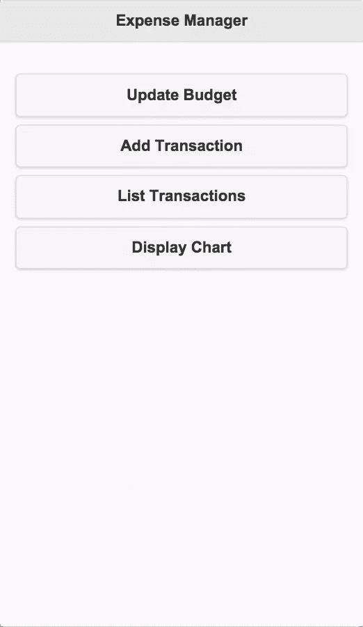
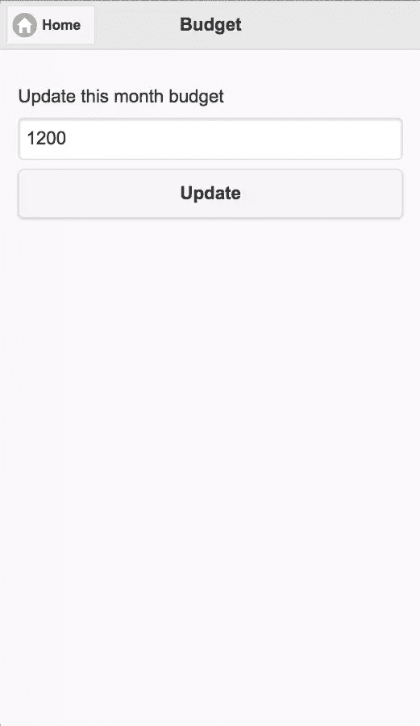
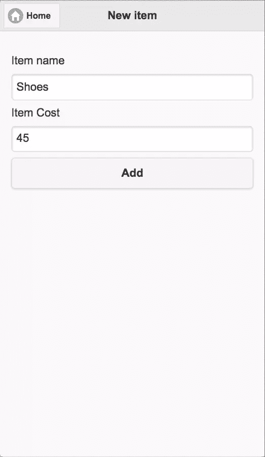
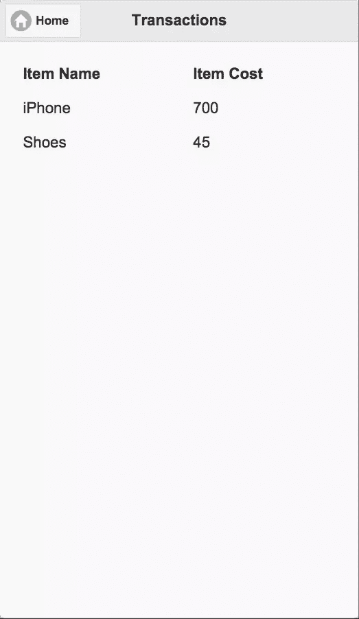
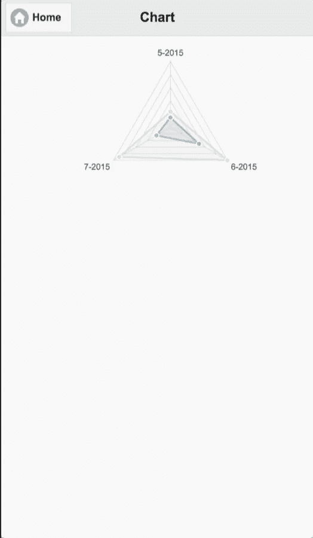
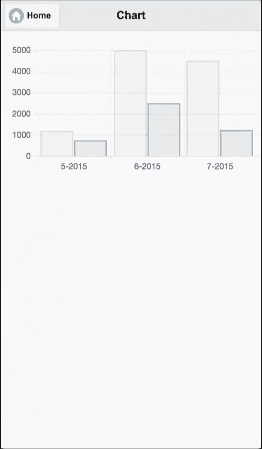

# 使用 Apache Cordova 创建费用管理器应用程序

> 原文：<https://www.sitepoint.com/creating-an-expense-manager-app-with-apache-cordova/>

费用管理器是一个财务预算应用程序，用于收集和分析费用。他们通过监控个人、企业或家庭的收入和支出来帮助人们做预算和省钱。

Expense manager 应用程序各不相同，可以提供一系列功能。在本教程中，我将展示如何使用 Cordova 创建一个简单的费用管理器应用程序。我将使用用于 UI 的 *jQuery Mobile* 和 *Chart.js* 来创建显示图表，以提供对收入和支出的洞察。

本教程的目的是向您展示如何组织和存储 expense manager 应用程序(或任何类似的应用程序)的数据，并创建每个更复杂的应用程序应该具备的基本功能。

## 开始

在起始模板中，我需要包含 jQuery、jQuery mobile 和 Chart.js。我不会在这里介绍安装和创建 Cordova 应用程序，如果您以前没有这样做过，[请阅读入门指南](http://cordova.apache.org/docs/en/4.0.0//guide_cli_index.md.html#The%20Command-Line%20Interface)。运行和构建应用程序的说明位于同一页面上。

给应用程序一个合适的名称，并添加您想要支持的平台。我在本教程中使用了 Cordova 的*通知*插件和*设备*插件，在这里添加这些[查找指令](http://docs.phonegap.com/en/edge/guide_cli_index.md.html#The%20Command-Line%20Interface_add_plugin_features)。

你可以在 gitHub 上找到这个项目的最终[代码。](https://github.com/sitepoint-editors/ExpenseManager)

注意:每次我们改变项目的代码，你都需要在重新运行模拟器之前重新构建它。

在 *www/index.html* 文件中，在`head`标签中添加以下 JavaScript 和 CSS 文件:

```
<style> @-ms-viewport { width: 100vw ; zoom: 100% ; }
        @viewport { width: 100vw ; zoom: 100% ; }
        @-ms-viewport { user-zoom: fixed ; }
        @viewport { user-zoom: fixed ; } </style>

    <link rel="stylesheet" href="https://code.jquery.com/mobile/1.4.5/jquery.mobile-1.4.5.min.css">

    <script src="https://code.jquery.com/jquery-2.1.4.min.js"></script>
    <script src="https://code.jquery.com/mobile/1.4.5/jquery.mobile-1.4.5.min.js"></script>

    <script src="https://cdn.rawgit.com/nnnick/Chart.js/master/Chart.js"></script>
```

这里我添加了来自 CDNs 的 jQuery、jQuery Mobile 和 Chart.js。您可以在本地嵌入这些文件，这样应用程序就可以在没有互联网连接的情况下工作。

## 数据结构

在本教程中，我将使用 [HTML5 本地存储](https://www.sitepoint.com/html5-web-storage/)来存储应用程序的数据。

我将把所有的数据组织成一个数组，这个数组将是一个对象的属性。对象作为 JSON 字符串存储在本地存储中。

以下是我们的数据外观的概述:

```
{
    data: [
            [
                ["06-2015", "Total Spendings", "Total Available Budget"],
                [
                    ["item1", "cost"] , ["item2", "cost"]
                ]
            ],
            [
                ["07-2015", "Total Spendings", "Total Available Budget"],
                [
                    ["item1", "cost"] , ["item2", "cost"]
                ]
            ],  
            [],
            []
        ];
}
```

`data`数组的每个元素都代表特定月份的信息。每个月元素也是一个数组，包含日期、总支出、可用预算和购买物品的成本。新的月份被添加到`data`数组的末尾。

第一次加载应用程序时，本地存储将为空，因此需要初始化数据结构。这里，代码检查本地存储中的对象。因为它是空的，所以它会创建并存储一个新的。将此代码放在位于 index.html 页面底部的`script`标签中，在结束`body`标签之前:

```
var info = null;

document.addEventListener("deviceready", function(){
    if(!localStorage.getItem("em_data"))
    {
        var date = new Date();
        var today = date.getMonth() + "-" + date.getFullYear();

        var em_data = {data: [[[today, 0, 0], []]]};
        localStorage.setItem("em_data", JSON.stringify(em_data));
    }

    info = JSON.parse(localStorage.getItem("em_data"));
}, false);
```

在这里，我将当前月份添加到数组中。我创建了一个在整个应用程序中使用的`info`变量来访问数据。每当我对变量`info`进行修改时，我都需要更新本地存储。

## 创建主屏幕

让我们为我们的应用程序创建一个主屏幕，它将在应用程序加载时首先显示。

在我们的应用程序的主屏幕上，我将放置四个按钮。这些用于更新本月的预算，添加新购买的项目，列出所有购买的项目，并显示一个图表来分析六个月的支出。

下面是为我们的主屏幕创建 jQuery 移动页面的代码。将这段代码放在 index.html*页面的`body`标签中(您可以替换那里的`div`):*

```
<div data-role="page" id="home">
  <div data-role="header">
    <h1>Expense Manager</h1>
  </div>

  <div data-role="main" class="ui-content">
    <p>
        <a target="_blank" href="#update_budget" style="text-decoration: none"><button>Update Budget</button></a>
        <a target="_blank" href="#add_transaction" style="text-decoration: none"><button>Add Transaction</button></a>
        <a target="_blank" href="#list_transactions" style="text-decoration: none"><button>List Transactions</button></a>
        <a target="_blank" href="#chart" style="text-decoration: none"><button>Display Chart</button></a>
    </p>
  </div>
</div>
```

这里我在页面上放置了四个按钮，每个按钮指向一个新页面。以下是该页面的外观:



**注意**:所有其他页面的代码都应该添加到这个页面之下，以便这个页面首先加载。

## 创建页面以更新预算

当用户点击*更新预算*按钮时，会显示一个新页面，用户可以在其中更新该月的总可用支出预算。

接下来，显示一个文本框和一个按钮来更新预算。将代码放在*index.html*文件的`body`标签中:

```
<div data-role="page" id="update_budget">
  <div data-role="header">
    <a target="_blank" href="#home" class="ui-btn ui-icon-home ui-btn-icon-left">Home</a>
    <h1>Budget</h1>
  </div>

  <div data-role="main" class="ui-content">
    <p>
        Update this month budget
        <input type="text" id="month_budget" />
        <a target="_blank" href="javascript:update_budget()" style="text-decoration: none"><button>Update</button></a>
    </p>
  </div>
</div>
```

默认情况下，文本框应显示当月的预算。因此，在页面加载之前，添加一个事件侦听器来更新预算。

要在每次页面加载前更新文本框的值，将这段代码放在*index.html*文件的`script`标签中:

```
function update_month()
{
    var date = new Date();
    var today = date.getMonth() + "-" + date.getFullYear();
    if(info.data[info.data.length - 1][0][0] != today)
    {
        info.data[info.data.length] = [];
        info.data[info.data.length - 1][0] = [];
        info.data[info.data.length - 1][1] = [];
        info.data[info.data.length - 1][0][0] = today;
        info.data[info.data.length - 1][0][1] = 0;
        info.data[info.data.length - 1][0][2] = 0;

        localStorage.setItem("em_data", JSON.stringify(info));
    }
}

$(document).on("pagebeforecreate","#update_budget",function(){
    update_month();
    document.getElementById("month_budget").value = info.data[info.data.length - 1][0][2];
});
```

在更新文本框值之前，调用`update_month`函数来检查当前月份在`data`数组中是否可用。否则，它将创建一个表示当前月份的新数组元素。

当点击*更新预算*时，调用`update_budget`功能。将此代码放入【index.html】页面*的`script`标签中:*

```
function update_budget()
{
    info.data[info.data.length - 1][0][2] = document.getElementById("month_budget").value;
    localStorage.setItem("em_data", JSON.stringify(info));

    navigator.notification.alert("This month budget is updated", null, "Budget Edit Status", "Ok");
}
```

以下是该页面的外观:



## 创建页面以添加购买的商品

当用户点击*添加交易*按钮时，会显示一个新页面，用户可以在其中添加新购买商品的详细信息，如名称和价格。将这段代码放在*index.html*文件的`body`标签中，该文件显示两个文本框和一个添加新项目的按钮:

```
<div data-role="page" id="add_transaction">
  <div data-role="header">
    <a target="_blank" href="#home" class="ui-btn ui-icon-home ui-btn-icon-left">Home</a>
    <h1>New item</h1>
  </div>

  <div data-role="main" class="ui-content">
    <p>
        Item name
        <input type="text" id="item_name" />
        Item Cost
        <input type="text" id="item_cost" />
        <a target="_blank" href="javascript:add_item()" style="text-decoration: none"><button>Add</button></a>
    </p>
  </div>
</div>
```

在页面加载之前，检查当前月份是否出现在`data`数组中，如果没有，在`data`数组中创建一个表示当前月份的新元素。将这段代码放在*index.html*页面的`script`标签中，以便在页面加载之前调用`update_month`函数:

```
$(document).on("pagebeforecreate","#add_transaction",function(){
    update_month();
});
```

最后是`add_item`函数，当用户点击页面上的*添加*按钮时调用。下面是`add_item`函数的代码。将此代码放入*index.html*页面的`script`标签中:

```
function add_item()
{
    var item = [document.getElementById("item_name").value, document.getElementById("item_cost").value];
    info.data[info.data.length - 1][1][info.data[info.data.length - 1][1].length] = item;
    info.data[info.data.length - 1][0][1] = info.data[info.data.length - 1][0][1] + parseInt(document.getElementById("item_cost").value);
    localStorage.setItem("em_data", JSON.stringify(info));

    navigator.notification.alert("New item has been added to this month transactions", null, "Transaction", "Ok")
}
```

以下是该页面的外观:



## 创建页面以显示购买的商品

当用户点击 *List Transactions* 按钮时，会显示一个新页面，用户可以在其中看到当月购买的商品(及其价格)列表。

显示一个 jQuery 表，列出购买的商品。将此代码放入*index.html*文件的`body`标签中:

```
<div data-role="page" id="list_transactions">
  <div data-role="header">
    <a target="_blank" href="#home" class="ui-btn ui-icon-home ui-btn-icon-left">Home</a>
    <h1>Transactions</h1>
  </div>

  <div data-role="main" class="ui-content" id="listTable"></div>
</div>
```

在页面加载检索当前购买商品的列表之前，生成 jQuery 表 HTML 代码并将其插入页面。将此代码放在*index.html*页面的`script`标签中:

```
$(document).on("pagebeforecreate","#list_transactions",function(){

    update_month();

    var html = '<table id="table" data-role="table" data-mode="column" class="ui-responsive"><thead><tr><th>Item Name</th><th>Item Cost</th></tr></thead><tbody>';

    for(var count = 0; count < info.data[info.data.length - 1][1].length; count++)
    {
        html = html + "<tr><td>" + info.data[info.data.length - 1][1][count][0] + "</td><td>" + info.data[info.data.length - 1][1][count][1] + "</td></tr>";

    }

    html = html + "</tbody></table>";

    document.getElementById("listTable").innerHTML = html;
});
```

以下是该页面的外观:



## 创建显示图表的页面

当用户点击*显示图表*按钮时，会显示一个新页面，显示过去 6 个月的支出和预算的雷达图。

以下是显示图表的页面代码。将此代码放入*index.html*文件的`body`标签中:

```
<div data-role="page" id="chart">
  <div data-role="header">
    <a target="_blank" href="#home" class="ui-btn ui-icon-home ui-btn-icon-left">Home</a>
    <h1>Chart</h1>
  </div>

  <div data-role="main" class="ui-content">
      <canvas id="monthly_canvas" style="height: 100%; width: 100%"></canvas>
  </div>
</div>
```

页面中的 `<canvas></canvas>` 充当图表的占位符。启动 chart.js 并向库提供数据，以便在画布上呈现图表。将此代码放在 index.html*页面的`script`标签中:*

```
$(document).on("pagebeforecreate","#chart",function(){
    var start = 0;
    var end = 0;

    if(info.data.length <= 6)
    {
        start = 0;
        end = info.data.length - 1;
    }
    else
    {
        start = info.data.length - 6;
        end = info.data.length - 1;
    }

    var labels = [];

    for(var iii = start; iii <= end; iii++)
    {
        labels[labels.length] = info.data[iii][0][0];
    }

    var monthly_budget = [];

    for(var iii = start; iii <= end; iii++)
    {
        monthly_budget[monthly_budget.length] = info.data[iii][0][2];
    }

    var monthly_spent = [];

    for(var iii = start; iii <= end; iii++)
    {
        monthly_spent[monthly_spent.length] = info.data[iii][0][1];
    }

    setTimeout(function(){

        var lineChartData = {
            labels : labels,
            datasets : [
                {
                    label: "Monthy Budget",
                    fillColor : "rgba(220,220,220,0.2)",
                    strokeColor : "rgba(220,220,220,1)",
                    pointColor : "rgba(220,220,220,1)",
                    pointStrokeColor : "#fff",
                    pointHighlightFill : "#fff",
                    pointHighlightStroke : "rgba(220,220,220,1)",
                    data : monthly_budget
                },
                {
                    label: "Monthly Spendings",
                    fillColor : "rgba(151,187,205,0.2)",
                    strokeColor : "rgba(151,187,205,1)",
                    pointColor : "rgba(151,187,205,1)",
                    pointStrokeColor : "#fff",
                    pointHighlightFill : "#fff",
                    pointHighlightStroke : "rgba(151,187,205,1)",
                    data : monthly_spent
                }
            ]

        }

        var ctx = document.getElementById("monthly_canvas").getContext("2d");
        window.myLine = new Chart(ctx).Radar(lineChartData, {
            responsive: true
        });
    }, 500);
});
```

上面的代码检索过去 6 个月的日期和支出信息，chart.js 是使用`setTimeout`异步启动的。我在 500 毫秒后启动了 chart.js，以便给页面渲染留出时间，否则画布将无法渲染图形。

通过调用 chart 对象的相应方法，可以显示不同种类的图表。这里我显示了一个雷达图，所以调用了图表对象的`Radar`方法。要显示条形图，用相同的参数调用`Bar`方法。

在 SitePoint 上了解更多关于 chart.js 的信息。

这是 3 个月交易的条形图和雷达图:




## 最后的想法

目前，该应用程序是功能性的，但基本的，可以部署到多个平台。下一步是提供关于如何减少开支的明智建议，或者添加通知。让我知道你尝试这个教程的经验和扩展它的想法。

## 分享这篇文章